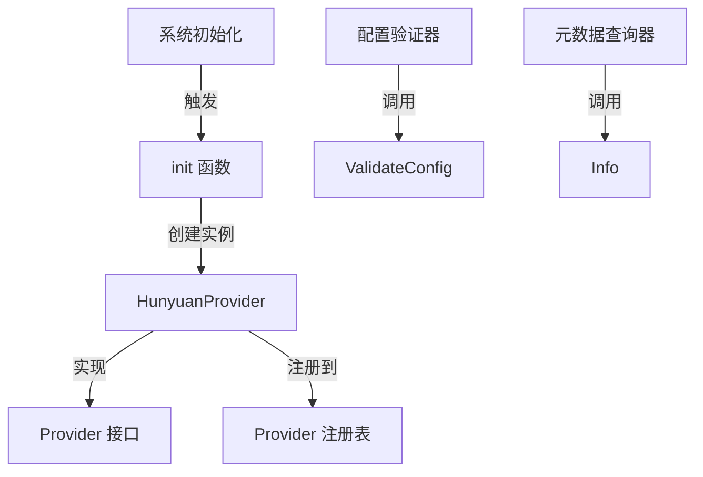

# hunyuan_provider_integration 模块技术深度解析

## 1. 问题与动机

在构建一个支持多种大语言模型平台的系统时，我们面临着如何统一管理不同云服务商提供的模型服务的挑战。腾讯混元（Hunyuan）作为国内重要的大语言模型平台之一，提供了 OpenAI 兼容的 API 接口，但仍然需要特定的集成逻辑来处理其独特的配置要求和认证机制。

### 为什么需要独立的模块？

一个朴素的想法是直接在通用的 OpenAI 兼容适配器中处理所有平台，但这种方案存在以下问题：
- 不同平台有不同的元数据描述和默认配置
- 平台特定的验证逻辑难以在通用适配器中优雅实现
- 用户期望看到明确的平台标识和相关模型信息

`hunyuan_provider_integration` 模块的核心设计洞见是：通过将平台特定的元数据、配置验证和注册逻辑封装在独立的 Provider 实现中，既保持了与 OpenAI 协议的兼容性，又能提供平台特有的用户体验。

## 2. 核心抽象与心智模型

### 核心抽象

本模块的核心抽象是 `HunyuanProvider` 结构体，它实现了系统定义的 `Provider` 接口。可以将其想象为一个"平台适配器卡片"，包含了以下信息：
- 平台的身份标识（名称、显示名、描述）
- 支持的模型类型和默认 API 地址
- 配置验证规则

### 心智模型

可以将整个 provider 系统想象成一个"模型平台目录"：
- 每个 Provider 实现就像目录中的一张卡片
- `Info()` 方法展示卡片的基本信息
- `ValidateConfig()` 方法检查用户填写的使用申请是否符合要求
- `init()` 函数中的 `Register()` 调用则是将这张卡片放入目录中

## 3. 架构与数据流

### 组件架构



### 数据流向

1. **注册阶段**：
   - 程序启动时，`init()` 函数自动执行
   - 创建 `HunyuanProvider` 实例并通过 `Register()` 注册到全局注册表

2. **配置验证阶段**：
   - 用户提供 Hunyuan 相关配置（API Key、模型名称等）
   - 系统调用 `ValidateConfig()` 验证配置完整性
   - 验证通过后配置才能被使用

3. **运行时元数据查询**：
   - 系统需要展示支持的模型平台列表时
   - 调用 `Info()` 获取 HunyuanProvider 的元数据
   - 元数据用于 UI 展示和路由决策

## 4. 核心组件深度解析

### HunyuanProvider 结构体

**目的**：作为腾讯混元平台的 Provider 实现，封装平台特定的元数据和配置验证逻辑。

**设计意图**：
- 采用空结构体设计，因为该 Provider 不需要维护任何实例状态
- 所有逻辑都是无状态的，符合 Provider 接口的设计理念

### Info() 方法

**签名**：`func (p *HunyuanProvider) Info() ProviderInfo`

**目的**：返回腾讯混元 Provider 的元数据信息。

**返回值解析**：
- `Name`: 内部标识符 `ProviderHunyuan`，用于系统内部路由
- `DisplayName`: 用户友好的显示名称"腾讯混元 Hunyuan"
- `Description`: 简要描述支持的模型类型，如 hunyuan-pro, hunyuan-standard 等
- `DefaultURLs`: 不同模型类型对应的默认 API 地址，这里知识问答和嵌入模型都使用相同的 BaseURL
- `ModelTypes`: 明确声明支持的模型类型列表
- `RequiresAuth`: 标记该平台需要认证

**设计决策**：将知识问答和嵌入模型的默认 URL 设置为相同值，反映了腾讯混元 OpenAI 兼容模式下统一端点的实际情况。

### ValidateConfig() 方法

**签名**：`func (p *HunyuanProvider) ValidateConfig(config *Config) error`

**目的**：验证腾讯混元 Provider 的配置是否完整有效。

**验证逻辑**：
1. 检查 API Key 是否为空 - 这是访问腾讯混元服务的必需凭证
2. 检查模型名称是否为空 - 明确指定模型是调用 API 的前提

**设计意图**：
- 只做最基本的配置完整性检查，不涉及实际的 API 连通性测试
- 错误信息清晰明确，帮助用户快速定位配置问题
- 提前验证可以避免在实际调用 API 时才发现配置缺失

### init() 函数

**目的**：在包初始化时自动注册 HunyuanProvider 到全局 Provider 注册表。

**设计模式**：这是 Go 语言中常见的"自注册"模式，使得添加新的 Provider 只需创建实现并在 init() 中注册，无需修改其他代码。

## 5. 依赖关系分析

### 依赖的模块

- **provider 包内部**：依赖 `Provider` 接口、`ProviderInfo` 结构体、`Config` 结构体和 `Register()` 函数
- **types 包**：依赖 `types.ModelType` 枚举来定义支持的模型类型

### 被依赖的方式

该模块通过 Provider 注册表被系统其他部分间接使用：
1. 系统初始化时会收集所有已注册的 Provider 信息
2. 用户配置模型时，系统会根据 Provider 名称找到对应的实现
3. 配置验证时，系统会调用对应 Provider 的 ValidateConfig 方法

### 数据契约

- **输入契约**：`Config` 结构体必须包含 APIKey 和 ModelName 字段
- **输出契约**：`Info()` 方法返回完整的 `ProviderInfo` 结构体
- **错误契约**：验证失败时返回描述清晰的错误信息

## 6. 设计决策与权衡

### 决策 1：使用 OpenAI 兼容模式

**选择**：腾讯混元的集成基于其 OpenAI 兼容 API 模式，使用统一的 BaseURL。

**原因**：
- 最大化代码复用，可以直接使用现有的 OpenAI 协议客户端实现
- 简化维护成本，无需为腾讯混元开发全新的 API 调用逻辑
- 符合腾讯混元官方推荐的集成方式

**权衡**：
- 可能无法使用腾讯混元独有的非标准 API 特性
- 但对于系统当前需要的知识问答和嵌入功能，OpenAI 兼容模式已足够

### 决策 2：无状态的 Provider 实现

**选择**：`HunyuanProvider` 是一个空结构体，所有方法都是无状态的。

**原因**：
- Provider 的职责只是提供元数据和验证配置，不需要维护状态
- 无状态设计使得 Provider 实例可以被全局共享和重用
- 简化了并发访问的处理

**权衡**：
- 如果未来需要为每个 Provider 实例维护特定状态，这种设计需要调整
- 但在当前的 Provider 接口定义下，无状态设计是最合理的选择

### 决策 3：最小化配置验证

**选择**：只验证 API Key 和模型名称的存在性，不做更深入的验证。

**原因**：
- 过度验证会导致与实际 API 要求不同步的风险
- 简单的验证足以捕获最常见的配置错误
- 实际的 API 连通性和凭证有效性最好在实际调用时测试

**权衡**：
- 用户可能在配置阶段通过验证，但在实际使用时才发现 API Key 无效
- 但这种"晚失败"的设计换取了更好的可维护性和适应性

## 7. 使用指南与示例

### 基本使用

系统会自动发现和使用 HunyuanProvider，无需手动实例化。用户只需在配置中指定 Provider 名称为 `ProviderHunyuan`。

### 配置示例

```go
config := &provider.Config{
    ProviderName: provider.ProviderHunyuan,
    APIKey:       "your-hunyuan-api-key",
    ModelName:    "hunyuan-pro",
    BaseURL:      provider.HunyuanBaseURL, // 可选，不设置则使用默认值
}

// 系统内部会自动调用验证
hunyuanProvider := getProvider(provider.ProviderHunyuan)
if err := hunyuanProvider.ValidateConfig(config); err != nil {
    log.Fatalf("配置验证失败: %v", err)
}
```

### 支持的模型类型

- `types.ModelTypeKnowledgeQA`：知识问答模型，如 hunyuan-pro、hunyuan-standard
- `types.ModelTypeEmbedding`：嵌入模型，如 hunyuan-embedding

## 8. 注意事项与常见问题

### 边缘情况

1. **空配置验证**：如果传入的 config 为 nil，虽然当前实现不会 panic，但这是不被支持的用法
2. **模型名称不匹配**：ValidateConfig 只检查模型名称是否为空，不检查是否为腾讯混元支持的实际模型
3. **自定义 BaseURL**：用户可以覆盖默认的 BaseURL，但需要确保其符合腾讯混元的 API 规范

### 隐含契约

- Provider 名称必须与 `ProviderHunyuan` 常量完全一致
- API Key 需要是腾讯混元控制台中获取的有效凭证
- 模型名称需要与腾讯混元支持的模型名称匹配

### 常见问题

**Q: 为什么 ValidateConfig 不验证 API Key 的有效性？**

A: 验证 API Key 的有效性需要实际调用腾讯混元的 API，这会带来网络开销和延迟。此外，API Key 的有效性可能随时间变化（如被撤销），因此在配置时验证的意义有限。更好的做法是在实际使用时处理认证错误。

**Q: 如何添加对腾讯混元新模型类型的支持？**

A: 只需在 `Info()` 方法的 `ModelTypes` 切片中添加相应的 `types.ModelType`，并在 `DefaultURLs` 中添加对应的默认 URL（如果需要）。

**Q: 腾讯混元的 API 格式与 OpenAI 完全兼容吗？**

A: 腾讯混元提供了 OpenAI 兼容的 API 接口，但可能存在一些细微差别。这些差别的处理通常在更底层的 API 客户端中进行，而不是在这个 Provider 模块中。

## 9. 相关模块参考

- [provider_catalog_and_configuration_contracts](model_providers_and_ai_backends-provider_catalog_and_configuration_contracts.md) - Provider 接口和注册表的定义
- [openai_compatible_provider_catalog](model_providers_and_ai_backends-provider_catalog_and_configuration_contracts-openai_compatible_provider_catalog.md) - OpenAI 兼容 Provider 的基础实现
- [qianfan_provider_integration](model_providers_and_ai_backends-provider_catalog_and_configuration_contracts-regional_and_cloud_platform_provider_catalog-major_chinese_cloud_llm_platform_providers-qianfan_provider_integration.md) - 百度千帆平台的集成实现
- [volcengine_provider_integration](model_providers_and_ai_backends-provider_catalog_and_configuration_contracts-regional_and_cloud_platform_provider_catalog-major_chinese_cloud_llm_platform_providers-volcengine_provider_integration.md) - 火山引擎平台的集成实现
