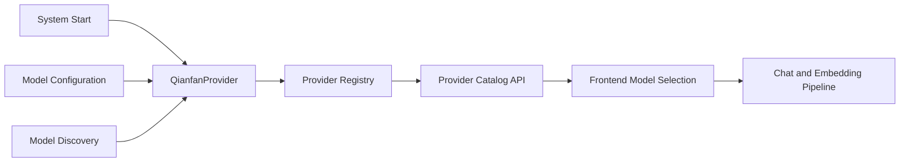

# 百度千帆 (Qianfan) 服务提供者集成模块深度解析

## 1. 概述

**qianfan_provider_integration** 模块是 WeKnora 平台中负责集成百度千帆大模型平台的核心组件。它实现了统一的 Provider 接口，使得系统能够无缝地利用百度千帆提供的多种 AI 能力，包括文心一言（Ernie）对话模型、向量嵌入模型、重排序模型以及视觉语言模型。

### 解决的核心问题

在多模型服务提供商的生态系统中，每个平台都有其独特的 API 结构、认证机制和配置要求。百度千帆作为中国领先的 AI 服务平台，提供了丰富的模型资源，但它的接口规范与其他厂商（如阿里云、OpenAI）存在差异。本模块的主要职责是将百度千帆的特性抽象为系统内部的统一接口，从而实现：
- **配置标准化**：将百度千帆的配置参数映射到系统通用的配置结构
- **能力发现**：向系统注册百度千帆支持的模型类型和默认端点
- **配置验证**：确保用户提供的百度千帆配置满足最小运行要求

## 2. 架构与设计模式

### 2.1 系统位置与上下文

该模块位于 `model_providers_and_ai_backends` → `provider_catalog_and_configuration_contracts` → `regional_and_cloud_platform_provider_catalog` → `major_chinese_cloud_llm_platform_providers` 层级下，属于**平台特定适配层**。它通过实现 [Provider](model_providers_and_ai_backends-provider_catalog_and_configuration_contracts.md) 接口，与上层的提供者注册表和配置系统交互。

### 2.2 核心设计模式

模块采用了**策略模式**和**注册表模式**的组合：



**注册表模式**：通过 `init()` 函数在包加载时自动将 `QianfanProvider` 实例注册到全局提供者注册表中，实现了"即插即用"的扩展性。

**策略模式**：`QianfanProvider` 实现了 `Provider` 接口，作为一种具体策略，可以被系统在需要时动态选择和使用，而不需要修改核心逻辑。

## 3. 核心组件解析

### 3.1 QianfanProvider 结构体

```go
type QianfanProvider struct{}
```

这是一个轻量级的无状态结构体，它作为百度千帆服务提供者的入口点。设计上不包含任何字段，因为：
- 所有配置都通过参数传递，避免了状态管理的复杂性
- 符合函数式设计思想，提高了可测试性
- 允许多个 goroutine 安全地共享同一个实例

### 3.2 Info() 方法

```go
func (p *QianfanProvider) Info() ProviderInfo
```

该方法返回百度千帆提供者的元数据，包括：

**名称与标识**：
- `Name`: 内部唯一标识符 `ProviderQianfan`
- `DisplayName`: 面向用户的友好名称 "百度千帆 Baidu Cloud"
- `Description`: 简要说明支持的模型类型，如 "ernie-5.0-thinking-preview, embedding-v1, bce-reranker-base, etc."

**端点配置**：
```go
DefaultURLs: map[types.ModelType]string{
    types.ModelTypeKnowledgeQA: QianfanBaseURL,
    types.ModelTypeEmbedding:   QianfanBaseURL,
    types.ModelTypeRerank:      QianfanBaseURL,
    types.ModelTypeVLLM:        QianfanBaseURL,
}
```

注意这里所有模型类型都使用相同的基础 URL `https://qianfan.baidubce.com/v2`，这反映了百度千帆平台的统一 API 设计。

**支持的模型类型**：
- `ModelTypeKnowledgeQA`: 对话/问答模型（如 Ernie 系列）
- `ModelTypeEmbedding`: 向量嵌入模型
- `ModelTypeRerank`: 重排序模型
- `ModelTypeVLLM`: 视觉语言模型

**认证要求**：
- `RequiresAuth: true` 表明百度千帆 API 必须使用 API Key 进行认证

### 3.3 ValidateConfig() 方法

```go
func (p *QianfanProvider) ValidateConfig(config *Config) error
```

该方法对百度千帆的配置进行严格验证，确保满足以下必填条件：

1. **BaseURL 不能为空**：虽然提供了默认 URL，但系统允许用户自定义（如使用私有部署的千帆服务）
2. **APIKey 不能为空**：百度千帆的所有 API 都需要认证
3. **ModelName 不能为空**：需要明确指定使用哪个具体模型

验证失败时，返回明确的错误信息，帮助用户快速定位问题。

## 4. 数据流程与依赖关系

### 4.1 初始化流程

当系统启动时，`qianfan.go` 包被加载，`init()` 函数自动执行：

```go
func init() {
    Register(&QianfanProvider{})
}
```

这个流程将 `QianfanProvider` 实例注册到全局注册表中，使其对系统其他部分可见。

### 4.2 配置验证流程

当用户配置或使用百度千帆模型时，系统会调用 `ValidateConfig()`：

1. 系统从模型数据库加载模型配置
2. 调用 `NewConfigFromModel()` 将 `types.Model` 转换为 `provider.Config`
3. 通过 `Get(ProviderQianfan)` 获取 `QianfanProvider` 实例
4. 调用 `ValidateConfig()` 验证配置的有效性
5. 如果验证通过，配置被用于后续的 API 调用

### 4.3 能力发现流程

当前端或其他组件需要了解可用的模型提供者时：

1. 调用 `List()` 或 `ListByModelType()` 获取所有注册的提供者信息
2. 每个提供者的 `Info()` 方法被调用，返回其元数据
3. 这些信息被用于构建模型选择界面或进行路由决策

## 5. 设计决策与权衡

### 5.1 统一 BaseURL  vs  分开配置

**决策**：所有模型类型使用相同的 `QianfanBaseURL`

**理由**：
- 百度千帆平台设计上使用统一的 API 网关
- 简化配置，减少用户认知负担
- 如果未来百度千帆改变这一设计，可以轻松调整

**权衡**：
- 丧失了为不同模型类型配置不同端点的灵活性
- 但这种灵活性对于百度千帆当前的架构来说是不必要的

### 5.2 严格验证 vs 宽松验证

**决策**：要求 `BaseURL`、`APIKey` 和 `ModelName` 都不能为空

**理由**：
- 提前失败原则：在配置阶段就发现问题，而不是在运行时
- 百度千帆 API 确实要求这些参数
- 明确的错误信息比神秘的 API 失败更友好

**权衡**：
- 对于一些特殊场景（如只需要部分功能）可能显得过于严格
- 但对于大多数用户来说，这种严格性避免了后续的调试痛苦

### 5.3 无状态设计 vs 有状态设计

**决策**：`QianfanProvider` 是无状态的

**理由**：
- 线程安全：多个 goroutine 可以同时使用同一个实例
- 简化内存管理：不需要担心实例的生命周期
- 易于测试：可以在不设置复杂状态的情况下进行单元测试

**权衡**：
- 无法缓存某些频繁使用的数据（如认证令牌）
- 但这些缓存逻辑最好放在更上层的调用者中，而不是提供者本身

## 6. 使用指南与常见问题

### 6.1 如何配置百度千帆模型

1. 在模型配置中，设置 `provider` 为 "qianfan"
2. 提供有效的 `base_url`（通常使用默认值即可）
3. 填入从百度千帆控制台获取的 `api_key`
4. 指定 `model_name`，如 "ernie-5.0-thinking-preview" 或 "embedding-v1"

### 6.2 常见错误

| 错误信息 | 原因 | 解决方案 |
|---------|------|---------|
| "base URL is required for Qianfan provider" | 配置中缺少 BaseURL | 确保配置包含有效的 base_url |
| "API key is required for Qianfan provider" | 配置中缺少 APIKey | 在百度千帆控制台获取 API Key 并填入 |
| "model name is required" | 配置中缺少 ModelName | 指定要使用的具体模型名称 |

### 6.3 支持的模型

虽然 `Info()` 方法的描述中提到了几个例子，但百度千帆支持的模型远不止这些。常见的包括：

**对话模型**：
- ernie-5.0-thinking-preview
- ernie-4.0-turbo-128k
- ernie-3.5-128k

**嵌入模型**：
- embedding-v1
- tao-8k

**重排序模型**：
- bce-reranker-base

**视觉语言模型**：
- ernie-vilg-2.5

## 7. 未来扩展与改进

虽然当前实现已经满足基本需求，但有几个可能的改进方向：

1. **自动检测模型类型**：根据 `ModelName` 自动推断模型类型，减少用户配置
2. **模型列表获取**：添加从百度千帆 API 动态获取可用模型列表的功能
3. **高级验证**：验证 `ModelName` 是否确实是百度千帆支持的模型
4. **额外配置字段**：通过 `ExtraFields` 支持百度千帆特有的配置参数

## 8. 总结

**qianfan_provider_integration** 模块是一个设计简洁、职责明确的适配器组件。它通过实现统一的 Provider 接口，将百度千帆平台的能力无缝集成到 WeKnora 系统中。其无状态设计、严格验证和自动注册机制体现了良好的软件工程实践，为系统的多模型提供者架构提供了坚实的支撑。

作为系统的"插件"之一，它展示了如何通过标准接口将外部服务集成进来，同时保持核心系统的简洁性和可扩展性。
