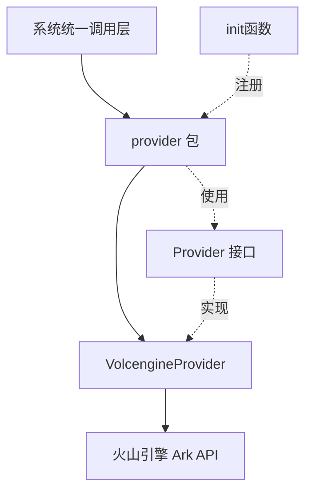

# 火山引擎 Provider 集成技术深度解析

## 1. 模块概述

`volcengine_provider_integration` 模块是一个专门为火山引擎（Volcengine）Ark 平台提供 AI 模型服务集成的适配层。在一个多模型提供商的生态系统中，这个模块解决了如何将火山引擎独特的 API 接口和能力无缝接入到统一的模型提供商框架中的问题。

### 核心问题
想象一下，你正在构建一个需要支持多种 AI 模型提供商的系统。每个提供商都有自己的 API 端点、认证方式和模型命名规范。如果直接在业务代码中处理这些差异，会导致代码混乱、难以维护。`volcengine_provider_integration` 模块就是为了解决这个问题而存在的——它充当了火山引擎 Ark 平台与系统统一模型提供商框架之间的翻译官。

## 2. 架构与设计

### 2.1 整体架构


### 2.2 核心组件
- **VolcengineProvider 结构体**：实现了 Provider 接口，是火山引擎 Ark 平台与系统交互的核心桥梁
- **Provider 接口**：定义了模型提供商必须实现的标准方法（Info 和 ValidateConfig）
- **Registry 机制**：通过 init 函数自动注册到全局提供者注册表

## 3. 核心组件详解

### 3.1 VolcengineProvider 结构体

VolcengineProvider 是一个空结构体，但它实现了 Provider 接口的两个关键方法。这是一种典型的"策略模式"实现，每个 Provider 都是一个策略，系统可以根据需要选择不同的策略。

#### Info() 方法
这个方法返回火山引擎 Provider 的元数据信息：

```go
func (p *VolcengineProvider) Info() ProviderInfo {
    return ProviderInfo{
        Name:        ProviderVolcengine,
        DisplayName: "火山引擎 Volcengine",
        Description: "doubao-1-5-pro-32k-250115, doubao-embedding-vision-250615, etc.",
        DefaultURLs: map[types.ModelType]string{
            types.ModelTypeKnowledgeQA: VolcengineChatBaseURL,
            types.ModelTypeEmbedding:   VolcengineEmbeddingBaseURL,
            types.ModelTypeVLLM:        VolcengineChatBaseURL,
        },
        ModelTypes: []types.ModelType{
            types.ModelTypeKnowledgeQA,
            types.ModelTypeEmbedding,
            types.ModelTypeVLLM,
        },
        RequiresAuth: true,
    }
}
```

**设计意图**：
- 为系统提供火山引擎的基本信息，包括显示名称和支持的模型类型
- 为不同模型类型提供默认的 API 端点，简化配置
- 明确表示需要 API 密钥认证

#### ValidateConfig() 方法
这个方法验证火山引擎 Provider 的配置：

```go
func (p *VolcengineProvider) ValidateConfig(config *Config) error {
    if config.APIKey == "" {
        return fmt.Errorf("API key is required for Volcengine Ark provider")
    }
    if config.ModelName == "" {
        return fmt.Errorf("model name is required")
    }
    return nil
}
```

**设计意图**：
- 在使用配置前进行验证，避免运行时错误
- 明确火山引擎特定的配置要求（API Key 和 Model Name 是必须的）

### 3.2 常量定义

模块定义了两个重要的常量：

```go
const (
    // VolcengineChatBaseURL 火山引擎 Ark Chat API BaseURL (OpenAI 兼容模式)
    VolcengineChatBaseURL = "https://ark.cn-beijing.volces.com/api/v3"
    // VolcengineEmbeddingBaseURL 火山引擎 Ark Multimodal Embedding API BaseURL
    VolcengineEmbeddingBaseURL = "https://ark.cn-beijing.volces.com/api/v3/embeddings/multimodal"
)
```

**设计意图**：
- 集中管理 API 端点，便于维护和更新
- 注释明确说明这些端点的用途，特别是火山引擎的 OpenAI 兼容模式
- 区分了聊天 API 和多模态嵌入 API 的不同端点

### 3.3 自动注册机制

```go
func init() {
    Register(&VolcengineProvider{})
}
```

**设计意图**：
- 使用 Go 的 init 函数机制，在包加载时自动注册 Provider
- 这种方式使得添加新的 Provider 变得简单，只需创建实现了 Provider 接口的结构体并在 init 中注册即可
- 符合"开闭原则"，对扩展开放，对修改关闭

## 4. 数据流程

### 4.1 Provider 注册流程
1. 程序启动时，volcengine 包被加载
2. init() 函数执行，创建 VolcengineProvider 实例并注册到全局注册表
3. 系统可以通过 ProviderName 查找和使用 VolcengineProvider

### 4.2 配置验证流程
1. 系统准备使用火山引擎模型时，创建 Config 结构体
2. 调用 VolcengineProvider.ValidateConfig(config) 验证配置
3. 如果验证通过，继续后续操作；如果失败，返回错误信息

## 5. 设计决策与权衡

### 5.1 使用 OpenAI 兼容模式
**决策**：火山引擎 Provider 使用 OpenAI 兼容的 API 端点
**原因**：
- 减少系统需要处理的 API 差异，因为系统已经有了 OpenAI Provider 的实现
- 降低维护成本，不需要为火山引擎编写完全独立的 API 调用逻辑
- 提高兼容性，火山引擎的 OpenAI 兼容模式已经处理了很多底层细节

### 5.2 空结构体实现
**决策**：VolcengineProvider 是一个空结构体
**原因**：
- 当前阶段，火山引擎 Provider 不需要维护状态
- 空结构体占用内存极少，性能最优
- 未来如果需要添加状态，可以轻松扩展，不会破坏现有接口

### 5.3 集中式常量管理
**决策**：API 端点定义为包级常量
**原因**：
- 便于统一管理和更新
- 提高代码可读性，一眼就能看到火山引擎使用的端点
- 方便测试时进行 mock

## 6. 使用指南

### 6.1 基本使用

要使用火山引擎 Provider，首先需要确保它已经被注册（这会自动发生），然后通过 Provider 注册表获取它：

```go
provider, ok := provider.Get(provider.ProviderVolcengine)
if !ok {
    // 处理错误
}

// 验证配置
config := &provider.Config{
    APIKey:    "your-api-key",
    ModelName: "doubao-1-5-pro-32k-250115",
    // 其他配置...
}

if err := provider.ValidateConfig(config); err != nil {
    // 处理验证错误
}
```

### 6.2 支持的模型类型

火山引擎 Provider 支持以下模型类型：
- `types.ModelTypeKnowledgeQA`：用于知识问答的聊天模型
- `types.ModelTypeEmbedding`：用于生成嵌入向量的模型，特别是多模态嵌入
- `types.ModelTypeVLLM`：用于视觉语言模型

### 6.3 配置要求

使用火山引擎 Provider 时，必须提供以下配置：
- `APIKey`：火山引擎 Ark 平台的 API 密钥
- `ModelName`：要使用的模型名称，如 `doubao-1-5-pro-32k-250115` 或 `doubao-embedding-vision-250615`

## 7. 注意事项与陷阱

### 7.1 API 端点区域
当前实现中，API 端点硬编码为北京区域（`cn-beijing`）。如果需要使用其他区域，需要修改这些端点。未来可以考虑将区域作为配置选项。

### 7.2 模型名称格式
火山引擎的模型名称有特定的格式，确保使用正确的模型名称，否则会导致 API 调用失败。

### 7.3 认证方式
火山引擎 Ark 平台使用 API Key 进行认证，确保 API Key 的安全性，不要在代码中硬编码。

## 8. 相关模块

- [provider 包](model_providers_and_ai_backends-provider_catalog_and_configuration_contracts.md)：包含 Provider 接口定义和注册表机制
- [types 包](core_domain_types_and_interfaces.md)：包含 ModelType 等核心类型定义
- [其他 Provider 实现](model_providers_and_ai_backends-provider_catalog_and_configuration_contracts-regional_and_cloud_platform_provider_catalog-major_chinese_cloud_llm_platform_providers.md)：可以参考其他 Provider 的实现方式

## 9. 总结

`volcengine_provider_integration` 模块是一个简洁但功能完整的火山引擎 Ark 平台集成层。它通过实现 Provider 接口，将火山引擎的 API 无缝接入到系统的统一模型提供商框架中。模块采用了策略模式、自动注册等设计模式，使得代码既简洁又易于扩展。

虽然当前实现相对简单，但它为未来的功能扩展（如支持更多模型类型、更复杂的认证方式等）打下了良好的基础。
