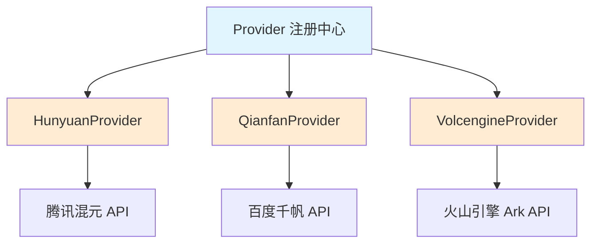

# 中国主流云平台 LLM 提供商集成

## 模块概述

这个模块为系统提供了与中国主流云平台 LLM 服务（腾讯混元、百度千帆、火山引擎）的标准化集成能力。想象一下，就像一个万能电源适配器，它能让你的设备在不同国家的电源插座上正常工作——这个模块让你的应用能够无缝地接入不同的中国云平台 LLM 服务，而无需为每个平台重写核心逻辑。

## 架构设计



这个模块采用了**插件式架构**，每个云平台提供商都实现了统一的 Provider 接口。当应用需要使用某个平台的 LLM 服务时，它不需要直接与该平台的 API 交互，而是通过 Provider 接口进行通信。

## 子模块详解

本模块包含三个子模块，每个子模块负责一个特定云平台提供商的集成。详细信息请参考各自的文档：

- [hunyuan_provider_integration](model_providers_and_ai_backends-provider_catalog_and_configuration_contracts-regional_and_cloud_platform_provider_catalog-major_chinese_cloud_llm_platform_providers-hunyuan_provider_integration.md) - 腾讯混元提供商集成
- [qianfan_provider_integration](model_providers_and_ai_backends-provider_catalog_and_configuration_contracts-regional_and_cloud_platform_provider_catalog-major_chinese_cloud_llm_platform_providers-qianfan_provider_integration.md) - 百度千帆提供商集成
- [volcengine_provider_integration](model_providers_and_ai_backends-provider_catalog_and_configuration_contracts-regional_and_cloud_platform_provider_catalog-major_chinese_cloud_llm_platform_providers-volcengine_provider_integration.md) - 火山引擎提供商集成

## 核心组件详解

### 1. HunyuanProvider（腾讯混元提供商）

**设计意图**：腾讯混元是腾讯云推出的大语言模型服务，它采用了 OpenAI 兼容的 API 格式，这使得集成相对简单。

**关键特性**：
- 统一的 BaseURL：`https://api.hunyuan.cloud.tencent.com/v1`
- 支持的模型类型：知识问答（KnowledgeQA）和嵌入（Embedding）
- 配置验证：强制要求 API Key 和模型名称

**设计权衡**：
- ✅ 采用 OpenAI 兼容模式，减少了适配器代码的复杂性
- ✅ 为所有模型类型使用相同的 BaseURL，简化了配置
- ⚠️ 没有提供自定义 BaseURL 的灵活性（这在私有部署场景可能是个问题）

### 2. QianfanProvider（百度千帆提供商）

**设计意图**：百度千帆是百度智能云的大模型平台，它提供了更丰富的模型类型支持，包括重排序（Rerank）和视觉语言模型（VLLM）。

**关键特性**：
- BaseURL：`https://qianfan.baidubce.com/v2`
- 支持的模型类型：KnowledgeQA、Embedding、Rerank、VLLM
- 配置验证：强制要求 BaseURL、API Key 和模型名称

**设计权衡**：
- ✅ 支持最多的模型类型，功能最全面
- ✅ 要求显式配置 BaseURL，为私有部署提供了灵活性
- ⚠️ 配置更复杂，用户需要提供更多参数

### 3. VolcengineProvider（火山引擎提供商）

**设计意图**：火山引擎是字节跳动推出的云服务平台，它的特色是提供了专门的多模态嵌入 API。

**关键特性**：
- 区分的 BaseURL：聊天使用通用 API，嵌入使用专门的多模态 API
- 支持的模型类型：KnowledgeQA、Embedding、VLLM
- 配置验证：强制要求 API Key 和模型名称

**设计权衡**：
- ✅ 为不同功能使用专门的 API 端点，可能提供更好的性能和功能
- ✅ 支持多模态嵌入，这是一个差异化功能
- ⚠️ 配置逻辑稍微复杂，需要根据模型类型选择不同的端点

## 数据流程

当应用需要调用 LLM 服务时，数据流程如下：

1. **配置阶段**：用户提供提供商类型、API Key、模型名称等配置
2. **验证阶段**：对应的 Provider 调用 `ValidateConfig` 方法验证配置的完整性
3. **注册阶段**：所有 Provider 在 `init` 函数中自动注册到全局 Provider 注册表
4. **使用阶段**：应用通过 Provider 名称从注册表获取实例，然后使用该实例进行 API 调用

## 设计决策分析

### 1. 为什么采用插件式架构？

**选择**：每个提供商作为独立的插件，实现统一的接口。

**替代方案**：
- 硬编码所有提供商逻辑在一个文件中
- 使用策略模式但不使用自动注册

**权衡**：
- ✅ 可扩展性：添加新的提供商只需创建新文件并实现接口
- ✅ 解耦：提供商逻辑与核心应用逻辑分离
- ✅ 自动发现：通过 `init` 函数自动注册，无需手动配置
- ⚠️ 稍微增加了代码结构的复杂性

### 2. 为什么每个提供商有不同的配置要求？

**选择**：让每个提供商自己定义配置验证逻辑。

**替代方案**：
- 统一所有提供商的配置要求
- 使用配置模板

**权衡**：
- ✅ 灵活性：每个提供商可以根据自己的 API 特点定义要求
- ✅ 准确性：验证逻辑更贴近实际 API 需求
- ⚠️ 用户需要了解不同提供商的不同要求

### 3. 为什么使用硬编码的 DefaultURLs？

**选择**：在代码中硬编码默认的 API 端点。

**替代方案**：
- 从配置文件加载
- 使用环境变量

**权衡**：
- ✅ 简化了用户配置，大多数情况下使用默认值即可
- ✅ 减少了配置错误的可能性
- ⚠️ 如果提供商更改 API 端点，需要更新代码
- ⚠️ 对于私有部署场景不够灵活（但大多数提供商都允许覆盖）

## 使用指南

### 基本使用

```go
// 1. 创建配置
config := &provider.Config{
    ProviderName: provider.ProviderHunyuan,
    APIKey:       "your-api-key",
    ModelName:    "hunyuan-pro",
}

// 2. 获取提供商
p, err := provider.GetProvider(config.ProviderName)
if err != nil {
    // 处理错误
}

// 3. 验证配置
if err := p.ValidateConfig(config); err != nil {
    // 处理错误
}

// 4. 使用提供商进行 API 调用
// ...
```

### 配置各提供商的注意事项

**腾讯混元**：
- 只需提供 API Key 和模型名称
- BaseURL 是固定的，无需配置

**百度千帆**：
- 需要提供 BaseURL、API Key 和模型名称
- 支持最多种类的模型类型

**火山引擎**：
- 只需提供 API Key 和模型名称
- 系统会根据模型类型自动选择合适的 BaseURL

## 常见陷阱与最佳实践

### 陷阱

1. **忘记检查 Provider 是否支持所需的模型类型**
   - 每个 Provider 支持的模型类型不同，使用前应检查 `Info().ModelTypes`

2. **配置参数错误**
   - 百度千帆需要 BaseURL，而其他两个不需要
   - 所有 Provider 都需要 API Key 和 Model Name

3. **忽略配置验证**
   - 始终调用 `ValidateConfig` 方法，不要假设配置是正确的

### 最佳实践

1. **使用 Provider 注册表**
   - 不要直接实例化 Provider，使用 `GetProvider` 函数从注册表获取

2. **提供有意义的错误信息**
   - 当配置验证失败时，错误信息会告诉你具体缺少什么

3. **考虑使用默认值**
   - 大多数情况下，使用 DefaultURLs 就足够了
   - 只有在特殊情况下（如私有部署）才需要自定义 BaseURL

## 扩展点

如果你需要添加新的中国云平台 LLM 提供商，只需：

1. 创建一个新文件（如 `moss.go`）
2. 定义一个实现 Provider 接口的结构体
3. 在 `init` 函数中调用 `Register` 注册你的 Provider
4. 实现 `Info()` 和 `ValidateConfig()` 方法

这样，你的新 Provider 就会自动集成到系统中，无需修改任何现有代码。

## 相关模块

- [provider_catalog_and_configuration_contracts](model_providers_and_ai_backends-provider_catalog_and_configuration_contracts.md) - 提供商目录和配置契约
- [chat_completion_backends_and_streaming](model_providers_and_ai_backends-chat_completion_backends_and_streaming.md) - 聊天完成后端和流式处理
- [embedding_interfaces_batching_and_backends](model_providers_and_ai_backends-embedding_interfaces_batching_and_backends.md) - 嵌入接口、批处理和后端
