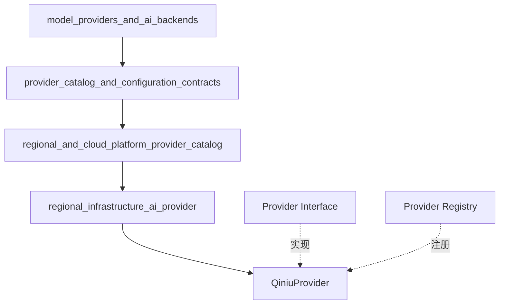

# regional_infrastructure_ai_provider 模块技术深度解析

## 1. 模块概览

**regional_infrastructure_ai_provider** 模块是 WeKnora 系统中专门用于集成国内区域云服务商 AI 能力的模块，核心实现了 **QiniuProvider** 结构体，用于适配七牛云的 OpenAI 兼容 API 接口。

### 解决的核心问题

在多模型提供商的系统中，需要统一的抽象层来处理不同云服务商的差异。七牛云作为国内重要的云服务提供商，提供了 OpenAI 兼容的 API 接口，本模块的主要职责就是：
- 将七牛云的 AI 服务无缝接入 WeKnora 系统
- 提供元数据描述和配置验证
- 遵循统一的 Provider 接口规范

## 2. 核心架构设计

### 2.1 模块在系统中的位置



### 2.2 核心抽象和接口

本模块的核心设计围绕着 **Provider 接口**展开，该接口定义在 [provider.go](internal/models/provider/provider.go) 中：

```go
type Provider interface {
    // Info 返回服务商的元数据
    Info() ProviderInfo

    // ValidateConfig 验证服务商的配置
    ValidateConfig(config *Config) error
}
```

**QiniuProvider** 结构体完全遵循这个接口，通过**空结构体**模式实现，因为它不需要维护任何状态，只需要提供元数据和验证逻辑。

## 3. 核心组件详解

### 3.1 QiniuProvider 结构体

**位置**：[internal/models/provider/qiniu.go](internal/models/provider/qiniu.go)

**设计意图**：
- 使用空结构体是因为该 Provider 不需要维护任何状态，所有功能都是无状态的
- 通过 `init()` 函数自动注册到全局 Provider 注册表中，实现插件式架构

**关键实现**：

```go
// QiniuProvider 实现七牛云的 Provider 接口
type QiniuProvider struct{}

func init() {
    Register(&QiniuProvider{})
}
```

### 3.2 Info() 方法

**功能**：返回七牛云 Provider 的元数据信息

**设计要点**：
- 明确声明支持的模型类型：`ModelTypeKnowledgeQA`
- 提供 OpenAI 兼容的默认 BaseURL：`https://api.qnaigc.com/v1`
- 描述中列出支持的典型模型，方便用户选择
- 显式声明需要认证（`RequiresAuth: true`）

**代码实现**：
```go
func (p *QiniuProvider) Info() ProviderInfo {
    return ProviderInfo{
        Name:        ProviderQiniu,
        DisplayName: "七牛云 Qiniu",
        Description: "deepseek/deepseek-v3.2-251201, z-ai/glm-4.7, etc.",
        DefaultURLs: map[types.ModelType]string{
            types.ModelTypeKnowledgeQA: QiniuBaseURL,
        },
        ModelTypes: []types.ModelType{
            types.ModelTypeKnowledgeQA,
        },
        RequiresAuth: true,
    }
}
```

### 3.3 ValidateConfig() 方法

**功能**：验证七牛云 Provider 的配置是否完整和有效

**设计要点**：
- 强制要求 BaseURL，确保 API 端点可访问
- 强制要求 APIKey，确保安全性
- 强制要求 ModelName，确保明确指定使用的模型
- 使用简洁的错误信息，便于调试和用户理解

**代码实现**：
```go
func (p *QiniuProvider) ValidateConfig(config *Config) error {
    if config.BaseURL == "" {
        return fmt.Errorf("base URL is required for Qiniu provider")
    }
    if config.APIKey == "" {
        return fmt.Errorf("API key is required for Qiniu provider")
    }
    if config.ModelName == "" {
        return fmt.Errorf("model name is required")
    }
    return nil
}
```

## 4. 数据流向和依赖关系

### 4.1 数据流向

```
用户配置 → Config 结构体 → ValidateConfig() 验证 → 通过
                                      ↓
                                    失败 → 返回错误信息
```

### 4.2 依赖关系

**QiniuProvider 依赖的组件**：
1. **Provider 接口**：定义了必须实现的方法
2. **ProviderInfo 结构体**：用于描述 Provider 的元数据
3. **Config 结构体**：用于存储和验证配置信息
4. **types.ModelType**：定义了支持的模型类型
5. **Register() 函数**：用于将 Provider 注册到全局注册表

**调用 QiniuProvider 的组件**：
1. **Provider Registry**：通过 `Get()` 或 `GetOrDefault()` 获取 Provider 实例
2. **Model Configuration System**：使用 `ValidateConfig()` 验证配置
3. **Provider Detection System**：通过 `DetectProvider()` 自动识别 Provider

## 5. 设计决策与权衡

### 5.1 无状态 Provider 设计

**决策**：使用空结构体实现 QiniuProvider，不维护任何状态

**原因**：
- Provider 的职责主要是提供元数据和验证配置，不需要维护状态
- 无状态设计使 Provider 可以被安全地共享和复用
- 简化了并发访问的处理，不需要考虑线程安全问题

**权衡**：
- 优点：简单、安全、易于测试
- 缺点：如果未来需要添加状态ful的功能，可能需要重构

### 5.2 OpenAI 兼容模式

**决策**：使用七牛云的 OpenAI 兼容 API 接口

**原因**：
- 七牛云提供了 OpenAI 兼容的 API，减少了适配工作量
- 可以复用系统中已有的 OpenAI 兼容客户端代码
- 便于未来扩展其他 OpenAI 兼容的 Provider

**权衡**：
- 优点：降低开发成本，提高代码复用性
- 缺点：可能无法充分利用七牛云特有的功能

### 5.3 插件式注册机制

**决策**：通过 `init()` 函数自动注册到全局 Provider 注册表

**原因**：
- 实现了插件式架构，添加新 Provider 不需要修改现有代码
- 遵循了 Go 语言的惯用模式
- 简化了 Provider 的使用，用户不需要手动注册

**权衡**：
- 优点：易于扩展，降低耦合
- 缺点：初始化顺序可能受到包导入顺序的影响

## 6. 使用指南与最佳实践

### 6.1 基本使用

```go
// 获取 QiniuProvider 实例
provider, ok := provider.Get(provider.ProviderQiniu)
if !ok {
    // 处理错误
}

// 验证配置
config := &provider.Config{
    BaseURL:   "https://api.qnaigc.com/v1",
    APIKey:    "your-api-key",
    ModelName: "deepseek/deepseek-v3.2-251201",
}
if err := provider.ValidateConfig(config); err != nil {
    // 处理验证错误
}
```

### 6.2 配置要求

使用 QiniuProvider 时，必须提供以下配置：
- **BaseURL**：API 端点地址，默认为 `https://api.qnaigc.com/v1`
- **APIKey**：七牛云 API 密钥
- **ModelName**：要使用的模型名称，如 `deepseek/deepseek-v3.2-251201` 或 `z-ai/glm-4.7`

### 6.3 常见模型

根据 Info() 方法中的描述，七牛云支持以下常见模型：
- `deepseek/deepseek-v3.2-251201`
- `z-ai/glm-4.7`

## 7. 注意事项与常见问题

### 7.1 自动检测

系统可以通过 `DetectProvider()` 函数自动检测 Provider，当 BaseURL 包含 "qiniuapi.com" 或 "qiniu" 时，会自动识别为 QiniuProvider。

### 7.2 错误处理

`ValidateConfig()` 方法会返回详细的错误信息，便于调试：
- "base URL is required for Qiniu provider"
- "API key is required for Qiniu provider"
- "model name is required"

### 7.3 扩展限制

当前 QiniuProvider 只支持 `ModelTypeKnowledgeQA` 类型的模型，如果需要支持其他类型（如 Embedding 或 Rerank），需要：
1. 在 `Info()` 方法的 `DefaultURLs` 中添加对应的 URL
2. 在 `ModelTypes` 切片中添加对应的类型
3. 可能需要修改 `ValidateConfig()` 方法（如果不同类型有不同的验证要求）

## 8. 相关模块

- [provider 核心接口定义](model_providers_and_ai_backends-provider_catalog_and_configuration_contracts.md)
- [其他区域云服务商 Provider](model_providers_and_ai_backends-provider_catalog_and_configuration_contracts-regional_and_cloud_platform_provider_catalog.md)
- [OpenAI 兼容 Provider 目录](model_providers_and_ai_backends-provider_catalog_and_configuration_contracts-openai_compatible_provider_catalog.md)

