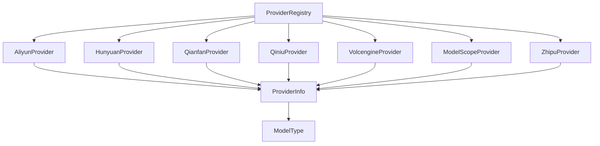

# regional_and_cloud_platform_provider_catalog 模块技术深度解析

## 1. 模块概述

### 1.1 问题空间

在构建多模型支持的 AI 平台时，我们面临一个核心挑战：如何优雅地接入和管理众多区域和云平台提供的模型服务？这些服务各有特点：
- 不同的 API 端点和认证方式
- 不同的模型类型支持（聊天、嵌入、重排序、视觉等）
- 不同的参数要求和配置规范

直接在业务逻辑中处理这些差异会导致代码混乱、难以维护，并且每次添加新的模型提供商都需要大规模修改。

### 1.2 解决方案

`regional_and_cloud_platform_provider_catalog` 模块采用了**提供者模式（Provider Pattern）**，为每个区域和云平台模型服务创建统一的接口实现。每个提供者（Provider）封装了特定平台的元数据、默认配置和验证逻辑，使得系统可以以统一的方式与各种模型服务交互。

## 2. 架构设计

### 2.1 核心架构图

### 2.2 架构说明

这个模块的设计非常简洁但有效：

1. **提供者注册机制**：每个 Provider 在 `init()` 函数中通过 `Register()` 函数自动注册到全局注册表中
2. **统一接口**：所有 Provider 都实现相同的接口，提供 `Info()` 和 `ValidateConfig()` 方法
3. **元数据驱动**：Provider 的能力、默认配置等都通过 `ProviderInfo` 结构体声明
4. **配置验证**：每个 Provider 负责验证自己的配置参数

这种设计使得系统可以在运行时动态发现可用的模型提供商，并根据它们的元数据选择合适的提供者。

## 3. 核心组件详解

### 3.1 AliyunProvider

**作用**：封装阿里云 DashScope 模型服务的接入逻辑。

**设计特点**：
- 支持多种模型类型（聊天、嵌入、重排序、视觉）
- 提供了两个辅助函数 `IsQwen3Model` 和 `IsDeepSeekModel` 来处理特定模型的特殊行为
- 聊天和嵌入使用相同的 BaseURL，但重排序使用单独的端点

**使用场景**：当需要接入阿里云的通义千问系列模型时使用。

### 3.2 HunyuanProvider

**作用**：封装腾讯混元模型服务的接入逻辑。

**设计特点**：
- 相对简洁，只支持聊天和嵌入两种模型类型
- 使用腾讯云的 OpenAI 兼容端点

**使用场景**：当需要接入腾讯混元系列模型时使用。

### 3.3 QianfanProvider

**作用**：封装百度千帆模型服务的接入逻辑。

**设计特点**：
- 是少数要求必须配置 BaseURL 的提供者之一
- 支持完整的模型类型（聊天、嵌入、重排序、视觉）
- 所有模型类型共享相同的 BaseURL

**使用场景**：当需要接入百度文心一言系列模型时使用。

### 3.4 QiniuProvider

**作用**：封装七牛云模型服务的接入逻辑。

**设计特点**：
- 目前只支持聊天模型类型
- 同样要求必须配置 BaseURL

**使用场景**：当需要接入七牛云提供的模型服务时使用。

### 3.5 VolcengineProvider

**作用**：封装火山引擎 Ark 模型服务的接入逻辑。

**设计特点**：
- 聊天和视觉模型使用相同的端点，但嵌入使用专门的多模态嵌入端点
- 支持豆包系列模型和多模态嵌入

**使用场景**：当需要接入火山引擎的豆包系列模型时使用。

### 3.6 ModelScopeProvider

**作用**：封装魔搭 ModelScope 模型服务的接入逻辑。

**设计特点**：
- 要求必须配置 BaseURL
- 支持完整的模型类型
- 主要用于接入 ModelScope 上的开源模型

**使用场景**：当需要接入 ModelScope 平台上的模型时使用。

### 3.7 ZhipuProvider

**作用**：封装智谱 AI 模型服务的接入逻辑。

**设计特点**：
- 聊天和嵌入使用相同的 BaseURL，但重排序使用单独的端点
- 支持 GLM 系列模型

**使用场景**：当需要接入智谱 AI 的 GLM 系列模型时使用。

## 4. 设计决策与权衡

### 4.1 为什么使用自动注册机制？

**决策**：使用 `init()` 函数自动注册提供者。

**原因**：
- 符合"开闭原则"：添加新提供者不需要修改注册中心的代码
- 降低耦合：提供者自己负责注册，注册中心不需要知道所有提供者的存在
- 简化使用：导入包时自动注册，无需手动调用注册函数

**权衡**：
- 优点：灵活性高，易于扩展
- 缺点：如果多个提供者有冲突，问题可能在运行时才暴露

### 4.2 为什么每个提供者都有自己的 ValidateConfig？

**决策**：将配置验证逻辑放在每个提供者内部。

**原因**：
- 不同的提供者有不同的验证要求（如 QianfanProvider 要求必须配置 BaseURL，而其他一些提供者不需要）
- 验证逻辑与提供者紧密相关，放在一起更符合内聚性原则
- 便于提供者自定义验证规则

**权衡**：
- 优点：验证逻辑与提供者紧密结合，更符合单一职责原则
- 缺点：如果验证逻辑有共同部分，可能会有代码重复

### 4.3 为什么有些提供者要求配置 BaseURL，有些不要求？

**决策**：根据提供者的特性决定是否要求 BaseURL。

**原因**：
- 对于有固定公共端点的服务（如阿里云、腾讯混元），不需要配置 BaseURL
- 对于可能有多个部署环境或需要自定义端点的服务（如百度千帆、七牛云），要求配置 BaseURL
- 这样的设计既简化了常见场景的使用，又保持了灵活性

**权衡**：
- 优点：常见场景使用简单，复杂场景有灵活性
- 缺点：不同提供者的配置要求不一致，可能会让用户困惑

## 5. 数据流程

### 5.1 提供者注册流程

1. 包导入时，每个提供者的 `init()` 函数被调用
2. `init()` 函数调用 `Register()` 将提供者注册到全局注册表
3. 注册表维护一个提供者名称到提供者实例的映射

### 5.2 配置验证流程

1. 用户创建一个 `Config` 对象，设置提供者名称、API Key、模型名称等
2. 系统根据提供者名称从注册表中获取对应的提供者实例
3. 调用提供者的 `ValidateConfig()` 方法验证配置
4. 如果验证失败，返回错误；如果验证成功，继续后续流程

## 6. 最佳实践与注意事项

### 6.1 添加新提供者

当需要添加新的区域或云平台模型提供者时：

1. 创建一个新的文件，如 `newprovider.go`
2. 定义一个结构体，如 `NewProvider`
3. 实现 `Info()` 和 `ValidateConfig()` 方法
4. 在 `init()` 函数中调用 `Register()` 注册
5. 确保正确设置 `ProviderInfo` 中的所有字段

### 6.2 注意事项

1. **提供者名称**：确保提供者名称唯一，避免与现有提供者冲突
2. **默认 URL**：对于有固定公共端点的服务，提供默认 URL 可以简化使用
3. **配置验证**：仔细考虑哪些配置项是必须的，哪些是可选的
4. **模型类型**：准确声明提供者支持的模型类型，避免用户尝试使用不支持的功能

### 6.3 常见问题

- **Q: 为什么我的提供者没有被注册？**
  A: 确保在 `init()` 函数中调用了 `Register()`，并且包被正确导入。

- **Q: 如何处理提供者特定的参数？**
  A: 可以在 `Config` 结构体中添加扩展字段，或者使用 `Extra` 字段存储提供者特定的配置。

- **Q: 如何测试我的提供者？**
  A: 编写单元测试，测试 `Info()` 和 `ValidateConfig()` 方法的各种情况。

## 7. 子模块文档

该模块包含以下子模块：

- [aliyun_ecosystem_providers](model_providers_and_ai_backends-provider_catalog_and_configuration_contracts-regional_and_cloud_platform_provider_catalog-aliyun_ecosystem_providers.md)
- [major_chinese_cloud_llm_platform_providers](model_providers_and_ai_backends-provider_catalog_and_configuration_contracts-regional_and_cloud_platform_provider_catalog-major_chinese_cloud_llm_platform_providers.md)
- [independent_foundation_model_platform_providers](model_providers_and_ai_backends-provider_catalog_and_configuration_contracts-regional_and_cloud_platform_provider_catalog-independent_foundation_model_platform_providers.md)
- [regional_infrastructure_ai_provider](model_providers_and_ai_backends-provider_catalog_and_configuration_contracts-regional_and_cloud_platform_provider_catalog-regional_infrastructure_ai_provider.md)

## 8. 总结

`regional_and_cloud_platform_provider_catalog` 模块是一个设计优雅的模块，它解决了多模型服务接入的复杂性问题。通过提供者模式和自动注册机制，它使得系统可以灵活地接入和管理各种区域和云平台模型服务，同时保持了代码的简洁性和可维护性。

这个模块的设计体现了几个重要的软件设计原则：
- 开闭原则：对扩展开放，对修改关闭
- 单一职责原则：每个提供者只负责自己的逻辑
- 依赖倒置原则：依赖于抽象接口，而不是具体实现

这些原则使得模块具有很好的扩展性和可维护性，是一个值得学习的设计范例。
