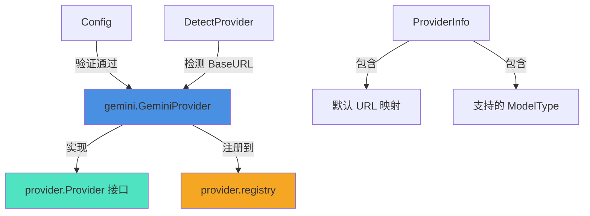

# Gemini 基础模型提供商适配器技术深度文档

## 1. 什么是这个模块，为什么需要它？

### 问题背景
在构建多模型提供商的 AI 应用时，系统需要与众多不同的 LLM 提供商进行交互，每个提供商都有自己独特的 API 端点、认证方式、参数规范和兼容性特性。对于 Google Gemini 这样的大型模型提供商，它提供了原生 API，但同时也提供了 OpenAI 兼容模式，这给系统带来了特定的集成挑战。

### 解决方案
`gemini_foundation_model_provider_adapter` 模块是专门为 Google Gemini 模型提供商设计的适配器实现，它遵循统一的 Provider 接口，将 Gemini 的特殊性封装在标准化接口之后。

### 关键设计意图
- **标准化集成**：通过实现通用的 `Provider` 接口，将 Gemini 独特的 API 特性转换为系统内部统一的抽象
- **OpenAI 兼容性优先**：优先使用 Gemini 的 OpenAI 兼容模式，这样可以复用已有的 OpenAI 兼容代码路径
- **最小化实现**：只包含必要的元数据和配置验证，实际 API 调用由更通用的 OpenAI 兼容处理逻辑处理

## 2. 核心概念和架构

### 核心抽象
该模块基于以下核心抽象构建：

1. **Provider 接口**：定义了所有模型提供商必须实现的标准化行为
2. **ProviderInfo**：封装提供商的元数据信息
3. **Config**：模型提供商的配置结构
4. **注册机制**：通过 `init()` 函数自动注册到全局提供商注册表

### 架构位置
这个模块位于整个模型提供商适配层的最底层，它是：
- **上游**：被 `provider` 包的注册表管理，被模型配置验证逻辑调用
- **下游**：依赖于 `types` 包的 `ModelType` 定义

### 架构图


## 3. 核心组件深度解析

### 3.1 GeminiProvider 结构体

```go
type GeminiProvider struct{}
```

**设计意图**：这是一个无状态的结构体，符合 Provider 接口的要求。它不保存任何运行时状态，所有信息都通过方法返回，这种设计使得：
- 实例可以安全地在并发环境中使用
- 内存占用最小化
- 易于测试和维护

### 3.2 常量定义

```go
const (
    // GeminiBaseURL Google Gemini API BaseURL
    GeminiBaseURL = "https://generativelanguage.googleapis.com/v1beta"
    // GeminiOpenAICompatBaseURL Gemini OpenAI 兼容模式 BaseURL
    GeminiOpenAICompatBaseURL = "https://generativelanguage.googleapis.com/v1beta/openai"
)
```

**设计决策**：
- **两个端点并存**：同时保留原生 API 端点和 OpenAI 兼容端点，提供灵活性
- **默认使用兼容模式**：在 `Info()` 方法中，默认 URL 配置指向兼容模式端点
- **版本明确**：使用 `v1beta` 版本，表明这是一个测试版 API，但在实际生产中被广泛使用

### 3.3 Info() 方法

```go
func (p *GeminiProvider) Info() ProviderInfo {
    return ProviderInfo{
        Name:        ProviderGemini,
        DisplayName: "Google Gemini",
        Description: "gemini-3-flash-preview, gemini-2.5-pro, etc.",
        DefaultURLs: map[types.ModelType]string{
            types.ModelTypeKnowledgeQA: GeminiOpenAICompatBaseURL,
        },
        ModelTypes: []types.ModelType{
            types.ModelTypeKnowledgeQA,
        },
        RequiresAuth: true,
    }
}
```

**详细解析**：
- **元数据配置**：提供了清晰的显示名称和描述，帮助用户识别此提供商
- **模型类型支持**：明确声明只支持 `ModelTypeKnowledgeQA`，这是系统中用于聊天/问答的模型类型
- **默认 URL 映射**：为 `KnowledgeQA` 类型配置了 OpenAI 兼容端点，这是关键设计决策
  - **为什么选择兼容模式**：OpenAI 兼容模式可以让系统复用已有的 OpenAI 请求/响应处理逻辑，避免为 Gemini 单独编写一套完整的 API 交互代码
  - **版本选择**：使用 `v1beta` 是因为这是 Google 目前提供的稳定测试版本

### 3.4 ValidateConfig() 方法

```go
func (p *GeminiProvider) ValidateConfig(config *Config) error {
    if config.APIKey == "" {
        return fmt.Errorf("API key is required for Google Gemini provider")
    }
    if config.ModelName == "" {
        return fmt.Errorf("model name is required")
    }
    return nil
}
```

**验证逻辑分析**：
- **API Key 强制检查**：Gemini API 要求所有请求都必须通过 API Key 进行认证
- **Model Name 强制检查**：必须明确指定使用哪个 Gemini 模型（如 gemini-2.5-pro, gemini-3-flash-preview 等）
- **不检查 BaseURL**：这是有意为之，因为用户可能想要使用自定义的代理端点或不同的 API 版本

### 3.5 自动注册机制

```go
func init() {
    Register(&GeminiProvider{})
}
```

**设计模式**：这是 Go 语言中常见的"自注册"模式
- **自动发现**：当包被导入时，`GeminiProvider` 会自动注册到全局注册表
- **无需显式初始化**：使用方无需关心如何创建和注册这个提供商
- **可插拔架构**：通过这种方式，新的提供商可以通过简单导入包的方式添加到系统中

## 4. 依赖关系和数据流向

### 4.1 依赖分析

**上游依赖**（被谁调用）：
- `provider` 包的注册中心：通过 `Register()` 函数
- 配置验证逻辑：当需要验证 Gemini 配置时，会调用 `ValidateConfig()`
- 模型目录服务：通过 `List()` 和 `Get()` 函数获取提供商信息
- `DetectProvider()` 函数：通过 BaseURL 自动检测到 Gemini 提供商

**下游依赖**（调用谁）：
- `types` 包：使用 `ModelType` 枚举类型
- `provider` 包：使用 `Provider` 接口、`ProviderInfo` 结构体、`Config` 结构体等

### 4.2 数据流向

**配置验证流程**：
1. 用户创建或更新模型配置
2. 系统通过 `Get(ProviderGemini)` 获取 `GeminiProvider` 实例
3. 调用 `ValidateConfig(config)` 验证配置是否有效
4. 根据验证结果决定是否接受配置

**模型检测流程**：
1. 系统收到一个包含 BaseURL 的模型配置
2. 调用 `DetectProvider(baseURL)` 
3. 检测到 URL 包含 `generativelanguage.googleapis.com`，返回 `ProviderGemini`
4. 系统相应地设置提供商类型

## 5. 设计决策和权衡

### 5.1 OpenAI 兼容模式 vs 原生 API

**决策**：优先使用 OpenAI 兼容模式

**理由**：
- **代码复用**：可以完全复用已有的 OpenAI 兼容请求/响应处理代码
- **维护成本**：不需要同时维护两套 API 交互逻辑
- **一致性**：与系统中其他使用 OpenAI 兼容模式的提供商保持一致

**权衡**：
- **功能限制**：可能无法使用 Gemini 原生 API 的某些特有功能
- **版本滞后**：OpenAI 兼容模式可能比原生 API 版本稍晚获得新特性
- **调试难度**：如果出现问题，需要通过兼容层进行调试

### 5.2 无状态设计

**决策**：`GeminiProvider` 是一个无状态结构体

**理由**：
- **并发安全**：无状态对象天然是并发安全的
- **简单性**：不需要考虑状态管理和同步问题
- **测试友好**：更容易编写单元测试

**权衡**：
- **灵活性限制**：如果未来需要缓存某些信息，无状态设计会成为限制
- **上下文传递**：所有必要的信息都必须通过方法参数传递

### 5.3 最小化验证逻辑

**决策**：只验证绝对必要的配置项

**理由**：
- **用户友好**：给用户最大的灵活性，允许他们使用自定义端点
- **前向兼容**：如果 Gemini 将来更改 API，不需要修改验证逻辑
- **职责分离**：只做最基本的配置验证，真正的 API 兼容性在实际调用时验证

**权衡**：
- **早期错误检测**：某些配置错误可能要到实际调用 API 时才能发现
- **用户体验**：用户可能在配置时无法获得足够的反馈

## 6. 使用指南和最佳实践

### 6.1 配置示例

```yaml
models:
  - name: gemini-2.5-pro
    type: KnowledgeQA
    source: gemini
    parameters:
      provider: gemini
      base_url: "https://generativelanguage.googleapis.com/v1beta/openai"
      api_key: "your-gemini-api-key"
```

### 6.2 支持的模型

根据 `Description` 字段，该适配器支持（但不限于）以下模型：
- `gemini-3-flash-preview`
- `gemini-2.5-pro`
- 其他 Google Gemini 系列模型

### 6.3 最佳实践

1. **使用 OpenAI 兼容模式**：尽管原生 API 可能提供更多功能，但建议使用兼容模式以保持与系统其他部分的一致性
2. **API Key 安全**：妥善保管 API Key，不要将其提交到版本控制系统
3. **模型选择**：根据任务需求选择合适的模型，对于大多数问答任务，`gemini-2.5-pro` 或 `gemini-3-flash-preview` 都是不错的选择
4. **监控使用**：Gemini API 有使用限制和定价，建议在生产环境中监控使用情况

## 7. 边缘情况和注意事项

### 7.1 版本兼容性

**问题**：代码中使用的是 `v1beta` 版本，这是一个测试版本，Google 可能会进行不向后兼容的更改

**缓解措施**：
- 关注 Google Gemini API 的更新公告
- 在配置中允许用户指定自定义的 BaseURL，以便在需要时切换版本

### 7.2 功能限制

**问题**：通过 OpenAI 兼容模式可能无法使用 Gemini 的某些特有功能，如多模态能力的高级特性

**缓解措施**：
- 如果需要使用这些特有功能，可能需要考虑实现原生 Gemini API 的支持
- 检查 Google 文档，确认所需功能在兼容模式中是否可用

### 7.3 错误处理

**问题**：配置验证只做基本检查，实际的 API 错误要在调用时才会暴露

**缓解措施**：
- 在实际调用 API 的地方实现完善的错误处理和重试逻辑
- 提供清晰的错误信息，帮助用户诊断问题

### 7.4 自定义端点

**注意**：用户可以指定自定义的 BaseURL，这可能是代理或其他兼容服务

**设计意图**：这是有意为之的灵活性，允许用户：
- 使用 API 代理来提高性能或可靠性
- 在内部网络中使用兼容的 API 服务
- 切换到不同的 API 版本

## 8. 扩展和贡献指南

### 8.1 可能的扩展方向

1. **支持更多模型类型**：未来可以考虑添加对 `ModelTypeEmbedding` 或 `ModelTypeVLLM` 的支持
2. **原生 API 支持**：可以添加一个可选的原生 API 支持模式，以解锁 Gemini 的全部功能
3. **更丰富的验证**：可以添加模型名称格式验证、API Key 格式验证等

### 8.2 贡献注意事项

1. **保持无状态设计**：如果修改 `GeminiProvider`，请保持它的无状态特性
2. **向后兼容**：任何更改都应该保持与现有配置的兼容性
3. **遵循接口契约**：确保继续完全实现 `Provider` 接口

## 9. 相关模块和参考资料

- [Provider 接口定义](model_providers_and_ai_backends-provider_catalog_and_configuration_contracts.md)
- [OpenAI 兼容提供商](model_providers_and_ai_backends-provider_catalog_and_configuration_contracts-openai_compatible_provider_catalog.md)
- [模型类型定义](core_domain_types_and_interfaces.md)
- Google Gemini API 官方文档
- OpenAI API 兼容模式文档

## 总结

`gemini_foundation_model_provider_adapter` 模块是一个精心设计的适配器，它以最小的代码量将 Google Gemini 模型提供商集成到系统中。通过使用 OpenAI 兼容模式，它实现了代码复用和一致性，同时保持了足够的灵活性来适应未来的变化。这个模块展示了如何通过清晰的接口定义和巧妙的设计决策，将外部服务的复杂性隐藏在简单的抽象之后。
