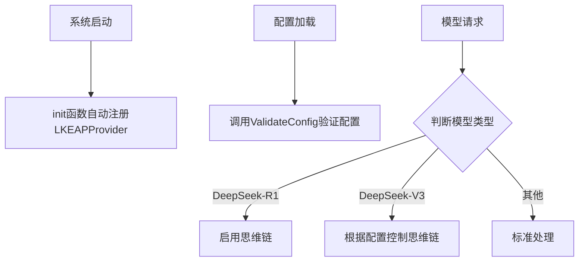

# LKEAP 基础模型提供商适配器技术深度解析

## 1. 概述

`lkeap_foundation_model_provider_adapter` 模块是系统中专门为集成腾讯云知识引擎原子能力（LKEAP）平台而设计的适配器组件。它的主要职责是将 LKEAP 平台提供的模型服务（特别是 DeepSeek-R1 和 DeepSeek-V3 系列模型）无缝接入到我们的系统中，使系统能够利用这些模型的强大能力，包括思维链（Thinking）特性。

### 问题背景

在多模型提供商的生态系统中，每个提供商都有自己独特的 API 接口、认证方式和模型特性。如果我们直接在业务代码中处理每个提供商的差异，会导致代码耦合度高、维护困难。为了解决这个问题，我们设计了统一的 Provider 接口，而 `lkeap_foundation_model_provider_adapter` 就是这个接口在 LKEAP 平台上的具体实现。

### 核心价值

这个模块的核心价值在于：
1. **标准化接入**：将 LKEAP 平台的模型服务标准化为系统内部的统一接口
2. **特性支持**：专门支持 DeepSeek 系列模型的思维链特性
3. **配置验证**：提供必要的配置验证逻辑，确保接入的正确性
4. **自动注册**：通过 init 函数自动注册到系统的 Provider 注册表中

## 2. 架构设计

### 核心组件角色

该模块的核心组件是 `LKEAPProvider` 结构体，它实现了系统定义的 `Provider` 接口。这个结构体的主要职责包括：

1. **元数据提供**：通过 `Info()` 方法提供 LKEAP 提供商的详细信息
2. **配置验证**：通过 `ValidateConfig()` 方法验证提供商配置的有效性
3. **模型识别**：提供一组辅助函数来识别不同类型的 DeepSeek 模型

### 数据流程



### 关键依赖

该模块依赖于以下核心组件：
- `provider` 包：定义了 Provider 接口和相关的配置结构
- `types` 包：提供了模型类型等核心类型定义

## 3. 核心组件详解

### LKEAPProvider 结构体

`LKEAPProvider` 是一个空结构体，它的主要价值在于实现了 `Provider` 接口的方法。这种设计体现了 Go 语言中“接口是行为的集合”的理念，结构体本身不需要存储状态，只需要提供行为实现。

### Info() 方法

这个方法返回 LKEAP 提供商的元数据信息，包括：
- 名称和显示名称
- 描述信息，特别强调了支持的模型系列和思维链特性
- 默认的 API 端点 URL
- 支持的模型类型（目前仅支持 KnowledgeQA 类型）
- 是否需要认证（LKEAP 需要 API Key 认证）

### ValidateConfig() 方法

这个方法验证 LKEAP 提供商的配置是否有效，主要检查：
1. API Key 是否存在（因为 LKEAP 需要认证）
2. 模型名称是否存在（因为需要明确指定使用哪个模型）

这种验证是必要的，可以提前发现配置错误，避免在运行时出现问题。

### 模型识别辅助函数

模块提供了三个重要的辅助函数来识别不同类型的 DeepSeek 模型：

1. **IsLKEAPDeepSeekV3Model**：检查模型是否为 DeepSeek V3.x 系列，这类模型支持通过 Thinking 参数控制思维链开关
2. **IsLKEAPDeepSeekR1Model**：检查模型是否为 DeepSeek R1 系列，这类模型默认开启思维链
3. **IsLKEAPThinkingModel**：综合判断模型是否支持思维链特性

这些函数使用字符串包含检查的方式，并且将模型名称转换为小写，提高了匹配的鲁棒性。

## 4. 设计决策与权衡

### 设计决策 1：空结构体实现 Provider 接口

**决策**：使用空结构体 `LKEAPProvider` 来实现 Provider 接口，而不是包含状态的结构体。

**原因**：LKEAPProvider 的实现不需要维护任何状态，所有必要的信息都通过方法参数传递。这种设计简化了实现，减少了内存占用，并提高了线程安全性。

**权衡**：虽然这种设计简单高效，但如果未来需要为 LKEAPProvider 添加状态管理（如连接池、缓存等），就需要修改结构体设计。

### 设计决策 2：字符串包含检查模型类型

**决策**：使用 `strings.Contains` 配合小写转换来识别模型类型。

**原因**：这种方法简单直观，并且对模型名称的变体有一定的容忍度（如不同的大小写、版本号格式等）。

**权衡**：这种方法可能会有误判的风险（如果有其他模型名称也包含类似的字符串）。不过在 DeepSeek 模型的命名规则下，这种风险是可控的。

### 设计决策 3：自动注册机制

**决策**：通过 init 函数自动将 LKEAPProvider 注册到系统的 Provider 注册表中。

**原因**：这种设计使得模块的使用非常简单，只需要导入包就可以自动完成注册，减少了手动配置的步骤。

**权衡**：自动注册可能会导致初始化顺序的问题，并且使得依赖关系不够明显。但在这个场景下，便利性的优势超过了这些潜在问题。

## 5. 使用指南与最佳实践

### 基本使用

使用 LKEAPProvider 非常简单，只需要确保导入了该包，然后在配置中指定 ProviderLKEAP 作为提供商名称即可：

```go
import (
    // 导入 LKEAP provider 包以自动注册
    _ "github.com/Tencent/WeKnora/internal/models/provider"
)

// 配置示例
config := &provider.Config{
    ProviderName: provider.ProviderLKEAP,
    APIKey:       "your-api-key",
    ModelName:    "deepseek-r1",
}
```

### 模型选择建议

- 如果需要默认开启思维链，推荐使用 DeepSeek-R1 系列模型
- 如果需要灵活控制思维链的开关，推荐使用 DeepSeek-V3 系列模型
- 使用 `IsLKEAPThinkingModel` 函数来判断模型是否支持思维链特性

### 配置注意事项

1. 确保 API Key 有效且有足够的权限
2. 模型名称必须正确，建议使用官方推荐的名称
3. 虽然模块只显式支持 KnowledgeQA 类型，但在实际使用中可能可以扩展到其他类型

## 6. 注意事项与潜在问题

### 模型名称匹配的局限性

当前的模型识别函数使用简单的字符串包含检查，可能无法处理所有可能的模型名称变体。如果 LKEAP 平台引入了新的命名规则，可能需要更新这些函数。

### 错误处理

`ValidateConfig` 方法只检查了最基本的配置项，没有验证 API Key 的有效性或模型名称的正确性。这些验证只能在实际调用 API 时进行，因此需要在调用层做好错误处理。

### 扩展性

目前 LKEAPProvider 只支持 KnowledgeQA 类型的模型，如果未来需要支持其他类型的模型（如 Embedding），需要扩展 `Info()` 方法中的 ModelTypes 列表和 DefaultURLs 映射。

## 7. 总结

`lkeap_foundation_model_provider_adapter` 模块是一个专门为集成腾讯云 LKEAP 平台而设计的适配器组件。它通过实现统一的 Provider 接口，将 LKEAP 平台的模型服务无缝接入到系统中，特别支持了 DeepSeek 系列模型的思维链特性。

该模块的设计简洁高效，使用了自动注册机制，提供了必要的配置验证和模型识别功能。虽然有一些潜在的局限性，但在当前的使用场景下，它是一个优秀的解决方案。

对于新加入团队的开发者来说，理解这个模块的关键是把握 Provider 接口的设计理念，以及 LKEAP 平台的特殊需求（如思维链特性）。
