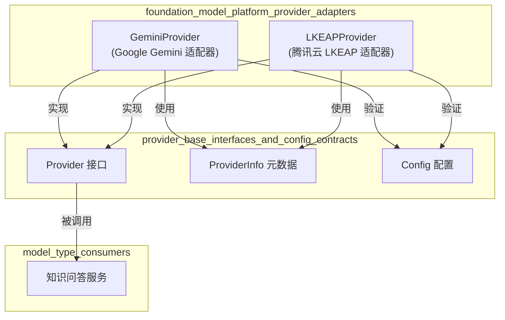
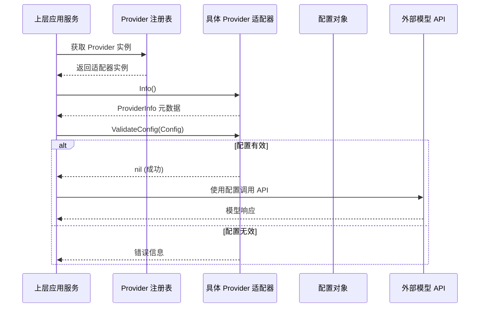

# foundation_model_platform_provider_adapters 模块技术深度文档

## 1. 模块概述

`foundation_model_platform_provider_adapters` 模块是一个专门用于集成专业基础模型平台的适配器集合。它解决了系统如何与特定的、具有独特特性的基础模型平台（如 Google Gemini 和腾讯云 LKEAP）进行标准化交互的问题。

想象一下，这个模块就像是一个"国际插头适配器"——每个模型平台都有自己独特的"插座"（API 格式、认证方式、参数要求），但系统只需要一种标准的"插头"就能工作。这个适配器模块负责在两者之间进行转换。

### 核心问题

在 AI 应用开发中，不同的基础模型平台通常有以下差异：
- API 端点格式和版本
- 认证机制
- 模型特定的参数和功能
- 特殊能力支持（如思维链）

如果没有这个适配器模块，系统的每个部分都需要直接处理这些差异，导致代码重复、维护困难和扩展复杂。

## 2. 架构与核心组件

### 模块架构图

### 核心组件

#### GeminiProvider
`GeminiProvider` 是 Google Gemini 平台的适配器实现，它：
- 提供 Gemini 平台的元数据信息
- 验证 Gemini 特定的配置要求
- 支持 OpenAI 兼容模式的 API 端点

#### LKEAPProvider
`LKEAPProvider` 是腾讯云知识引擎原子能力（LKEAP）平台的适配器，它：
- 提供 LKEAP 平台的元数据信息
- 验证 LKEAP 特定的配置要求
- 包含用于检测 DeepSeek 模型系列的辅助函数
- 支持思维链（Chain-of-Thought）能力

## 3. 数据与控制流

### 典型的 Provider 使用流程

当系统需要使用某个基础模型平台时，数据流向如下：

1. **服务发现**：系统通过 Provider 注册表查找合适的 Provider
2. **元数据获取**：调用 `Info()` 方法获取 Provider 的能力信息
3. **配置验证**：调用 `ValidateConfig()` 确保配置正确
4. **API 调用**：使用验证后的配置进行实际的模型调用（由上层模块处理）

## 4. 关键设计决策

### 设计决策 1：接口驱动的适配器模式

**选择**：所有 Provider 都实现统一的 `Provider` 接口

**原因**：
- 允许上层代码以统一方式处理不同的模型平台
- 便于添加新的 Provider 而无需修改现有代码
- 支持运行时动态选择和切换 Provider

**权衡**：
- ✅ 优点：高度解耦，易于扩展
- ⚠️ 缺点：接口设计需要足够灵活以适应各种平台特性

### 设计决策 2：注册机制与自动发现

**选择**：使用 `init()` 函数自动注册 Provider 实例

**原因**：
- 无需手动初始化每个 Provider
- 新添加的 Provider 会自动被系统发现
- 简化了配置和部署流程

**权衡**：
- ✅ 优点：自动化程度高，减少人为错误
- ⚠️ 缺点：初始化顺序可能成为隐式依赖

### 设计决策 3：LKEAP 特殊模型检测函数

**选择**：在 LKEAPProvider 中提供专门的模型类型检测函数

**原因**：
- DeepSeek 系列模型具有独特的思维链能力
- 需要根据模型类型调整请求参数和行为
- 将这些逻辑集中在 Provider 适配器中保持了封装性

**权衡**：
- ✅ 优点：功能封装良好，调用方使用简单
- ⚠️ 缺点：依赖字符串匹配，对模型命名有一定要求

## 5. 子模块文档

本模块包含以下子模块，详细信息请参考各自的文档：

- [gemini_foundation_model_provider_adapter](model_providers_and_ai_backends-provider_catalog_and_configuration_contracts-specialized_and_infrastructure_provider_catalog-foundation_model_platform_provider_adapters-gemini_foundation_model_provider_adapter.md) - Google Gemini 平台适配器详细实现
- [lkeap_foundation_model_provider_adapter](model_providers_and_ai_backends-provider_catalog_and_configuration_contracts-specialized_and_infrastructure_provider_catalog-foundation_model_platform_provider_adapters-lkeap_foundation_model_provider_adapter.md) - 腾讯云 LKEAP 平台适配器详细实现

## 6. 跨模块依赖关系

### 依赖的模块

- [provider_base_interfaces_and_config_contracts](model_providers_and_ai_backends-provider_catalog_and_configuration_contracts-provider_base_interfaces_and_config_contracts.md) - 提供 Provider 接口和基础配置契约
- [core_domain_types_and_interfaces](core_domain_types_and_interfaces.md) - 提供 ModelType 等核心类型定义

### 被依赖的模块

- [chat_completion_backends_and_streaming](model_providers_and_ai_backends-chat_completion_backends_and_streaming.md) - 使用 Provider 进行聊天完成请求
- [application_services_and_orchestration](application_services_and_orchestration.md) - 在服务编排层使用 Provider

## 7. 使用指南与注意事项

### 添加新的 Provider 适配器

1. 创建新的结构体实现 `Provider` 接口
2. 在 `init()` 函数中调用 `Register()` 注册
3. 实现 `Info()` 方法返回正确的元数据
4. 实现 `ValidateConfig()` 方法验证平台特定配置

### 配置验证最佳实践

- 始终验证 API Key 的存在性
- 检查模型名称是否符合平台要求
- 对于有特殊能力的模型，提供额外的检测函数

### 常见陷阱

1. **模型名称匹配**：LKEAP 的模型检测函数使用字符串包含匹配，确保模型名称格式一致
2. **API 端点版本**：Gemini 提供了标准和 OpenAI 兼容两种端点，根据使用场景选择正确的一个
3. **思维链参数**：使用 LKEAP 的 DeepSeek 模型时，注意正确设置思维链相关参数
