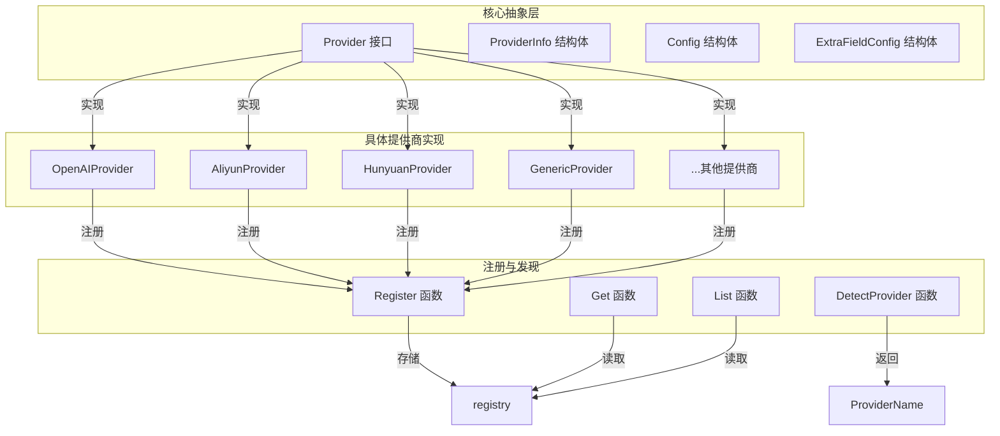

# provider_catalog_and_configuration_contracts 模块深度解析

## 为什么这个模块存在？

在构建支持多模型提供商的 AI 应用时，最棘手的问题之一是如何以统一的方式管理和配置各种不同的模型服务。每个提供商都有自己的 API 端点、认证方式、支持的模型类型和特殊配置要求。如果没有一个统一的抽象层，应用代码很快就会被各种条件判断和特殊处理逻辑弄得一团糟。

这个模块的核心使命就是**将"模型提供商"这个概念抽象化**，让系统的其他部分可以用统一的方式与任何模型提供商交互，而不需要知道底层的具体实现细节。它就像一个"万能插座"，不管你插的是 OpenAI、阿里云还是腾讯混元的插头，系统都能正常工作。

## 核心心智模型

想象一下这个模块就像是一个**模型提供商的"大使馆"系统**：

1. **Provider 接口**：就像大使馆必须遵守的外交协议，规定了每个提供商需要提供哪些基本信息和功能。
2. **ProviderInfo**：类似于大使馆的官方介绍手册，包含了名称、描述、支持的服务类型等元数据。
3. **Config**：就像签证申请表，包含了与该提供商交互所需的所有必要信息。
4. **注册机制**：就像各国大使馆在外交部的注册系统，系统启动时所有提供商都会自动注册。

通过这种方式，系统不需要预先知道所有可能的提供商，而是可以动态地发现和使用它们。

## 架构概览

这个架构图展示了模块的三层结构：

1. **核心抽象层**：定义了所有提供商必须遵守的接口和数据结构。
2. **注册与发现层**：管理提供商的注册、查询和自动检测。
3. **具体提供商实现层**：包含了各种实际的提供商适配器。

## 数据流向

让我们通过一个典型的使用场景来看看数据是如何流动的：

1. **系统启动时**：
   - 每个具体的 Provider 实现（如 OpenAIProvider）通过 `init()` 函数调用 `Register()` 注册自己。
   - 所有提供商都被存储在一个线程安全的全局注册表中。

2. **用户配置模型时**：
   - 前端调用 `List()` 或 `ListByModelType()` 获取所有可用的提供商信息。
   - 用户选择一个提供商并填写配置信息，形成一个 `Config` 对象。

3. **使用模型时**：
   - 系统通过 `Get(providerName)` 从注册表中获取对应的 Provider 实现。
   - 调用 `provider.ValidateConfig(config)` 验证配置是否有效。
   - 使用配置信息与实际的模型服务交互。

4. **自动检测场景**：
   - 如果用户只提供了 BaseURL，系统可以通过 `DetectProvider(baseURL)` 自动猜测提供商类型。

## 关键设计决策

### 1. **接口最小化设计**

**决策**：Provider 接口只定义了两个方法：`Info()` 和 `ValidateConfig()`。

**原因**：
- 不同的模型操作（聊天、嵌入、重排序）有完全不同的请求/响应格式，很难在一个接口中统一。
- 将接口限制在元数据和配置验证上，保持了接口的简洁性和稳定性。
- 实际的调用逻辑由上层模块（如 chat_completion_backends_and_streaming）根据提供商类型处理。

**权衡**：
- ✅ 接口简单易懂，易于实现新的提供商
- ❌ 上层模块需要知道如何与不同类型的提供商交互

### 2. **自动注册模式**

**决策**：每个提供商在自己的 `init()` 函数中调用 `Register()` 注册自己。

**原因**：
- 符合 Go 的惯用模式，导入包即自动注册。
- 添加新提供商时只需要创建新文件，不需要修改其他代码。
- 避免了集中式的注册列表。

**权衡**：
- ✅ 扩展性好，添加新提供商无需修改现有代码
- ❌ 注册顺序不可控（虽然这个场景下不影响）
- ❌ 如果忘记导入包，提供商不会被注册

### 3. **按模型类型区分的默认 URL**

**决策**：ProviderInfo 中的 DefaultURLs 是一个 map，key 是 ModelType。

**原因**：
- 许多提供商对不同的模型类型使用不同的端点（如阿里云的聊天和重排序使用不同 URL）。
- 提供合理的默认值可以减少用户的配置负担。

**权衡**：
- ✅ 灵活支持多种模型类型
- ✅ 提供默认值，改善用户体验
- ❌ 增加了数据结构的复杂度

### 4. **通用提供商作为兜底**

**决策**：提供 GenericProvider，并且 `GetOrDefault()` 在找不到提供商时返回它。

**原因**：
- 总有一些提供商是系统不知道的，特别是用户的私有部署。
- OpenAI 协议已经成为事实标准，大多数提供商都兼容。
- 兜底机制保证了系统的鲁棒性。

**权衡**：
- ✅ 几乎可以支持任何 OpenAI 兼容的提供商
- ✅ 系统永远不会因为未知提供商而失败
- ❌ 通用提供商的验证逻辑比较宽松

### 5. **BaseURL 自动检测**

**决策**：提供 `DetectProvider()` 函数，可以通过 BaseURL 猜测提供商。

**原因**：
- 用户经常只知道 API 地址，不知道应该选择哪个提供商。
- 大多数提供商的域名是唯一的，可以作为识别依据。

**权衡**：
- ✅ 改善用户体验，减少手动选择
- ❌ 可能误判（虽然概率很低）
- ❌ 需要维护一个域名映射表

## 子模块详解

这个模块可以进一步划分为以下几个子模块：

### 1. [provider_base_interfaces_and_config_contracts](model_providers_and_ai_backends-provider_catalog_and_configuration_contracts-provider_base_interfaces_and_config_contracts.md)

这是模块的核心，定义了所有提供商必须遵守的接口和数据结构。包含了 Provider 接口、ProviderInfo、Config、ExtraFieldConfig 等核心概念，以及注册和发现机制。

### 2. [openai_compatible_provider_catalog](model_providers_and_ai_backends-provider_catalog_and_configuration_contracts-openai_compatible_provider_catalog.md)

包含了所有兼容 OpenAI 协议的提供商实现。这些提供商都使用 OpenAI 的请求/响应格式，只是端点和认证方式可能不同。

### 3. [regional_and_cloud_platform_provider_catalog](model_providers_and_ai_backends-provider_catalog_and_configuration_contracts-regional_and_cloud_platform_provider_catalog.md)

包含了区域特定的和云平台提供商的实现，如阿里云、腾讯云、百度等。这些提供商可能有一些特殊的配置要求或功能。

### 4. [specialized_and_infrastructure_provider_catalog](model_providers_and_ai_backends-provider_catalog_and_configuration_contracts-specialized_and_infrastructure_provider_catalog.md)

包含了专门用途的和基础设施提供商的实现，如 Gemini、LKEAP、GPUStack 等。这些提供商可能有独特的功能或部署方式。

## 与其他模块的关系

这个模块在整个系统中处于**基础支撑层**，被许多其他模块依赖：

1. **依赖它的模块**：
   - [chat_completion_backends_and_streaming](model_providers_and_ai_backends-chat_completion_backends_and_streaming.md)：使用 Provider 信息来配置聊天后端
   - [embedding_interfaces_batching_and_backends](model_providers_and_ai_backends-embedding_interfaces_batching_and_backends.md)：使用 Provider 信息来配置嵌入后端
   - [model_catalog_configuration_services](application_services_and_orchestration-agent_identity_tenant_and_configuration_services-model_and_tag_configuration_services.md)：使用 Provider 列表来提供模型配置界面

2. **它依赖的模块**：
   - [core_domain_types_and_interfaces](core_domain_types_and_interfaces.md)：使用 ModelType 等基础类型

## 新贡献者指南

### 如何添加一个新的提供商？

1. 在 `internal/models/provider/` 目录下创建一个新文件，例如 `myprovider.go`。
2. 定义一个结构体（通常是空的），例如 `MyProvider struct{}`。
3. 实现 `Provider` 接口的两个方法：`Info()` 和 `ValidateConfig()`。
4. 在 `init()` 函数中调用 `Register(&MyProvider{})`。
5. 在 `provider.go` 的 `ProviderName` 常量和 `AllProviders()` 函数中添加你的提供商。

### 常见陷阱

1. **忘记在 AllProviders() 中添加**：即使你注册了提供商，如果不在 `AllProviders()` 中添加，`List()` 函数也不会返回它。

2. **验证逻辑过于严格**：`ValidateConfig()` 应该只验证真正必要的字段，避免因为一些可选字段缺失而拒绝配置。

3. **硬编码 URL**：虽然应该提供默认 URL，但也要允许用户覆盖它。

4. **不处理所有 ModelType**：如果你的提供商只支持某些模型类型，确保在 `ProviderInfo.ModelTypes` 中正确列出。

### 调试技巧

1. **检查提供商是否注册**：调用 `List()` 看看你的提供商是否在列表中。
2. **测试自动检测**：调用 `DetectProvider()` 传入你的提供商的 URL，看看是否能正确识别。
3. **验证配置**：创建一个测试配置，调用 `ValidateConfig()` 看看是否通过。

## 总结

`provider_catalog_and_configuration_contracts` 模块是整个系统支持多模型提供商的基石。它通过简洁的接口设计、灵活的注册机制和实用的自动检测功能，让系统能够以统一的方式与各种模型提供商交互。

这个模块的设计哲学是"**简单但足够灵活**"——它不试图处理所有的模型调用逻辑，而是专注于提供商的元数据管理和配置验证，让更上层的模块来处理具体的调用细节。这种关注点分离使得模块既易于理解，又易于扩展。
