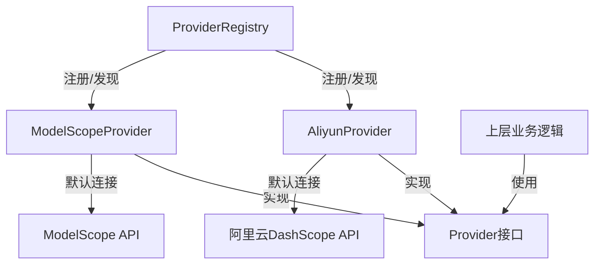

# 阿里云生态系统提供商 (aliyun_ecosystem_providers)

## 概述

阿里云生态系统提供商模块（aliyun_ecosystem_providers）是一个专门为中国主流云平台和AI服务提供商设计的适配器层，它为整个应用系统提供了与阿里云DashScope和魔搭ModelScope等平台的无缝集成能力。这个模块的核心价值在于，它将不同API风格、认证机制和功能特性的云平台统一抽象为标准化的接口，让上层业务逻辑无需关心底层具体的平台差异。

想象一下，如果没有这个模块，每接入一个新的AI平台，我们都需要在业务代码中编写大量条件判断来处理不同的URL结构、认证方式和参数格式。aliyun_ecosystem_providers就像一个翻译官，它让应用系统用"同一种语言"与阿里云DashScope和ModelScope对话。

## 架构设计

### 组件关系图



### 核心组件

这个模块包含两个主要的Provider实现：

1. **AliyunProvider**：负责与阿里云DashScope平台的交互
   - 支持Chat、Embedding、Rerank和VLLM等多种模型类型
   - 提供默认的API端点配置
   - 实现了配置验证和模型特性检测功能

2. **ModelScopeProvider**：负责与魔搭ModelScope平台的交互
   - 支持OpenAI兼容的API接口
   - 提供标准的模型接入能力
   - 支持灵活的BaseURL配置

### 设计模式

这个模块采用了**策略模式（Strategy Pattern）**的设计思想，每个Provider都是一个独立的策略实现，通过统一的Provider接口进行管理。同时，它也体现了**工厂模式**的特点，通过init函数自动注册Provider实例，让系统可以动态发现和使用不同的云平台。

## 核心功能与实现

### AliyunProvider：阿里云DashScope适配器

AliyunProvider是一个专门为阿里云DashScope平台设计的适配器，它处理了以下核心功能：

**元数据定义**：通过Info()方法提供了完整的Provider元数据，包括名称、显示名称、描述、默认URL和支持的模型类型。这些信息让上层应用可以在运行时了解Provider的能力。

**配置验证**：ValidateConfig()方法确保了必要的配置项（API Key和模型名称）的存在，避免了在实际调用时才发现配置错误的问题。

**模型特性检测**：IsQwen3Model()和IsDeepSeekModel()这两个辅助函数虽然定义在aliyun.go文件中，但它们实际上是为整个Provider系统提供服务的。它们检测特定模型的特性，以便系统可以根据模型类型调整行为（例如，Qwen3模型需要特殊处理enable_thinking参数，而DeepSeek模型不支持tool_choice参数）。

```go
// 关键代码片段：AliyunProvider的Info方法
func (p *AliyunProvider) Info() ProviderInfo {
    return ProviderInfo{
        Name:        ProviderAliyun,
        DisplayName: "阿里云 DashScope",
        Description: "qwen-plus, tongyi-embedding-vision-plus, qwen3-rerank, etc.",
        DefaultURLs: map[types.ModelType]string{
            types.ModelTypeKnowledgeQA: AliyunChatBaseURL,
            types.ModelTypeEmbedding:   AliyunChatBaseURL,
            types.ModelTypeRerank:      AliyunRerankBaseURL,
            types.ModelTypeVLLM:        AliyunChatBaseURL,
        },
        // ...
    }
}
```

### ModelScopeProvider：魔搭ModelScope适配器

ModelScopeProvider为魔搭ModelScope平台提供了标准化的接入能力，它的主要特点包括：

**OpenAI兼容接口**：ModelScopeProvider利用了ModelScope平台提供的OpenAI兼容API，这意味着它可以复用许多为OpenAI平台设计的工具和逻辑。

**灵活的配置**：与AliyunProvider不同，ModelScopeProvider要求显式配置BaseURL，这是因为ModelScope支持更多样化的部署方式和自定义端点。

**完整的配置验证**：ValidateConfig()方法确保了BaseURL、API Key和模型名称等所有必要配置的完整性。

## 数据流向与依赖关系

### 典型调用流程

1. **初始化阶段**：
   - 系统启动时，AliyunProvider和ModelScopeProvider通过init()函数自动注册到ProviderRegistry
   - 注册表保存了所有可用Provider的实例

2. **配置阶段**：
   - 上层应用根据用户选择或配置，从注册表中获取对应的Provider
   - 调用Provider的ValidateConfig()方法验证配置的有效性

3. **运行时阶段**：
   - 应用系统使用Provider的元数据（如DefaultURLs）来设置API调用
   - 根据模型类型（通过IsQwen3Model()等函数检测）调整请求参数
   - 执行实际的API调用（这部分通常由更上层的适配器处理）

### 依赖关系

这个模块的依赖结构非常清晰：
- **内部依赖**：依赖于provider包的基础接口和类型定义，以及types包的ModelType等枚举
- **外部依赖**：没有复杂的外部依赖，保持了很高的独立性
- **被依赖情况**：被provider_registry和上层的模型调用逻辑所依赖

## 设计决策与权衡

### 1. 分离Provider实现与通用模型特性检测

**决策**：将IsQwen3Model()和IsDeepSeekModel()等模型特性检测函数放在aliyun.go文件中，而不是作为Provider的方法。

**权衡分析**：
- ✅ **优点**：这些函数可以被整个系统使用，而不局限于特定的Provider；它们是纯函数，易于测试和复用
- ❌ **缺点**：从代码组织角度看，这些函数与AliyunProvider的耦合度不高，放在一起可能会让人困惑

**背后的考虑**：这些函数检测的是模型特性，而不是Provider特性。虽然目前这些模型主要在阿里云生态中使用，但它们的特性检测逻辑是通用的，可能在其他Provider中也会用到。

### 2. 默认URL与强制配置的平衡

**决策**：
- AliyunProvider为所有支持的模型类型提供了默认URL
- ModelScopeProvider则强制要求配置BaseURL

**权衡分析**：
- ✅ **优点**：AliyunProvider的默认URL让用户可以快速上手，不需要了解具体的API端点；ModelScopeProvider的强制配置则给予了更大的灵活性
- ❌ **缺点**：这种不一致的设计可能会让用户感到困惑

**背后的考虑**：阿里云DashScope是一个相对稳定的商业服务，其API端点变化较小；而ModelScope作为一个开放平台，支持更多样化的部署方式（包括私有部署），因此需要更灵活的配置选项。

### 3. 自动注册机制

**决策**：使用init()函数在包加载时自动注册Provider实例。

**权衡分析**：
- ✅ **优点**：简化了使用流程，用户不需要手动注册Provider；实现了插件式的架构，添加新Provider只需要添加新文件
- ❌ **缺点**：init()函数的执行顺序不明确，可能导致难以调试的问题；增加了包加载时的副作用

**背后的考虑**：对于Provider这种插件式架构，自动注册的便利性超过了其带来的风险。同时，通过在Registry中进行去重和验证，可以减轻大部分潜在问题。

## 使用指南与最佳实践

### 配置AliyunProvider

```go
config := &provider.Config{
    APIKey:    "your-aliyun-api-key",
    ModelName: "qwen-plus",
}
// BaseURL是可选的，如果不设置会使用默认值
```

### 配置ModelScopeProvider

```go
config := &provider.Config{
    BaseURL:   "https://api-inference.modelscope.cn/v1",
    APIKey:    "your-modelscope-api-key",
    ModelName: "Qwen/Qwen3-8B",
}
// BaseURL是必需的
```

### 检测模型特性

```go
if provider.IsQwen3Model(config.ModelName) {
    // 为Qwen3模型设置特殊参数
    request.EnableThinking = true
}

if provider.IsDeepSeekModel(config.ModelName) {
    // DeepSeek模型不支持tool_choice，需要特殊处理
    request.ToolChoice = nil
}
```

## 注意事项与常见问题

### 1. API Key的安全性

AliyunProvider和ModelScopeProvider都要求API Key，但它们本身不处理API Key的存储和加密。在生产环境中，请确保使用安全的方式管理API Key，不要将其硬编码在代码或配置文件中。

### 2. 模型名称的大小写敏感性

IsQwen3Model()函数是大小写敏感的，它只检查模型名是否以"qwen3-"开头。而IsDeepSeekModel()函数则先将模型名转换为小写，再进行检查。这种不一致的行为可能会导致混淆，建议在使用前统一模型名称的大小写。

### 3. Rerank模型的特殊端点

AliyunProvider为Rerank模型提供了与其他模型类型不同的默认端点。在使用Rerank功能时，确保你使用的是正确的端点，或者让Provider自动处理这个问题。

### 4. ModelScope的BaseURL配置

ModelScopeProvider强制要求配置BaseURL，即使你使用的是官方的公共端点。这虽然增加了一点配置工作，但也为使用自定义部署或代理提供了灵活性。

## 总结

aliyun_ecosystem_providers模块是一个精心设计的适配器层，它将阿里云DashScope和魔搭ModelScope等平台的复杂性隐藏在统一的接口背后。通过使用策略模式和自动注册机制，它实现了高度的可扩展性和灵活性。同时，它也包含了一些实用的辅助函数，用于检测特定模型的特性，帮助上层应用做出正确的决策。

对于新加入团队的开发者来说，理解这个模块的关键在于认识到它的"适配器"角色——它不直接处理API调用，而是为上层提供正确的元数据和配置验证。在使用这个模块时，要特别注意模型特性检测函数的行为，以及不同Provider在配置要求上的差异。
