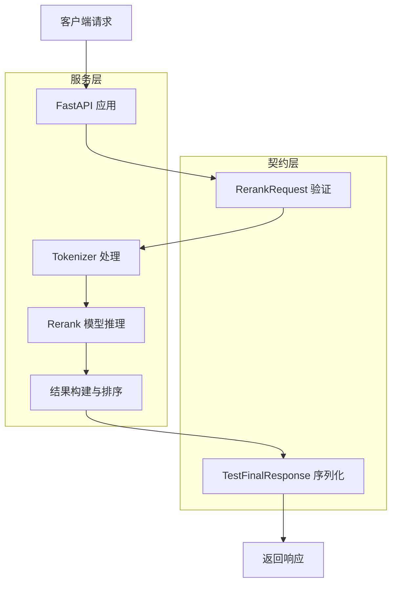

# rerank_demo_contracts 模块深度技术解析

## 1. 问题与目标

在构建企业级 AI 应用时，检索结果的质量直接影响最终回答的准确性。虽然向量检索可以快速找到语义相关的文档，但初始检索结果往往需要进一步优化排序，以确保最相关的文档排在前面。这就是重排序（reranking）技术的用武之地。

`rerank_demo_contracts` 模块解决的核心问题是：**如何快速验证和测试重排序服务的 API 契约兼容性**。在实际开发中，不同的重排序服务提供商可能使用不同的字段命名约定（如 `relevance_score` vs `score`），这会导致客户端与服务端之间的集成问题。本模块通过提供一个轻量级的演示服务，帮助团队快速验证 API 契约的一致性，避免在生产环境中出现集成故障。

## 2. 架构与心智模型

### 2.1 架构概览



### 2.2 心智模型

可以将这个模块想象成一个**API 契约验证器**。它的作用类似于建筑施工中的"模板"——先在小规模环境中验证设计是否符合要求，再大规模应用。具体来说：

- **请求契约**（`RerankRequest`）定义了"输入应该长什么样"
- **响应契约**（`TestFinalResponse`）定义了"输出应该长什么样"
- **演示服务**则是一个"活的契约验证器"，可以实际运行并验证契约是否工作

这种设计使得团队可以在集成真实的重排序服务之前，先验证整个系统的契约是否匹配，大大降低了集成风险。

## 3. 核心组件解析

### 3.1 RerankRequest

**设计意图**：定义重排序请求的标准输入格式，确保客户端发送的数据结构符合服务端预期。

```python
class RerankRequest(BaseModel):
    query: str
    documents: List[str]
```

这个类非常简洁，但包含了重排序所需的全部信息：
- `query`：用户的原始查询
- `documents`：需要重新排序的文档列表

**设计决策**：使用 Pydantic 的 `BaseModel` 而不是普通的字典，这样可以获得自动的数据验证、序列化和 OpenAPI 文档生成能力。

### 3.2 DocumentInfo

**设计意图**：封装文档信息，为未来可能的扩展预留空间。

```python
class DocumentInfo(BaseModel):
    text: str
```

虽然目前只包含一个 `text` 字段，但这种设计使得未来可以轻松添加元数据（如文档 ID、来源、时间戳等），而不会破坏现有 API 契约。

### 3.3 TestRankResult

**设计意图**：定义单个重排序结果的数据结构，特别关注字段命名的兼容性。

```python
class TestRankResult(BaseModel):
    index: int
    document: DocumentInfo
    score: float  # 关键字段：从 relevance_score 改为 score
```

**关键设计点**：
- `index`：保留原始文档的位置信息，方便客户端追踪
- `document`：嵌套的文档信息结构
- `score`：这是整个模块的核心修改点——将字段名从 `relevance_score` 改为 `score`，以测试 Go 客户端的兼容性

### 3.4 TestFinalResponse

**设计意图**：定义完整的重排序响应格式。

```python
class TestFinalResponse(BaseModel):
    results: List[TestRankResult]
```

这个类将多个 `TestRankResult` 组合成一个完整的响应，确保返回的数据结构符合客户端预期。

## 4. 数据流与处理流程

让我们追踪一个完整的请求-响应流程：

1. **请求接收**：FastAPI 应用接收到 POST `/rerank` 请求
2. **契约验证**：使用 `RerankRequest` 验证请求体的结构和类型
3. **数据预处理**：将查询和文档组合成 `[query, document]` 对
4. **模型推理**：
   - 使用 Tokenizer 将文本对转换为模型输入
   - 将输入移动到适当的设备（GPU 或 CPU）
   - 通过重排序模型进行推理，获取相关性分数
5. **结果构建**：
   - 为每个文档创建 `DocumentInfo` 对象
   - 创建 `TestRankResult` 对象，包含原始索引、文档信息和分数
   - 按分数降序排序结果
6. **响应序列化**：使用 `TestFinalResponse` 序列化结果并返回

## 5. 设计决策与权衡

### 5.1 使用 FastAPI + Pydantic

**选择**：使用 FastAPI 框架和 Pydantic 模型定义 API 契约

**原因**：
- 自动数据验证和序列化
- 自动生成 OpenAPI 文档
- 高性能异步支持
- 类型提示驱动的开发体验

**权衡**：
- ✅ 优点：开发效率高，契约清晰，文档自动生成
- ❌ 缺点：引入了额外的依赖，对于超高性能场景可能有轻微 overhead

### 5.2 硬编码模型路径

**选择**：在代码中直接硬编码模型路径 `/data1/home/lwx/work/Download/rerank_model_weight`

**原因**：
- 这是一个演示/测试服务，不是生产环境代码
- 简化部署和运行过程
- 快速验证 API 契约的目的优先于灵活性

**权衡**：
- ✅ 优点：简单直接，无需额外配置
- ❌ 缺点：缺乏灵活性，无法在不同环境中轻松切换模型

### 5.3 字段命名从 relevance_score 改为 score

**选择**：将响应字段从 `relevance_score` 改为 `score`

**原因**：
- 这是整个模块存在的核心理由——测试不同字段命名的兼容性
- 实际生产中，不同服务提供商可能使用不同的字段名
- 通过这种方式可以快速验证客户端是否能正确处理不同的字段命名

**权衡**：
- ✅ 优点：可以有效验证 API 契约兼容性
- ❌ 缺点：如果不仔细阅读代码，可能会误解这个服务的目的

## 6. 使用指南与示例

### 6.1 启动服务

```bash
python rerank_server_demo.py
```

服务将在 `http://localhost:8000` 启动。

### 6.2 发送请求

使用 curl 或任何 HTTP 客户端发送请求：

```bash
curl -X POST "http://localhost:8000/rerank" \
  -H "Content-Type: application/json" \
  -d '{
    "query": "什么是机器学习？",
    "documents": [
      "机器学习是人工智能的一个分支",
      "深度学习是机器学习的一种方法",
      "Python 是一种流行的编程语言"
    ]
  }'
```

### 6.3 预期响应

```json
{
  "results": [
    {
      "index": 0,
      "document": {
        "text": "机器学习是人工智能的一个分支"
      },
      "score": 0.95
    },
    {
      "index": 1,
      "document": {
        "text": "深度学习是机器学习的一种方法"
      },
      "score": 0.87
    },
    {
      "index": 2,
      "document": {
        "text": "Python 是一种流行的编程语言"
      },
      "score": 0.32
    }
  ]
}
```

## 7. 注意事项与潜在陷阱

### 7.1 模型路径硬编码

**注意**：模型路径是硬编码的，在不同环境中运行时需要修改。

**建议**：在实际使用前，检查并修改 `model_path` 变量。

### 7.2 这不是生产服务

**注意**：这个模块是一个演示/测试服务，不应用于生产环境。

**原因**：
- 缺乏错误处理和重试机制
- 没有性能优化（如批处理、缓存等）
- 硬编码的配置
- 没有监控和日志记录

### 7.3 字段命名的特殊性

**注意**：响应中的字段名是 `score`，而不是更常见的 `relevance_score`。

**建议**：在集成时，确保客户端能够正确处理这个字段名，或者根据需要修改代码。

### 7.4 设备依赖性

**注意**：服务会自动检测并使用 GPU（如果可用），否则使用 CPU。

**建议**：在生产环境中，确保有适当的 GPU 资源，或者考虑使用更轻量级的模型。

## 8. 相关模块

- [core_reranking_contracts_and_interface](model_providers_and_ai_backends-reranking_interfaces_and_backends.md)：核心重排序契约和接口
- [openai_style_remote_rerank_backend](model_providers_and_ai_backends-reranking_interfaces_and_backends.md)：OpenAI 风格的远程重排序后端
- [aliyun_rerank_backend_and_payload_models](model_providers_and_ai_backends-reranking_interfaces_and_backends.md)：阿里云重排序后端和负载模型

---

通过这个模块，团队可以快速验证重排序服务的 API 契约兼容性，避免在生产环境中出现集成问题。虽然它不是一个生产就绪的服务，但它提供了一个宝贵的测试和验证工具。
