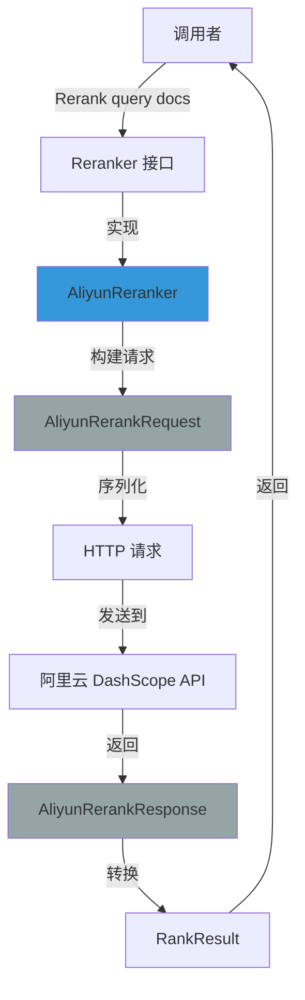

# aliyun_rerank_backend_and_payload_models 模块技术深度解析

## 1. 模块概述

`aliyun_rerank_backend_and_payload_models` 模块实现了与阿里云 DashScope 文本重排序服务的集成。它是整个重排序框架中的一个具体提供商适配器，解决了"如何将通用的重排序接口调用，转换为阿里云 DashScope API 能理解的请求/响应格式"这一问题。

想象一下，你有一个统一的邮件系统接口，但需要同时对接 Gmail、Outlook 和阿里云企业邮箱——每个服务的 API 格式和认证方式都不同。这个模块就像是专门为阿里云企业邮箱写的适配器，负责把你的通用"发送邮件"请求翻译成阿里云的 API 协议。

## 2. 架构与数据流向



这个模块扮演了适配器的角色，它将系统内部通用的 `Reranker` 接口调用，转换为阿里云 DashScope 特定的 API 调用。整个数据流包括：请求构建、序列化、HTTP 传输、响应解析和格式转换五个主要阶段。

## 3. 核心组件深度解析

### 3.1 AliyunReranker - 主要适配器实现

`AliyunReranker` 是这个模块的核心类，它实现了 `Reranker` 接口，封装了与阿里云 API 交互的所有逻辑。

```go
type AliyunReranker struct {
    modelName string       // 模型名称，如 "gte-rerank"
    modelID   string       // 模型唯一标识符
    apiKey    string       // 阿里云 API 密钥
    baseURL   string       // API 端点（支持自定义）
    client    *http.Client // HTTP 客户端
}
```

**设计意图**：这个结构体将配置和执行逻辑封装在一起，符合"单一职责原则"。每个 `AliyunReranker` 实例负责一个特定模型的重排序任务。

### 3.2 请求/响应模型

模块定义了一系列结构体来精确映射阿里云 DashScope API 的请求和响应格式：

#### 请求模型
- `AliyunRerankRequest` - 顶层请求结构
- `AliyunRerankInput` - 包含查询和待排序文档
- `AliyunRerankParameters` - 控制参数（返回文档数、是否返回文档内容）

#### 响应模型
- `AliyunRerankResponse` - 顶层响应结构
- `AliyunOutput` - 包含排序结果
- `AliyunRankResult` - 单个排序结果
- `AliyunDocument` - 文档信息
- `AliyunUsage` - Token 使用统计

**设计意图**：这些结构体不是凭空定义的，而是完全按照阿里云 API 文档的契约设计的。这种"强类型映射"方式有两个好处：
1. 编译时就能发现格式错误
2. 代码自文档化，结构体字段本身就说明了 API 需要什么

### 3.3 Rerank 方法 - 核心业务逻辑

`Rerank` 方法是整个模块的核心，它执行完整的重排序流程：

```go
func (r *AliyunReranker) Rerank(ctx context.Context, query string, documents []string) ([]RankResult, error)
```

**执行流程详解**：

1. **请求构建**：创建 `AliyunRerankRequest`，设置 `ReturnDocuments=true` 和 `TopN=len(documents)`
   - 这里有个关键点：总是请求返回所有文档，而不是截断，这样调用方可以自己决定要取 Top N

2. **序列化**：将请求结构序列化为 JSON
   - 注意错误处理方式：使用 `fmt.Errorf("xxx: %w", err)` 保留原始错误链

3. **HTTP 请求**：
   - 使用 `http.NewRequestWithContext` 支持上下文取消
   - 设置必要的请求头：`Content-Type` 和 `Authorization`
   - **调试友好**：记录等效的 curl 命令，便于问题排查

4. **响应处理**：
   - 检查 HTTP 状态码
   - 读取并反序列化响应
   - 将阿里云特定的响应格式转换为通用的 `RankResult` 格式

## 4. 依赖分析

### 4.1 上游依赖

这个模块依赖于：
- [core_reranking_contracts](model_providers_and_ai_backends-reranking_interfaces_and_backends-core_reranking_contracts.md)：定义了 `Reranker` 接口、`RankResult`、`DocumentInfo` 和 `RerankerConfig`
- `internal/logger`：用于记录调试信息
- 标准库：`net/http`、`encoding/json` 等

### 4.2 下游调用

模块直接调用：
- 阿里云 DashScope API（通过 HTTP）

### 4.3 调用方

这个模块通常被以下组件调用：
- [retrieval_reranking_plugin](application_services_and_orchestration-chat_pipeline_plugins_and_flow-query_understanding_and_retrieval_flow-retrieval_result_refinement_and_merge-retrieval_reranking_plugin.md)：在检索流程中进行结果重排序

## 5. 设计决策与权衡

### 5.1 总是返回所有文档 vs 让 API 截断

**决策**：在构建请求时，设置 `TopN = len(documents)`，总是请求返回所有文档。

**权衡分析**：
- ✅ **灵活性**：调用方可以在获取完整排序结果后，根据需要自己截取 Top N
- ✅ **一致性**：无论使用哪个提供商的重排序服务，调用方都能获得完整的排序结果
- ⚠️ **轻微性能损耗**：传输和处理更多数据，但重排序场景下文档数量通常不大（几十到几百），这个开销可以接受

### 5.2 强类型结构体 vs 通用 map[string]interface{}

**决策**：使用具体的结构体类型来映射 API 请求和响应。

**权衡分析**：
- ✅ **类型安全**：编译时检查字段名和类型
- ✅ **自文档化**：结构体定义本身就是 API 契约的文档
- ✅ **IDE 支持**：自动补全和重构更方便
- ⚠️ **维护成本**：API 变更时需要同步更新结构体

### 5.3 包含调试 curl 日志

**决策**：在发送请求前，记录等效的 curl 命令。

**权衡分析**：
- ✅ **可观测性**：生产环境出问题时，可以直接复制 curl 命令重现
- ⚠️ **安全性**：日志中包含 API 密钥（需要注意日志权限控制）
- 💡 **最佳实践**：在生产环境中，可以通过日志级别控制（`logger.Debugf`）只在需要时输出

### 5.4 默认 API URL vs 可配置

**决策**：提供默认的阿里云 API URL，但支持通过配置覆盖。

**权衡分析**：
- ✅ **易用性**：大多数用户不需要配置 URL
- ✅ **灵活性**：支持自定义端点（如内部代理、测试环境）
- 📝 **实现细节**：在 `NewAliyunReranker` 函数中先设置默认值，再检查配置是否覆盖

## 6. 使用示例与最佳实践

### 6.1 创建和使用 AliyunReranker

```go
import (
    "context"
    "github.com/Tencent/WeKnora/internal/models/rerank"
    "github.com/Tencent/WeKnora/internal/types"
)

// 创建配置
config := &rerank.RerankerConfig{
    APIKey:    "your-aliyun-api-key",
    ModelName: "gte-rerank",
    ModelID:   "aliyun-gte-rerank",
    Provider:  "aliyun",
}

// 创建重排序器
reranker, err := rerank.NewReranker(config)
if err != nil {
    // 处理错误
}

// 执行重排序
ctx := context.Background()
query := "什么是 Go 语言？"
documents := []string{
    "Go 是 Google 开发的编程语言",
    "Python 是一种解释型语言",
    "Go 语言具有并发特性",
}

results, err := reranker.Rerank(ctx, query, documents)
if err != nil {
    // 处理错误
}

// 使用结果
for _, result := range results {
    fmt.Printf("文档 %d: 相关性得分 %.4f, 内容: %s\n", 
        result.Index, 
        result.RelevanceScore, 
        result.Document.Text)
}
```

### 6.2 最佳实践

1. **使用上下文超时**：总是为 `Rerank` 调用设置超时，避免 API 响应慢导致整个系统阻塞
   ```go
   ctx, cancel := context.WithTimeout(context.Background(), 5*time.Second)
   defer cancel()
   ```

2. **错误处理**：注意错误类型，区分网络错误、API 错误和格式错误
   ```go
   if err != nil {
       // 检查是否是 API 错误（非 200 状态码）
       // 检查是否是网络错误
       // 检查是否是序列化/反序列化错误
   }
   ```

3. **避免重复创建**：`AliyunReranker` 实例应该被重用，而不是每次请求都创建新的

## 7. 边缘情况与注意事项

### 7.1 空文档列表

如果传入的 `documents` 是空切片，阿里云 API 可能会返回错误。模块没有在客户端做防御性检查，这个责任留给了调用方。

### 7.2 文档长度限制

阿里云 API 对输入文档的长度有限制（具体限制参考官方文档）。如果文档太长，可能会导致 API 错误。

### 7.3 API Key 安全性

- **不要提交 API Key 到版本控制**
- **注意日志权限**：调试日志中包含完整的 API Key
- **使用环境变量或密钥管理服务**来存储 API Key

### 7.4 并发安全性

`AliyunReranker` 是并发安全的吗？让我们分析一下：
- 结构体字段在创建后不会被修改（没有 setter 方法）
- `http.Client` 本身是并发安全的

✅ **结论**：`AliyunReranker` 可以在多个 goroutine 中安全地并发使用。

## 8. 扩展与维护指南

### 8.1 如何支持新的阿里云模型

通常不需要修改代码，只需要在创建 `AliyunReranker` 时传入不同的 `ModelName` 即可。

### 8.2 如何添加新的请求参数

如果阿里云 API 增加了新的参数：
1. 在 `AliyunRerankParameters` 结构体中添加对应字段
2. 在 `Rerank` 方法中设置该字段的值
3. 考虑是否需要通过 `RerankerConfig` 暴露配置选项

### 8.3 如何处理 API 版本变更

如果阿里云 API 有 breaking change：
1. 保留旧的结构体（可能重命名为 `AliyunRerankRequestV1`）
2. 添加新的结构体（`AliyunRerankRequestV2`）
3. 在 `NewAliyunReranker` 或 `Rerank` 方法中根据配置选择使用哪个版本

## 9. 总结

`aliyun_rerank_backend_and_payload_models` 模块是一个设计良好的适配器实现。它清晰地分离了"做什么"（重排序接口）和"怎么做"（阿里云 API 调用），通过强类型结构体确保了类型安全，同时提供了足够的灵活性。

这个模块的设计体现了几个重要的软件工程原则：
- **接口与实现分离**：依赖 `Reranker` 接口而不是具体实现
- **单一职责**：每个结构体和方法都有明确的职责
- **错误处理**：保留错误链，便于调试
- **可观测性**：记录调试信息，包括等效的 curl 命令

作为团队的新成员，理解这个模块的设计思路，将帮助你更好地理解整个系统中类似的适配器模式（如其他重排序提供商、LLM 提供商等）。
