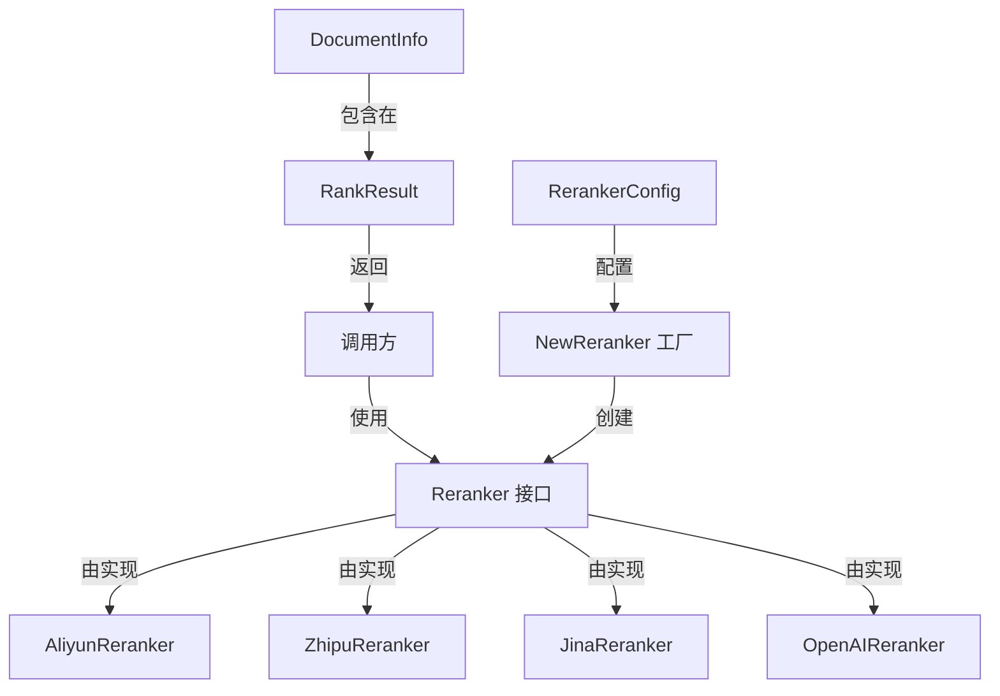

# 核心重排序合约与接口 (core_reranking_contracts_and_interface)

## 模块概述

当你需要对搜索或检索到的文档进行更精细的排序时，重排序（Reranking）模块就是你的得力助手。这个模块定义了一套统一的接口和契约，使得系统能够无缝地集成和切换不同的重排序后端服务（如阿里云、智谱、Jina 等），同时确保了所有重排序实现遵循一致的行为规范。

## 核心问题与解决方案

### 问题空间

在信息检索系统中，我们通常会得到一组与查询相关的文档，但这些文档的初始排序可能不够精确。不同的重排序服务有不同的 API 格式、响应结构和错误处理方式，这使得在系统中切换或集成多个重排序服务变得复杂和困难。

### 解决方案

这个模块通过以下方式解决了上述问题：

1. **统一接口**：定义了 `Reranker` 接口，确保所有重排序实现都遵循相同的方法签名
2. **契约抽象**：通过 `DocumentInfo`、`RankResult` 等结构体抽象了文档信息和排序结果
3. **工厂模式**：使用 `NewReranker` 工厂函数根据配置动态创建合适的重排序器实例
4. **兼容性处理**：通过自定义的 JSON 反序列化方法处理不同服务的响应格式差异

## 核心组件深度解析

### Reranker 接口

```go
type Reranker interface {
    Rerank(ctx context.Context, query string, documents []string) ([]RankResult, error)
    GetModelName() string
    GetModelID() string
}
```

**设计意图**：这是整个重排序模块的核心接口，定义了所有重排序器必须实现的功能。它采用了策略模式的思想，使得不同的重排序实现可以互换使用。

**关键方法**：
- `Rerank`：核心方法，接收查询和文档列表，返回排序后的结果
- `GetModelName` 和 `GetModelID`：用于标识和追踪使用的模型信息

### DocumentInfo 结构体

```go
type DocumentInfo struct {
    Text string `json:"text"`
}
```

**设计意图**：封装文档信息，目前主要包含文档文本内容。

**特殊之处**：自定义的 `UnmarshalJSON` 方法使其能够兼容两种格式的输入：
1. 简单字符串格式：`"document text"`
2. 对象格式：`{"text": "document text"}`

这种设计使得模块能够处理不同重排序服务返回的文档信息格式差异。

### RankResult 结构体

```go
type RankResult struct {
    Index          int          `json:"index"`
    Document       DocumentInfo `json:"document"`
    RelevanceScore float64      `json:"relevance_score"`
}
```

**设计意图**：表示单个文档的排序结果，包含原始索引、文档信息和相关性分数。

**特殊之处**：自定义的 `UnmarshalJSON` 方法使其能够兼容两种分数字段名：
1. `relevance_score`（标准字段）
2. `score`（备选字段）

这种设计确保了模块能够与使用不同字段名的重排序服务无缝集成。

### RerankerConfig 结构体

```go
type RerankerConfig struct {
    APIKey    string
    BaseURL   string
    ModelName string
    Source    types.ModelSource
    ModelID   string
    Provider  string
}
```

**设计意图**：封装创建重排序器所需的所有配置信息，包括认证信息、API 地址、模型信息和提供商标识。

### NewReranker 工厂函数

```go
func NewReranker(config *RerankerConfig) (Reranker, error)
```

**设计意图**：采用工厂模式，根据配置信息创建合适的重排序器实例。它首先尝试使用配置中指定的提供商，如果没有指定，则通过 `provider.DetectProvider` 从 BaseURL 中检测提供商。

**目前支持的提供商**：
- 阿里云 (provider.ProviderAliyun)
- 智谱 (provider.ProviderZhipu)
- Jina (provider.ProviderJina)
- 默认：OpenAI 风格的重排序器

## 架构与数据流程

### 模块架构图



### 数据流程

1. 调用方创建 `RerankerConfig` 配置对象
2. 调用 `NewReranker` 工厂函数创建具体的重排序器实例
3. 调用重排序器的 `Rerank` 方法，传入查询和文档列表
4. 重排序器与后端服务通信，获取排序结果
5. 结果通过自定义的 JSON 反序列化处理，转换为统一的 `RankResult` 格式
6. 调用方获得排序后的结果

## 设计决策与权衡

### 1. 接口设计的简洁性 vs 完整性

**决策**：保持 `Reranker` 接口的简洁性，只包含核心方法。

**权衡**：
- 优点：接口简单明了，易于实现和使用
- 缺点：可能无法满足某些特殊需求（如批量处理、异步操作等）

**原因**：在当前阶段，核心功能已经足够满足大部分使用场景，过度设计会增加复杂性。

### 2. 兼容性处理的位置

**决策**：在数据模型层面（通过自定义 `UnmarshalJSON` 方法）处理兼容性问题，而不是在各个重排序器实现中。

**权衡**：
- 优点：集中处理兼容性问题，代码复用性高，新增重排序器时无需重复处理
- 缺点：数据模型层包含了一些业务逻辑，可能会让模型变得不够"纯净"

**原因**：这种设计使得兼容性问题得到统一管理，降低了维护成本。

### 3. 工厂函数的提供商检测策略

**决策**：优先使用配置中指定的提供商，如果没有指定，则从 BaseURL 中检测。

**权衡**：
- 优点：提供了灵活性，既支持显式指定，也支持自动检测
- 缺点：自动检测可能不够准确，特别是对于非标准 URL 格式

**原因**：这种设计平衡了易用性和灵活性，满足了大多数使用场景。

## 使用指南与最佳实践

### 基本使用示例

```go
// 创建配置
config := &rerank.RerankerConfig{
    APIKey:    "your-api-key",
    BaseURL:   "https://api.example.com",
    ModelName: "your-model-name",
    Provider:  "aliyun", // 可选，如果不指定会自动检测
}

// 创建重排序器
reranker, err := rerank.NewReranker(config)
if err != nil {
    // 处理错误
}

// 执行重排序
query := "什么是重排序？"
documents := []string{
    "重排序是一种信息检索技术...",
    "机器学习中的重排序算法...",
    "文档排序的最佳实践..."
}

results, err := reranker.Rerank(context.Background(), query, documents)
if err != nil {
    // 处理错误
}

// 使用排序结果
for _, result := range results {
    fmt.Printf("文档 %d: 相关性分数 %.4f\n", result.Index, result.RelevanceScore)
    fmt.Printf("内容: %s\n", result.Document.Text)
}
```

### 配置选项说明

- `APIKey`：API 密钥，用于认证
- `BaseURL`：API 基础 URL
- `ModelName`：模型名称
- `Source`：模型来源（类型为 `types.ModelSource`）
- `ModelID`：模型 ID
- `Provider`：提供商标识（可选值："openai", "aliyun", "zhipu", "siliconflow", "jina", "generic"）

## 注意事项与常见陷阱

### 1. 提供商自动检测的局限性

虽然模块支持从 BaseURL 自动检测提供商，但这种检测可能不够准确，特别是对于自定义域名或非标准 URL 格式的情况。建议在可能的情况下显式指定 `Provider` 字段。

### 2. JSON 反序列化的兼容性处理

自定义的 `UnmarshalJSON` 方法虽然处理了常见的格式差异，但可能无法覆盖所有可能的格式变化。如果遇到新的格式差异，需要相应地更新这些方法。

### 3. 上下文传递

`Rerank` 方法接收一个 `context.Context` 参数，这个参数会被传递到底层的 HTTP 请求中。确保传递合适的上下文，特别是在需要超时控制或取消操作的场景中。

### 4. 错误处理

`NewReranker` 和 `Rerank` 方法都可能返回错误，调用方应该妥善处理这些错误，而不是忽略它们。

## 扩展与演进

### 如何添加新的重排序器实现

1. 创建一个新的结构体，实现 `Reranker` 接口
2. 在 `NewReranker` 工厂函数中添加对应的 case
3. 如果需要，更新 `DocumentInfo` 和 `RankResult` 的 `UnmarshalJSON` 方法以处理新的响应格式

### 未来可能的演进方向

1. 支持批量重排序操作
2. 添加异步重排序支持
3. 提供更多的配置选项（如超时设置、重试策略等）
4. 支持更多的重排序提供商

## 相关模块

- [openai_style_remote_rerank_backend](model_providers_and_ai_backends-reranking_interfaces_and_backends-openai_style_remote_rerank_backend.md)：OpenAI 风格的远程重排序后端实现
- [aliyun_rerank_backend_and_payload_models](model_providers_and_ai_backends-reranking_interfaces_and_backends-aliyun_rerank_backend_and_payload_models.md)：阿里云重排序后端实现
- [zhipu_rerank_backend_and_payload_models](model_providers_and_ai_backends-reranking_interfaces_and_backends-zhipu_rerank_backend_and_payload_models.md)：智谱重排序后端实现
- [jina_rerank_backend_and_payload_models](model_providers_and_ai_backends-reranking_interfaces_and_backends-jina_rerank_backend_and_payload_models.md)：Jina 重排序后端实现
