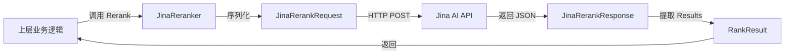

# Jina Rerank 后端与有效负载模型

## 1. 问题空间与模块定位

在现代搜索和检索系统中，初次检索（无论是基于关键词还是向量）返回的结果往往在相关性排序上存在不足。**重排序（Reranking）** 作为检索管道中的关键环节，通过更细粒度的语义理解将候选文档重新排序，从而显著提升最终结果质量。

然而，不同的重排序服务提供商（如 Jina AI、OpenAI、阿里云等）有着完全不同的 API 契约和参数约定。如果直接在业务逻辑中硬编码对特定提供商的调用，会导致：
- 提供商切换成本极高
- 代码库中散落着重复的 HTTP 调用逻辑
- 错误处理和监控难以统一

本模块的核心价值在于：**将 Jina AI 重排序服务的特有 API 契约，适配到系统通用的重排序接口上**，使上层业务逻辑无需关心底层提供商的具体实现细节。

## 2. 核心抽象与心智模型

可以将本模块想象成一个**电源适配器**：
- 系统的通用重排序接口是一个标准插座
- Jina AI 的 API 是一个特定形状的插头
- `JinaReranker` 就是这个适配器，它在保持标准插座接口不变的同时，内部完成了插头形状的转换

更技术化地说，这里有三个关键抽象：
1. **`JinaReranker`**：适配器本身，实现了通用的重排序接口，但内部与 Jina API 通信
2. **`JinaRerankRequest`**：Jina API 的请求格式定义（注意与标准格式的差异）
3. **`JinaRerankResponse`**：Jina API 的响应格式定义

## 3. 架构与数据流

### 3.1 组件架构图



### 3.2 端到端数据流

1. **初始化阶段**：
   - 系统通过 `NewJinaReranker` 创建实例，传入包含 API Key、模型名称等配置
   - 默认使用 Jina 官方 API 端点，但支持通过 `BaseURL` 覆盖（便于测试或使用代理）

2. **重排序执行阶段**：
   - 上层调用 `Rerank(ctx, query, documents)` 方法
   - `JinaReranker` 内部构建 `JinaRerankRequest`，注意：
     - 不设置 `truncate_prompt_tokens`（Jina 不支持此参数）
     - 强制 `ReturnDocuments = true`（系统期望返回文档文本）
   - 序列化为 JSON 并发送 POST 请求到 `/rerank` 端点
   - 记录调试用的 curl 命令（API Key 已脱敏）
   - 解析响应为 `JinaRerankResponse` 并提取 `Results` 字段返回

3. **错误处理**：
   - HTTP 层面错误直接返回
   - 非 200 状态码记录完整响应体并返回错误
   - JSON 序列化/反序列化错误包装后返回

## 4. 核心组件深度解析

### 4.1 JinaReranker 结构体

```go
type JinaReranker struct {
    modelName string       // 用于 API 请求的模型名称
    modelID   string       // 系统内部使用的模型唯一标识
    apiKey    string       // Jina API 认证密钥
    baseURL   string       // API 基础 URL，默认 https://api.jina.ai/v1
    client    *http.Client // HTTP 客户端
}
```

**设计意图**：
- `modelName` 与 `modelID` 分离是关键设计：前者是 API 层面的名称（如 "jina-reranker-v2-base-multilingual"），后者是系统内部的稳定标识
- `baseURL` 可配置使测试和环境切换变得简单
- 持有自己的 `http.Client` 而不是使用全局客户端，便于将来配置超时、代理等

### 4.2 JinaRerankRequest 结构体

```go
type JinaRerankRequest struct {
    Model           string   `json:"model"`
    Query           string   `json:"query"`
    Documents       []string `json:"documents"`
    TopN            int      `json:"top_n,omitempty"`
    ReturnDocuments bool     `json:"return_documents,omitempty"`
}
```

**关键差异点**：
- 注意注释中明确提到的：**Jina 不支持 `truncate_prompt_tokens` 参数**，这是与 OpenAI 兼容 API 的主要区别
- `TopN` 是可选的，但当前实现未使用（由系统在后期统一裁剪）
- `ReturnDocuments` 被强制设为 `true`，因为后续处理需要文档文本

### 4.3 Rerank 方法实现

这是模块的核心方法，让我们分析其设计权衡：

**请求构建**：
- 为什么不暴露 `TopN` 参数？因为系统的重排序接口在设计上期望获取所有候选的得分，然后由上层统一决定返回多少。这保持了提供商实现的一致性。
- 为什么强制 `ReturnDocuments = true`？因为 `RankResult` 结构中包含文档文本，而上层逻辑可能需要它。如果不返回，我们将不得不在内部保留文档列表并重新匹配，增加复杂度。

**日志记录**：
- 记录完整的 curl 命令（API Key 脱敏）是一个精心设计的调试辅助。当生产环境出现问题时，工程师可以直接复制这个命令在本地复现，而不需要拼凑请求。

**错误处理**：
- 使用 `fmt.Errorf("...: %w", err)` 模式包装错误，保留了原始错误链，便于上层使用 `errors.Is` 和 `errors.As` 进行类型断言。

## 5. 依赖关系分析

### 5.1 被依赖关系

此模块被以下模块依赖（通过通用的重排序接口）：
- [retrieval_result_refinement_and_merge > retrieval_reranking_plugin](application_services_and_orchestration-chat_pipeline_plugins_and_flow-query_understanding_and_retrieval_flow-retrieval_result_refinement_and_merge.md)：检索结果重排序插件

### 5.2 依赖关系

此模块依赖：
- `core_reranking_contracts_and_interface`：定义了通用的重排序接口和 `RankResult` 类型
- `internal/logger`：用于日志记录
- 标准库：`context`、`encoding/json`、`net/http` 等

### 5.3 数据契约

此模块与外部的关键契约：
- **输入**：`query` (string) + `documents` ([]string)
- **输出**：`[]RankResult`，每个结果包含 `Index`、`Document`、`RelevanceScore`
- **错误**：任何步骤失败都返回带上下文的错误

## 6. 设计权衡与决策

### 6.1 为什么不支持 `truncate_prompt_tokens`？

**决策**：明确不支持，并在注释中标注。

**权衡**：
- 如果试图模拟这个参数，我们需要在客户端手动截断文档，这会：
  - 增加实现复杂度
  - 导致与 Jina API 原生行为不一致
  - 可能引入微妙的边界情况错误
- 选择明确不支持，保持实现简单且行为可预测。

### 6.2 为什么强制 `ReturnDocuments = true`？

**决策**：在请求中硬编码 `ReturnDocuments: true`。

**权衡**：
- 灵活性与简单性的权衡：如果让调用者决定，接口会更灵活，但上层逻辑可能需要处理两种情况（有文档文本或没有）
- 当前选择优先考虑一致性和简单性，确保返回的结果总是包含文档文本

### 6.3 为什么不使用可配置的 HTTP 客户端？

**决策**：在 `NewJinaReranker` 中直接创建 `&http.Client{}`。

**权衡**：
- 当前实现简单，满足基本需求
- 但这限制了将来添加超时、代理、连接池配置等能力
- 这是一个**刻意的简单性优先**选择，当有实际需求时可以轻松扩展（例如在 `RerankerConfig` 中添加 `HTTPClient` 字段）

## 7. 使用指南与示例

### 7.1 基本使用

```go
// 创建配置
config := &rerank.RerankerConfig{
    ModelName: "jina-reranker-v2-base-multilingual",
    ModelID:   "jina-reranker-v2",
    APIKey:    "your-api-key-here",
}

// 创建重排序器
reranker, err := rerank.NewJinaReranker(config)
if err != nil {
    // 处理错误
}

// 执行重排序
results, err := reranker.Rerank(ctx, "什么是 Go 语言？", []string{
    "Go 是一种编程语言",
    "Python 很流行",
    "Go 由 Google 开发",
})
```

### 7.2 配置说明

- `ModelName`：Jina API 接受的模型名称，例如 `jina-reranker-v2-base-multilingual`
- `ModelID`：系统内部使用的稳定标识符，可以是任意字符串
- `APIKey`：Jina AI 的 API 密钥
- `BaseURL`：可选，覆盖默认的 API 端点（用于测试或代理）

## 8. 边缘情况与注意事项

### 8.1 隐式契约与陷阱

1. **文档顺序保持**：`RankResult.Index` 字段至关重要，它表示结果在原始 `documents` 切片中的位置。上层逻辑依赖此来关联原始文档。
2. **空文档列表**：如果传入空的 `documents` 切片，Jina API 会如何响应？当前代码未特殊处理，会直接转发请求。
3. **上下文取消**：`Rerank` 方法接受 `context.Context`，并使用 `http.NewRequestWithContext`，因此支持上下文取消和超时。

### 8.2 错误情况

- **API Key 无效**：返回 401 错误，日志中会记录完整响应
- **模型不存在**：返回 404 错误
- **速率限制**：Jina API 有速率限制，超出时返回 429 错误，当前实现未进行重试处理
- **网络超时**：依赖默认的 `http.Client` 超时行为（无超时！），这是一个潜在问题

### 8.3 已知限制

1. **不支持 `truncate_prompt_tokens`**：如前所述，这是 Jina API 的限制
2. **HTTP 客户端无超时**：当前使用的 `http.Client` 没有配置超时，可能导致请求挂起
3. **无重试逻辑**：对于临时性网络错误没有自动重试
4. **不支持批量请求**：当前实现一次只处理一个查询

## 9. 扩展与演进建议

如果未来需要增强此模块，可以考虑：

1. **在 `RerankerConfig` 中添加 `HTTPClient` 字段**：允许注入自定义的 HTTP 客户端，便于配置超时、代理等
2. **添加可选的重试逻辑**：使用指数退避重试临时性网络错误
3. **支持更丰富的 Jina API 特性**：如果将来需要，可以暴露 `TopN` 等参数作为可选配置
4. **添加指标收集**：记录 API 调用次数、延迟、错误率等指标

## 10. 相关模块参考

- [core_reranking_contracts_and_interface](model_providers_and_ai_backends-reranking_interfaces_and_backends-core_reranking_contracts_and_interface.md)：通用重排序接口定义
- [openai_style_remote_rerank_backend](model_providers_and_ai_backends-reranking_interfaces_and_backends-openai_style_remote_rerank_backend.md)：OpenAI 兼容的重排序实现（可对比）
- [aliyun_rerank_backend_and_payload_models](model_providers_and_ai_backends-reranking_interfaces_and_backends-aliyun_rerank_backend_and_payload_models.md)：阿里云重排序实现（可对比）
