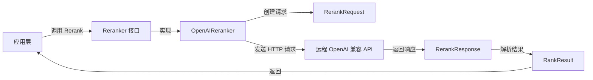

# OpenAI 风格远程重排序后端模块技术深度解析

## 1. 为什么需要这个模块？

在现代检索系统中，重排序（Reranking）是一个关键环节。最初的检索可能会返回大量候选文档，但这些文档往往是基于快速但可能不够精确的算法（如 BM25 或向量相似性）排序的。重排序的作用就是使用更复杂的模型对这些候选文档进行精细排序，以提高最终结果的相关性。

### 问题背景

当团队需要集成不同的重排序服务时，面临着两个主要挑战：
1. **API 格式差异**：不同厂商的重排序 API 有不同的请求和响应格式
2. **统一接口需求**：系统的其他部分需要一个一致的重排序接口，不应该关心底层使用的是哪个厂商的服务

### 设计洞察

通过创建一个通用的 OpenAI 风格重排序后端，我们可以：
- 为系统提供一个统一的重排序接口
- 支持任何兼容 OpenAI 重排序 API 格式的服务
- 简化新的重排序服务集成

## 2. 核心抽象和心智模型

### 核心接口：Reranker

整个模块的核心是 `Reranker` 接口，它定义了重排序器必须实现的三个方法：

```go
type Reranker interface {
    Rerank(ctx context.Context, query string, documents []string) ([]RankResult, error)
    GetModelName() string
    GetModelID() string
}
```

### 心智模型

你可以把 `OpenAIReranker` 想象成一个**翻译官**：
- 它接收系统内部的标准化请求（查询和文档列表）
- 将其翻译成 OpenAI 风格的 API 请求格式
- 发送到远程服务
- 然后将远程服务的响应翻译回系统内部的标准化格式

## 3. 架构和数据流程

### 组件架构图



### 数据流程详解

1. **初始化阶段**：
   - 通过 `NewOpenAIReranker` 函数创建实例
   - 配置包括 API 密钥、基础 URL、模型名称和模型 ID
   - 如果没有指定基础 URL，默认使用 OpenAI 官方 API 地址

2. **重排序阶段**：
   - 调用 `Rerank` 方法，传入查询和文档列表
   - 创建 `RerankRequest` 对象，设置模型名称、查询、文档
   - 特别注意：默认设置 `TruncatePromptTokens` 为 511
   - 将请求序列化为 JSON
   - 构造 HTTP POST 请求到 `${baseURL}/rerank` 端点
   - 设置必要的请求头（Content-Type 和 Authorization）
   - 记录调试用的 curl 命令（API 密钥已脱敏）
   - 发送请求并读取响应
   - 检查 HTTP 状态码是否为 200 OK
   - 将响应反序列化为 `RerankResponse` 对象
   - 返回 `Results` 字段中的排序结果

3. **元数据获取**：
   - 通过 `GetModelName` 和 `GetModelID` 方法获取模型信息

## 4. 组件深度解析

### OpenAIReranker 结构体

```go
type OpenAIReranker struct {
    modelName string       // 重排序模型的名称
    modelID   string       // 模型的唯一标识符
    apiKey    string       // API 认证密钥
    baseURL   string       // API 请求的基础 URL
    client    *http.Client // HTTP 客户端
}
```

**设计意图**：
- 保持简单的状态管理，所有字段都是不可变的（除了 http.Client）
- 将模型名称和 ID 分开存储，满足不同场景的需求
- 使用组合而非继承，提高灵活性

### RerankRequest 结构体

```go
type RerankRequest struct {
    Model                string                 `json:"model"`
    Query                string                 `json:"query"`
    Documents            []string               `json:"documents"`
    AdditionalData       map[string]interface{} `json:"additional_data"`
    TruncatePromptTokens int                    `json:"truncate_prompt_tokens"`
}
```

**关键设计点**：
- `AdditionalData` 字段提供了扩展性，可以传递厂商特定的参数
- `TruncatePromptTokens` 硬编码为 511，这是一个值得注意的设计决策

### RerankResponse 结构体

```go
type RerankResponse struct {
    ID      string       `json:"id"`
    Model   string       `json:"model"`
    Usage   UsageInfo    `json:"usage"`
    Results []RankResult `json:"results"`
}
```

**设计意图**：
- 包含请求 ID，便于追踪和调试
- 保留 token 使用信息，有助于成本核算
- 直接使用系统内部的 `RankResult` 类型，减少转换开销

## 5. 设计决策与权衡

### 决策 1：硬编码 TruncatePromptTokens 为 511

**代码位置**：
```go
requestBody := &RerankRequest{
    Model:                r.modelName,
    Query:                query,
    Documents:            documents,
    TruncatePromptTokens: 511,
}
```

**分析**：
- **选择**：将截断 token 数硬编码为 511
- **原因**：这是一个安全的默认值，可以防止过长的请求导致 API 错误
- **权衡**：
  - ✅ 优点：简单、安全，避免了配置复杂性
  - ❌ 缺点：缺乏灵活性，不同场景可能需要不同的值
- **建议**：考虑将此值移至配置中，或者提供一个可选参数

### 决策 2：默认使用 OpenAI 官方 API

**代码位置**：
```go
baseURL := "https://api.openai.com/v1"
if url := config.BaseURL; url != "" {
    baseURL = url
}
```

**分析**：
- **选择**：默认使用 OpenAI 官方 API，但允许通过配置覆盖
- **原因**：OpenAI 是标准，同时保持对兼容服务的支持
- **权衡**：
  - ✅ 优点：开箱即用，同时支持其他兼容服务
  - ❌ 缺点：如果用户忘记配置 BaseURL，可能会意外调用 OpenAI 官方 API

### 决策 3：详细的错误包装

**代码示例**：
```go
if err != nil {
    return nil, fmt.Errorf("marshal request body: %w", err)
}
```

**分析**：
- **选择**：使用 `%w` 动词包装错误，保留原始错误信息
- **原因**：便于调试和错误追踪
- **权衡**：
  - ✅ 优点：错误信息详细，便于定位问题
  - ❌ 缺点：错误信息可能会暴露内部实现细节

### 决策 4：记录调试用的 curl 命令

**代码位置**：
```go
logger.GetLogger(ctx).Infof(
    "curl -X POST %s/rerank -H \"Content-Type: application/json\" -H \"Authorization: Bearer ***\" -d '%s'",
    r.baseURL, string(jsonData),
)
```

**分析**：
- **选择**：记录一个可以直接运行的 curl 命令，API 密钥已脱敏
- **原因**：极大地方便了调试和问题排查
- **权衡**：
  - ✅ 优点：调试极其方便
  - ❌ 缺点：可能会记录敏感数据（虽然 API 密钥已脱敏，但请求体可能包含敏感信息）

## 6. 依赖关系分析

### 入站依赖

- **`Reranker` 接口**：定义在同一个包中，是整个重排序系统的核心契约
- **`RerankerConfig`**：配置结构体，包含创建重排序器所需的所有参数
- **`RankResult`**：重排序结果的标准化格式

### 出站依赖

- **`http.Client`**：标准库 HTTP 客户端，用于发送 API 请求
- **`logger`**：日志系统，用于记录调试信息
- **JSON 序列化/反序列化**：标准库 `encoding/json` 包

### 与其他模块的关系

在 `rerank` 包中，还有其他几个重排序器实现：
- 阿里云重排序后端
- 智谱重排序后端
- Jina 重排序后端

这些实现都遵循相同的 `Reranker` 接口，通过 `NewReranker` 工厂函数根据配置选择合适的实现。

## 7. 使用示例和最佳实践

### 基本使用

```go
// 创建配置
config := &rerank.RerankerConfig{
    APIKey:    "your-api-key",
    BaseURL:   "https://api.your-provider.com/v1",
    ModelName: "your-model-name",
    ModelID:   "your-model-id",
}

// 创建重排序器
reranker, err := rerank.NewOpenAIReranker(config)
if err != nil {
    // 处理错误
}

// 执行重排序
results, err := reranker.Rerank(ctx, "查询文本", []string{"文档1", "文档2", "文档3"})
if err != nil {
    // 处理错误
}

// 使用结果
for _, result := range results {
    fmt.Printf("文档 %d: 相关性分数 %f\n", result.Index, result.RelevanceScore)
}
```

### 通过工厂函数创建（推荐）

```go
config := &rerank.RerankerConfig{
    APIKey:    "your-api-key",
    BaseURL:   "https://api.your-provider.com/v1",
    ModelName: "your-model-name",
    ModelID:   "your-model-id",
    Provider:  "openai", // 可以不设置，工厂函数会自动检测
}

// 工厂函数会根据配置选择合适的实现
reranker, err := rerank.NewReranker(config)
```

## 8. 注意事项和潜在陷阱

### 陷阱 1：硬编码的 TruncatePromptTokens

**问题**：`TruncatePromptTokens` 被硬编码为 511，这可能不适合所有场景。

**建议**：
- 如果你需要修改这个值，可以考虑在 `RerankerConfig` 中添加一个字段
- 或者在 `Rerank` 方法中添加一个可选参数

### 陷阱 2：敏感信息泄露

**问题**：日志中记录了完整的请求体，可能包含敏感信息。

**建议**：
- 在生产环境中，考虑降低日志级别
- 或者修改日志记录代码，对敏感信息进行脱敏处理

### 陷阱 3：错误处理不够细致

**问题**：当前的错误处理只是简单地包装错误，没有根据不同的错误类型采取不同的处理策略。

**建议**：
- 考虑定义自定义错误类型
- 根据 HTTP 状态码进行不同的处理（例如，429 状态码可以进行重试）

### 陷阱 4：没有超时控制

**问题**：当前的 HTTP 客户端没有设置超时时间，可能导致请求挂起。

**建议**：
- 在创建 `http.Client` 时设置超时时间：
  ```go
  client: &http.Client{
      Timeout: 30 * time.Second,
  },
  ```
- 或者使用 context 的超时功能

### 陷阱 5：没有重试机制

**问题**：对于临时性的网络错误，没有重试机制。

**建议**：
- 考虑添加重试逻辑，特别是对于 5xx 错误和网络错误
- 可以使用指数退避策略来避免重试风暴

## 9. 扩展点和未来改进方向

### 可能的扩展点

1. **支持更多 OpenAI 风格的 API 特性**：
   - 添加对 `top_n` 参数的支持
   - 支持返回文档的 metadata
   - 支持多种文档格式（不仅仅是字符串）

2. **更好的性能和可靠性**：
   - 添加连接池
   - 支持批量请求
   - 添加缓存机制

3. **更好的可观测性**：
   - 添加指标收集
   - 添加分布式追踪
   - 更详细的日志记录

## 10. 总结

`OpenAIReranker` 是一个简洁而实用的模块，它通过适配 OpenAI 风格的重排序 API，为系统提供了统一的重排序接口。它的设计体现了以下几个重要原则：

1. **接口驱动设计**：通过 `Reranker` 接口定义契约，实现了与具体厂商的解耦
2. **简单性优先**：保持代码简单，避免过度设计
3. **实用性**：提供了开箱即用的功能，同时保持了一定的扩展性

虽然有一些可以改进的地方，但整体来说，这是一个设计良好的模块，很好地解决了集成不同重排序服务的问题。
