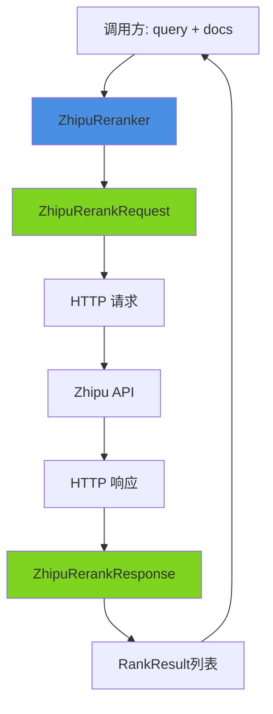

# Zhipu 重排序后端和负载模型深度解析

## 1. 问题空间与模块价值

在搜索、问答和知识管理系统中，**语义重排序**是提升检索质量的关键环节。当我们从向量数据库或搜索引擎中获取初步检索结果后，这些结果往往是基于粗略的相似性或关键词匹配计算出来的，需要一个更精细的模型来评估每个结果与查询的真实语义相关性。

这就是 `zhipu_rerank_backend_and_payload_models` 模块要解决的问题。它为系统提供了与智谱 AI (Zhipu AI) 重排序服务的适配层，将标准化的重排序请求转换为智谱 API 能够理解的格式，并将智谱的返回结果映射回系统的内部数据结构。

## 2. 核心抽象与心智模型

这个模块的设计围绕着一个简单而强大的抽象展开：**适配器模式**。把它想象成一个翻译官，一边说着系统的通用语言（[Reranker 接口](./model_providers_and_ai_backends-reranking_interfaces_and_backends-core_reranking_contracts_and_interface.md)），另一边说着智谱 API 的方言。

### 关键组件心智模型：
* **ZhipuReranker**：适配器的核心，持有翻译官的"身份信息"（API Key、模型名称、URL 等）和"通信工具"（HTTP 客户端）
* **ZhipuRerankRequest/ZhipuRerankResponse**：翻译官的"语言手册"，定义了与智谱 API 交流的精确格式
* **ZhipuRankResult/ZhipuUsage**：翻译官的"词汇表"，对应智谱特有的数据结构

## 3. 数据流动与架构

让我们通过一个 Mermaid 图来直观理解数据是如何流动的：



### 详细执行流程

当系统需要重排序文档时，执行流程如下：

1. **请求构建阶段**：`ZhipuReranker.Rerank()` 方法接收查询字符串和文档列表，创建一个 `ZhipuRerankRequest` 对象，将内部参数映射到智谱 API 需要的字段格式。注意这里做了一个关键选择：`TopN` 固定为 0（返回所有文档），`ReturnDocuments` 设置为 true（包含文档内容）。

2. **网络传输阶段**：请求被序列化为 JSON，通过带有认证头（Bearer Token）的 POST 请求发送到智谱 API。模块还会记录一个 curl 命令的等价形式，便于调试。

3. **响应处理阶段**：API 响应被读取、验证（检查 HTTP 200 状态码），然后反序列化为 `ZhipuRerankResponse` 对象。

4. **结果转换阶段**：智谱特定的 `ZhipuRankResult` 数组被转换为系统通用的 `RankResult` 数组，完成从 API 特定格式到内部契约的适配。

## 4. 核心组件深度解析

### ZhipuReranker 结构体

这是模块的核心，实现了通用的 `Reranker` 接口。它持有与智谱 API 通信所需的所有配置：

```go
type ZhipuReranker struct {
    modelName string       // 用于日志和标识的模型名称
    modelID   string       // 模型的唯一标识符
    apiKey    string       // 认证密钥
    baseURL   string       // API 端点（默认：https://open.bigmodel.cn/api/paas/v4/rerank）
    client    *http.Client // HTTP 客户端
}
```

**设计意图**：将所有状态封装在结构体中，使实例可复用且线程安全（因为 HTTP client 本身是并发安全的）。

### ZhipuRerankRequest 与 ZhipuRerankResponse

这两个结构体精确映射了智谱重排序 API 的请求和响应格式：

```go
type ZhipuRerankRequest struct {
    Model           string   `json:"model"`           // 模型名称
    Query           string   `json:"query"`           // 查询文本
    Documents       []string `json:"documents"`       // 待排序文档
    TopN            int      `json:"top_n,omitempty"` // 返回 top N 结果，0 表示全部
    ReturnDocuments bool     `json:"return_documents,omitempty"`  // 是否返回文档内容
    ReturnRawScores bool     `json:"return_raw_scores,omitempty"` // 是否返回原始分数
}
```

**设计选择**：使用 `omitempty` 标记可选字段，减少不必要的 JSON 字段传输。

### 构造函数与核心方法

#### NewZhipuReranker

```go
func NewZhipuReranker(config *RerankerConfig) (*ZhipuReranker, error)
```

这个工厂方法从通用配置创建智谱特定的重排序器。值得注意的是它的默认值策略：
- 默认 `baseURL` 硬编码为智谱官方端点
- 允许通过配置覆盖 `baseURL`，便于测试或使用兼容智谱协议的第三方服务

#### Rerank 方法

这是模块的核心业务逻辑，实现了完整的请求-响应生命周期。让我们看看它的关键设计：

**为什么固定 TopN=0 和 ReturnDocuments=true？**
这是一个有意的设计决策，反映了"在适配器层保持最大灵活性，在调用层进行过滤"的原则。通过返回所有结果和文档内容，适配器保持了通用性，让上层应用可以根据需要选择 top-k 结果或进行进一步处理。

**错误处理策略**：
错误被包装后向上传递（`fmt.Errorf("marshal request body: %w", err)`），保留了原始错误的同时添加上下文信息，符合 Go 的错误处理最佳实践。

## 5. 依赖关系分析

### 入站依赖（谁使用它）
- 直接由 [reranker.go 中的 NewReranker 工厂函数](./model_providers_and_ai_backends-reranking_interfaces_and_backends-core_reranking_contracts_and_interface.md) 根据配置创建
- 最终被检索管道中的 [retrieval_reranking_plugin](./application_services_and_orchestration-chat_pipeline_plugins_and_flow-query_understanding_and_retrieval_flow-retrieval_result_refinement_and_merge-retrieval_reranking_plugin.md) 使用

### 出站依赖（它使用谁）
- 标准库：`context`、`encoding/json`、`net/http` 等
- 内部日志：`logger.Debugf` 用于调试请求
- 核心契约：`RerankerConfig`、`RankResult`、`DocumentInfo` 来自同一包

### 数据契约
这个模块严格遵守两个关键契约：
1. **入站契约**：接收 `context.Context`、`query` 字符串和 `documents` 字符串切片
2. **出站契约**：返回 `[]RankResult`，其中每个结果包含原始索引、文档信息和相关性分数

## 6. 设计决策与权衡

### 1. 固定参数 vs 可配置参数
**决策**：在 `Rerank()` 方法中硬编码 `TopN=0` 和 `ReturnDocuments=true`
**权衡**：
- ✅ 优点：简化了接口，确保所有结果都返回，给上层最大灵活性
- ❌ 缺点：对于大型文档列表，会传输不必要的数据；无法利用 API 端的过滤能力
**理由**：在内部系统中，一致性和灵活性通常比微小的性能优化更重要。

### 2. 直接 HTTP 调用 vs 客户端 SDK
**决策**：直接使用标准库 `http.Client` 而不是引入智谱 SDK
**权衡**：
- ✅ 优点：减少依赖，更好地控制请求/响应流程，便于日志记录和调试
- ❌ 缺点：需要手动处理序列化、认证、错误处理等
**理由**：重排序 API 的表面区域很小，引入 SDK 带来的负担超过了价值。

### 3. 同步 vs 异步 API
**决策**：实现同步的 `Rerank()` 方法，依赖调用方处理并发
**权衡**：
- ✅ 优点：简单易用，符合 Go 的惯用法，调用方可以灵活控制并发
- ❌ 缺点：调用方需要负责超时和上下文管理
**理由**：上下文感知的同步 API 是 Go 生态系统中的标准模式，调用方可以使用 `context.WithTimeout()` 等机制控制执行。

## 7. 使用指南与常见模式

### 基本使用

```go
// 创建配置
config := &rerank.RerankerConfig{
    APIKey:    "your-zhipu-api-key",
    ModelName: "rerank-model-name",
    ModelID:   "unique-model-id",
}

// 创建重排序器
reranker, err := rerank.NewZhipuReranker(config)
if err != nil {
    // 处理错误
}

// 执行重排序
results, err := reranker.Rerank(ctx, "查询文本", []string{
    "文档1内容",
    "文档2内容",
    "文档3内容",
})

// 处理结果，按相关性分数排序
for _, result := range results {
    fmt.Printf("文档 %d: 相关性分数 %.4f\n", result.Index, result.RelevanceScore)
}
```

### 通过通用工厂使用

更常见的是通过通用的 `NewReranker` 工厂：

```go
config := &rerank.RerankerConfig{
    APIKey:    "your-api-key",
    BaseURL:   "https://open.bigmodel.cn/api/paas/v4/rerank",
    ModelName: "your-model",
    Provider:  "zhipu", // 显式指定提供者
}

reranker, err := rerank.NewReranker(config) // 自动选择 ZhipuReranker
```

## 8. 注意事项与陷阱

### 1. 错误处理
智谱 API 返回的非 200 状态码会被包装成错误，但错误信息仅包含状态码和响应体。确保在调用层检查并适当地处理这些错误。

### 2. 上下文传递
始终传递带有适当超时的上下文，以防止在 API 响应慢时阻塞整个管道。

### 3. 空文档列表
虽然代码没有显式检查空文档列表，但向智谱 API 发送空列表可能导致错误。调用方应确保文档列表非空。

### 4. API Key 安全性
`ZhipuReranker` 将 API Key 保存在内存中。确保配置对象不会被不必要地持久化或日志记录。

### 5. 日志中的敏感信息
调试日志会记录完整的 curl 命令，包括 API Key。在生产环境中，注意调整日志级别或审查日志输出。

## 9. 扩展与演进

当前模块设计简洁且专注，但未来可能的演进方向包括：
- 支持更多智谱 API 特性（如原始分数返回）
- 添加请求批处理能力
- 实现重试逻辑和回退策略
- 添加指标收集和监控点

不过，就目前而言，它很好地履行了一个适配器的单一职责：将系统与智谱重排序服务连接起来。
