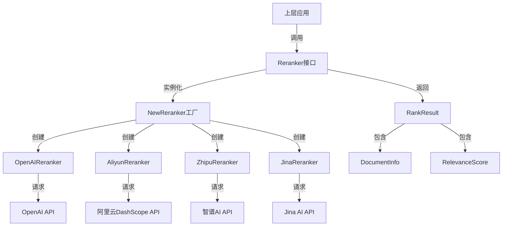

# reranking_interfaces_and_backends 模块技术深度解析

## 1. 模块概览

`reranking_interfaces_and_backends` 模块是一个用于管理不同供应商重排序模型的统一接口层。在现代检索系统中，初阶检索（如向量相似度搜索）通常会返回大量候选文档，但这些文档的相关性排序往往不够精准。重排序模型通过更精细的语义理解，可以在初阶检索结果的基础上进一步优化排序，从而显著提升搜索质量。

这个模块的核心价值在于：它为上层应用提供了一个干净、统一的重排序接口，同时封装了不同供应商（阿里云、智谱、Jina、OpenAI等）的API差异。这样，当需要切换或添加新的重排序模型时，上层应用代码无需任何改动。

## 2. 架构设计

### 2.1 整体架构图



### 2.2 核心组件解析

模块采用了**策略模式**和**工厂模式**的组合设计：

1. **Reranker 接口**：定义了统一的重排序操作契约，是整个模块的核心抽象（详见 [core_reranking_contracts_and_interface](model_providers_and_ai_backends-reranking_interfaces_and_backends-core_reranking_contracts_and_interface.md)）。
2. **NewReranker 工厂函数**：根据配置参数动态创建合适的重排序器实现。
3. **具体重排序器实现**：
   - [OpenAIReranker](model_providers_and_ai_backends-reranking_interfaces_and_backends-openai_style_remote_rerank_backend.md)：兼容 OpenAI 格式的重排序器
   - [AliyunReranker](model_providers_and_ai_backends-reranking_interfaces_and_backends-aliyun_rerank_backend_and_payload_models.md)：阿里云 DashScope 重排序器
   - [ZhipuReranker](model_providers_and_ai_backends-reranking_interfaces_and_backends-zhipu_rerank_backend_and_payload_models.md)：智谱 AI 重排序器
   - [JinaReranker](model_providers_and_ai_backends-reranking_interfaces_and_backends-jina_rerank_backend_and_payload_models.md)：Jina AI 重排序器
4. **数据模型层**：定义了通用和供应商特定的请求/响应数据结构。

这种设计的精妙之处在于：对于上层应用来说，它只需要与 Reranker 接口交互，而不必关心底层是哪个供应商的模型在工作。这就像你去餐厅点菜，只需要告诉服务员你想吃什么，而不需要关心是哪位厨师在做饭。

## 3. 核心数据模型

### 3.1 Reranker 接口

```go
type Reranker interface {
    // Rerank 重排序文档，基于与查询的相关性
    Rerank(ctx context.Context, query string, documents []string) ([]RankResult, error)
    
    // GetModelName 返回模型名称
    GetModelName() string
    
    // GetModelID 返回模型ID
    GetModelID() string
}
```

这个接口是整个模块的契约，确保了所有重排序实现都遵循相同的行为规范。

### 3.2 核心数据结构

**RankResult**：代表单个重排序结果，包含原始文档索引、文档信息和相关性分数。

特别值得注意的是 `RankResult.UnmarshalJSON` 方法，它实现了对不同供应商返回格式的兼容：
- 优先使用 `relevance_score` 字段
- 如果不存在，则回退到 `score` 字段

这种设计体现了模块的**兼容性优先**原则，能够平滑处理不同API的响应格式差异。

**DocumentInfo**：代表文档信息，同样通过自定义 `UnmarshalJSON` 方法实现了对两种格式的兼容：
- 简单字符串格式（`"document": "text"`）
- 对象格式（`"document": {"text": "text"}`）

## 4. 数据流与核心流程

当一个重排序请求到达时，数据会按照以下路径流动：

1. **初始化阶段**：上层应用创建 `RerankerConfig` 配置，调用 `NewReranker` 工厂函数
2. **选择实现**：工厂函数根据配置中的 Provider 或 BaseURL 检测选择合适的重排序器
3. **请求构建**：调用所选重排序器的 `Rerank` 方法，内部会构建供应商特定的请求格式
4. **API调用**：通过 HTTP 客户端发送请求到供应商 API
5. **响应解析**：解析供应商特定的响应格式，并转换为统一的 `RankResult` 格式
6. **结果返回**：将标准化的结果返回给上层应用

以 AliyunReranker 为例，具体流程如下：

```
Rerank() 
  → 构建 AliyunRerankRequest 
  → 序列化为 JSON 
  → 发送 HTTP POST 请求 
  → 接收响应 
  → 反序列化为 AliyunRerankResponse 
  → 转换为 []RankResult 
  → 返回
```

## 5. 设计决策与权衡

### 5.1 统一接口 vs 专用功能

**决策**：采用统一的 Reranker 接口，隐藏供应商特定的功能差异。

**权衡分析**：
- ✅ 优点：上层应用代码简单，切换供应商无感知
- ❌ 缺点：无法直接利用某些供应商的高级特性（如智谱的 `return_raw_scores`）

**设计意图**：这个选择反映了模块的定位——它是一个通用的重排序抽象层，而不是某个供应商API的完整封装。对于大多数应用场景，基本的重排序功能已经足够，而统一接口带来的便利性远大于高级特性的损失。

### 5.2 硬编码默认值 vs 可配置参数

**决策**：在各实现中硬编码一些默认参数（如 OpenAIReranker 的 `TruncatePromptTokens: 511`）。

**权衡分析**：
- ✅ 优点：简化了配置，大多数情况下无需调整
- ❌ 缺点：降低了灵活性，某些场景可能需要不同的值

**设计意图**：这是**约定优于配置**原则的体现。模块选择了最常用的、安全的默认值，同时保留了通过扩展来调整这些参数的可能性（如果未来需要的话）。

### 5.3 错误处理策略

**决策**：在 HTTP 错误时，不仅返回错误，还记录完整的请求/响应信息（通过 logger）。

**权衡分析**：
- ✅ 优点：便于调试和问题定位
- ❌ 缺点：可能记录敏感信息（虽然已经对 API Key 进行了掩码处理）

**设计意图**：在开发和生产环境中，快速定位问题的价值超过了潜在的信息泄露风险（尤其是在已经对敏感信息进行掩码处理的情况下）。

## 6. 与其他模块的关系

本模块是整个系统中相对独立的组件，但它与以下模块有重要交互：

1. **provider 模块**：通过 `provider.DetectProvider` 函数来自动识别供应商类型
2. **logger 模块**：用于记录请求、响应和错误信息
3. **上层检索服务**：调用本模块来优化检索结果排序（参见 [application_services_and_orchestration-chat_pipeline_plugins_and_flow-query_understanding_and_retrieval_flow-retrieval_result_refinement_and_merge.md](application_services_and_orchestration-chat_pipeline_plugins_and_flow-query_understanding_and_retrieval_flow-retrieval_result_refinement_and_merge.md)）

## 7. 使用指南与注意事项

### 7.1 基本使用

```go
// 创建配置
config := &rerank.RerankerConfig{
    APIKey:    "your-api-key",
    BaseURL:   "https://api.example.com/v1",
    ModelName: "rerank-model",
    Provider:  "openai",
}

// 创建重排序器
reranker, err := rerank.NewReranker(config)
if err != nil {
    // 处理错误
}

// 执行重排序
results, err := reranker.Rerank(ctx, "查询文本", []string{"文档1", "文档2", "文档3"})
if err != nil {
    // 处理错误
}

// 使用结果
for _, result := range results {
    fmt.Printf("文档索引: %d, 相关性分数: %f\n", result.Index, result.RelevanceScore)
}
```

### 7.2 常见陷阱与注意事项

1. **供应商自动检测**：如果没有明确指定 Provider，模块会尝试从 BaseURL 自动检测。确保 BaseURL 是可识别的，或者显式指定 Provider。

2. **API Key 安全**：虽然日志中已经对 API Key 进行了掩码处理，但在生产环境中仍需注意日志的访问控制。

3. **文档数量限制**：不同供应商对单次请求的文档数量有限制。如果文档数量较多，可能需要分批处理。

4. **错误重试**：模块本身不包含重试逻辑。在生产环境中，建议在上层添加适当的重试机制来处理网络波动等临时性错误。

5. **结果索引的重要性**：`RankResult.Index` 字段指示了文档在原始输入中的位置，这对于后续处理（如获取原始文档元数据）至关重要。

## 8. 扩展指南

### 8.1 添加新的供应商支持

如果需要添加新的重排序供应商，只需遵循以下步骤：

1. 创建新文件（如 `new_provider_reranker.go`）
2. 定义供应商特定的请求和响应结构
3. 实现 `Reranker` 接口
4. 在 `NewReranker` 工厂函数中添加新的 case

关键是要确保新实现能够将供应商特定的响应格式正确转换为统一的 `RankResult` 格式。

### 8.2 自定义默认参数

如果需要调整默认参数（如 `TruncatePromptTokens`），可以考虑扩展 `RerankerConfig` 结构，添加可选参数，并在相应的实现中使用这些参数而不是硬编码值。

## 9. 总结

`reranking_interfaces_and_backends` 模块是一个精心设计的抽象层，它通过统一的接口封装了不同重排序供应商的差异。它的核心价值在于：

1. **解耦**：将上层应用与具体供应商实现分离
2. **一致**：提供统一的数据模型和错误处理
3. **灵活**：支持多种供应商，易于扩展
4. **健壮**：通过自定义反序列化处理格式差异

这个模块体现了良好的软件工程实践——它识别出了系统中变化的部分（不同供应商的API），并将其封装在稳定的接口后面，从而使整个系统更加灵活和可维护。
