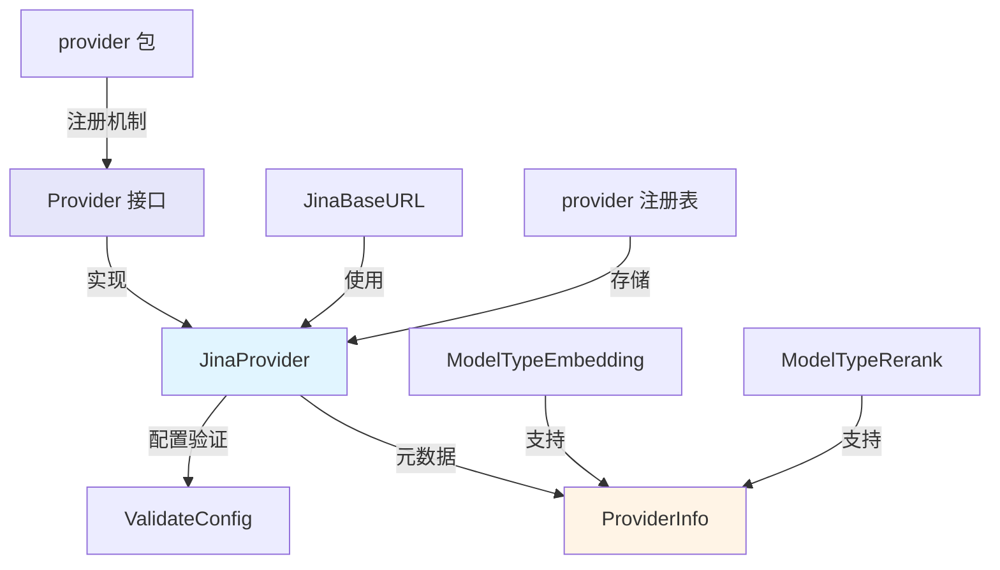

# retrieval_and_embedding_specialized_provider 模块技术深度解析

## 概述

在人工智能应用中，检索增强生成（RAG）是一个核心技术，而高质量的嵌入（Embedding）和重排序（Rerank）服务是RAG系统性能的基石。`retrieval_and_embedding_specialized_provider` 模块专门用于集成那些以检索和嵌入技术为核心优势的专业 AI 服务商，让我们的系统能够灵活接入这类专业服务。

这个模块的核心组件是 `JinaProvider`，它提供了与 Jina AI 服务的适配能力。Jina AI 专注于语义搜索和向量表示，其产品在中文文本处理方面有优异表现。

## 架构设计



这个模块的架构遵循了 provider 包的统一设计模式，采用了**策略模式 + 注册表模式**的组合架构。核心思想是将专业服务商的适配逻辑封装成独立的 Provider 实现，通过统一的接口进行管理。

## 核心组件深度解析

### JinaProvider 结构体

`JinaProvider` 是这个模块的核心实现，它是一个无状态的结构体，专门负责与 Jina AI 服务的适配。

**设计意图**：采用无状态设计是因为 Provider 的职责是提供元数据和验证配置，不需要维护任何运行时状态。这种设计让 Provider 的实例可以安全地在全局注册表中共享，避免了状态管理的复杂性。

### init() 函数与自动注册机制

```go
func init() {
    Register(&JinaProvider{})
}
```

**设计亮点**：这个初始化函数利用了 Go 语言的包初始化机制，在包加载时自动将 `JinaProvider` 实例注册到全局注册表中。这种设计带来了两个关键好处：

1. **无需显式初始化**：使用方无需关心 Provider 的初始化顺序，只要导入了这个包，Provider 就会自动可用
2. **模块化集成**：添加新的 Provider 只需在对应包中实现接口并在 `init()` 中注册，不会影响其他代码

### Info() 方法 - 元数据声明

```go
func (p *JinaProvider) Info() ProviderInfo {
    return ProviderInfo{
        Name:        ProviderJina,
        DisplayName: "Jina",
        Description: "jina-clip-v1, jina-embeddings-v2-base-zh, etc.",
        DefaultURLs: map[types.ModelType]string{
            types.ModelTypeEmbedding: JinaBaseURL,
            types.ModelTypeRerank:    JinaBaseURL,
        },
        ModelTypes: []types.ModelType{
            types.ModelTypeEmbedding,
            types.ModelTypeRerank,
        },
        RequiresAuth: true,
    }
}
```

**元数据设计分析**：

- **模型类型映射**：通过 `DefaultURLs` 字段为不同模型类型提供默认端点。这里 Embedding 和 Rerank 使用相同的 base URL，体现了 Jina AI API 设计的一致性
- **能力声明**：`ModelTypes` 明确声明了支持的能力范围 - 仅嵌入和重排序，不包括对话生成等其他能力
- **用户友好性**：`DisplayName` 和 `Description` 为前端界面提供了友好的展示信息
- **安全约束**：`RequiresAuth: true` 明确表示这个服务必须使用 API key 认证

### ValidateConfig() 方法 - 配置验证

```go
func (p *JinaProvider) ValidateConfig(config *Config) error {
    if config.APIKey == "" {
        return fmt.Errorf("API key is required for Jina AI provider")
    }
    return nil
}
```

**验证策略分析**：这个方法采用了**最小验证原则**，只验证最核心的约束条件（API key 存在）。其他配置项（如 BaseURL）允许用户自定义，这样既保证了基本的功能性，又提供了足够的灵活性（例如允许用户使用 Jina AI 的私有化部署版本）。

## 依赖关系与数据流向

### 依赖分析

这个模块的依赖关系非常清晰：

1. **核心依赖**：provider 包 - 定义了统一的 Provider 接口和注册表机制
2. **类型依赖**：`internal/types` - 提供了 `ModelType` 等核心类型定义

### 数据流向

```
1. 系统启动 → 包初始化 → JinaProvider 注册到注册表
2. 用户配置模型 → 系统获取 Provider → 调用 Info() 获取元数据
3. 用户使用模型 → 系统调用 ValidateConfig() 验证配置
4. 验证通过 → 执行实际的嵌入/重排序操作
```

## 设计决策与权衡

### 1. 无状态 Provider 设计

**决策**：采用无状态的 Provider 结构体
**权衡分析**：
- ✅ 优点：线程安全、易于测试、内存占用小
- ⚠️ 缺点：无法在 Provider 中缓存状态（但这不是 Provider 的职责）
**合理性**：Provider 的定位是"元数据提供者"和"配置验证器"，不应该持有状态，这个设计完全符合单一职责原则

### 2. 自动注册 vs 显式注册

**决策**：使用 `init()` 函数自动注册
**权衡分析**：
- ✅ 优点：使用简单、不易遗漏、模块化好
- ⚠️ 缺点：注册顺序不可控、测试时可能需要特殊处理
**合理性**：对于 Provider 这类插件式组件，自动注册的便利性远大于其带来的复杂性

### 3. 最小验证原则

**决策**：只验证 API key 的存在性
**权衡分析**：
- ✅ 优点：灵活性高、允许自定义端点
- ⚠️ 缺点：可能无法提前发现所有配置问题
**合理性**：过于严格的验证会限制用户的使用场景（如私有化部署），而实际的 API 调用错误会在运行时自然暴露

## 使用指南与最佳实践

### 配置示例

使用 JinaProvider 时，典型的配置如下：

```go
config := &provider.Config{
    Provider:  provider.ProviderJina,
    BaseURL:   "https://api.jina.ai/v1", // 可以自定义
    APIKey:    "your-jina-api-key-here",  // 必填
    ModelName: "jina-embeddings-v2-base-zh",
}
```

### 扩展点

如果需要添加类似的专业检索与嵌入提供商，可以遵循以下模式：

1. 创建新的 Provider 结构体
2. 实现 `Info()` 方法，声明元数据
3. 实现 `ValidateConfig()` 方法，进行必要的验证
4. 在 `init()` 中调用 `Register()` 进行自动注册

## 注意事项与边缘情况

### 配置验证的局限性

`ValidateConfig()` 只验证 API key 的存在性，不验证其有效性。无效的 API key 会在实际调用 API 时才会暴露错误。

### BaseURL 的自定义

系统允许用户自定义 BaseURL，这对于使用 Jina AI 的私有化部署或代理服务非常有用。但要注意，自定义的端点必须与 Jina AI 的 API 协议兼容。

### 多模型类型支持

JinaProvider 同时支持 Embedding 和 Rerank 两种模型类型，它们共享同一个 BaseURL。这是 Jina AI API 设计的特点，但其他专业提供商可能有不同的设计。

## 总结

`retrieval_and_embedding_specialized_provider` 模块通过 `JinaProvider` 展示了如何将专业的检索与嵌入服务集成到我们的系统中。它遵循了 provider 包的统一设计模式，采用了策略模式和注册表模式的组合，提供了灵活、可扩展的专业服务适配能力。

这个模块的设计理念是"简单而强大" - 通过简洁的接口和最小化的验证，既保证了核心功能的可靠性，又为用户提供了足够的灵活性来适应各种使用场景。
