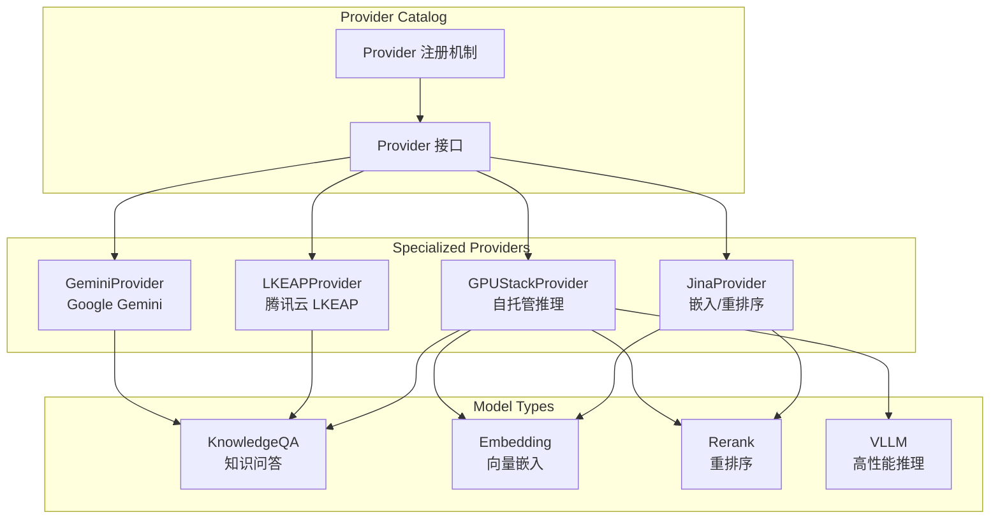

# Specialized and Infrastructure Provider Catalog

## 概述

这个模块是模型提供者生态系统中的"专业领域和基础设施提供者目录"，它解决了一个关键问题：如何让系统灵活支持那些具有特殊能力（如思维链推理）、需要特定基础设施（如自托管推理）或专注于特定任务（如嵌入和重排序）的模型提供者？

想象一下，如果你需要集成 Google Gemini 这样的前沿大模型、Jina 这样专注于嵌入和重排序的专家、腾讯云 LKEAP 这样具有深度思维链能力的平台，以及 GPUStack 这样的自托管推理基础设施，你会希望有一个统一的方式来注册、发现和验证这些提供者。这个模块就充当了这样一个"智能插座板"——每个提供者都是一个不同形状的插头，但它们都能插入这个统一的接口中。

## 核心组件

### 1. 基础模型平台提供者适配器
- **GeminiProvider**: Google Gemini 大模型的适配器，支持通过 OpenAI 兼容协议访问 Gemini 模型
- **LKEAPProvider**: 腾讯云知识引擎原子能力平台的适配器，专门支持 DeepSeek 系列模型的思维链能力

### 2. 自托管推理基础设施提供者
- **GPUStackProvider**: GPUStack 自托管推理平台的适配器，支持用户部署自己的模型

### 3. 检索和嵌入专业提供者
- **JinaProvider**: Jina AI 平台的适配器，专注于嵌入和重排序任务

## 架构设计

## 设计意图

这个模块的设计体现了几个关键的架构决策：

1. **接口一致性与提供者多样性的平衡**：通过统一的 Provider 接口，系统可以支持各种不同类型的提供者，同时保持核心逻辑的简洁性。

2. **能力声明式设计**：每个提供者通过 `Info()` 方法声明自己的能力（支持的模型类型、默认 URL、显示名称等），而不是在代码中硬编码这些信息。

3. **自动注册机制**：使用 `init()` 函数在包加载时自动注册提供者，这种"即插即用"的设计使得添加新提供者变得非常简单。

4. **配置验证分离**：将配置验证逻辑放在提供者内部，每个提供者可以根据自己的需求定制验证规则。

## 关键设计决策

### 1. 为什么使用独立的 Provider 结构体而不是函数？
**选择**：每个提供者都实现为一个独立的结构体，即使它们没有状态。
**原因**：这种设计为未来的扩展留出了空间。虽然当前的提供者都是无状态的，但未来某些提供者可能需要维护连接池、缓存或其他状态。使用结构体可以在不改变接口的情况下添加这些功能。

### 2. 为什么使用 OpenAI 兼容协议作为主要接口？
**选择**：Gemini、LKEAP 和 GPUStack 都使用 OpenAI 兼容的 API 接口。
**原因**：这是一个务实的选择。OpenAI 的 API 已经成为行业标准，通过兼容这个接口，系统可以：
- 减少需要维护的适配器代码量
- 让用户更容易迁移和切换模型
- 利用现有的 OpenAI 生态系统工具和库

### 3. 为什么提供者需要声明支持的模型类型？
**选择**：每个提供者都明确声明自己支持哪些 `ModelType`。
**原因**：这种设计使得系统可以在运行时动态选择合适的提供者。例如，当需要进行嵌入时，系统可以自动过滤出只支持 `ModelTypeEmbedding` 的提供者。

## 使用指南

### 注册新提供者
要添加一个新的提供者，你需要：
1. 创建一个实现了 Provider 接口的结构体
2. 在 `init()` 函数中调用 `Register()` 注册它
3. 实现 `Info()` 方法返回提供者的元数据
4. 实现 `ValidateConfig()` 方法验证配置

### 配置验证
每个提供者都有自己的配置验证逻辑。例如：
- GeminiProvider 需要 API Key 和模型名称
- GPUStackProvider 需要 Base URL、API Key 和模型名称
- JinaProvider 只需要 API Key

## 注意事项

1. **GPUStack 的 Base URL 特殊性**：GPUStack 的重排序 API 使用不同的路径（`/v1/rerank`），而不是 OpenAI 兼容的 `/v1-openai/rerank`。

2. **LKEAP 的思维链能力**：LKEAPProvider 提供了额外的辅助函数来检测模型是否支持思维链，这是它特有的能力。

3. **默认 URL 配置**：每个提供者都提供了默认的 URL，但用户可以通过配置覆盖这些默认值。

## 子模块

- [基础模型平台提供者适配器](model_providers_and_ai_backends-provider_catalog_and_configuration_contracts-specialized_and_infrastructure_provider_catalog-foundation_model_platform_provider_adapters.md)
- [自托管推理基础设施提供者](model_providers_and_ai_backends-provider_catalog_and_configuration_contracts-specialized_and_infrastructure_provider_catalog-self_hosted_inference_infrastructure_provider.md)
- [检索和嵌入专业提供者](model_providers_and_ai_backends-provider_catalog_and_configuration_contracts-specialized_and_infrastructure_provider_catalog-retrieval_and_embedding_specialized_provider.md)
