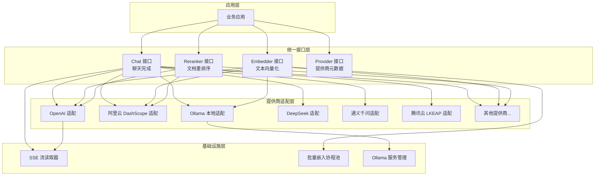

# 模型提供商与 AI 后端 (model_providers_and_ai_backends)

## 1. 模块概述

在构建 AI 应用时，最棘手的问题之一是如何统一管理和适配不同的模型提供商。你可能需要同时支持 OpenAI 的 GPT 系列、阿里云的通义千问、本地部署的 Ollama 模型，还有各种 Embedding 和 Rerank 服务——每个都有自己独特的 API 格式、参数要求和行为差异。

`model_providers_and_ai_backends` 模块就是为了解决这个问题而存在的。它就像一个**通用适配器**，将所有这些不同的模型提供商统一到一套一致的接口下，让你可以用相同的方式调用任何模型，而不必担心底层差异。

### 核心价值
- **统一抽象**：一套接口，多种实现
- **即插即用**：添加新提供商无需修改业务代码
- **差异屏蔽**：自动处理各提供商的特殊参数和行为

---

## 2. 架构设计

### 2.1 整体架构图



### 2.2 核心设计理念

这个模块采用了**分层抽象**和**策略模式**的设计思想：

1. **接口层**：定义统一契约，如 `Chat`、`Embedder`、`Reranker`
2. **适配层**：为每个提供商提供具体实现
3. **工厂模式**：通过 `NewChat`、`NewEmbedder`、`NewReranker` 等工厂函数动态创建实例
4. **注册表模式**：`Provider` 接口实现自动注册和发现

---

## 3. 核心组件详解

### 3.1 聊天完成 (Chat)

#### 核心接口
```go
type Chat interface {
    Chat(ctx context.Context, messages []Message, opts *ChatOptions) (*types.ChatResponse, error)
    ChatStream(ctx context.Context, messages []Message, opts *ChatOptions) (<-chan types.StreamResponse, error)
    GetModelName() string
    GetModelID() string
}
```

#### 设计亮点

**1. 请求自定义器 (Request Customizer)**

这是一个巧妙的设计，让基类 `RemoteAPIChat` 保持通用，同时允许子类灵活定制：

```go
// 在 RemoteAPIChat 中
type requestCustomizer func(req *openai.ChatCompletionRequest, opts *ChatOptions, isStream bool) (any, bool)

// 子类使用示例 (LKEAPChat)
func (c *LKEAPChat) customizeRequest(req *openai.ChatCompletionRequest, opts *ChatOptions, isStream bool) (any, bool) {
    // 仅对 DeepSeek V3.x 系列模型需要特殊处理 thinking 参数
    if !c.isDeepSeekV3Model() || opts == nil || opts.Thinking == nil {
        return nil, false // 使用标准请求
    }
    
    // 构建 LKEAP 特有请求
    lkeapReq := LKEAPChatCompletionRequest{
        ChatCompletionRequest: *req,
    }
    // ... 设置 thinking 参数
    return lkeapReq, true // 使用原始 HTTP 请求
}
```

**2. 流式响应处理**

流式输出需要处理增量更新、工具调用组装、思考内容分离等复杂逻辑：

```go
// streamState 管理流式处理状态
type streamState struct {
    toolCallMap      map[int]*types.LLMToolCall
    lastFunctionName map[int]string
    nameNotified     map[int]bool
    hasThinking      bool
}
```

#### 主要实现类

| 类名 | 用途 | 特殊处理 |
|------|------|----------|
| `RemoteAPIChat` | 通用 OpenAI 兼容实现 | 基础实现 |
| `OllamaChat` | 本地 Ollama 模型 | 模型可用性检查、自动拉取 |
| `LKEAPChat` | 腾讯云 LKEAP | DeepSeek 思维链参数 |
| `QwenChat` | 阿里云通义千问 | Qwen3 模型 enable_thinking |
| `DeepSeekChat` | DeepSeek 模型 | 移除不支持的 tool_choice |
| `GenericChat` | 通用兼容 (如 vLLM) | ChatTemplateKwargs |

### 3.2 文本向量化 (Embedder)

#### 核心接口
```go
type Embedder interface {
    Embed(ctx context.Context, text string) ([]float32, error)
    BatchEmbed(ctx context.Context, texts []string) ([][]float32, error)
    GetModelName() string
    GetDimensions() int
    GetModelID() string
    EmbedderPooler
}
```

#### 设计亮点

**1. 批量嵌入与协程池**

为了提高大规模文本向量化的吞吐量，模块使用了协程池：

```go
// batchEmbedder 使用 ants 协程池并发处理
func (e *batchEmbedder) BatchEmbedWithPool(ctx context.Context, model Embedder, texts []string) ([][]float32, error) {
    // 将文本分块
    // 提交到协程池
    // 收集结果
}
```

**2. 提供商路由逻辑**

阿里云的嵌入模型有两个不同的 API：
- 文本-only 模型使用 OpenAI 兼容接口
- 多模态模型使用 DashScope 专用接口

```go
// 在 NewEmbedder 中的智能路由
isMultimodalModel := strings.Contains(strings.ToLower(config.ModelName), "vision") ||
    strings.Contains(strings.ToLower(config.ModelName), "multimodal")

if isMultimodalModel {
    // 使用 DashScope 专用 API
    embedder, err = NewAliyunEmbedder(...)
} else {
    // 使用 OpenAI 兼容接口
    embedder, err = NewOpenAIEmbedder(...)
}
```

### 3.3 文档重排序 (Reranker)

#### 核心接口
```go
type Reranker interface {
    Rerank(ctx context.Context, query string, documents []string) ([]RankResult, error)
    GetModelName() string
    GetModelID() string
}
```

#### 设计亮点

**1. 兼容性反序列化**

不同提供商使用不同的字段名（`relevance_score` vs `score`），模块通过自定义 `UnmarshalJSON` 处理：

```go
func (r *RankResult) UnmarshalJSON(data []byte) error {
    var temp struct {
        Index          int          `json:"index"`
        Document       DocumentInfo `json:"document"`
        RelevanceScore *float64     `json:"relevance_score"`
        Score          *float64     `json:"score"`
    }
    // 优先使用 RelevanceScore，回退到 Score
}
```

**2. 文档格式自适应**

同样，文档信息也有两种格式：

```go
func (d *DocumentInfo) UnmarshalJSON(data []byte) error {
    // 先尝试作为字符串解析
    var text string
    if err := json.Unmarshal(data, &text); err == nil {
        d.Text = text
        return nil
    }
    // 再尝试作为对象解析
    var temp struct {
        Text string `json:"text"`
    }
    // ...
}
```

### 3.4 提供商管理 (Provider)

#### 核心接口
```go
type Provider interface {
    Info() ProviderInfo
    ValidateConfig(config *Config) error
}
```

#### 设计亮点

**1. 自动注册机制**

每个提供商在 `init()` 中自动注册：

```go
func init() {
    Register(&AliyunProvider{})
}
```

**2. 基于 URL 的自动检测**

即使没有明确指定提供商，也能通过 BaseURL 自动识别：

```go
func DetectProvider(baseURL string) ProviderName {
    switch {
    case containsAny(baseURL, "dashscope.aliyuncs.com"):
        return ProviderAliyun
    case containsAny(baseURL, "api.openai.com"):
        return ProviderOpenAI
    // ... 更多检测规则
    default:
        return ProviderGeneric
    }
}
```

---

## 4. 关键设计决策与权衡

### 4.1 OpenAI 兼容作为 lingua franca

**决策**：以 OpenAI API 格式作为统一基础，其他提供商通过适配层转换

**原因**：
- OpenAI 格式已成为行业事实标准
- 大多数新提供商都提供 OpenAI 兼容接口
- 减少转换层级，提高性能

**权衡**：
- 对于完全不兼容的 API（如阿里云多模态嵌入），需要完全独立的实现
- 某些高级特性可能无法通过标准接口表达

### 4.2 组合优先于继承

**决策**：`RemoteAPIChat` 作为基类，通过 `requestCustomizer` 回调扩展，而不是为每个提供商创建子类

**原因**：
- 大多数提供商差异仅在请求格式的细微调整
- 保持核心逻辑（流式处理、错误处理、重试）在一处
- 更容易添加新提供商

**示例**：
```go
// DeepSeekChat 只需要清除 tool_choice，其余逻辑复用
func (c *DeepSeekChat) customizeRequest(req *openai.ChatCompletionRequest, opts *ChatOptions, isStream bool) (any, bool) {
    if opts != nil && opts.ToolChoice != "" {
        req.ToolChoice = nil
    }
    return nil, false
}
```

### 4.3 思考内容的特殊处理

**决策**：为推理模型（DeepSeek-R1、Qwen3 等）的思考过程提供特殊支持

**实现方式**：
1. 在 `ChatOptions` 中添加 `Thinking` 参数
2. 在流式响应中区分 `ResponseTypeThinking` 和 `ResponseTypeAnswer`
3. 自动移除非流式响应中的 `<think>` 标签

**原因**：
- 思考过程对用户体验很重要（显示"正在思考..."）
- 不同模型处理方式差异很大
- 需要在接口层面统一

---

## 5. 数据流向分析

### 5.1 聊天完成请求流程

```
用户请求
    ↓
NewChat(config) → 根据 Source 和 Provider 选择实现
    ↓
    ├─→ Local → OllamaChat
    │       ↓
    │   OllamaService.EnsureModelAvailable()
    │       ↓
    │   Ollama API
    │
    └─→ Remote → 检测 Provider
            ↓
        ├─→ LKEAP → LKEAPChat.customizeRequest()
        ├─→ Qwen3 → QwenChat.customizeRequest()
        ├─→ DeepSeek → DeepSeekChat.customizeRequest()
        ├─→ Generic → GenericChat.customizeRequest()
        └─→ 其他 → RemoteAPIChat（标准请求）
            ↓
        BuildChatCompletionRequest()
            ↓
        requestCustomizer（可选修改）
            ↓
        ├─→ 非流式 → CreateChatCompletion()
        │       ↓
        │   parseCompletionResponse()
        │       ↓
        │   移除 <think> 标签（如需要）
        │
        └─→ 流式 → CreateChatCompletionStream() 或原始 HTTP
                ↓
            processStream() / processRawHTTPStream()
                ↓
            streamState 管理增量更新
                ↓
            分离 Thinking 和 Answer
                ↓
            组装 ToolCalls
```

### 5.2 嵌入请求流程

```
文本输入
    ↓
NewEmbedder(config)
    ↓
检测 Provider 和模型类型
    ↓
    ├─→ 阿里云多模态 → AliyunEmbedder（专用 API）
    ├─→ 阿里云文本 → OpenAIEmbedder（兼容接口）
    ├─→ Jina → JinaEmbedder（truncate 参数不同）
    ├─→ Volcengine → VolcengineEmbedder（逐个调用）
    ├─→ Ollama → OllamaEmbedder（本地服务）
    └─→ 其他 → OpenAIEmbedder
        ↓
    ├─→ 单文本 → Embed() → 内部调用 BatchEmbed([]string{text})
    └─→ 批量 → BatchEmbed()
            ↓
        ┌─────────────────────────────────┐
        │  可选：BatchEmbedWithPool()    │
        │  使用协程池并发处理             │
        └─────────────────────────────────┘
            ↓
        返回 [][]float32
```

---

## 6. 子模块概览

本模块包含以下子模块，每个都有专门的详细文档：

| 子模块 | 职责 | 链接 |
|--------|------|------|
| 聊天完成后端与流式处理 | 核心聊天接口、各提供商适配、SSE 流解析 | [chat_completion_backends_and_streaming](model_providers_and_ai_backends-chat_completion_backends_and_streaming.md) |
| 嵌入接口、批处理与后端 | 文本向量化、批量处理协程池、多提供商实现 | [embedding_interfaces_batching_and_backends](model_providers_and_ai_backends-embedding_interfaces_batching_and_backends.md) |
| 提供商目录与配置契约 | 提供商注册、元数据管理、配置验证 | [provider_catalog_and_configuration_contracts](model_providers_and_ai_backends-provider_catalog_and_configuration_contracts.md) |
| 重排序接口与后端 | 文档重排序、多提供商兼容 | [reranking_interfaces_and_backends](model_providers_and_ai_backends-reranking_interfaces_and_backends.md) |
| Ollama 模型元数据与服务工具 | 本地 Ollama 服务管理、模型生命周期 | [ollama_model_metadata_and_service_utils](model_providers_and_ai_backends-ollama_model_metadata_and_service_utils.md) |

---

## 7. 与其他模块的依赖关系

### 7.1 被依赖模块

本模块是**底层基础设施**，被以下模块依赖：

- [application_services_and_orchestration](application_services_and_orchestration.md)：使用 Chat、Embedder、Reranker 实现对话和检索
- [data_access_repositories](data_access_repositories.md)：使用 Provider 管理模型配置
- [http_handlers_and_routing](http_handlers_and_routing.md)：通过 API 暴露模型功能

### 7.2 依赖的模块

- `core_domain_types_and_interfaces`：定义了 `types.ChatResponse`、`types.StreamResponse` 等通用类型
- 内部工具包：`logger`、`utils` 等

---

## 8. 使用指南与最佳实践

### 8.1 创建 Chat 实例

```go
config := &chat.ChatConfig{
    Source:    types.ModelSourceRemote,
    BaseURL:   "https://dashscope.aliyuncs.com/compatible-mode/v1",
    ModelName: "qwen-plus",
    APIKey:    "your-api-key",
    Provider:  "aliyun",
}

chatInstance, err := chat.NewChat(config, ollamaService)
if err != nil {
    // 处理错误
}
```

### 8.2 流式聊天的正确用法

```go
stream, err := chatInstance.ChatStream(ctx, messages, opts)
if err != nil {
    // 处理错误
}

for resp := range stream {
    switch resp.ResponseType {
    case types.ResponseTypeThinking:
        if resp.Done {
            // 思考结束
        } else {
            // 显示思考内容
        }
    case types.ResponseTypeAnswer:
        if resp.Done {
            // 回答结束
        } else {
            // 显示回答内容
        }
    case types.ResponseTypeToolCall:
        // 处理工具调用
    case types.ResponseTypeError:
        // 处理错误
    }
}
```

### 8.3 常见陷阱

**陷阱 1：忘记配置 OllamaService**
```go
// 错误：忘记传递 ollamaService
chatInstance, err := chat.NewChat(config, nil)

// 正确
ollamaService, _ := ollama.GetOllamaService()
chatInstance, err := chat.NewChat(config, ollamaService)
```

**陷阱 2：假设所有提供商都支持所有参数**
```go
// 错误：DeepSeek 不支持 tool_choice
opts := &chat.ChatOptions{
    ToolChoice: "required",
}

// 模块会自动处理，但最好在应用层根据提供商选择参数
```

**陷阱 3：忽略批量嵌入的顺序**
```go
// 正确：返回的 embeddings 与输入 texts 顺序一致
embeddings, err := embedder.BatchEmbed(ctx, texts)
for i, text := range texts {
    // embeddings[i] 对应 texts[i]
}
```

---

## 9. 扩展指南：添加新的模型提供商

### 9.1 添加新的 Chat 提供商

1. **在 `provider/` 中创建 Provider 实现**（如 `myprovider.go`）
2. **如果只是 OpenAI 兼容但有小调整**：在 `chat/` 中创建类似 `DeepSeekChat` 的包装
3. **如果有完全不同的 API**：创建独立的 `Chat` 实现
4. **在 `NewRemoteChat` 中添加路由**

### 9.2 添加新的 Embedder 提供商

1. **实现 `Embedder` 接口**
2. **在 `NewEmbedder` 中添加路由**
3. **考虑是否需要特殊的批量处理逻辑**

### 9.3 添加新的 Reranker 提供商

1. **实现 `Reranker` 接口**
2. **在 `NewReranker` 中添加路由**
3. **利用 `RankResult.UnmarshalJSON` 处理字段差异**

---

## 10. 总结

`model_providers_and_ai_backends` 模块是一个精心设计的抽象层，它：

✅ **统一了差异**：让 20+ 模型提供商看起来像一个  
✅ **保持了灵活性**：通过请求自定义器处理特殊情况  
✅ **优化了性能**：批量嵌入协程池、流式处理  
✅ **增强了健壮性**：自动重试、兼容性反序列化、思考内容处理  

这个模块的设计体现了"**在统一中求变化，在变化中求统一**"的架构哲学——用最小的接口表面覆盖最大的功能范围，同时为特殊情况保留扩展点。
