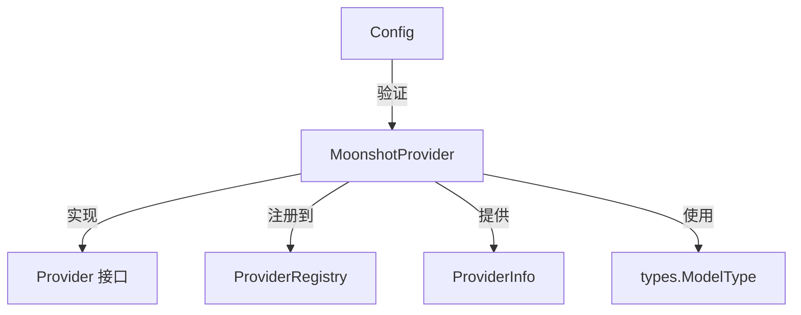

# Moonshot OpenAI 兼容 Provider 适配器技术深度解析

## 1. 模块概述

**Moonshot OpenAI 兼容 Provider 适配器** 是一个专门为月之暗面（Moonshot）AI 平台设计的轻量级集成组件。它通过将 Moonshot AI 的 API 映射到系统的 OpenAI 兼容接口标准，实现了对 Moonshot 模型（如 kimi-k2-turbo-preview 和 moonshot-v1-8k-vision-preview）的无缝接入。

### 问题背景

在一个支持多模型提供商的系统中，直接集成每个平台的原生 API 会导致代码重复和接口碎片化。Moonshot 等新兴 AI 平台通常会提供与 OpenAI 兼容的 API 接口，但仍需要一个适配器层来处理平台特定的配置验证、元数据管理和默认设置。本模块正是为了解决这一问题而设计的。

## 2. 架构与设计

### 核心组件角色



### 设计理念

这个模块采用了**适配器模式**和**注册发现机制**的组合设计：

1. **适配器模式**：将 Moonshot 平台的特性适配到系统的通用 Provider 接口
2. **注册发现机制**：通过 `init()` 函数自动注册到 Provider 注册表
3. **声明式元数据**：通过 `Info()` 方法集中管理平台的元数据和配置

## 3. 核心组件深度解析

### MoonshotProvider 结构体

`MoonshotProvider` 是一个空结构体，这体现了**无状态设计**的理念。它的所有行为都通过方法实现，不保存任何实例状态，这使得它可以被安全地并发使用。

```go
type MoonshotProvider struct{}
```

#### 设计意图

使用空结构体而不是包含配置字段的结构体是一个关键的设计决策。这意味着：
- 配置通过参数传递，而不是保存在实例中
- 同一个 `MoonshotProvider` 实例可以服务多个不同的配置
- 简化了生命周期管理，不需要考虑实例的创建和销毁

### Info() 方法

```go
func (p *MoonshotProvider) Info() ProviderInfo {
    return ProviderInfo{
        Name:        ProviderMoonshot,
        DisplayName: "月之暗面 Moonshot",
        Description: "kimi-k2-turbo-preview, moonshot-v1-8k-vision-preview, etc.",
        DefaultURLs: map[types.ModelType]string{
            types.ModelTypeKnowledgeQA: MoonshotBaseURL,
            types.ModelTypeVLLM:        MoonshotBaseURL,
        },
        ModelTypes: []types.ModelType{
            types.ModelTypeKnowledgeQA,
            types.ModelTypeVLLM,
        },
        RequiresAuth: true,
    }
}
```

#### 功能解析

这个方法提供了 Moonshot 平台的完整元数据描述：
- **DefaultURLs**：为不同类型的模型提供默认的 API 端点
- **ModelTypes**：声明支持的模型类型（知识问答和视觉语言模型）
- **RequiresAuth**：明确标识此平台需要 API 密钥认证

#### 设计意图

通过 `Info()` 方法而不是结构体字段来提供元数据，使得元数据可以动态计算（尽管在这个简单实现中是静态的），同时保持了 `Provider` 接口的简洁性。

### ValidateConfig() 方法

```go
func (p *MoonshotProvider) ValidateConfig(config *Config) error {
    if config.BaseURL == "" {
        return fmt.Errorf("base URL is required for Moonshot provider")
    }
    if config.APIKey == "" {
        return fmt.Errorf("API key is required for Moonshot provider")
    }
    if config.ModelName == "" {
        return fmt.Errorf("model name is required")
    }
    return nil
}
```

#### 功能解析

这个方法执行三个关键验证：
1. **BaseURL**：确保 API 端点已配置
2. **APIKey**：确保认证凭据已提供
3. **ModelName**：确保目标模型已指定

#### 设计意图

验证逻辑集中在一个方法中，使得：
- 配置验证在使用前完成，避免运行时错误
- 错误消息清晰明确，便于调试
- 可以轻松扩展验证规则，而不影响其他代码

### 自动注册机制

```go
func init() {
    Register(&MoonshotProvider{})
}
```

这是一个巧妙的设计，利用 Go 的 `init()` 函数在包加载时自动注册 Provider，使得：
- 使用者无需手动注册
- Provider 列表自动维护
- 便于添加新的 Provider 实现

## 4. 依赖关系分析

### 依赖的模块

- **Provider 接口**：定义了 Provider 必须实现的方法
- **types.ModelType**：提供模型类型的枚举定义
- **Provider 注册表**：管理所有可用的 Provider 实例

### 被依赖的模块

此模块被以下模块依赖：
- **OpenAI 兼容 Provider 目录**：使用注册的 Provider 列表
- **聊天完成后端**：可能使用此 Provider 进行 API 调用

## 5. 设计决策与权衡

### 决策1：无状态设计

**选择**：使用空结构体，通过参数传递配置
**替代方案**：在结构体中保存配置
**权衡**：
- 支持并发使用，无需锁
- 同一个实例可服务多个配置
- 每次调用都需要传递配置，稍微增加了开销
**理由**：在多租户环境中，无状态设计更合适，因为不同租户可能有不同的配置

### 决策2：通过 Info() 方法提供元数据

**选择**：使用方法而不是字段
**替代方案**：在结构体中定义元数据字段
**权衡**：
- 允许动态计算元数据
- 保持接口一致性
- 对于静态元数据，稍微增加了调用开销
**理由**：为未来的扩展留出空间，同时保持与其他 Provider 实现的一致性

### 决策3：集中式配置验证

**选择**：在 ValidateConfig() 中验证所有必要字段
**替代方案**：在使用时分散验证
**权衡**：
- 早期发现配置错误
- 验证逻辑集中，易于维护
- 可能验证了某些实际未使用的字段
**理由**：提前验证可以避免在 API 调用时才发现配置错误，提高了系统的可靠性

## 6. 使用指南

### 基本使用

由于使用了自动注册机制，使用 MoonshotProvider 非常简单：

```go
// Provider 已通过 init() 自动注册
// 只需从注册表获取即可
provider := GetProvider(ProviderMoonshot)

// 验证配置
config := &Config{
    BaseURL:   "https://api.moonshot.ai/v1",
    APIKey:    "your-api-key",
    ModelName: "kimi-k2-turbo-preview",
}
err := provider.ValidateConfig(config)
if err != nil {
    // 处理错误
}

// 获取 Provider 信息
info := provider.Info()
```

### 配置选项

| 配置项 | 必需 | 说明 |
|--------|------|------|
| BaseURL | 是 | Moonshot API 的基础 URL |
| APIKey | 是 | Moonshot 平台的 API 密钥 |
| ModelName | 是 | 要使用的模型名称 |

## 7. 注意事项与边缘情况

### 隐式契约

- **BaseURL 格式**：虽然没有明确验证，但 BaseURL 应该以 `https://` 开头
- **APIKey 格式**：APIKey 应该是 Moonshot 平台签发的有效密钥
- **模型名称**：ModelName 必须是 Moonshot 平台支持的模型之一

### 常见问题

1. **BaseURL 为空**：会导致 `ValidateConfig()` 返回错误
2. **APIKey 缺失**：同样会导致验证失败
3. **模型名称错误**：虽然不会被 `ValidateConfig()` 捕获，但会在实际 API 调用时失败

### 扩展性考虑

虽然当前实现很简单，但未来可能需要：
- 添加更多模型类型的支持
- 实现更复杂的配置验证
- 添加请求/响应转换逻辑

## 8. 总结

Moonshot OpenAI 兼容 Provider 适配器是一个设计简洁但功能完整的集成组件。它通过无状态设计、自动注册和集中验证等模式，实现了对 Moonshot AI 平台的无缝接入。虽然代码量不大，但它体现了良好的软件工程实践，为系统的多模型提供商支持奠定了基础。

这个模块的设计理念可以总结为：**简单而不简陋，灵活而不松散**。它通过最小化的实现满足了当前需求，同时为未来的扩展留出了空间。
