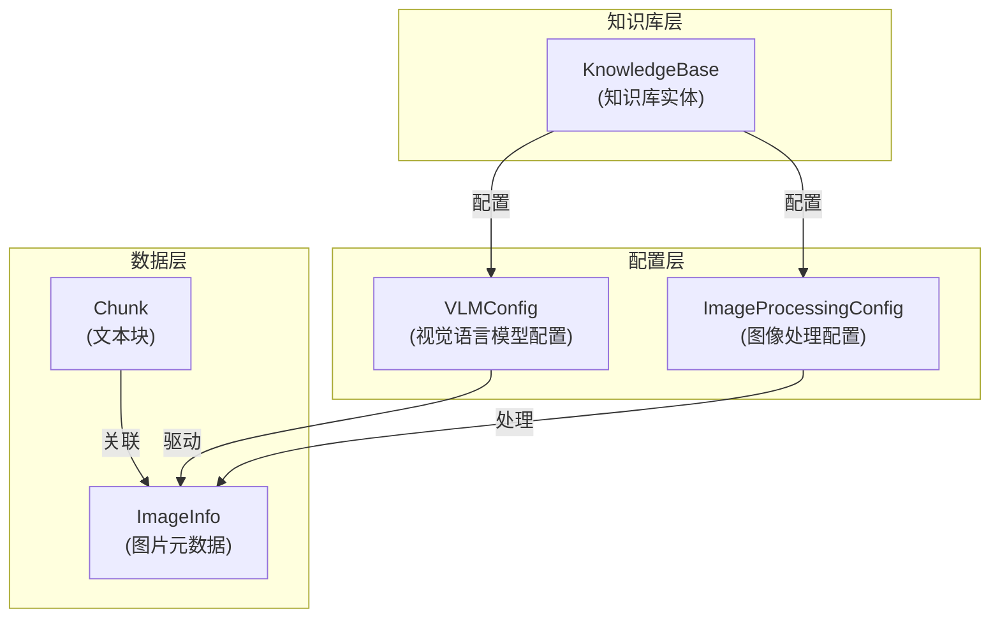

# 多模态 VLM 与图像处理配置模块

## 概述

这个模块是系统多模态能力的"指挥中心"，负责配置和管理视觉语言模型（VLM）以及图像处理流程。想象一下，当您上传一份包含图表、照片和流程图的技术文档时，系统需要能够"看懂"这些图片内容，并将其与文本内容一起索引和检索。这个模块就是让这一切成为可能的核心配置层。

在没有这个模块之前，系统只能处理纯文本内容，文档中的图片要么被完全忽略，要么只能通过简单的 OCR 提取文字，丢失了图片中的视觉语义信息。通过这个模块，系统可以利用先进的视觉语言模型来理解图片内容，生成描述，并将其纳入知识库的检索范围。

## 架构概览



这个架构图展示了模块的核心组件及其关系：

1. **配置层**：包含 `VLMConfig` 和 `ImageProcessingConfig`，负责定义如何使用视觉语言模型和处理图片
2. **数据层**：包含 `ImageInfo` 和 `Chunk`，负责存储图片元数据和与文本块的关联
3. **知识库层**：`KnowledgeBase` 实体整合了这些配置，使得每个知识库都可以有自己独立的多模态处理策略

数据流向是这样的：当文档被处理时，系统会检查知识库的多模态配置，如果启用，就会使用配置的模型来处理文档中的图片，生成描述和 OCR 文本，然后创建带有 `ImageInfo` 的特殊 Chunk 来存储这些信息。

## 核心组件详解

### VLMConfig - 视觉语言模型配置

`VLMConfig` 是模块的核心配置结构，它决定了系统是否启用多模态能力以及使用哪个模型来处理图片。

```go
type VLMConfig struct {
    Enabled bool   `yaml:"enabled"  json:"enabled"`
    ModelID string `yaml:"model_id" json:"model_id"`
    
    // 兼容老版本
    ModelName     string `yaml:"model_name" json:"model_name"`
    BaseURL       string `yaml:"base_url" json:"base_url"`
    APIKey        string `yaml:"api_key" json:"api_key"`
    InterfaceType string `yaml:"interface_type" json:"interface_type"`
}
```

**设计意图**：
- 采用了"新旧兼容"的设计模式，既支持新的基于 `ModelID` 的配置方式，也保留了老版本的直接配置方式
- `IsEnabled()` 方法封装了启用判断逻辑，使得调用方无需关心版本差异

**关键点**：
- 新版本使用 `Enabled && ModelID != ""` 判断启用
- 老版本使用 `ModelName != "" && BaseURL != ""` 判断启用
- 这种设计允许系统平滑迁移，不会破坏现有知识库的配置

### ImageProcessingConfig - 图像处理配置

`ImageProcessingConfig` 是一个简洁但重要的配置结构：

```go
type ImageProcessingConfig struct {
    ModelID string `yaml:"model_id" json:"model_id"`
}
```

**设计意图**：
- 目前只包含 `ModelID`，但作为独立结构存在，为未来扩展预留了空间
- 与 `VLMConfig` 分离，使得图像处理和视觉理解可以使用不同的模型

**潜在扩展方向**：
- 图片大小限制
- 格式转换规则
- 预处理参数（如缩放、裁剪）
- OCR 语言设置

### ImageInfo - 图片元数据

`ImageInfo` 是连接图片和文本块的桥梁：

```go
type ImageInfo struct {
    URL         string `json:"url"          gorm:"type:text"`
    OriginalURL string `json:"original_url" gorm:"type:text"`
    StartPos    int    `json:"start_pos"`
    EndPos      int    `json:"end_pos"`
    Caption     string `json:"caption"`
    OCRText     string `json:"ocr_text"`
}
```

**设计意图**：
- 存储图片的多个维度信息：位置、原始文件、处理结果
- `StartPos` 和 `EndPos` 维护了图片在原始文本中的位置关系，使得检索时可以提供上下文
- 同时存储 `Caption`（视觉描述）和 `OCRText`（文字提取），覆盖不同类型的图片内容

**与 Chunk 的关系**：
- `ImageInfo` 以 JSON 字符串形式存储在 `Chunk` 的 `ImageInfo` 字段中
- 图片相关的 Chunk 通常有特殊类型（`ChunkTypeImageOCR` 或 `ChunkTypeImageCaption`）
- 通过 `ParentChunkID` 与原始文本 Chunk 关联，保持内容的连贯性

## 设计决策与权衡

### 1. 配置版本兼容性 vs 代码简洁性

**决策**：保留了新旧两套配置方案，并在 `IsEnabled()` 方法中封装判断逻辑

**权衡分析**：
- ✅ **优点**：无缝升级，现有知识库无需迁移
- ❌ **缺点**：代码稍显复杂，需要维护两套逻辑

**为什么这样选择**：
- 系统中可能存在大量使用旧配置的知识库，强制迁移会带来风险
- 配置逻辑相对简单，维护成本可控
- 为未来彻底移除旧配置留下了平滑过渡的空间

### 2. 图片信息内嵌 vs 独立存储

**决策**：将 `ImageInfo` 以 JSON 字符串形式内嵌在 `Chunk` 中

**权衡分析**：
- ✅ **优点**：查询简单，一次数据库操作即可获取完整信息
- ❌ **缺点**：不适合复杂查询，更新时需要重写整个 JSON

**为什么这样选择**：
- 图片信息通常与 Chunk 一起使用，内嵌可以提高查询效率
- 图片信息相对稳定，不需要频繁更新
- JSON 形式足够灵活，可以适应未来字段扩展

### 3. 集中式配置 vs  per-知识库配置

**决策**：将多模态配置放在 `KnowledgeBase` 级别，而非全局配置

**权衡分析**：
- ✅ **优点**：灵活性高，不同知识库可以使用不同策略
- ❌ **缺点**：配置管理稍显复杂，可能存在配置不一致

**为什么这样选择**：
- 不同类型的知识库对多模态的需求差异很大
- 成本考虑：VLM 调用可能更昂贵，允许按需启用
- 渐进式采用：可以先在部分知识库试点，再推广

## 使用指南与注意事项

### 启用多模态处理

要为知识库启用多模态处理，需要正确配置 `VLMConfig`：

```go
// 新版本推荐方式
kb.VLMConfig = types.VLMConfig{
    Enabled: true,
    ModelID: "your-vlm-model-id",
}

// 验证是否启用
if kb.IsMultimodalEnabled() {
    // 多模态已启用
}
```

### 图片 Chunk 的处理流程

当处理包含图片的文档时：

1. 系统检测到图片，提取并存储到 COS
2. 使用配置的 VLM 模型生成图片描述（Caption）
3. 使用 OCR 模型提取图片中的文字（OCRText）
4. 创建两个特殊类型的 Chunk：
   - `ChunkTypeImageCaption`：存储视觉描述
   - `ChunkTypeImageOCR`：存储 OCR 文字
5. 两个 Chunk 都通过 `ParentChunkID` 关联到原始文本 Chunk

### 注意事项与陷阱

1. **向后兼容性**：
   - 始终使用 `IsMultimodalEnabled()` 和 `IsEnabled()` 方法，不要直接检查字段
   - 旧配置可能仍在使用，代码需要同时处理两种情况

2. **性能考虑**：
   - VLM 处理可能较慢，考虑在异步任务中进行
   - 大图片可能需要先压缩再处理

3. **数据一致性**：
   - `ImageInfo` 的 `StartPos` 和 `EndPos` 需要与原始文本保持同步
   - 删除 Chunk 时，考虑是否需要清理关联的图片文件

4. **错误处理**：
   - VLM 调用失败时应该有降级策略（如只使用 OCR）
   - 图片处理失败不应阻塞整个文档的处理

## 与其他模块的关系

这个模块与以下模块有紧密联系：

- **知识提取与处理模块**：使用这里的配置来决定如何处理文档中的图片
- **Chunk 管理模块**：创建和管理带有图片信息的 Chunk
- **模型目录模块**：提供可用的 VLM 和图像处理模型
- **检索引擎模块**：在检索时使用图片 Chunk 的内容

## 总结

`multimodal_vlm_and_image_processing_configuration` 模块是系统多模态能力的基石，它通过简洁但灵活的配置设计，使得系统能够"看懂"文档中的图片内容。模块在设计上非常注重向后兼容性，确保系统可以平滑演进，同时为未来的功能扩展预留了空间。

对于新加入团队的开发者，理解这个模块的关键在于把握"配置驱动"的设计理念——每个知识库都可以根据自己的需求定制多模态处理策略，而这些策略都由这个模块统一管理和协调。
