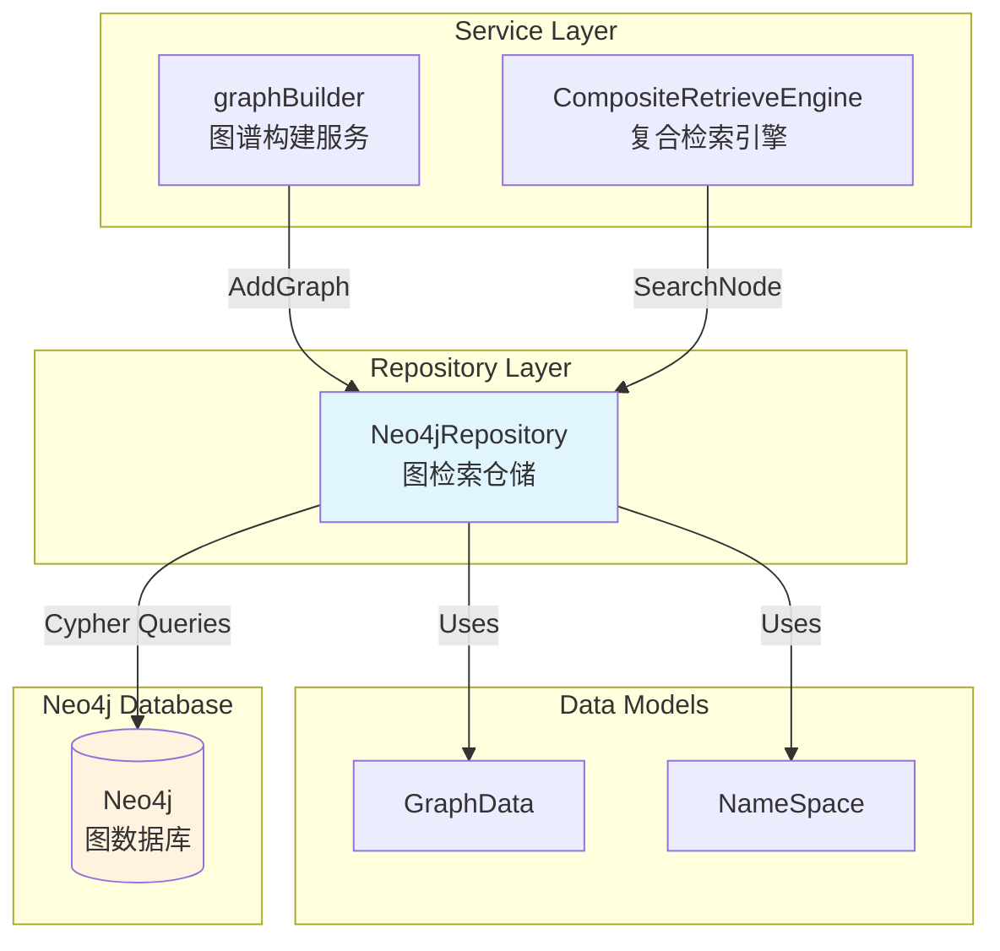

# Neo4j Retrieval Repository 模块深度解析

## 概述：为什么需要图检索？

想象一下，你正在构建一个企业级知识库问答系统。向量检索能帮你找到"语义相似"的文本片段，但它无法回答这样的问题："这个产品的所有依赖组件是什么？"或者"找出所有与财务审批流程相关的文档及其负责人"。这类问题需要理解实体之间的**关系结构**，而不仅仅是文本相似度。

`neo4j_retrieval_repository` 模块正是为了解决这个问题而存在的。它提供了一个图数据库持久化层，将业务层生成的知识图谱（实体节点 + 关系边）存储到 Neo4j 中，并支持基于节点名称的图遍历查询。与向量检索形成互补：向量检索擅长"模糊语义匹配"，图检索擅长"结构化关系导航"。

这个模块的核心设计洞察是：**图数据的多租户隔离和批量导入的幂等性**。每个知识库（Knowledge）的图数据必须相互隔离，且重复导入同一份数据不应产生重复节点。模块通过 `kg`（knowledge_id）属性和 APOC 的 merge 操作实现了这两个关键需求。

## 架构与数据流



**架构角色说明**：

- **Neo4jRepository** 是典型的仓储模式实现，位于 `data_access_repositories` → `graph_retrieval_and_memory_repositories` 层级。它向上对服务层（如 [`graphBuilder`](internal/application/service/graph/graphBuilder.go)）提供图数据持久化接口，向下封装 Neo4j 驱动的细节。

- **数据流入路径**：[`graphBuilder`](internal/application/service/graph/graphBuilder.go) 服务从文档 chunk 中提取实体和关系，组装成 `GraphData` 结构，调用 `AddGraph` 持久化到 Neo4j。

- **数据流出路径**：[`CompositeRetrieveEngine`](internal/application/service/retriever/composite/composite_retrieve_engine.go) 在执行混合检索时，可能调用 `SearchNode` 获取与查询词相关的子图，与向量检索结果融合后返回给用户。

- **接口契约**：实现 `internal.types.interfaces.retriever_graph.RetrieveGraphRepository` 接口，与 [`MemoryRepository`](internal/application/repository/memory/neo4j/repository.go) 共享 Neo4j 基础设施但职责分离——前者存储知识图谱，后者存储对话记忆。

## 核心组件深度解析

### Neo4jRepository 结构体

```go
type Neo4jRepository struct {
    driver     neo4j.Driver
    nodePrefix string
}
```

**设计意图**：这是一个轻量级的无状态仓储（stateless repository）。`driver` 是线程安全的 Neo4j 客户端连接池，`nodePrefix` 固定为 `"ENTITY"`，用于统一所有知识图谱节点的标签前缀。

**为什么没有连接池管理？** 连接生命周期由上层（通常是应用启动时的依赖注入容器）管理，仓储只负责使用。这种设计遵循"依赖倒置"原则——仓储不关心驱动如何创建，只关心如何使用。

**关键约束**：`driver` 可能为 `nil`（配置中未启用 Neo4j 时），所有公开方法都会检查并优雅降级，返回 `nil` 或空结果而非 panic。这是典型的"可选功能"设计模式。

### 命名空间到标签的转换：`Labels` 与 `Label`

```go
func (n *Neo4jRepository) Labels(namespace types.NameSpace) []string {
    res := make([]string, 0)
    for _, label := range namespace.Labels() {
        res = append(res, n.nodePrefix+_remove_hyphen(label))
    }
    return res
}
```

**为什么需要标签转换？** Neo4j 的标签（Label）不能包含连字符（`-`），但业务层的 `NameSpace.Labels()` 可能返回包含连字符的字符串（如 `"knowledge-base"`）。`_remove_hyphen` 函数将连字符替换为下划线，确保 Cypher 查询语法合法。

**标签的作用**：在 Neo4j 中，标签类似于关系型数据库的"表名"，用于索引和查询优化。所有知识图谱节点都会被标记为 `ENTITY<Label1>:ENTITY<Label2>...`，例如 `ENTITYKnowledge:ENTITYDocument`。这种设计使得同一知识库的不同类型实体可以共享相同的查询逻辑，同时保持类型区分能力。

**多租户隔离机制**：注意标签本身**不**包含知识库 ID，真正的隔离是通过节点属性 `kg`（knowledge_id）实现的。这样设计的好处是：
1. 标签体系保持简洁，避免为每个知识库创建独立标签（标签爆炸问题）
2. 查询时通过 `WHERE {kg: $knowledge_id}` 实现逻辑隔离
3. 删除时可以批量删除某个知识库的所有数据

### 图数据导入：`AddGraph` 与 `addGraph`

**方法签名**：
```go
AddGraph(ctx context.Context, namespace types.NameSpace, graphs []*types.GraphData) error
```

**内部流程**：

1. **会话管理**：为每个 `GraphData` 创建独立的写会话（`neo4j.SessionConfig{AccessMode: neo4j.AccessModeWrite}`），使用 `defer session.Close(ctx)` 确保资源释放。

2. **事务包装**：使用 `ExecuteWrite` 确保节点和关系的创建是原子操作。如果节点创建成功但关系创建失败，整个事务回滚，避免数据不一致。

3. **节点导入策略**（关键设计点）：
   ```cypher
   CALL apoc.merge.node(row.labels, {name: row.name, kg: row.knowledge_id}, row.props, {}) 
   YIELD node
   SET node.chunks = apoc.coll.union(node.chunks, row.chunks)
   ```
   
   - **为什么用 `apoc.merge.node` 而非 `CREATE` 或 `MERGE`？** `apoc.merge.node` 是 APOC 库提供的"智能合并"过程，它根据匹配键（这里是 `name` + `kg`）判断节点是否存在：存在则更新属性，不存在则创建。这比原生 `MERGE` 更灵活，支持批量操作和更复杂的属性合并逻辑。
   
   - **`chunks` 字段的特殊处理**：使用 `apoc.coll.union` 将新 chunk 与已有 chunk 合并，避免重复。这是典型的"集合累加"模式——同一实体可能被多个文档引用，需要保留所有引用来源。

4. **关系导入策略**：
   ```cypher
   CALL apoc.merge.node(row.source_labels, {name: row.source, kg: row.knowledge_id}, {}, {}) YIELD node as source
   CALL apoc.merge.node(row.target_labels, {name: row.target, kg: row.knowledge_id}, {}, {}) YIELD node as target
   CALL apoc.merge.relationship(source, row.type, {}, row.attributes, target) YIELD rel
   ```
   
   这里有一个微妙的设计：**关系导入时会确保两端节点存在**。即使上游只提供了关系数据（没有显式提供节点），这段代码也会自动创建缺失的节点。这是一种"防御性编程"，防止因数据不完整导致的关系悬挂。

**性能考量**：
- 使用 `UNWIND $data AS row` 批量处理，减少网络往返次数
- 没有使用 `apoc.periodic.iterate` 是因为导入数据量通常较小（单个知识库的图谱在千级节点以内）
- 每个 `GraphData` 独立事务，避免大事务导致的锁竞争

### 图数据删除：`DelGraph`

**方法签名**：
```go
DelGraph(ctx context.Context, namespaces []types.NameSpace) error
```

**删除策略的核心挑战**：Neo4j 中不能直接删除有关系的节点（会违反参照完整性）。必须先删除关系，再删除节点。

**实现细节**：
```cypher
CALL apoc.periodic.iterate(
    "MATCH (n:` + labelExpr + ` {kg: $knowledge_id})-[r]-(m:` + labelExpr + ` {kg: $knowledge_id}) RETURN r",
    "DELETE r",
    {batchSize: 1000, parallel: true, params: {knowledge_id: $knowledge_id}}
)
```

**为什么用 `apoc.periodic.iterate`？** 这是处理大规模删除的关键优化：
1. **分批执行**：`batchSize: 1000` 避免一次性加载所有关系到内存
2. **并行处理**：`parallel: true` 利用多核 CPU 加速删除
3. **事务自动管理**：每个批次独立事务，避免长事务导致的锁等待

**潜在风险**：如果某个知识库有百万级关系，删除操作可能耗时数分钟。调用方需要设置合理的 `context.Context` 超时时间，否则可能遇到 `context deadline exceeded` 错误。

### 节点搜索：`SearchNode`

**方法签名**：
```go
SearchNode(ctx context.Context, namespace types.NameSpace, nodes []string) (*types.GraphData, error)
```

**查询逻辑**：
```cypher
MATCH (n:` + labelExpr + `)-[r]-(m:` + labelExpr + `)
WHERE ANY(nodeText IN $nodes WHERE n.name CONTAINS nodeText)
RETURN n, r, m
```

**设计选择分析**：

1. **`CONTAINS` vs 精确匹配**：使用 `CONTAINS` 支持模糊搜索（如搜索 "用户" 可匹配 "用户管理模块"），但代价是无法利用索引。对于大规模图谱，这可能成为性能瓶颈。如果未来需要优化，可以考虑：
   - 添加全文索引（Neo4j Full-Text Index）
   - 改用 `STARTS WITH`（可利用索引）
   - 引入向量相似度搜索作为前置过滤

2. **一度关系遍历**：查询只返回直接相连的节点和关系（`(n)-[r]-(m)`），不递归遍历。这是合理的默认行为——用户通常只关心"直接相关"的实体。如果需要多跳查询，应在服务层实现迭代调用。

3. **去重逻辑**：使用 `nodeSeen` map 避免重复节点（一个节点可能通过多条关系被匹配到）。这是图查询的常见模式，因为 `MATCH` 会为每条匹配路径返回一行，导致节点重复。

**返回数据结构**：`GraphData` 包含三部分：
- `Node`：匹配到的节点列表（含 `Chunks` 和 `Attributes`）
- `Relation`：节点间的关系列表
- `Text`：未使用（保留字段，可能用于未来扩展）

**使用场景**：典型调用是在用户提问后，提取问题中的关键实体（如"产品 A"），搜索这些实体及其一度邻居，将结果作为上下文注入到 LLM 提示词中。

## 依赖关系分析

### 上游依赖（谁调用它）

| 调用方 | 调用方法 | 期望行为 |
|--------|----------|----------|
| [`graphBuilder`](internal/application/service/graph/graphBuilder.go) | `AddGraph` | 文档处理完成后，将提取的图谱持久化；期望幂等（重复导入不产生重复数据） |
| [`CompositeRetrieveEngine`](internal/application/service/retriever/composite/composite_retrieve_engine.go) | `SearchNode` | 检索阶段获取相关子图；期望低延迟（<100ms） |
| [`knowledgeService`](internal/application/service/knowledge/knowledgeService.go) | `DelGraph` | 知识库删除时清理图数据；期望最终一致性（允许异步） |

### 下游依赖（它调用谁）

| 被调用方 | 调用目的 | 耦合强度 |
|----------|----------|----------|
| `neo4j-go-driver/v6` | 执行 Cypher 查询 | 强耦合（直接依赖驱动 API） |
| APOC 过程库 | `apoc.merge.node`、`apoc.periodic.iterate` | 强耦合（Neo4j 必须安装 APOC 插件） |
| [`logger`](internal/logger/logger.go) | 记录警告和错误日志 | 弱耦合（可替换） |

### 数据契约

**输入契约**：
- `NameSpace.Knowledge`：知识库 ID，必须非空，用于数据隔离
- `GraphData.Node[].Name`：节点名称，作为合并的主键
- `GraphData.Relation[].Type`：关系类型，如 `"DEPENDS_ON"`、`"OWNED_BY"`

**输出契约**：
- `AddGraph`：成功返回 `nil`，失败返回带上下文的 error
- `SearchNode`：成功返回 `*GraphData`（可能为空），失败返回 error
- 所有方法在 `driver == nil` 时返回 `nil` 而非 error（优雅降级）

## 设计决策与权衡

### 1. 同步 vs 异步导入

**当前选择**：同步导入（`AddGraph` 阻塞直到完成）

**权衡分析**：
- **优点**：调用方可以立即知道导入是否成功，便于错误处理和重试
- **缺点**：大批量导入可能阻塞请求线程，影响响应时间
- **适用场景**：文档处理是后台任务（如消息队列消费），同步导入不会阻塞用户请求

**如果未来需要异步**：可以引入任务队列，`AddGraph` 只提交任务 ID，实际导入由后台 worker 执行。但这会增加复杂性（任务状态查询、失败重试机制）。

### 2. APOC 依赖的必要性

**当前选择**：重度依赖 APOC 过程库

**为什么必须？**
- `apoc.merge.node` 提供比原生 `MERGE` 更灵活的批量合并逻辑
- `apoc.periodic.iterate` 是大规模删除的唯一可行方案
- `apoc.coll.union` 简化集合去重操作

**风险**：
- Neo4j 实例必须安装 APOC 插件（运维复杂度增加）
- APOC 版本必须与 Neo4j 版本兼容（升级时需注意）
- 某些托管 Neo4j 服务（如 Neo4j Aura）对 APOC 有限制

**替代方案**：如果无法使用 APOC，需要重写为原生 Cypher，但代码会复杂很多（需要手动处理批量、事务、去重）。

### 3. 标签前缀固定为 `ENTITY`

**当前选择**：所有节点标签都以 `ENTITY` 开头

**设计理由**：
- 统一查询模式：所有图谱查询都可以用 `ENTITY*` 标签
- 便于未来扩展：如果需要区分不同类型节点，可以在 `ENTITY` 后追加子标签

**潜在问题**：如果未来需要存储非实体节点（如"事件"、"概念"），标签体系可能需要重构。更好的设计可能是将 `nodePrefix` 作为配置项，或根据 `NameSpace` 动态生成。

### 4. 无分页的搜索结果

**当前选择**：`SearchNode` 返回所有匹配结果

**风险**：如果某个实体有上千个一度邻居，返回数据量可能过大（内存和带宽压力）

**改进建议**：
- 添加 `limit` 参数（如 `SearchNode(ctx, namespace, nodes, limit int)`）
- 或在服务层实现分页（基于 `chunks` 字段分组）

### 5. 字符串类型的 `Chunks` 和 `Attributes`

**当前选择**：`[]string` 存储 chunk ID 和属性

**设计理由**：
- 简单直观，易于序列化
- Neo4j 对字符串数组有良好支持

**潜在优化**：
- 如果 `chunks` 数量很大（>100），可以考虑单独存储为关系（`(node)-[:FROM_CHUNK]->(chunk)`），便于反向查询

## 使用示例与配置

### 初始化仓储

```go
import "github.com/neo4j/neo4j-go-driver/v6/neo4j"

// 创建 Neo4j 驱动
driver, err := neo4j.NewDriverWithContext(
    "neo4j://localhost:7687",
    neo4j.BasicAuth("username", "password", ""),
)
if err != nil {
    return err
}

// 创建仓储实例
repo := neo4j.NewNeo4jRepository(driver)
```

### 导入知识图谱

```go
namespace := types.NameSpace{
    KnowledgeBase: "kb-001",
    Knowledge:     "knowledge-123",
}

graphs := []*types.GraphData{
    {
        Node: []*types.GraphNode{
            {
                Name:       "产品 A",
                Chunks:     []string{"chunk-1", "chunk-2"},
                Attributes: []string{"类别：电子产品"},
            },
        },
        Relation: []*types.GraphRelation{
            {
                Node1: "产品 A",
                Node2: "公司 B",
                Type:  "MANUFACTURED_BY",
            },
        },
    },
}

err := repo.AddGraph(ctx, namespace, graphs)
```

### 搜索相关实体

```go
result, err := repo.SearchNode(ctx, namespace, []string{"产品 A"})
if err != nil {
    return err
}

// result.Node 包含匹配的节点
// result.Relation 包含节点间的关系
for _, node := range result.Node {
    fmt.Printf("节点：%s, 关联 Chunks: %v\n", node.Name, node.Chunks)
}
```

### 删除知识库图谱

```go
namespaces := []types.NameSpace{
    {KnowledgeBase: "kb-001", Knowledge: "knowledge-123"},
}

err := repo.DelGraph(ctx, namespaces)
```

## 边界情况与注意事项

### 1. Neo4j 未配置时的优雅降级

当 `driver == nil` 时，所有方法返回 `nil` 而非 error。调用方需要明确这种语义：

```go
// ❌ 错误处理会误判为成功
if err := repo.AddGraph(ctx, ns, graphs); err != nil {
    // 这里不会执行
}

// ✅ 正确做法：检查返回的 GraphData 是否为空
result, err := repo.SearchNode(ctx, ns, nodes)
if err != nil {
    return err
}
if result == nil {
    // Neo4j 未启用，使用降级策略
}
```

### 2. 节点名称冲突

`apoc.merge.node` 使用 `name` + `kg` 作为合并键。如果同一知识库内有两个同名节点，它们会被合并为一个（chunks 和 attributes 会合并）。这通常是期望行为，但如果需要区分同名实体，应在名称中加入上下文（如 `"产品 A (版本 1)"`）。

### 3. 关系类型的命名规范

关系类型（如 `"MANUFACTURED_BY"`）没有强制规范，但建议：
- 使用大写字母和下划线
- 使用动词短语，表达从 Node1 到 Node2 的语义
- 避免使用特殊字符（可能影响 Cypher 解析）

### 4. 删除操作的幂等性

`DelGraph` 是幂等的——重复删除同一知识库不会报错（`MATCH` 不到数据时 `apoc.periodic.iterate` 返回 0 条记录）。这允许调用方安全重试。

### 5. 事务超时风险

默认情况下，Neo4j 事务超时为 30 秒。如果导入或删除操作超过这个时间，会收到 `TransactionTimeout` 错误。解决方案：
- 在调用前设置 `context.WithTimeout`
- 或调整 Neo4j 配置 `dbms.transaction.timeout`

### 6. APOC 过程未安装的错误

如果 Neo4j 未安装 APOC，执行查询时会收到 `Procedure not found` 错误。部署时必须确保：
- APOC JAR 文件放在 Neo4j 的 `plugins` 目录
- `neo4j.conf` 中配置 `apoc.import.file.enabled=true`

## 与其他模块的关联

- **[MemoryRepository](memory_graph_repository.md)**：同样使用 Neo4j，但存储对话记忆（用户 - 助手交互历史），与知识图谱物理隔离（不同的标签和查询模式）

- **[graphBuilder](internal/application/service/graph/graphBuilder.go)**：上游服务，负责从文档中提取实体和关系，调用 `AddGraph` 持久化

- **[CompositeRetrieveEngine](internal/application/service/retriever/composite/composite_retrieve_engine.go)**：下游消费者，在混合检索中融合向量检索和图检索结果

- **[KnowledgeBase](internal/types/knowledgebase/knowledge_base.md)**：`NameSpace.KnowledgeBase` 对应知识库配置，决定图谱的提取策略（如是否启用实体抽取）

## 总结

`neo4j_retrieval_repository` 是一个专注且设计精良的图数据持久化层。它的核心价值在于：

1. **多租户隔离**：通过 `kg` 属性实现知识库级别的数据隔离
2. **幂等导入**：使用 APOC merge 操作确保重复导入不产生脏数据
3. **批量优化**：利用 `UNWIND` 和 `apoc.periodic.iterate` 处理大规模数据
4. **优雅降级**：Neo4j 未配置时不影响系统其他功能

主要限制是重度依赖 APOC 插件，且搜索功能较为基础（无分页、无索引优化）。对于需要复杂图查询（多跳遍历、路径查找、图算法）的场景，可能需要在服务层封装更高级的查询逻辑，或考虑引入专门的图查询服务。
