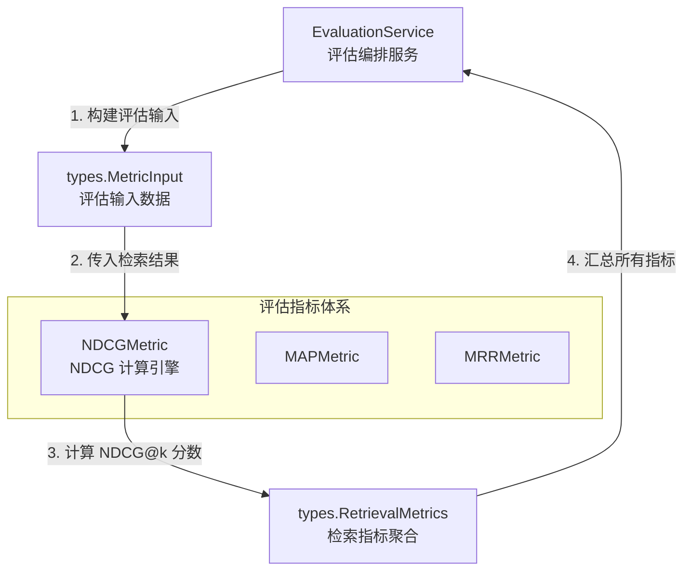

# Normalized Discounted Cumulative Gain (NDCG) 评估模块

## 模块概述

想象你正在评估一个搜索引擎的表现：用户搜索"Python 教程"，系统返回了 10 个结果。如何判断这个排序好不好？如果最相关的结果排在第 10 位，而前 9 位都是低质量内容，这显然比把最相关结果排在第 1 位要差。**NDCG（Normalized Discounted Cumulative Gain，归一化折损累计增益）** 正是为了解决这个问题而设计的——它不仅关心"找没找到"，更关心"排得对不对"。

本模块实现了 NDCG 指标的计算逻辑，用于评估检索系统的排序质量。与简单的精确率（Precision）或召回率（Recall）不同，NDCG 有两个关键特性：

1. **位置敏感性**：排在越前面的相关文档贡献越大，排在后面的相关文档会被"折损"
2. **归一化**：通过与理想排序对比，将分数映射到 [0, 1] 区间，使得不同查询之间的结果可比

在 WeKnora 的评估体系中，NDCG 与 [MAP](mean_average_precision_metric.md)、[MRR](mean_reciprocal_rank_metric.md) 一起构成"排序质量位置敏感指标"三剑客，共同评估检索引擎的表现。

---

## 架构与数据流

### 组件关系图



### 数据流 walkthrough

评估流程中，数据按以下路径流动：

1. **评估服务发起**：[EvaluationService](../../application_services_and_orchestration/evaluation_dataset_and_metric_services/evaluation_orchestration_and_state/evaluation_service.md) 准备评估任务时，构建 `MetricInput` 结构体，其中 `RetrievalGT` 包含每个查询的相关文档 ID 列表（ground truth），`RetrievalIDs` 包含检索系统实际返回的文档 ID 序列

2. **指标计算**：`NDCGMetric.Compute()` 接收 `MetricInput`，执行三步计算：
   - 构建相关文档集合（从 `RetrievalGT` 提取）
   - 计算实际排序的 DCG（Discounted Cumulative Gain）
   - 计算理想排序的 IDCG（Ideal DCG）
   - 返回 NDCG = DCG / IDCG

3. **结果聚合**：计算得到的 NDCG 分数（通常计算 NDCG@3 和 NDCG@10 两个截断点）被填入 `RetrievalMetrics` 结构体，与 Precision、Recall、MRR、MAP 一起形成完整的检索质量画像

4. **评估报告**：[EvaluationService](../../application_services_and_orchestration/evaluation_dataset_and_metric_services/evaluation_orchestration_and_state/evaluation_service.md) 将聚合后的指标持久化或返回给调用方

---

## 核心组件深度解析

### NDCGMetric 结构体

```go
type NDCGMetric struct {
    k int // Top k results to consider
}
```

**设计意图**：这是一个典型的"策略模式"实现——将 NDCG 算法封装为独立的可插拔组件。`k` 参数决定了评估的"视野范围"：NDCG@3 关注前 3 个结果的质量（适合移动端等展示空间有限的场景），NDCG@10 则评估更完整的检索表现。

**为什么用结构体而不是函数？** 虽然当前实现中 `NDCGMetric` 没有内部状态，但使用结构体有以下好处：
- 与 [MAPMetric](mean_average_precision_metric.md)、[MRRMetric](mean_reciprocal_rank_metric.md) 保持一致的接口风格
- 为未来扩展预留空间（例如缓存中间计算结果、支持不同的折损函数）
- 便于依赖注入和单元测试

---

### NewNDCGMetric 构造函数

```go
func NewNDCGMetric(k int) *NDCGMetric
```

**参数说明**：
- `k`：截断位置，即只考虑前 k 个检索结果。常见取值为 3、5、10

**返回值**：指向 `NDCGMetric` 实例的指针

**使用示例**：
```go
// 评估前 3 个结果的排序质量
ndcg3 := metric.NewNDCGMetric(3)

// 评估前 10 个结果的排序质量
ndcg10 := metric.NewNDCGMetric(10)
```

---

### Compute 方法

```go
func (n *NDCGMetric) Compute(metricInput *types.MetricInput) float64
```

这是模块的核心逻辑，让我们逐步拆解其内部机制。

#### 输入数据契约

`MetricInput` 包含两个关键字段：
- `RetrievalGT [][]int`：每个查询的相关文档 ID 列表。这是一个二维数组，支持多查询批量评估。例如 `[[1, 5, 8], [3, 7]]` 表示第一个查询有 3 个相关文档（ID 为 1、5、8），第二个查询有 2 个相关文档
- `RetrievalIDs []int`：检索系统实际返回的文档 ID 序列，按排序顺序排列

#### 计算步骤详解

**第一步：限制评估范围**
```go
if len(ids) > n.k {
    ids = ids[:n.k]
}
```
只保留前 k 个结果。这是一个"硬截断"——第 k+1 位及之后的结果完全不计入评估，即使它们是相关的。

**第二步：构建相关文档集合**
```go
gtSets := make(map[int]struct{}, len(gts))
countGt := 0
for _, gt := range gts {
    countGt += len(gt)
    for _, g := range gt {
        gtSets[g] = struct{}{}
    }
}
```
这里做了两件事：
1. 将 `RetrievalGT` 展平为 `map[int]struct{}`，便于 O(1) 时间复杂度判断某个文档是否相关
2. 统计总的相关文档数量 `countGt`，用于后续构建理想排序

**设计细节**：使用 `map[int]struct{}` 而非 `map[int]bool` 是 Go 的惯用模式——`struct{}` 占用 0 字节，节省内存。

**第三步：分配相关性分数**
```go
relevanceScores := make(map[int]int)
for _, docID := range ids {
    if _, exist := gtSets[docID]; exist {
        relevanceScores[docID] = 1
    } else {
        relevanceScores[docID] = 0
    }
}
```
当前实现采用**二元相关性**：相关=1，不相关=0。这是 NDCG 的简化版本。更复杂的场景可能使用多级相关性（例如 0=不相关，1=部分相关，2=高度相关），此时公式中的分子会变为 `2^rel - 1` 以放大高相关性文档的贡献。

**第四步：计算 DCG（折损累计增益）**
```go
var dcg float64
for i, docID := range ids {
    dcg += (math.Pow(2, float64(relevanceScores[docID])) - 1) / math.Log2(float64(i+2))
}
```
公式解析：
- 分子 `2^rel - 1`：当 `rel=1` 时结果为 1，当 `rel=0` 时结果为 0。这个指数形式在多级相关性场景下能拉开差距
- 分母 `log2(i+2)`：折损因子。注意是 `i+2` 而非 `i+1`，这是因为排名从 1 开始计数（第 1 个结果对应 `i=0`，分母为 `log2(2)=1`）
- 位置越靠后，分母越大，贡献越小——这就是"折损"的含义

**第五步：构建理想排序并计算 IDCG**
```go
idealLen := min(countGt, len(ids))
idealPred := make([]int, len(ids))
for i := 0; i < len(ids); i++ {
    if i < idealLen {
        idealPred[i] = 1
    } else {
        idealPred[i] = 0
    }
}

var idcg float64
for i, relevance := range idealPred {
    idcg += float64(relevance) / math.Log2(float64(i+2))
}
```
理想排序的定义：所有相关文档都排在前面，不相关文档都排在后面。`IDCG` 是这个理想情况下的 DCG 值，作为归一化的分母。

**关键细节**：`idealLen` 取 `min(countGt, len(ids))` 是因为：
- 如果相关文档总数超过 k，理想情况下前 k 个都应该是相关的
- 如果相关文档总数少于 k，理想情况下只有前 `countGt` 个是相关的，后面都是不相关的

**第六步：归一化与边界处理**
```go
if idcg == 0 {
    return 0
}
return dcg / idcg
```
当 `IDCG=0` 时（即没有任何相关文档），返回 0 而非 NaN。这是一个实用的设计决策——避免评估流程因除零错误而中断，同时 0 分也合理反映了"没有相关文档可检索"的情况。

---

## 依赖分析

### 上游依赖（谁调用它）

| 调用方 | 调用场景 | 期望行为 |
|--------|----------|----------|
| [EvaluationService](../../application_services_and_orchestration/evaluation_dataset_and_metric_services/evaluation_orchestration_and_state/evaluation_service.md) | 执行评估任务时计算检索质量指标 | 接收 `MetricInput`，返回 0-1 之间的浮点数 |
| 评估指标聚合逻辑 | 填充 `RetrievalMetrics` 结构体 | 分别计算 NDCG@3 和 NDCG@10 |

### 下游依赖（它调用谁）

| 被调用方 | 用途 | 耦合程度 |
|----------|------|----------|
| `internal/types.MetricInput` | 输入数据结构 | 强耦合——字段变更会直接影响本模块 |
| `math.Pow` / `math.Log2` | 数学计算 | 无耦合——标准库函数 |

### 数据契约

**输入契约**：
```go
type MetricInput struct {
    RetrievalGT  [][]int  // 必须：每个查询的相关文档 ID 列表
    RetrievalIDs []int    // 必须：检索返回的文档 ID 序列（按排序顺序）
    GeneratedTexts string // 忽略：用于生成质量评估
    GeneratedGT    string // 忽略：用于生成质量评估
}
```

**输出契约**：
- 返回值范围：[0, 1]
- 返回值含义：1=完美排序（所有相关文档都在最前面），0=最差排序（没有任何相关文档在前 k 位）
- 边界情况：当没有相关文档时返回 0（而非 NaN 或 panic）

---

## 设计决策与权衡

### 1. 二元相关性 vs 多级相关性

**当前选择**：二元相关性（相关=1，不相关=0）

**替代方案**：多级相关性（例如 0-4 分）

**权衡分析**：
- 二元相关的优势：实现简单，标注成本低（只需判断"是否相关"）
- 多级相关的优势：能区分"部分相关"和"高度相关"，更精细地评估排序质量
- 为什么选择二元：在 WeKnora 的检索场景中，文档相关性通常是二元的——要么能回答用户问题，要么不能。引入多级相关性会增加标注复杂度，但收益有限

**扩展点**：如果需要支持多级相关性，只需修改 `relevanceScores` 的赋值逻辑，DCG 公式中的 `2^rel - 1` 已经为多级相关性预留了空间。

### 2. 硬截断 vs 软折损

**当前选择**：硬截断——第 k+1 位及之后的结果完全不计入

**替代方案**：软折损——所有结果都计入，但位置越靠后折损越大

**权衡分析**：
- 硬截断的优势：计算效率高，符合实际使用场景（用户通常只关注前几页）
- 软折损的优势：能反映长尾结果的质量
- 为什么选择硬截断：NDCG@k 的标准定义就是截断的，且评估场景通常关注头部结果质量

### 3. 结构体封装 vs 纯函数

**当前选择**：使用 `NDCGMetric` 结构体封装 `k` 参数

**替代方案**：`ComputeNDCG(k int, metricInput *types.MetricInput) float64`

**权衡分析**：
- 结构体的优势：与同包其他指标（MAP、MRR）保持一致的接口风格，便于统一管理和扩展
- 纯函数的优势：更简洁，无状态
- 为什么选择结构体：为未来可能的扩展预留空间（例如缓存、配置不同的折损函数），同时保持 API 一致性

### 4. 除零处理策略

**当前选择**：当 `IDCG=0` 时返回 0

**替代方案**：返回 NaN、返回 1、panic

**权衡分析**：
- 返回 0 的优势：语义合理（没有相关文档=最差情况），不会中断评估流程
- 返回 NaN 的优势：明确表示"无法计算"
- 为什么选择返回 0：评估系统需要鲁棒性，返回 0 既能反映实际情况，又不会导致评估任务失败

---

## 使用指南

### 基本用法

```go
package main

import (
    "github.com/Tencent/WeKnora/internal/application/service/metric"
    "github.com/Tencent/WeKnora/internal/types"
)

func main() {
    // 创建 NDCG@10 评估器
    ndcg10 := metric.NewNDCGMetric(10)
    
    // 准备评估数据
    input := &types.MetricInput{
        // 相关文档 ID：查询 1 有 3 个相关文档（ID 为 1、5、8）
        RetrievalGT: [][]int{{1, 5, 8}},
        // 检索返回的文档 ID 序列（按排序顺序）
        RetrievalIDs: []int{1, 3, 5, 7, 8, 10, 12, 14, 16, 18},
    }
    
    // 计算 NDCG 分数
    score := ndcg10.Compute(input)
    // score ≈ 0.78（取决于具体计算）
}
```

### 典型评估场景

在 [EvaluationService](../../application_services_and_orchestration/evaluation_dataset_and_metric_services/evaluation_orchestration_and_state/evaluation_service.md) 中，通常会同时计算多个截断点的 NDCG：

```go
func evaluateRetrieval(input *types.MetricInput) *types.RetrievalMetrics {
    ndcg3 := metric.NewNDCGMetric(3)
    ndcg10 := metric.NewNDCGMetric(10)
    
    return &types.RetrievalMetrics{
        NDCG3:  ndcg3.Compute(input),
        NDCG10: ndcg10.Compute(input),
        // 同时计算其他指标...
    }
}
```

### 配置建议

| 场景 | 推荐 k 值 | 理由 |
|------|----------|------|
| 移动端搜索 | 3-5 | 屏幕空间有限，用户通常只看前几个结果 |
| 桌面端搜索 | 10 | 标准评估截断点，平衡全面性和计算成本 |
| 深度检索分析 | 20-50 | 评估长尾结果质量，但计算成本较高 |

---

## 边界情况与注意事项

### 1. 空检索结果

当 `RetrievalIDs` 为空时：
- DCG = 0（没有结果可计算）
- IDCG = 0（理想情况下也没有结果）
- 返回 0（触发除零保护）

**行为合理**：没有返回任何结果，评估为最差情况。

### 2. 没有相关文档

当 `RetrievalGT` 为空或所有子数组为空时：
- `gtSets` 为空
- 所有 `relevanceScores` 为 0
- DCG = 0，IDCG = 0
- 返回 0

**行为合理**：没有相关文档可检索，评估为最差情况。

### 3. 检索结果少于 k

当 `len(RetrievalIDs) < k` 时：
- 不会 panic，直接使用所有可用结果
- 理想排序的长度也会相应调整

**示例**：
```go
ndcg10 := metric.NewNDCGMetric(10)
input := &types.MetricInput{
    RetrievalGT:  [][]int{{1, 2}},
    RetrievalIDs: []int{1, 2, 3}, // 只有 3 个结果
}
// 正常计算，不会报错
```

### 4. 重复文档 ID

当前实现**不处理** `RetrievalIDs` 中的重复 ID。如果检索系统返回重复结果：
- 重复的 ID 会被多次计入 DCG
- 可能导致分数虚高

**建议**：在调用 `Compute` 之前，确保 `RetrievalIDs` 已去重。

### 5. 多查询评估

`RetrievalGT` 是二维数组，支持多查询批量评估。但当前实现将所有查询的相关文档合并为一个集合：

```go
for _, gt := range gts {
    for _, g := range gt {
        gtSets[g] = struct{}{}
    }
}
```

**注意**：这意味着它计算的是"整体 NDCG"，而非"每个查询的 NDCG 然后取平均"。如果需要后者，需要在外层循环逐个查询调用 `Compute`。

---

## 性能考虑

### 时间复杂度

- 构建 `gtSets`：O(G)，G 为相关文档总数
- 分配 `relevanceScores`：O(k)，k 为截断位置
- 计算 DCG：O(k)
- 计算 IDCG：O(k)
- **总体**：O(G + k)

### 空间复杂度

- `gtSets`：O(G)
- `relevanceScores`：O(k)
- `idealPred`：O(k)
- **总体**：O(G + k)

### 优化建议

对于高频评估场景（例如在线 A/B 测试）：
1. **预计算 IDCG**：如果 `k` 和相关文档数量固定，IDCG 可以预先计算并缓存
2. **并行计算**：多查询评估时，可以并行计算每个查询的 NDCG
3. **避免重复分配**：在循环评估时，复用 `gtSets` 和 `relevanceScores` 的内存

---

## 相关模块

- [MAP 指标](mean_average_precision_metric.md)：另一种排序质量指标，关注平均精确率
- [MRR 指标](mean_reciprocal_rank_metric.md)：关注第一个相关文档的排名
- [EvaluationService](../../application_services_and_orchestration/evaluation_dataset_and_metric_services/evaluation_orchestration_and_state/evaluation_service.md)：评估编排服务，调用 NDCG 进行指标计算
- [RetrievalMetrics](../../core_domain_types_and_interfaces/evaluation_dataset_and_metric_contracts/metric_models_and_extension_hooks/retrieval_metric_models.md)：检索指标聚合结构体，存储 NDCG 计算结果

---

## 参考资料

- Jarvelin, K., & Kekäläinen, J. (2002). "Cumulated gain-based evaluation of IR techniques". ACM Transactions on Information Systems.
- Wikipedia: [Discounted Cumulative Gain](https://en.wikipedia.org/wiki/Discounted_cumulative_gain)
