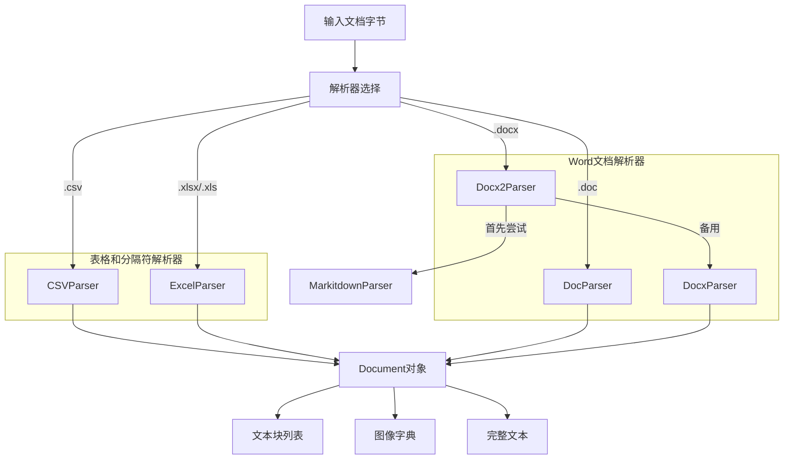

# Office and Structured Document Parsers

## 概述

`office_and_structured_document_parsers` 模块是文档处理管道中的核心组件，专门负责解析常见的办公文档格式和结构化文档。它将各种格式的文档（CSV、Excel、DOC、DOCX）转换为统一的文本表示，并支持图像提取和分块处理。

### 为什么这个模块存在？

在知识管理和文档检索系统中，我们面临的一个核心挑战是：**不同的文档格式需要不同的解析策略，但最终都需要转换为统一的文本形式以供检索和处理**。

想象一下，一个用户上传了一个包含销售数据的 Excel 文件、一个包含产品文档的 Word 文件，以及一个包含客户记录的 CSV 文件。系统需要将这些格式各异的文档转换为：
1. 纯文本内容（用于全文检索）
2. 结构化的块（用于语义搜索）
3. 图像链接（用于多模态理解）

这个模块就是解决这个问题的"格式适配器"——它封装了每种文档格式的复杂性，对外提供统一的接口。

## 架构概览



### 核心组件职责

1. **CSVParser**：处理逗号分隔值文件，将每一行转换为"列名: 值"格式的键值对
2. **ExcelParser**：处理 Excel 工作簿，支持多个工作表，跳过空行
3. **DocParser**：处理旧版 Word 文档（.doc），采用多重回退策略
4. **DocxParser**：处理新版 Word 文档（.docx），支持多线程处理和图像提取
5. **Docx2Parser**：组合解析器，先尝试 MarkitdownParser，失败时回退到 DocxParser

### 数据流

以一个典型的 DOCX 文件解析为例：
1. 输入：原始字节流
2. Docx2Parser 首先尝试用 MarkitdownParser 解析
3. 如果失败，回退到 DocxParser
4. DocxParser 加载文档，识别页面结构
5. 使用多进程并行处理每页内容
6. 提取文本和图像，保持原始顺序
7. 输出：包含完整文本、分块和图像的 Document 对象

## 设计决策

### 1. 分层解析策略

**决策**：对于复杂格式（如 DOC），采用多重回退的解析策略。

**原因**：
- 旧版二进制格式没有统一的解析库
- 不同的工具有不同的优缺点（LibreOffice 转换质量高但慢，antiword 快但功能有限）
- 需要在质量和可靠性之间找到平衡

**权衡**：
- ✅ 优点：提高了解析成功率，适应不同环境
- ❌ 缺点：代码复杂度增加，最坏情况下需要尝试多个方法

### 2. 多进程并行处理 DOCX

**决策**：对于 DOCX 文件，使用多进程而不是多线程进行页面级并行处理。

**原因**：
- Python 的 GIL（全局解释器锁）限制了 CPU 密集型任务的线程并行效率
- 文档解析是 CPU 密集型工作
- 每个页面的处理相对独立，适合并行化

**权衡**：
- ✅ 优点：真正利用多核 CPU，处理大文档时速度提升显著
- ❌ 缺点：进程间通信开销增加，需要额外的临时文件管理

### 3. 统一的 Document 输出格式

**决策**：所有解析器都返回相同的 Document 对象结构。

**原因**：
- 下游处理模块不需要关心输入格式
- 便于在管道中组合不同的解析器
- 简化测试和维护

**权衡**：
- ✅ 优点：接口统一，易于使用和扩展
- ❌ 缺点：某些格式特有的信息可能无法完全表示

## 子模块概览

### [tabular_spreadsheet_and_delimited_parsers](docreader_pipeline-format_specific_parsers-office_and_structured_document_parsers-tabular_spreadsheet_and_delimited_parsers.md)

负责处理表格类文档，包括 CSV 和 Excel 格式。将表格数据转换为结构化的键值对文本，每个行作为一个独立的块。

### [word_processing_openxml_parsers](docreader_pipeline-format_specific_parsers-office_and_structured_document_parsers-word_processing_openxml_parsers.md)

处理现代 Word 文档格式（DOCX），支持高级特性如多线程处理、图像提取和页面边界识别。

### [word_processing_legacy_binary_parser](docreader_pipeline-format_specific_parsers-office_and_structured_document_parsers-word_processing_legacy_binary_parser.md)

处理旧版 Word 文档（DOC），通过多重回退策略（LibreOffice 转换 → antiword → textract）确保最大兼容性。

## 跨模块依赖

### 输入依赖
- **[parser_base_abstractions](docreader_pipeline-parser_framework_and_orchestration-parser_base_abstractions.md)**：提供 BaseParser 基类，定义了解析器的统一接口
- **[document_data_models](docreader_pipeline-document_models_and_chunking_support-document_data_models.md)**：定义 Document 和 Chunk 数据结构

### 输出流向
- **[parser_pipeline_orchestration](docreader_pipeline-parser_framework_and_orchestration-parser_pipeline_orchestration.md)**：使用这些解析器构建完整的文档处理管道
- **[document_models_and_chunking_support](docreader_pipeline-document_models_and_chunking_support.md)**：进一步处理解析后的文档，进行分块和元数据提取

## 常见使用模式

### 基本用法

```python
from docreader.parser.csv_parser import CSVParser
from docreader.parser.excel_parser import ExcelParser
from docreader.parser.docx_parser import DocxParser

# 解析 CSV
csv_parser = CSVParser()
with open("data.csv", "rb") as f:
    doc = csv_parser.parse_into_text(f.read())

# 解析 Excel  
excel_parser = ExcelParser()
with open("data.xlsx", "rb") as f:
    doc = excel_parser.parse_into_text(f.read())

# 解析 DOCX（带多模态支持）
docx_parser = DocxParser(enable_multimodal=True, max_pages=50)
with open("document.docx", "rb") as f:
    doc = docx_parser.parse_into_text(f.read())
```

### 新贡献者注意事项

1. **DOC 解析依赖外部工具**：DocParser 需要 LibreOffice 和 antiword 等外部工具，在新环境中需要确保这些依赖已安装。

2. **多进程处理的边界**：DocxParser 的多进程处理在处理非常大的文档时可能会消耗大量内存，可以通过调整 `max_pages` 和 `max_workers` 参数来控制。

3. **图像处理的临时文件**：图像提取会创建临时文件，确保系统有足够的临时存储空间，且 `/tmp` 目录可写。

4. **错误回退策略**：许多解析器都有备用方法，当主要方法失败时会尝试备用方法。调试时注意日志中的 "Failed to parse with..." 信息。

5. **pandas 版本兼容性**：CSVParser 和 ExcelParser 依赖 pandas，注意 pandas 版本更新可能导致的 API 变化，特别是 `read_csv` 和 `ExcelFile.parse` 的参数。
