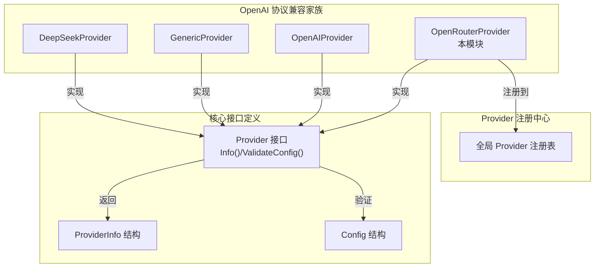

# OpenRouter OpenAI 兼容提供者模块深度解析

## 1. 为什么需要这个模块？

在多模型生态系统中，OpenRouter 作为一个模型聚合平台，为用户提供了访问数百种不同模型的统一接口。这为开发者带来了巨大的灵活性，但同时也引入了新的复杂性：如何在保持代码简洁的同时，无缝集成这种"模型超市"模式？

这个问题的核心在于：OpenRouter 本身完全兼容 OpenAI 的 API 协议，但它又有自己独特的元数据需求、配置要求和使用场景。如果我们直接复用 OpenAI 提供者，会导致配置混乱、UI 展示不清晰，以及无法正确标识 OpenRouter 特有的模型集合。

因此，`openrouter_openai_compatible_provider` 模块应运而生。它通过一个专门的提供者实现，既利用了系统中已有的 OpenAI 协议兼容基础设施，又为 OpenRouter 提供了独立的身份标识、配置验证和元数据描述。

## 2. 核心抽象与心理模型

可以把这个模块想象成一个"**适配器标识牌**"：

- 它本身不处理复杂的 API 通信逻辑（那是底层 OpenAI 协议兼容层的工作）
- 它的主要职责是告诉系统："嘿，这是 OpenRouter，虽然它说话的方式和 OpenAI 一样，但它有自己的商店和商品目录"

这种设计遵循了**接口与实现分离**的原则：
- **身份层**：由 `OpenRouterProvider` 负责，提供唯一标识和元数据
- **协议层**：由通用的 OpenAI 兼容基础设施处理，负责实际的 API 调用
- **配置层**：通过 `Config` 结构统一管理，但提供者可以添加自己的验证规则

## 3. 架构与组件关系

让我们通过 Mermaid 图表来理解这个模块在整个系统中的位置：



### 数据流动与组件交互

1. **初始化阶段**：
   - 包加载时，`init()` 函数执行，`OpenRouterProvider` 实例通过 `Register()` 函数注册到全局注册表
   - 注册表以 `ProviderName` 为键存储所有提供者实例

2. **发现阶段**：
   - 系统通过 `List()` 或 `ListByModelType()` 获取可用提供者列表
   - 或者通过 `DetectProvider()` 函数根据 BaseURL 自动检测（包含 "openrouter.ai" 时返回 `ProviderOpenRouter`）

3. **配置阶段**：
   - 当用户配置使用 OpenRouter 时，系统获取 `OpenRouterProvider` 实例
   - 调用 `Info()` 获取元数据用于 UI 展示和默认配置
   - 调用 `ValidateConfig()` 验证配置的合法性

4. **执行阶段**：
   - 注意：`OpenRouterProvider` 本身不处理实际的 API 调用
   - 系统会使用通用的 OpenAI 协议兼容层进行通信，因为 OpenRouter 完全兼容该协议

## 4. 核心组件详解

### OpenRouterProvider 结构

这是模块的核心组件，一个无状态的结构体，实现了 `Provider` 接口。

```go
type OpenRouterProvider struct{}
```

**设计意图**：
- 无状态设计意味着这个结构不需要保存任何实例数据
- 所有的状态都存储在 `Config` 结构中，提供者只是行为的集合
- 这种设计使得提供者可以安全地在多个 goroutine 中共享使用

### Info() 方法

```go
func (p *OpenRouterProvider) Info() ProviderInfo {
    return ProviderInfo{
        Name:        ProviderOpenRouter,
        DisplayName: "OpenRouter",
        Description: "openai/gpt-5.2-chat, google/gemini-3-flash-preview, etc.",
        DefaultURLs: map[types.ModelType]string{
            types.ModelTypeKnowledgeQA: OpenRouterBaseURL,
            types.ModelTypeVLLM:        OpenRouterBaseURL,
        },
        ModelTypes: []types.ModelType{
            types.ModelTypeKnowledgeQA,
            types.ModelTypeVLLM,
        },
        RequiresAuth: true,
    }
}
```

**关键设计点**：
1. **模型类型选择**：只包含 `KnowledgeQA` 和 `VLLM`，这反映了 OpenRouter 主要用于聊天和视觉语言模型的使用场景
2. **描述信息**：特意列举了 OpenRouter 特有的模型命名格式（`供应商/模型名`），这与 OpenAI 原生的简单命名方式形成对比
3. **默认 URL**：统一使用 `https://openrouter.ai/api/v1`，这是 OpenRouter 的标准 API 端点
4. **认证要求**：设置 `RequiresAuth: true`，因为 OpenRouter 始终需要 API 密钥

### ValidateConfig() 方法

```go
func (p *OpenRouterProvider) ValidateConfig(config *Config) error {
    if config.APIKey == "" {
        return fmt.Errorf("API key is required for OpenRouter provider")
    }
    return nil
}
```

**与 OpenAIProvider 的对比**：
- OpenRouter 只验证 API 密钥的存在
- OpenAI 还额外验证模型名称（`ModelName`）
- **原因分析**：OpenRouter 有更灵活的模型选择机制，模型名称可能在运行时动态确定，或者通过其他方式指定，因此不在这里强制验证

### 自动注册机制

```go
func init() {
    Register(&OpenRouterProvider{})
}
```

这种模式在 Go 中很常见，利用包的初始化机制自动注册组件。优点是：
- 使用方无需显式初始化
- 添加新提供者只需创建文件并实现接口，无需修改其他代码
- 符合"开闭原则"（对扩展开放，对修改关闭）

## 5. 设计决策与权衡

### 决策 1：独立提供者 vs 复用 OpenAI 提供者

**选择**：创建独立的 `OpenRouterProvider`，而不是在 `OpenAIProvider` 中添加分支逻辑

**理由**：
- **清晰的身份分离**：OpenRouter 是一个独立的服务，有自己的品牌、定价和模型生态
- **配置差异**：虽然协议兼容，但使用场景、模型命名格式和 UI 展示需求不同
- **未来扩展**：如果 OpenRouter 将来添加协议扩展或特殊功能，有一个独立的提供者会更容易支持

**权衡**：
- 优点：职责清晰，易于独立演化
- 缺点：轻微的代码重复（主要是 Info() 方法的结构）

### 决策 2：不实现自定义的 API 调用逻辑

**选择**：仅实现元数据和配置验证，依赖通用的 OpenAI 协议兼容层处理通信

**理由**：
- **协议兼容性**：OpenRouter 完全兼容 OpenAI API，无需自定义逻辑
- **保持简洁**：这个模块的职责就是"标识"和"配置"，不是"执行"
- **复用投资**：系统中已经有完善的 OpenAI 协议处理代码，无需重复造轮子

**权衡**：
- 优点：代码简洁，维护成本低
- 缺点：如果 OpenRouter 有特殊的协议扩展，需要在更底层进行修改

### 决策 3：有限的模型类型支持

**选择**：只支持 `KnowledgeQA` 和 `VLLM`，不支持 `Embedding` 和 `Rerank`

**理由**：
- **主要使用场景**：OpenRouter 主要用于聊天和多模态模型，不是 embeddings 的首选
- **配置简化**：减少不必要的选项，降低用户配置的复杂性
- **与其他提供者互补**：用户可以使用专门的提供者（如 OpenAI、Jina）处理 embeddings

**权衡**：
- 优点：聚焦核心场景，配置界面简洁
- 缺点：限制了 OpenRouter 在某些场景下的使用（尽管这些场景可能不常见）

### 决策 4：最小化的配置验证

**选择**：只验证 API 密钥，不验证模型名称或其他参数

**理由**：
- **灵活性**：OpenRouter 支持大量模型，模型名称格式多样，验证起来困难
- **运行时检查**：错误的模型名称会在 API 调用时由 OpenRouter 直接返回错误，不必提前验证
- **避免过时**：模型列表频繁变化，硬编码验证规则会很快过时

**权衡**：
- 优点：配置灵活，适应 OpenRouter 快速变化的模型生态
- 缺点：配置错误可能要到实际调用时才会发现

## 6. 使用场景与示例

### 基本配置示例

```go
// 创建 OpenRouter 配置
config := &provider.Config{
    Provider:  provider.ProviderOpenRouter,
    BaseURL:   provider.OpenRouterBaseURL,
    APIKey:    "sk-or-v1-...", // OpenRouter API 密钥
    ModelName: "openai/gpt-5.2-chat", // 注意 OpenRouter 的模型命名格式
    ModelID:   "openrouter-model-123",
}

// 获取提供者并验证配置
p, _ := provider.Get(provider.ProviderOpenRouter)
if err := p.ValidateConfig(config); err != nil {
    log.Fatalf("配置验证失败: %v", err)
}
```

### 自动检测场景

```go
// 只有 URL，不知道具体提供者
baseURL := "https://openrouter.ai/api/v1"

// 自动检测提供者类型
detectedProvider := provider.DetectProvider(baseURL)
fmt.Printf("检测到的提供者: %s\n", detectedProvider) 
// 输出: 检测到的提供者: openrouter
```

### 通过注册表列出所有支持 OpenRouter 的模型类型

```go
// 获取 OpenRouter 提供者信息
p, _ := provider.Get(provider.ProviderOpenRouter)
info := p.Info()

fmt.Printf("OpenRouter 支持的模型类型:\n")
for _, modelType := range info.ModelTypes {
    fmt.Printf("- %s\n", modelType)
}
```

## 7. 注意事项与常见陷阱

### 模型命名格式

OpenRouter 使用独特的模型命名格式：`供应商/模型名`，例如 `openai/gpt-5.2-chat`、`google/gemini-3-flash-preview`。

**常见陷阱**：直接使用 OpenAI 风格的简单名称（如 `gpt-5.2-chat`）会导致 API 调用失败。

### API 密钥格式

OpenRouter API 密钥通常以 `sk-or-v1-` 开头，与 OpenAI 的 `sk-` 前缀不同。虽然提供者不验证密钥格式，但使用错误的密钥类型会导致认证失败。

### BaseURL 必须完整

确保配置的 BaseURL 包含完整的路径（`/api/v1`），只写域名是不够的。

**正确**：`https://openrouter.ai/api/v1`

**错误**：`https://openrouter.ai`

### 与 OpenAI 提供者的功能差异

虽然协议兼容，但 OpenRouter 可能不支持 OpenAI 的所有最新功能，或者可能有不同的参数限制。在使用高级功能时，建议查阅 OpenRouter 的官方文档。

### 不支持的模型类型

如果尝试将 OpenRouter 用于 Embeddings 或 Rerank 任务，虽然代码不会报错（因为提供者注册机制允许这种组合），但可能会遇到运行时错误或不期望的行为。

## 8. 与其他模块的关系

### 依赖的模块

- 核心 Provider 接口定义在同一个包中
- 使用 `types.ModelType` 定义支持的模型类型

### 相似模块

- `OpenAIProvider`：OpenAI 官方平台的提供者
- `GenericProvider`：通用 OpenAI 协议兼容提供者

## 9. 总结

`openrouter_openai_compatible_provider` 模块是一个看似简单但设计精妙的组件。它的价值不在于复杂的逻辑，而在于清晰的职责划分和对"身份与协议分离"原则的贯彻。

通过创建一个专门的提供者，系统能够：
1. 为用户提供清晰的 OpenRouter 品牌体验
2. 维护正确的元数据和配置验证
3. 为将来可能的 OpenRouter 特定功能预留扩展点
4. 同时充分利用现有的 OpenAI 协议兼容基础设施

这种设计展示了如何在保持代码复用的同时，为不同的服务提供独立的身份和配置空间——这是构建灵活、可扩展的多模型系统的关键设计模式之一。
