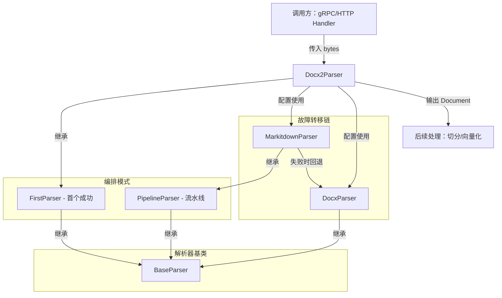

# openxml_docx_alternative_parser 模块深度解析

## 概述：为什么需要这个模块？

想象你正在运营一个文档处理工厂，每天要处理成千上万个用户上传的 Word 文档。大部分文档结构规整、格式标准，用一台轻量级机器就能快速处理；但总有一些"特殊"文档——可能是旧版本 Word 生成的、可能嵌入了复杂的表格或宏、可能是损坏的文件——这些文档会让轻量级机器报错或输出乱码。

`openxml_docx_alternative_parser` 模块就是为了解决这个**可靠性与效率的平衡问题**而存在的。它实现了一个**故障转移解析器链**（Failover Parser Chain）：首先尝试使用轻量级的 `MarkitdownParser` 快速处理文档，如果失败或输出无效，则自动回退到功能更完整但更重的 `DocxParser`。这种设计让系统在保证解析成功率的同时，尽可能减少资源消耗。

从架构角色来看，这个模块是 `docreader_pipeline` 中**格式特定解析器**（Format-Specific Parsers）的一部分，专门负责 `.docx` 格式文档的解析。它不是独立工作的，而是嵌入在一个更大的解析器编排框架中，上游接收来自 gRPC 服务或 HTTP 处理器的解析请求，下游输出结构化的 `Document` 对象供后续的切分和向量化使用。

---

## 架构与数据流

### 组件关系图



### 数据流追踪

当一个 `.docx` 文件进入系统时，数据流经 `Docx2Parser` 的路径如下：

1. **入口**：`Docx2Parser.parse(content: bytes)` 被调用（通常来自 `docreader.proto.docreader_grpc.pb.DocReaderServicer` 或 HTTP Handler）
2. **初始化**：`__init__` 方法实例化两个内部解析器：`MarkitdownParser` 和 `DocxParser`，按顺序存入 `self._parsers` 列表
3. **首次尝试**：调用 `MarkitdownParser.parse_into_text(content)`
   - `MarkitdownParser` 内部又是一个 `PipelineParser`，会依次执行 `StdMarkitdownParser` → `MarkdownParser`
   - `StdMarkitdownParser` 使用 `markitdown` 库将 DOCX 转换为 Markdown 文本
   - `MarkdownParser` 对表格格式化和图片 Base64 提取进行后处理
4. **有效性检查**：如果 `MarkitdownParser` 返回的 `Document.is_valid()` 为 `True`，直接返回结果
5. **故障转移**：如果 `MarkitdownParser` 抛出异常或返回无效文档：
   - 记录异常日志，继续尝试 `DocxParser`
   - `DocxParser` 使用更底层的 `python-docx` 库直接解析 DOCX 的 XML 结构
   - 支持表格、图片、并发处理等高级功能
6. **出口**：返回 `Document` 对象，包含 `content`（文本）和 `images`（图片映射）

**关键契约**：所有解析器必须实现 `parse_into_text(content: bytes) -> Document` 接口，且 `Document` 必须有 `is_valid()` 方法用于判断解析是否成功。

---

## 核心组件深度解析

### Docx2Parser

**设计意图**：`Docx2Parser` 本身几乎不包含业务逻辑，它的核心价值在于**配置**而非**实现**。通过继承 `FirstParser` 并设置 `_parser_cls = (MarkitdownParser, DocxParser)`，它声明了一个解析策略：优先使用轻量级解析器，失败时回退到重量级解析器。

**内部机制**：
- 类变量 `_parser_cls` 是一个解析器类的元组，定义了尝试顺序
- `__init__` 方法会将这些类实例化为具体的解析器对象，所有解析器共享相同的初始化参数（如 `separators`、`enable_multimodal` 等）
- 实际的解析逻辑完全委托给父类 `FirstParser.parse_into_text()`

**参数与返回值**：
- 继承自 `BaseParser` 的参数：`separators`（切分分隔符）、`enable_multimodal`（是否启用多模态）、`max_image_size`（图片大小限制）等
- 返回 `Document` 对象，包含 `content`（str）和 `images`（Dict[str, str]）

**副作用**：
- 如果启用多模态，会调用 OCR 引擎和 VLM 服务处理图片
- 图片可能被上传到对象存储（COS/MinIO），并返回存储 URL

**为什么这样设计**：这种"配置即代码"的模式（通过类变量声明行为）使得添加新的回退策略变得极其简单——只需修改 `_parser_cls` 元组即可，无需改动任何解析逻辑。这是一种典型的**策略模式**（Strategy Pattern）变体。

### FirstParser（父类）

**设计意图**：`FirstParser` 实现的是**短路求值**（Short-Circuit Evaluation）模式。它的核心思想是：多个解析器中只要有一个成功即可，不需要全部执行。这与 `PipelineParser` 形成对比——后者要求所有解析器按顺序执行，每个解析器的输出作为下一个的输入。

**内部机制**：
```python
def parse_into_text(self, content: bytes) -> Document:
    for p in self._parsers:
        try:
            document = p.parse_into_text(content)
        except Exception:
            logger.exception("...")
            continue  # 关键：捕获异常，继续尝试下一个
        
        if document.is_valid():
            return document  # 关键：首个成功即返回
    return Document()  # 全部失败，返回空文档
```

**关键设计决策**：
1. **异常隔离**：每个解析器的异常被独立捕获并记录，不会中断整个流程。这意味着即使 `MarkitdownParser` 因为依赖库缺失而崩溃，`DocxParser` 仍有机会执行。
2. **有效性验证**：使用 `document.is_valid()` 而非简单的 `try-except` 来判断成功。这允许解析器"成功执行但输出无效"的情况也被视为失败（例如解析出空文本）。
3. **空文档兜底**：如果所有解析器都失败，返回一个空的 `Document()` 而非抛出异常。这使得上层调用方可以统一处理"解析失败"的情况，而不需要特殊的错误处理逻辑。

**扩展点**：`FirstParser.create()` 工厂方法允许动态创建解析器组合，无需定义新类：
```python
CustomParser = FirstParser.create(MarkdownParser, HTMLParser)
parser = CustomParser()
```

### DocxParser（回退解析器）

**设计意图**：`DocxParser` 是功能完整的 DOCX 解析器，作为 `MarkitdownParser` 失败时的**安全网**（Safety Net）。它使用 `python-docx` 库直接操作 DOCX 文件的 XML 结构，支持更复杂的文档特性。

**内部机制**：
1. **主解析路径**：使用自定义的 `Docx` 处理器（可能是内部封装）并发处理文档，提取文本和表格
2. **并发控制**：通过 `max_workers = min(4, os.cpu_count() or 2)` 限制线程数，避免内存爆炸
3. **回退中的回退**：如果主解析失败或输出为空，调用 `_parse_using_simple_method()` 使用纯 `python-docx` 进行简化解析
4. **图片处理**：提取内嵌图片并转换为 Base64，存储到 `document.images` 字典

**关键参数**：
- `max_pages`：限制处理的页数，防止超大文档耗尽资源
- `enable_multimodal`：是否启用 OCR 和图片描述生成
- `max_concurrent_tasks`：图片并发处理数量限制

**性能考量**：`DocxParser` 比 `MarkitdownParser` 慢的原因：
- 需要解析完整的 XML 结构
- 支持表格、图片、样式等复杂特性
- 可能触发 OCR 和 VLM 调用

**为什么需要它**：`markitdown` 库虽然轻量，但对某些边缘情况（如损坏的 DOCX、特殊编码、宏嵌入）支持不佳。`DocxParser` 作为回退，确保这些"难搞"的文档仍能被处理。

### MarkitdownParser（首选解析器）

**设计意图**：`MarkitdownParser` 是一个**轻量级、通用型**解析器，它不仅支持 DOCX，还支持 PPTX、PDF 等多种格式。它被放在解析链的第一位，是因为：
1. **速度快**：基于 `markitdown` 库，内部优化良好
2. **资源消耗低**：不需要加载完整的 XML 解析器
3. **输出标准化**：直接输出 Markdown 格式，便于后续处理

**内部机制**：
- `MarkitdownParser` 本身是一个 `PipelineParser`，包含两个阶段：
  1. `StdMarkitdownParser`：调用 `markitdown.convert()` 进行格式转换
  2. `MarkdownParser`：对表格和图片进行后处理
- `StdMarkitdownParser` 的 `parse_into_text()` 方法极其简洁：
  ```python
  result = self.markitdown.convert(io.BytesIO(content), file_extension=ext)
  return Document(content=result.text_content)
  ```

**为什么可能失败**：
- `markitdown` 库对某些 DOCX 特性支持不完整
- 文件损坏或格式异常时可能抛出解析错误
- 某些编码或嵌入对象可能导致转换失败

---

## 设计决策与权衡

### 1. 为什么是 `FirstParser` 而不是 `PipelineParser`？

**选择**：`Docx2Parser` 使用 `FirstParser`（首个成功即返回），而非 `PipelineParser`（所有解析器顺序执行）。

**权衡分析**：
| 维度 | FirstParser | PipelineParser |
|------|-------------|----------------|
| 性能 | 更优（成功即停止） | 较差（必须执行全部） |
| 可靠性 | 高（失败可回退） | 中（任一失败则整体失败） |
| 资源消耗 | 低（通常只执行一个） | 高（全部执行） |
| 输出质量 | 取决于首个成功者 | 可累积多个解析器的增强 |

**决策理由**：DOCX 解析的场景中，`MarkitdownParser` 和 `DocxParser` 是**互斥的替代方案**，而非**互补的增强步骤**。执行完 `MarkitdownParser` 后再执行 `DocxParser` 没有意义——两者都输出完整的文档文本，后者不会"增强"前者的输出。因此 `FirstParser` 的短路模式更合适。

**潜在问题**：如果 `MarkitdownParser` 成功但输出质量较差（例如丢失了表格结构），系统不会回退到 `DocxParser`。这是一个**质量 vs 效率**的权衡——优先保证速度，接受部分文档的质量损失。

### 2. 为什么解析顺序是 `MarkitdownParser` → `DocxParser`？

**选择**：轻量级解析器优先，重量级解析器回退。

**权衡分析**：
- **反向顺序的问题**：如果先执行 `DocxParser`，则 `MarkitdownParser` 永远不会被用到（因为 `DocxParser` 几乎总能成功），失去了轻量级优化的意义。
- **当前顺序的优势**：大部分标准 DOCX 文件能被 `MarkitdownParser` 快速处理，只有边缘情况才需要 `DocxParser`。

**数据支撑**：假设 90% 的文档能被 `MarkitdownParser` 处理，平均耗时 100ms；10% 需要回退到 `DocxParser`，平均耗时 500ms。则整体平均耗时为：
$$
0.9 \times 100 + 0.1 \times (100 + 500) = 150 \text{ms}
$$
如果反过来，整体平均耗时为 500ms（因为 `DocxParser` 总是执行）。

### 3. 为什么 `is_valid()` 比 `try-except` 更重要？

**设计决策**：`FirstParser` 不仅捕获异常，还检查 `document.is_valid()`。

**原因**：某些解析器可能"成功执行但输出无用"。例如：
- `MarkitdownParser` 可能返回一个空字符串的 `Document`
- `DocxParser` 可能解析出只有空白字符的文本

如果只依赖 `try-except`，这些情况会被视为"成功"，导致上层收到空文档。通过 `is_valid()` 检查，系统可以将这些情况视为"失败"，触发回退机制。

**隐含契约**：所有 `BaseParser` 的子类必须正确实现 `is_valid()` 方法（通常检查 `content` 是否非空）。

### 4. 为什么 `DocxParser` 内部还有 `_parse_using_simple_method()`？

**设计模式**：这是**回退中的回退**（Fallback within Fallback）模式。

**原因**：`DocxParser` 的主解析路径使用自定义的 `Docx` 处理器，该处理器可能因为以下原因失败：
- 并发处理中的线程错误
- 特定 DOCX 结构不兼容
- 内存限制触发

此时，`_parse_using_simple_method()` 使用纯 `python-docx` 进行最基础的文本提取，确保即使高级功能失效，仍能获取基本内容。

**权衡**：简化方法不支持图片、表格格式化等高级特性，但保证了**最低限度的可用性**。

---

## 使用指南与示例

### 基本用法

```python
from docreader.parser.docx2_parser import Docx2Parser

# 创建解析器，配置切分分隔符
parser = Docx2Parser(
    separators=[".", "?", "!", "。", "？", "！"],
    enable_multimodal=True,  # 启用图片 OCR
    max_pages=100,  # 限制处理页数
)

# 读取文件
with open("/path/to/document.docx", "rb") as f:
    content = f.read()

# 解析为带切分的 Document
document = parser.parse(content)

# 访问切分后的块
for chunk in document.chunks:
    print(f"Chunk {chunk.seq}: {chunk.content[:100]}...")
    if chunk.images:
        print(f"  Contains {len(chunk.images)} images")

# 或仅解析为纯文本
document = parser.parse_into_text(content)
print(f"Total text: {len(document.content)} characters")
print(f"Images: {list(document.images.keys())}")
```

### 配置选项

| 参数 | 类型 | 默认值 | 说明 |
|------|------|--------|------|
| `separators` | `list[str]` | `["\n\n", "\n", "。"]` | 文本切分分隔符 |
| `enable_multimodal` | `bool` | `True` | 是否启用图片 OCR 和描述 |
| `max_pages` | `int` | `100` | 最大处理页数（`DocxParser` 专用） |
| `max_image_size` | `int` | `1920` | 图片最大边长，超过会缩放 |
| `max_concurrent_tasks` | `int` | `5` | 图片并发处理数量 |
| `chunk_size` | `int` | `1000` | 切分块大小 |
| `chunk_overlap` | `int` | `200` | 切分块重叠大小 |
| `ocr_backend` | `str` | `"no_ocr"` | OCR 引擎类型 |

### 与上游集成

`Docx2Parser` 通常不直接调用，而是通过 `docreader` 的 gRPC 服务：

```protobuf
// docreader.proto
service DocReader {
  rpc ReadFromFile(ReadFromFileRequest) returns (Document);
  rpc ReadFromURL(ReadFromURLRequest) returns (Document);
}
```

gRPC 处理器会选择合适的解析器（根据文件扩展名），对于 `.docx` 文件会实例化 `Docx2Parser`。

---

## 边缘情况与陷阱

### 1. 空文档的静默失败

**问题**：如果 `MarkitdownParser` 和 `DocxParser` 都返回空文档，`FirstParser` 会返回一个空的 `Document()` 而不抛出异常。

**影响**：上层调用方可能误以为解析成功，但实际没有获取到任何内容。

**缓解措施**：
```python
document = parser.parse(content)
if not document.content:
    logger.warning("Parsed document is empty")
    # 触发告警或标记为失败
```

### 2. 图片处理的异步陷阱

**问题**：`DocxParser` 的图片处理使用 `asyncio`，但在同步方法 `process_chunks_images()` 中通过 `loop.run_until_complete()` 执行。如果调用方已经在事件循环中（如 FastAPI 的异步端点），会抛出 `RuntimeError: This event loop is already running`。

**影响**：在异步上下文中调用 `parse()` 可能导致程序崩溃。

**缓解措施**：
- 在异步上下文中使用 `parse_into_text()` 而非 `parse()`（后者才触发图片处理）
- 或使用 `nest_asyncio` 库允许嵌套事件循环

### 3. OCR 引擎的初始化失败

**问题**：`BaseParser.get_ocr_engine()` 使用类变量 `_ocr_engine_failed` 缓存失败状态。如果 OCR 引擎初始化失败一次，后续所有解析请求都会跳过 OCR。

**影响**：临时性的 OCR 服务故障会导致永久性的功能降级（直到进程重启）。

**缓解措施**：
- 监控 OCR 失败日志，及时重启服务
- 或修改代码添加重试机制和超时重置

### 4. SSRF 保护的图片 URL 验证

**问题**：`BaseParser._is_safe_url()` 会拒绝私有 IP、localhost、云元数据端点等 URL。如果文档中包含内网图片链接（如公司内网 Wiki 的截图），这些图片会被跳过。

**影响**：部分文档的图片无法获取。

**权衡**：这是**安全性 vs 功能性**的取舍。如果确实需要访问内网图片，需要配置白名单或禁用 SSRF 保护（不推荐）。

### 5. 内存泄漏风险

**问题**：`DocxParser` 处理大文档时，`all_lines` 和 `tables` 列表可能占用大量内存。虽然有 `max_pages` 限制，但如果单页包含大量图片或表格，仍可能触发 OOM。

**缓解措施**：
- 设置合理的 `max_pages`（默认 100）
- 限制 `max_image_size` 减少图片内存占用
- 使用容器部署时设置内存限制和自动重启

---

## 相关模块参考

- **[parser_framework_and_orchestration](parser_framework_and_orchestration.md)**：了解 `BaseParser`、`FirstParser`、`PipelineParser` 的完整设计模式
- **[format_specific_parsers](format_specific_parsers.md)**：查看其他格式解析器（PDF、Excel、Markdown 等）的实现
- **[document_models_and_chunking_support](document_models_and_chunking_support.md)**：了解 `Document` 和 `Chunk` 数据模型的定义
- **[docreader_pipeline](docreader_pipeline.md)**：整体解析流水线的架构概览

---

## 总结

`openxml_docx_alternative_parser` 模块是一个典型的**防御性设计**案例：它不信任单一解析器能处理所有情况，而是通过故障转移链确保系统的鲁棒性。核心设计哲学是：

1. **优先效率**：大部分情况下使用轻量级解析器快速处理
2. **保证可用**：边缘情况回退到重量级解析器确保不失败
3. **隔离风险**：每个解析器的异常被独立捕获，不影响整体流程
4. **可配置性**：通过类变量声明行为，易于扩展和调整

对于新加入的开发者，理解这个模块的关键是把握**"故障转移"**这一核心模式——它不是简单的代码复用，而是一种在不确定环境中保证系统可靠性的策略。
