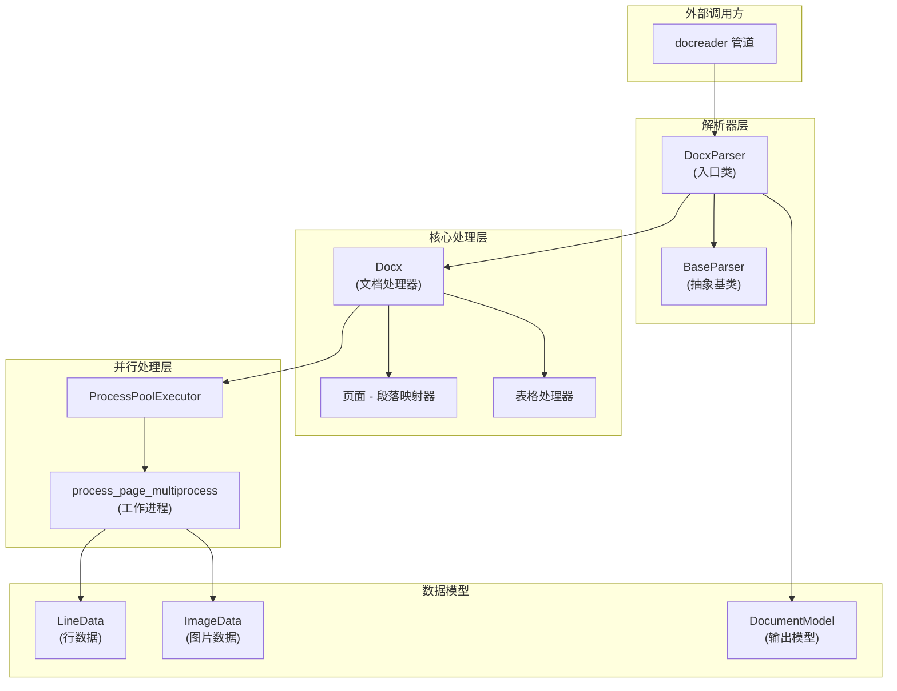

# openxml_docx_primary_parser 模块深度解析

## 概述：为什么需要这个模块

想象一下，你拿到了一份几十页的 Word 文档，里面混杂着正文、表格、内嵌图片、分节符，甚至还有从其他文档复制粘贴带来的隐藏格式标记。你的任务是把这份文档"消化"成下游系统能理解的纯文本和结构化图片引用。 naive 的做法可能是直接用 `python-docx` 库遍历所有段落，把文本拼起来——但这样做会丢失太多关键信息：图片出现在哪个位置？表格的行列结构是什么？哪些段落实际上在同一页？

**`openxml_docx_primary_parser` 模块存在的核心价值**，就是解决 DOCX 文档解析中的三个根本性挑战：

1. **保真度问题**：DOCX 本质上是压缩的 XML 包，段落、图片、表格在 XML 层面是分离的，但语义上紧密关联。简单的文本提取会破坏这种关联。
2. **性能问题**：大型文档（数百页、数千段落）如果串行解析，耗时可能达到分钟级。模块需要支持并行处理，但 Python 的 GIL 限制了多线程的效果。
3. **鲁棒性问题**：现实世界的 DOCX 文件常常包含损坏的图片流、不规范的 XML 结构、甚至恶意构造的内容。解析器必须在"尽可能提取"和"安全失败"之间找到平衡。

这个模块的设计洞察是：**将文档视为"页面流"而非"段落流"**。通过先建立页面 - 段落的映射关系，再按页面并行处理，既保持了内容的语义边界（一页是一个自然的阅读单元），又为并行化提供了天然的切分点。

---

## 架构全景



### 组件角色与数据流

**入口层（DocxParser）**：作为 [`BaseParser`](docreader_parser_base_parser.md) 的子类，`DocxParser` 是外部系统（如 docreader 管道）与 DOCX 解析逻辑之间的适配器。它不直接处理文档内容，而是委托给内部的 `Docx` 处理器，并在解析失败时提供降级策略。

**核心处理器（Docx）**：这是模块的"大脑"。它负责：
1. 加载 DOCX 文档并建立页面 - 段落映射
2. 决定并行策略（进程数、是否启用多模态）
3. 协调多进程任务执行与结果收集
4. 处理表格提取

**并行工作进程（process_page_multiprocess）**：这是一个模块级函数，设计为可在独立进程中执行。每个工作进程独立加载文档副本，处理指定页面的段落和图片，返回 `LineData` 对象。使用独立进程而非线程的原因是**绕过 GIL 限制**——图片解码和 XML 解析都是 CPU 密集型操作。

**数据模型（LineData / ImageData）**：这些是跨进程边界传递的数据容器。`LineData` 不仅包含文本，还维护 `content_sequence` 字段，记录文本和图片的原始顺序。这对于多模态场景（如 VLM 模型需要知道图片在文本中的位置）至关重要。

---

## 核心组件深度解析

### DocxParser：入口与降级策略

```python
class DocxParser(BaseParser):
    def parse_into_text(self, content: bytes) -> DocumentModel:
        # 主解析路径
        docx_processor = Docx(...)
        all_lines, tables = docx_processor(...)
        # 构建 DocumentModel
        ...
        # 降级策略：如果主解析失败或结果为空
        if not text:
            return self._parse_using_simple_method(content)
```

**设计意图**：`DocxParser` 的核心职责不是解析本身，而是**管理解析的生命周期和失败恢复**。它采用"尝试 - 降级"模式：

1. **主路径**：使用 `Docx` 处理器进行完整解析（包括图片提取、页面映射、并行处理）
2. **降级路径**：如果主路径抛出异常或返回空文本，使用简化的 `python-docx` 直接遍历

这种设计的**权衡**在于：
- **优点**：提高了系统的整体可用性。即使复杂解析逻辑因文档格式问题失败，仍能返回基本文本内容。
- **缺点**：降级路径会丢失图片、页面结构等元数据。调用方需要意识到返回结果的"质量等级"可能不同。

**关键参数**：
- `max_pages`（默认 100）：限制处理的页面数。这是一个**安全阀**，防止恶意构造的超大文档耗尽资源。对于大多数业务文档，100 页已足够；超出部分会被静默忽略。

### Docx：页面映射策略

```python
def _identify_page_paragraph_mapping(self, max_page=100000):
    # 启发式策略（大文档）
    if total_paragraphs > 1000:
        estimated_paras_per_page = 25
        for p_idx in range(total_paragraphs):
            est_page = p_idx // estimated_paras_per_page
            ...
    # 标准策略（精确解析）
    else:
        for p_idx, p in enumerate(self.doc.paragraphs):
            # 检测 lastRenderedPageBreak 或 w:br type="page"
            ...
```

**为什么有两种映射策略？**

这是一个典型的**性能 vs 精度**权衡。精确解析需要检查每个段落的 XML 中是否包含分页符标记（`lastRenderedPageBreak` 或 `w:br`），这涉及大量的 XML 解析操作。对于小型文档，这种开销可以接受；但对于数千段落的文档，XML 解析可能成为瓶颈。

**启发式策略的假设**：平均每页约 25 个段落。这个数字来自经验统计——对于标准 A4 页面、12 号字体、1.5 倍行距的文档，这个估计相对准确。当然，对于包含大量表格或图片的文档，这个估计会偏差，但模块优先保证处理速度。

**设计决策**：阈值设为 1000 段落。低于此值使用精确映射，高于此值使用启发式。这个阈值是经验值，可根据实际文档分布调整。

### 并行处理架构

```python
def _execute_multiprocess_tasks(self, args_list, max_workers):
    with Manager() as manager:
        self.all_lines = manager.list()
        with ProcessPoolExecutor(max_workers=max_workers) as executor:
            future_to_idx = {
                executor.submit(process_page_multiprocess, *args): i
                ...
            }
```

**为什么使用 `ProcessPoolExecutor` 而非 `ThreadPoolExecutor`？**

这是 Python 并发编程中的经典选择。DOCX 解析涉及：
1. XML 解析（`python-docx` 内部使用 `lxml`）
2. 图片解码（`PIL.Image.open`）
3. 图片缩放（`image.resize`）

这些都是 CPU 密集型操作，受 GIL 限制，多线程无法利用多核。使用多进程可以真正并行，但代价是**进程间通信开销**和**内存复制**。

**进程间数据传递的设计**：

图片数据不能直接在进程间传递 PIL 对象（不可序列化），因此模块采用**临时文件中转**策略：
1. 工作进程将图片保存到 `/tmp/docx_img_*/page_X_img_Y.png`
2. 主进程读取临时文件，上传到存储系统，获取 URL
3. 主进程清理临时文件

这种设计的**权衡**：
- **优点**：避免了大对象序列化的开销，支持图片上传等需要网络访问的操作（只能在主进程执行）
- **缺点**：磁盘 I/O 开销，需要管理临时文件生命周期

**工作进程数计算**：
```python
if not doc_contains_images or len(pages_to_process) < cpu_count:
    max_workers = min(len(pages_to_process), max(1, cpu_count - 1))
else:
    max_workers = min(len(pages_to_process), cpu_count)
```

对于无图片或页数少的文档，减少进程数以避免启动开销；对于含图片的大文档，充分利用所有 CPU 核心。

### 内容序列追踪（content_sequence）

```python
@dataclass
class LineData:
    text: str = ""
    images: List[ImageData] = field(default_factory=list)
    content_sequence: List[Tuple[str, Any]] = field(default_factory=list)
    # ("text", "段落内容") 或 ("image", ImageData 对象)
```

**为什么需要 `content_sequence`？**

假设文档内容如下：
```
这是第一段。

[图片 1]

这是第二段。

[图片 2]
```

如果只返回 `text` 字段（所有文本拼接）和 `images` 字段（所有图片列表），下游系统无法知道图片应该插入到哪个位置。`content_sequence` 维护了原始的交错顺序，使得重建带图片标记的文本成为可能：

```python
for content_type, content in processed_content:
    if content_type == "text":
        combined_parts.append(content)
    elif content_type == "image":
        combined_parts.append(image_url_map[content.local_path])
```

**设计洞察**：这是一个**保序 vs 简化**的权衡。维护序列增加了数据结构的复杂性，但对于多模态场景（VLM 模型需要图文对应）是必要的。如果业务场景只需要纯文本，可以忽略此字段。

---

## 依赖关系分析

### 上游依赖（谁调用这个模块）

`DocxParser` 被 [`docreader`](docreader_pipeline.md) 管道调用，作为格式特定解析器之一。调用流程通常是：

1. 用户提交 DOCX 文件到 docreader 服务
2. 路由器根据文件扩展名选择 `DocxParser`
3. `DocxParser.parse_into_text()` 被调用，返回 `DocumentModel`
4. 解析结果传递给分块（chunking）模块进行后续处理

**契约**：调用方期望 `DocumentModel` 包含：
- `content`：纯文本（必需）
- `images`：字典，键为 Markdown 图片链接，值为 base64 编码（可选，取决于 `enable_multimodal`）

### 下游依赖（这个模块调用谁）

1. **`python-docx`**：核心解析库，用于加载 DOCX 文件、访问段落和表格
2. **`PIL.Image`**：图片解码和缩放
3. **`storage.upload_file`**：图片上传回调（通过构造函数注入）
4. **`docreader.utils.endecode.decode_image`**：图片编码工具

**关键耦合点**：
- `storage.upload_file` 是一个回调函数，由外部注入。这意味着模块不直接依赖特定存储服务，但**假设存储服务可用**。如果上传失败，图片会被跳过，但不会导致整个解析失败。
- `python-docx` 的版本兼容性很重要。模块使用了 `paragraph._element.xpath` 等内部 API，如果 `python-docx` 改变 XML 结构，可能需要适配。

---

## 设计决策与权衡

### 1. 同步 vs 异步

**选择**：模块采用同步阻塞设计，`parse_into_text()` 直接返回结果。

**原因**：
- DOCX 解析本身是 CPU 密集型，异步不会带来性能提升
- 内部已使用多进程并行，外部无需再异步包装
- 简化调用方的错误处理逻辑

**代价**：对于超大文档，调用方需要自行处理超时或进度监控。

### 2. 继承 vs 组合

**选择**：`DocxParser` 继承 `BaseParser`，但内部使用 `Docx` 处理器（组合模式）。

**原因**：
- 继承 `BaseParser` 是为了符合解析器框架的接口契约（多态性）
- 使用 `Docx` 内部类是为了封装复杂的解析逻辑，避免 `DocxParser` 过于臃肿

**权衡**：这种"继承 + 组合"的混合模式增加了代码层次，但提高了可维护性。

### 3.  eager vs lazy 图片处理

**选择**：图片在解析时立即处理（上传、编码），而非延迟到下游需要时。

**原因**：
- 工作进程中的临时文件需要在解析完成后清理
- 图片上传需要网络访问，在工作进程中可能遇到权限或网络隔离问题

**代价**：即使下游不需要图片（纯文本场景），图片仍会被处理。可通过 `enable_multimodal=False` 禁用。

### 4. 临时文件 vs 内存共享

**选择**：使用临时文件中转图片数据，而非 `multiprocessing.Queue` 或共享内存。

**原因**：
- PIL 对象不可序列化，无法直接通过 Queue 传递
- 共享内存（`multiprocessing.Array`）对于变长图片数据管理复杂
- 临时文件简单可靠，且便于调试（可检查中间产物）

**代价**：磁盘 I/O 开销，需要管理文件清理。模块使用 `try-finally` 和显式清理逻辑来降低泄漏风险。

---

## 使用指南

### 基本用法

```python
from docreader.parser.docx_parser import DocxParser

# 创建解析器实例
parser = DocxParser(
    max_pages=100,           # 最多处理 100 页
    enable_multimodal=True,  # 启用图片提取
    max_image_size=1920,     # 图片最大边长
)

# 解析文档
with open("document.docx", "rb") as f:
    content = f.read()

document = parser.parse_into_text(content)

# 访问结果
print(document.content)      # 纯文本
print(document.images)       # 图片字典 {url: base64}
```

### 配置选项

| 参数 | 类型 | 默认值 | 说明 |
|------|------|--------|------|
| `max_pages` | int | 100 | 限制处理的页面数，防止资源耗尽 |
| `enable_multimodal` | bool | False | 是否提取图片 |
| `max_image_size` | int | 1920 | 图片最大边长（像素），超出会等比缩放 |
| `storage.upload_file` | callable | None | 图片上传回调，接收本地路径返回 URL |

### 扩展点

**自定义图片处理**：如果默认的图片上传逻辑不满足需求，可注入自定义回调：

```python
def custom_upload(local_path: str) -> str:
    # 自定义上传逻辑，如上传到 S3、添加水印等
    return "https://example.com/image.png"

parser = DocxParser(
    enable_multimodal=True,
    upload_file=custom_upload,
)
```

**子类化**：如需修改解析行为，可继承 `DocxParser` 并重写方法：

```python
class CustomDocxParser(DocxParser):
    def _parse_using_simple_method(self, content: bytes) -> DocumentModel:
        # 自定义降级逻辑
        ...
```

---

## 边界情况与陷阱

### 1. 空文档或纯图片文档

**现象**：解析后 `document.content` 为空字符串。

**原因**：文档只包含图片，没有文本段落。

**处理**：模块会记录警告日志，返回空的 `DocumentModel`。调用方应检查 `content` 是否为空，并决定是否需要特殊处理（如仅处理图片）。

### 2. 损坏的图片流

**现象**：部分图片缺失，日志中出现 `UnrecognizedImageError` 或 `InvalidImageStreamError`。

**原因**：DOCX 文件中的图片数据损坏或格式不支持。

**处理**：模块会跳过损坏的图片，继续处理其他内容。这是**预期行为**，不应视为错误。

### 3. 临时文件泄漏

**现象**：`/tmp/docx_img_*` 目录积累大量文件。

**原因**：解析过程中进程异常退出，清理逻辑未执行。

**预防**：
- 确保调用方捕获异常并记录日志
- 定期清理 `/tmp` 目录（如 cron 任务）
- 考虑使用 `tempfile.TemporaryDirectory` 的上下文管理器模式（当前实现已部分采用）

### 4. 页面映射偏差

**现象**：某些页面的内容被分配到错误的页码。

**原因**：对于大文档（>1000 段落），使用启发式映射（每页 25 段落），与实际分页可能不符。

**影响**：如果业务逻辑依赖精确的页码（如"提取第 10 页的内容"），结果可能不准确。

**解决**：如需精确分页，可修改 `_identify_page_paragraph_mapping` 方法，强制使用标准策略（但性能会下降）。

### 5. 内存峰值

**现象**：解析大文档时内存使用激增。

**原因**：
- 每个工作进程加载完整的文档副本
- 图片解码后占用内存（尤其是高分辨率图片）

**缓解**：
- 降低 `max_workers` 减少并发进程数
- 降低 `max_image_size` 减少图片内存占用
- 降低 `max_pages` 限制处理范围

---

## 相关模块

- [`BaseParser`](docreader_parser_base_parser.md)：解析器抽象基类，定义接口契约
- [`Docx2Parser`](openxml_docx_alternative_parser.md)：DOCX 的替代解析器实现
- [`DocumentModel`](document_chunk_data_model.md)：解析结果的数据模型
- [`ChunkingConfig`](chunking_configuration.md)：分块配置，解析后通常会进行分块处理

---

## 总结

`openxml_docx_primary_parser` 模块是一个**生产级的 DOCX 解析器**，其设计体现了多个工程权衡：

1. **性能优先**：通过多进程并行和启发式页面映射，在可接受精度损失下大幅提升处理速度
2. **鲁棒性优先**：通过降级策略和异常捕获，确保即使部分解析失败也能返回可用结果
3. **可扩展性优先**：通过依赖注入（如 `upload_file` 回调）和清晰的接口边界，便于集成到不同环境

理解这个模块的关键是认识到：**DOCX 解析不是简单的文本提取，而是文档结构的语义重建**。模块的复杂性来源于对保真度、性能和鲁棒性的综合追求。
