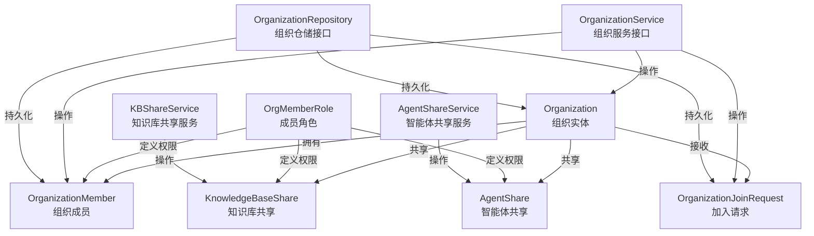

# 组织治理、成员管理与加入工作流契约

## 概述

这个模块是整个系统中负责**组织协作空间**的核心契约层。它定义了组织（Organization）、成员（Member）、加入请求（Join Request）以及资源共享（Resource Sharing）等关键概念的数据模型和业务接口。

想象一下，你需要在一个多租户的协作平台上创建一个"工作空间"，让不同租户的用户可以一起共享知识库和智能体——这就是这个模块要解决的问题。它就像一个虚拟的"会议室"管理系统：你可以创建会议室、邀请成员、设置不同级别的访问权限、管理加入申请，以及控制哪些资源可以在这个会议室里共享。

## 架构概览



这个模块采用了清晰的**分层契约架构**：

1. **领域模型层**：定义了 `Organization`、`OrganizationMember`、`OrganizationJoinRequest` 等核心实体
2. **请求/响应层**：定义了创建、更新、查询等操作的 API 契约
3. **服务接口层**：`OrganizationService`、`KBShareService` 等定义了业务操作的接口
4. **仓储接口层**：`OrganizationRepository` 等定义了数据持久化的接口

### 核心数据流转

让我们以一个典型的"用户通过邀请码加入组织"场景为例，看看数据是如何流动的：

1. **创建邀请码**：组织管理员调用 `GenerateInviteCode`，系统生成唯一邀请码并设置过期时间
2. **用户申请加入**：用户使用邀请码调用 `JoinByInviteCode`，系统验证邀请码有效性和成员限制
3. **权限检查**：如果组织设置了 `RequireApproval`，则创建 `OrganizationJoinRequest` 等待审批
4. **成员添加**：通过审批后，创建 `OrganizationMember` 记录，用户获得相应角色权限
5. **资源访问**：用户现在可以访问组织共享的知识库和智能体，权限由 `OrgMemberRole` 控制

## 核心设计决策

### 1. 角色权限模型：基于等级的权限系统

**设计选择**：采用三级角色（Admin > Editor > Viewer），并通过数值化等级（3 > 2 > 1）实现权限继承。

```go
roleLevel := map[OrgMemberRole]int{
    OrgRoleAdmin:  3,
    OrgRoleEditor: 2,
    OrgRoleViewer: 1,
}
```

**为什么这样设计**：
- ✅ **简单直观**：三级角色覆盖了 90% 的协作场景，避免过度设计
- ✅ **权限继承**：通过 `HasPermission()` 方法，高等级角色自动拥有低等级角色的所有权限
- ✅ **易于扩展**：如果未来需要更细粒度的权限，可以在这个基础上增加角色或引入权限位掩码

**权衡**：
- ❌ 灵活性有限：无法实现"可以编辑但不能删除"这种细粒度控制
- ❌ 角色是硬编码的：不能通过配置动态添加新角色

### 2. 组织发现模式：邀请码 + 可搜索性双重机制

**设计选择**：支持两种加入方式：
- 通过邀请码（`InviteCode`）加入
- 通过搜索可发现的组织（`Searchable`）直接申请

**为什么这样设计**：
- ✅ **隐私保护**：默认组织不可搜索，保护隐私
- ✅ **灵活性**：既支持封闭式团队（邀请码），也支持开放式社区（可搜索）
- ✅ **安全性**：两种方式都可以配合 `RequireApproval` 实现人工审核

### 3. 共享资源权限：双重权限检查

**设计选择**：用户对共享资源的有效权限是"组织角色权限"和"资源共享权限"的最小值。

```go
// 有效权限 = min(资源权限, 用户在组织中的角色权限)
MyPermission string `json:"my_permission"`
```

**为什么这样设计**：
- ✅ **安全第一**：防止资源所有者意外授予过高权限
- ✅ **职责分离**：组织管理员控制成员在组织中的整体权限，资源所有者控制具体资源的权限
- ✅ **防御性设计**：即使一方配置错误，另一方也能提供保护

### 4. 加入请求统一模型：加入 + 升级复用

**设计选择**：`OrganizationJoinRequest` 同时处理新成员加入和现有成员角色升级两种场景。

```go
type JoinRequestType string

const (
    JoinRequestTypeJoin    JoinRequestType = "join"    // 新成员加入
    JoinRequestTypeUpgrade JoinRequestType = "upgrade" // 角色升级
)
```

**为什么这样设计**：
- ✅ **代码复用**：审批流程逻辑可以共享
- ✅ **统一体验**：管理员在一个地方处理所有类型的请求
- ✅ **审计清晰**：所有权限变更都有统一的记录格式

## 子模块说明

这个模块可以进一步细分为以下几个子模块，每个子模块负责特定的功能领域：

### [组织生命周期与治理契约](core_domain_types_and_interfaces-identity_tenant_organization_and_configuration_contracts-organization_governance_membership_and_join_workflow_contracts-organization_lifecycle_and_governance_contracts.md)

负责组织本身的创建、更新、删除和基本治理功能，包括邀请码管理、可搜索性设置等。核心组件包括 `Organization` 实体、`CreateOrganizationRequest`、`UpdateOrganizationRequest` 等。

### [组织成员管理契约](core_domain_types_and_interfaces-identity_tenant_organization_and_configuration_contracts-organization_governance_membership_and_join_workflow_contracts-organization_membership_management_contracts.md)

负责组织成员的添加、移除、角色更新等功能。核心组件包括 `OrganizationMember` 实体、`AddMemberRequest`、`UpdateMemberRoleRequest` 等。

### [组织加入请求工作流契约](core_domain_types_and_interfaces-identity_tenant_organization_and_configuration_contracts-organization_governance_membership_and_join_workflow_contracts-organization_join_request_workflow_contracts.md)

负责处理加入请求和角色升级请求的审批流程。核心组件包括 `OrganizationJoinRequest` 实体、`SubmitJoinRequestRequest`、`ReviewJoinRequestRequest` 等。

### [组织发现与可搜索性契约](core_domain_types_and_interfaces-identity_tenant_organization_and_configuration_contracts-organization_governance_membership_and_join_workflow_contracts-organization_discovery_and_searchability_contracts.md)

负责组织的发现和搜索功能。核心组件包括 `SearchableOrganizationItem`、`ListSearchableOrganizationsResponse` 等。

### [组织资源摘要契约](core_domain_types_and_interfaces-identity_tenant_organization_and_configuration_contracts-organization_governance_membership_and_join_workflow_contracts-organization_resource_summary_contracts.md)

负责组织资源的统计和摘要功能。核心组件包括 `ResourceCountsByOrgResponse` 等。

## 跨模块依赖

这个模块是整个组织协作功能的基础，它与以下模块有紧密的依赖关系：

### 依赖此模块的模块

- **[组织治理与成员管理服务](../application_services_and_orchestration-agent_identity_tenant_and_configuration_services-identity_tenant_and_organization_management-organization_governance_and_membership_management.md)**：实现了这里定义的服务接口
- **[组织成员与共享访问仓储](../data_access_repositories-identity_tenant_and_organization_repositories-organization_membership_sharing_and_access_control_repositories.md)**：实现了这里定义的仓储接口
- **[组织共享访问处理](../http_handlers_and_routing-agent_tenant_organization_and_model_management_handlers-organization_shared_agent_access_handlers.md)**：使用这里的契约实现 HTTP API

### 此模块依赖的模块

- **[用户身份注册与认证契约](identity_tenant_organization_and_configuration_contracts-user_identity_registration_and_auth_contracts.md)**：依赖 `User` 实体
- **[知识库领域模型](knowledge_graph_retrieval_and_content_contracts-knowledge_and_knowledgebase_domain_models.md)**：依赖 `KnowledgeBase` 实体
- **[自定义智能体领域模型](identity_tenant_organization_and_configuration_contracts-custom_agent_and_skill_capability_contracts.md)**：依赖 `CustomAgent` 实体

## 新开发者注意事项

### 1. 角色权限的"最小值"规则

当检查用户对共享资源的权限时，记住**有效权限是组织角色和资源权限的最小值**。这是一个常见的陷阱：

```go
// 错误：只检查资源权限
if share.Permission.HasPermission(OrgRoleEditor) { ... }

// 正确：检查用户在组织中的角色和资源权限的最小值
userRole, _ := orgService.GetUserRoleInOrg(ctx, orgID, userID)
effectivePermission := minPermission(userRole, share.Permission)
if effectivePermission.HasPermission(OrgRoleEditor) { ... }
```

### 2. 邀请码的有效期处理

邀请码有两种过期机制：
- `InviteCodeExpiresAt`：具体的过期时间点
- `InviteCodeValidityDays`：有效期天数（0 表示永不过期）

在生成新邀请码时，确保同时设置这两个字段，保持一致性。

### 3. 成员限制检查

在添加成员时，需要检查 `MemberLimit`（0 表示无限制）。注意：
- 组织所有者不计入成员限制
- 已软删除的成员不计入成员限制
- 审批通过但尚未正式加入的用户不计入成员限制

### 4. 跨租户数据隔离

虽然组织支持跨租户协作，但在实现仓储层时，仍然需要注意：
- 查询共享资源时，确保正确处理 `SourceTenantID`
- 用户只能看到自己租户的资源，即使这些资源被共享到其他组织
- 删除组织或资源时，确保正确级联删除共享记录

### 5. 软删除的使用

这个模块中的很多实体（`Organization`、`KnowledgeBaseShare`、`AgentShare`）都使用了 GORM 的软删除。在查询时，记住：
- 默认查询不会返回软删除的记录
- 如果需要查询包含软删除的记录，使用 `Unscoped()`
- 软删除的记录仍然占用唯一索引，需要注意

## 总结

这个模块是组织协作功能的"契约 backbone"，它定义了整个系统如何理解和操作组织、成员、共享资源等核心概念。通过清晰的接口分离和精心设计的数据模型，它为上层业务逻辑提供了坚实的基础，同时保持了足够的灵活性来应对未来的需求变化。

记住：这个模块只是**契约定义**，真正的业务逻辑在服务层实现，真正的数据持久化在仓储层实现。当你需要修改或扩展功能时，先从这里开始理解概念，然后再去看具体的实现代码。
