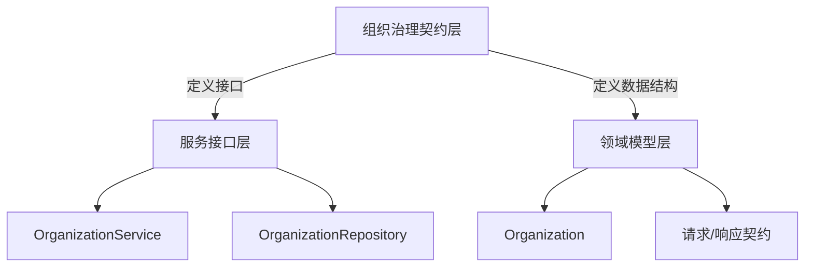

# 组织生命周期与治理契约

## 1. 什么问题

在多租户、多团队协作的知识管理系统中，团队间的资源共享与协作治理是一个核心挑战。本模块解决的问题是：如何在保持租户隔离的前提下，安全、灵活地实现跨租户的资源共享与协作。

### 问题空间分析：
- **资源归属与隔离**：知识库、智能体等资源天然属于特定租户，但团队协作需要打破这种隔离
- **权限边界**：需要一套清晰的权限模型，确保资源所有者能够精确控制共享范围
- **协作流程**：加入、退出、权限变更等协作操作需要规范化、可审计
- **发现与加入**：如何让用户能够发现并加入合适的协作空间，同时保障安全

这个模块不是简单的"共享记录存储"，而是一套完整的协作治理契约体系，定义了组织生命周期、成员管理、资源共享的核心概念与交互规则。

## 2. 架构概述

本模块采用了经典的**分层架构模式**，将核心功能划分为三个主要层次：

### 核心架构组件

#### 2.1 服务接口层
这一层定义了组织治理的核心能力契约，包括：
- **[组织服务接口](core_domain_types_and_interfaces-identity_tenant_organization_and_configuration_contracts-organization_governance_membership_and_join_workflow_contracts-organization_lifecycle_and_governance_contracts-organization_service_and_persistence_interfaces.md)：定义了组织生命周期管理、成员管理、资源共享的业务逻辑接口
- **仓储接口**：定义了数据持久化的抽象接口

#### 2.2 领域模型层
这一层定义了组织治理的核心数据结构：
- **[组织领域模型](core_domain_types_and_interfaces-identity_tenant_organization_and_configuration_contracts-organization_governance_membership_and_join_workflow_contracts-organization_lifecycle_and_governance_contracts-organization_domain_and_response_models.md)：组织实体、成员实体、共享记录等核心数据结构
- **[请求/响应契约](core_domain_types_and_interfaces-identity_tenant_organization_and_configuration_contracts-organization_governance_membership_and_join_workflow_contracts-organization_lifecycle_and_governance_contracts-organization_lifecycle_request_contracts.md)：API层的数据契约

## 3. 设计决策

### 3.1 角色权限模型
**选择了三级权限模型（Admin/Editor/Viewer）**

这个模型的设计权衡：
- **优点**：简单清晰，易于理解和实现
- **权衡**：牺牲了部分灵活性，但对于大多数协作场景已经足够
- **权限层次**：Admin > Editor > Viewer，通过数字等级实现权限检查

### 3.2 邀请码与审批机制
**双重加入机制：
- 邀请码：快速加入，适合私密协作
- 审批机制：安全加入，适合公开组织
- 可发现性：组织可以设置为"可搜索"，方便用户发现和加入

### 3.3 软删除策略
**选择了软删除策略：
- 保留审计历史
- 支持恢复操作
- 权衡：增加了存储复杂度，但提供了更好的数据安全性

## 4. 关键概念与业务流程

### 4.1 组织创建与生命周期

组织从创建到销毁的完整生命周期管理，包括：
1. 创建组织
2. 成员管理
3. 资源共享
4. 组织销毁

### 4.2 成员加入流程
支持多种加入方式：
- 邀请码加入
- 申请加入（需要审批）
- 直接添加（管理员操作）

## 5. 跨模块依赖

本模块与其他模块的关系：
- **身份认证模块：依赖用户身份信息
- **知识库模块：支持知识库共享
- **智能体模块：支持智能体共享
- **权限管理模块：依赖权限检查机制

## 6. 使用指南与最佳实践

### 6.1 常见使用场景
- 创建协作组织
- 管理组织成员
- 共享资源
- 处理加入申请

### 6.2 注意事项
- 权限检查的正确使用
- 邀请码的安全性
- 组织成员数量限制
