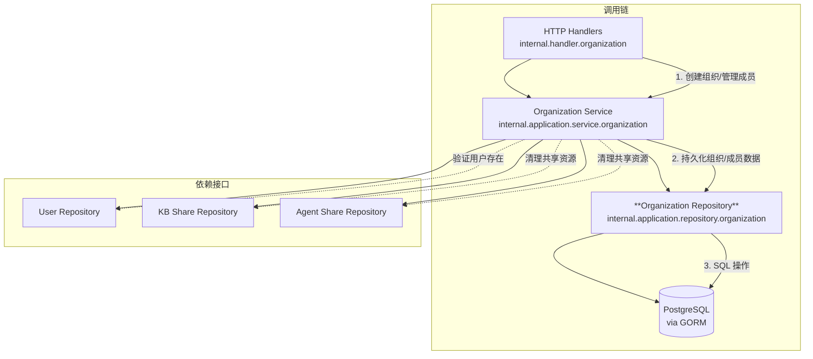

# organization_membership_and_governance_repository 模块深度解析

## 概述：为什么需要这个模块？

想象一下你正在运营一个多人协作的知识库平台。每个团队（组织）需要有自己的边界：谁能进来、谁可以编辑内容、谁只能查看。更复杂的是，有些团队希望完全封闭，有些希望开放加入但需要审批，还有些希望通过邀请码快速拉人。

`organization_membership_and_governance_repository` 模块就是这个治理体系的数据持久化层。它的核心职责是**将组织、成员关系和加入审批流程的状态可靠地存储到数据库中**。

为什么不能简单地用几张表加几条 SQL 搞定？问题在于：

1. **并发安全**：当两个管理员同时修改成员角色时，如何避免覆盖？
2. **状态一致性**：加入请求被批准后，必须确保成员记录被创建，且不能重复创建
3. **查询效率**：用户可能属于多个组织，组织可能有上百个成员，如何高效查询？
4. **业务语义清晰**：邀请码过期、成员已存在、请求已处理……这些业务错误需要明确的区分

这个模块通过**仓储模式（Repository Pattern）**将数据库操作封装成具有业务语义的方法，让上层服务无需关心 SQL 细节，只需调用 `AddMember`、`UpdateJoinRequestStatus` 这样意图明确的方法。

---

## 架构定位与数据流

### 模块在系统中的位置



### 数据流追踪：以"用户申请加入组织"为例

1. **HTTP 层** (`OrganizationHandler`) 接收 `SubmitJoinRequestRequest`，提取 `orgID`、`userID`、申请消息
2. **服务层** (`organizationService.SubmitJoinRequest`) 执行权限校验、检查是否已有待处理请求
3. **仓储层** (`organizationRepository.CreateJoinRequest`) 将 `OrganizationJoinRequest` 写入数据库
4. **数据库** 持久化记录，状态为 `pending`

当管理员审批时，流程反向：

1. **服务层** 调用 `UpdateJoinRequestStatus` 将状态改为 `approved` 或 `rejected`
2. 若批准，服务层继续调用 `AddMember` 创建成员记录
3. **仓储层** 通过 `RowsAffected` 判断操作是否成功，返回领域特定的错误（如 `ErrOrgMemberAlreadyExists`）

---

## 核心组件深度解析

### `organizationRepository` 结构体

```go
type organizationRepository struct {
    db *gorm.DB
}
```

这是典型的**仓储模式实现**：一个轻量结构体，仅持有数据库连接（`*gorm.DB`），所有方法都是无状态的，依赖传入的 `context.Context` 进行生命周期管理和超时控制。

#### 设计意图

- **无状态设计**：每个方法调用都是独立的，便于并发处理和测试
- **接口隔离**：实现 `interfaces.OrganizationRepository` 接口，上层服务只依赖接口，便于 Mock 测试
- **事务边界在外**：仓储层不主动开启事务，由服务层通过 `db.Begin()` 控制事务边界，仓储方法接收事务上下文

---

### 组织 CRUD 操作

#### `Create` / `GetByID` / `Update` / `Delete`

这些是标准的 CRUD 方法，但有几个值得注意的设计细节：

```go
func (r *organizationRepository) Update(ctx context.Context, org *types.Organization) error {
    return r.db.WithContext(ctx).Model(&types.Organization{}).Where("id = ?", org.ID).
        Select("name", "description", "avatar", "require_approval", "searchable", 
               "invite_code_validity_days", "member_limit", "updated_at").
        Updates(org).Error
}
```

**为什么显式指定 `Select` 字段？**

这是一个**防错设计**。GORM 的 `Updates` 默认会忽略零值（如 `invite_code_validity_days=0`），但业务上 `0` 可能表示"永不过期"，需要被持久化。通过显式列出字段，确保：
- 零值被正确写入
- 未提供的字段不会被意外更新（如 `deleted_at`）
- SQL 语句更清晰，便于审计

#### `GetByInviteCode`：邀请码过期检查

```go
func (r *organizationRepository) GetByInviteCode(ctx context.Context, inviteCode string) (*types.Organization, error) {
    var org types.Organization
    if err := r.db.WithContext(ctx).Where("invite_code = ?", inviteCode).First(&org).Error; err != nil {
        if errors.Is(err, gorm.ErrRecordNotFound) {
            return nil, ErrInviteCodeNotFound
        }
        return nil, err
    }
    if org.InviteCodeExpiresAt != nil && org.InviteCodeExpiresAt.Before(time.Now()) {
        return nil, ErrInviteCodeExpired
    }
    return &org, nil
}
```

**设计权衡**：过期检查放在仓储层而非服务层？

- **优点**：调用方无需关心过期逻辑，统一处理 `ErrInviteCodeExpired` 错误
- **缺点**：仓储层引入了业务规则（什么是"过期"），略微违反了单一职责

这是一个**务实的妥协**：过期检查是纯数据判断（比较时间），不涉及复杂业务逻辑，放在仓储层可以减少服务层的样板代码。

---

### 成员管理操作

#### `AddMember`：防重复插入

```go
func (r *organizationRepository) AddMember(ctx context.Context, member *types.OrganizationMember) error {
    // 先检查是否存在
    var count int64
    r.db.WithContext(ctx).Model(&types.OrganizationMember{}).
        Where("organization_id = ? AND user_id = ?", member.OrganizationID, member.UserID).
        Count(&count)

    if count > 0 {
        return ErrOrgMemberAlreadyExists
    }
    return r.db.WithContext(ctx).Create(member).Error
}
```

**为什么不用唯一索引 + 捕获错误？**

理论上可以在数据库层添加 `(organization_id, user_id)` 唯一索引，然后捕获 GORM 的唯一约束错误。但当前实现选择**应用层检查**：

- **优点**：错误信息更友好（`ErrOrgMemberAlreadyExists` vs 数据库约束错误）
- **缺点**：存在竞态条件（检查后、插入前，另一请求可能插入相同记录）

**改进建议**：在高并发场景下，应添加数据库唯一索引作为最终保障，应用层检查作为快速失败优化。

#### `ListMembersByUserForOrgs`：批量查询优化

```go
func (r *organizationRepository) ListMembersByUserForOrgs(ctx context.Context, userID string, orgIDs []string) (map[string]*types.OrganizationMember, error) {
    if len(orgIDs) == 0 {
        return make(map[string]*types.OrganizationMember), nil
    }
    var members []*types.OrganizationMember
    err := r.db.WithContext(ctx).
        Where("user_id = ? AND organization_id IN ?", userID, orgIDs).
        Find(&members).Error
    // ... 转为 map
}
```

这是一个**N+1 查询优化**的典型例子。场景：用户属于 10 个组织，需要获取他在每个组织的角色。

- ** naive 做法**：循环 10 次调用 `GetMember`，产生 10 条 SQL
- **当前做法**：一次 `IN` 查询，返回 map，O(1) 查找

**返回值设计为 `map[string]*OrganizationMember`** 而非切片，是因为调用方通常按 `orgID` 查找，避免再次遍历。

---

### 加入请求工作流

这是模块最复杂的部分，支持两种请求类型：

| 请求类型 | 场景 | 状态流转 |
|---------|------|---------|
| `join` | 非成员申请加入 | `pending` → `approved`（创建成员）或 `rejected` |
| `upgrade` | 现有成员申请升级角色 | `pending` → `approved`（更新角色）或 `rejected` |

#### 关键方法

```go
// 获取待处理请求（任意类型）
GetPendingJoinRequest(ctx context.Context, orgID string, userID string) (*OrganizationJoinRequest, error)

// 获取待处理请求（指定类型）
GetPendingRequestByType(ctx context.Context, orgID string, userID string, requestType types.JoinRequestType) (*OrganizationJoinRequest, error)

// 更新请求状态（审批）
UpdateJoinRequestStatus(ctx context.Context, id string, status types.JoinRequestStatus, reviewedBy string, reviewMessage string) error
```

#### 设计洞察

**为什么 `UpdateJoinRequestStatus` 不直接创建/更新成员？**

这是**职责分离**的体现：
- 仓储层：只负责 `OrganizationJoinRequest` 表的状态更新
- 服务层：根据审批结果，决定调用 `AddMember` 还是 `UpdateMemberRole`

这样做的好处：
1. **事务可控**：服务层可以将"更新请求状态"和"创建成员"放在同一事务中
2. **逻辑清晰**：仓储方法只做一件事，便于测试和复用
3. **扩展性**：未来审批后可能需要触发其他操作（如发送通知），在服务层编排更合适

---

## 依赖关系分析

### 上游调用者

| 调用方 | 依赖方法 | 使用场景 |
|-------|---------|---------|
| `organizationService` | 全部方法 | 组织管理业务逻辑 |
| `OrganizationHandler` | 间接通过 Service | HTTP 请求处理 |

### 下游依赖

| 依赖 | 类型 | 用途 |
|-----|------|-----|
| `*gorm.DB` | 基础设施 | 数据库操作 |
| `types.Organization` | 领域模型 | 组织实体 |
| `types.OrganizationMember` | 领域模型 | 成员关系实体 |
| `types.OrganizationJoinRequest` | 领域模型 | 加入请求实体 |

### 数据契约

仓储层假设传入的实体已经过服务层的验证：
- `Organization.ID` 不为空
- `OrganizationMember.Role` 是有效枚举值
- `OrganizationJoinRequest.Status` 是有效状态

**隐式契约**：仓储方法不重复验证业务规则（如角色权限），只保证数据完整性。

---

## 设计决策与权衡

### 1. 软删除 vs 硬删除

```go
DeletedAt gorm.DeletedAt `json:"deleted_at" gorm:"index"`
```

组织采用**软删除**（GORM 自动管理 `deleted_at` 字段），而非物理删除。

**权衡**：
- **优点**：可恢复、审计追踪、外键引用不中断
- **缺点**：查询需过滤 `deleted_at IS NULL`、数据量增长

**为什么选择软删除？** 组织下可能有知识库、会话等关联资源，硬删除会导致级联删除或外键冲突。软删除允许先清理关联资源，再归档组织。

### 2. 邀请码过期策略

```go
InviteCodeExpiresAt *time.Time  // nil = 永不过期
InviteCodeValidityDays int      // 默认 7 天
```

采用**绝对时间戳**而非相对时间存储过期时间。

**权衡**：
- **绝对时间戳**：查询简单（`WHERE expires_at > NOW()`），但时区变化需重新计算
- **相对天数**：存储简洁，但每次查询需计算

选择绝对时间戳是因为**查询性能优先**，且组织设置变更频率低。

### 3. 成员角色枚举

```go
type OrgMemberRole string  // "admin" | "editor" | "viewer"
```

使用字符串而非整数枚举。

**权衡**：
- **字符串**：可读性好、API 友好、数据库调试方便
- **整数**：存储紧凑、比较快

在成员管理场景下，**可读性优于存储效率**，且角色数量固定（3 种），性能差异可忽略。

### 4. 预加载策略

```go
// ListMembers 预加载 User 信息
Preload("User")

// GetJoinRequestByID 预加载 User
Preload("User")
```

**设计意图**：列表/详情查询通常需要用户信息（头像、昵称），预加载避免 N+1 查询。

**潜在问题**：如果调用方不需要用户信息，会浪费一次 JOIN。改进方案是提供 `ListMembersWithoutUser` 变体或按需预加载。

---

## 使用示例与最佳实践

### 创建组织并添加创始成员

```go
// 服务层伪代码
func (s *organizationService) CreateOrganization(ctx context.Context, userID string, tenantID uint64, req *types.CreateOrganizationRequest) (*types.Organization, error) {
    // 1. 创建组织
    org := &types.Organization{
        ID:          uuid.New().String(),
        Name:        req.Name,
        OwnerID:     userID,
        InviteCode:  generateInviteCode(),
        Searchable:  req.Searchable,
    }
    if err := s.orgRepo.Create(ctx, org); err != nil {
        return nil, err
    }
    
    // 2. 添加所有者为管理员
    member := &types.OrganizationMember{
        ID:             uuid.New().String(),
        OrganizationID: org.ID,
        UserID:         userID,
        TenantID:       tenantID,
        Role:           types.OrgMemberRoleAdmin,
    }
    if err := s.orgRepo.AddMember(ctx, member); err != nil {
        // 注意：这里组织已创建但成员添加失败，需要回滚
        // 理想情况应使用事务
        return nil, err
    }
    
    return org, nil
}
```

**注意**：当前实现未使用事务，存在部分失败风险。建议改进：

```go
tx := s.db.Begin()
defer func() {
    if r := recover(); r != nil {
        tx.Rollback()
    }
}()

orgRepo := NewOrganizationRepository(tx)
// ... 操作
tx.Commit()
```

### 审批加入请求

```go
func (s *organizationService) ReviewJoinRequest(ctx context.Context, orgID string, requestID string, approved bool, reviewerID string, message string) error {
    request, err := s.orgRepo.GetJoinRequestByID(ctx, requestID)
    if err != nil {
        return err
    }
    
    if request.OrganizationID != orgID {
        return errors.New("request does not belong to organization")
    }
    
    // 更新请求状态
    newStatus := types.JoinRequestStatusApproved
    if !approved {
        newStatus = types.JoinRequestStatusRejected
    }
    if err := s.orgRepo.UpdateJoinRequestStatus(ctx, requestID, newStatus, reviewerID, message); err != nil {
        return err
    }
    
    // 如果批准，创建成员或更新角色
    if approved {
        if request.RequestType == types.JoinRequestTypeJoin {
            member := &types.OrganizationMember{
                ID:             uuid.New().String(),
                OrganizationID: orgID,
                UserID:         request.UserID,
                TenantID:       request.TenantID,
                Role:           request.RequestedRole,
            }
            return s.orgRepo.AddMember(ctx, member)
        } else if request.RequestType == types.JoinRequestTypeUpgrade {
            return s.orgRepo.UpdateMemberRole(ctx, orgID, request.UserID, request.RequestedRole)
        }
    }
    
    return nil
}
```

---

## 边界情况与陷阱

### 1. 并发加入请求

**场景**：用户同时提交两个加入请求（快速双击或并发脚本）。

**当前行为**：`CreateJoinRequest` 不检查是否已有待处理请求，可能创建多条 `pending` 记录。

**建议**：在 `CreateJoinRequest` 中添加检查，或添加数据库唯一索引 `(organization_id, user_id, status)` 其中 `status='pending'`（部分索引）。

### 2. 成员计数不一致

**场景**：`CountMembers` 返回的数量与 `ListMembers` 实际数量不一致（并发删除）。

**影响**：前端显示"已有 50/50 成员"，但实际还能加入。

**建议**：在 `AddMember` 前使用 `SELECT ... FOR UPDATE` 锁定计数，或在应用层容忍短暂不一致。

### 3. 邀请码重复生成

**场景**：`UpdateInviteCode` 生成新邀请码时，可能与现有邀请码冲突。

**当前行为**：依赖数据库唯一索引抛出错误。

**建议**：在应用层重试生成，直到获得唯一码。

### 4. 时区敏感的时间比较

```go
if org.InviteCodeExpiresAt != nil && org.InviteCodeExpiresAt.Before(time.Now()) {
    return nil, ErrInviteCodeExpired
}
```

**问题**：`time.Now()` 使用服务器本地时区，而数据库存储的是 UTC。如果服务器时区配置错误，可能导致过期判断偏差。

**建议**：统一使用 `time.Now().UTC()` 或确保服务器时区为 UTC。

---

## 扩展点

### 添加新的成员状态

当前 `OrganizationMember` 只有 `role` 字段，若需支持"冻结"、"待激活"等状态：

1. 在 `types.OrganizationMember` 添加 `Status` 字段
2. 在仓储层添加 `UpdateMemberStatus` 方法
3. 在 `AddMember` 中设置初始状态

### 支持组织层级结构

若需支持子组织/部门：

1. 在 `types.Organization` 添加 `ParentID` 字段
2. 添加 `ListChildOrganizations(parentID string)` 方法
3. 修改 `ListByUserID` 支持递归查询

---

## 相关模块参考

- [Organization Service](application_services_and_orchestration.md) — 调用本仓储的业务逻辑层
- [User Repository](data_access_repositories.md) — 成员关联的用户数据存储
- [KB Share Repository](data_access_repositories.md) — 组织级知识库共享权限
- [Agent Share Repository](data_access_repositories.md) — 组织级 Agent 共享权限

---

## 总结

`organization_membership_and_governance_repository` 是一个**职责清晰、设计务实**的仓储实现。它通过领域特定的错误类型、防错的数据更新策略、以及工作流状态管理，为上层服务提供了可靠的组织治理数据访问能力。

关键设计原则：
1. **接口隔离**：实现 `OrganizationRepository` 接口，便于测试和替换
2. **错误语义化**：`ErrOrganizationNotFound`、`ErrInviteCodeExpired` 等错误让调用方无需解析 SQL 错误
3. **查询优化**：`ListMembersByUserForOrgs` 等批量方法避免 N+1 问题
4. **事务外置**：由服务层控制事务边界，仓储层保持无状态

主要改进空间：
- 关键操作（创建组织 + 添加成员）应支持事务
- 并发场景下的唯一性约束需数据库层保障
- 时间比较应统一时区处理
