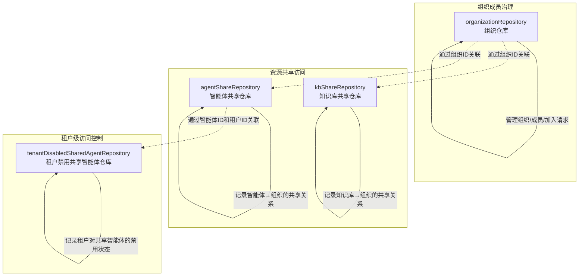

# 组织成员关系、共享与访问控制仓库

## 概述

这个模块是整个系统的"组织治理与资源共享基础设施"。它解决了一个核心问题：如何在多租户、多组织的环境中，让用户能够安全地加入组织、管理成员关系，并在组织内共享知识库和智能体资源，同时保持清晰的访问边界和权限控制。

想象一下这个场景：一个团队创建了一个知识库，他们希望与另一个团队共享，但不希望公开；一个组织的管理员需要审核新成员的加入；一个租户希望禁用某些共享的智能体。这个模块就是处理这些场景的底层数据访问层。

## 架构概览



### 架构说明

这个模块采用了**职责分离**的设计模式，将功能清晰地划分为三个子模块：

1. **组织成员治理子模块**：由 `organizationRepository` 负责，是整个模块的基础。它管理组织的生命周期、成员关系和加入请求流程。其他两个共享子模块都依赖于它提供的组织实体。

2. **资源共享访问子模块**：由 `kbShareRepository` 和 `agentShareRepository` 组成。它们采用相似的模式，分别处理知识库和智能体的共享关系记录。这两个仓库的设计高度一致，体现了**模式复用**的思想。

3. **租户级访问控制子模块**：由 `tenantDisabledSharedAgentRepository` 负责，提供了一种"覆盖式"的访问控制机制。即使智能体已经共享给组织，租户仍可以选择禁用它，这为租户提供了额外的自主控制权。

## 核心设计决策

### 1. 软删除策略的广泛应用

**决策**：所有主要实体（组织、共享记录）都采用软删除而非物理删除。

**为什么这样设计**：
- **数据可追溯性**：组织和共享关系的变更历史对于审计和故障排查至关重要
- **恢复能力**：误操作后可以方便地恢复数据
- **一致性保证**：避免删除共享记录后，相关的访问历史信息丢失

**权衡**：
- 增加了数据库存储空间
- 查询时需要额外过滤 `deleted_at IS NULL` 条件
- 需要定期清理真正不需要的历史数据

### 2. 共享关系的双向查询优化

**决策**：同时提供"按资源查询共享到哪些组织"和"按组织查询获得了哪些共享资源"的方法。

**为什么这样设计**：
- 这是典型的多对多关系场景，双方都有查询需求
- 知识库所有者需要知道自己分享给了谁
- 组织成员需要知道自己能访问哪些共享资源

**关键实现**：在 `ListByOrganization` 方法中使用 JOIN 来过滤掉已软删除的资源，确保查询结果的一致性。

### 3. 租户级禁用机制的独立设计

**决策**：将"租户禁用共享智能体"作为一个独立的仓库，而不是嵌入到 `agentShareRepository` 中。

**为什么这样设计**：
- **关注点分离**：共享关系是"资源所有者→组织"的授权，而禁用是"租户→智能体"的覆盖控制
- **灵活性**：一个智能体可能被共享到多个组织，租户可以选择只禁用其中某些，或者全部
- **扩展性**：未来可以为禁用机制添加更多属性（如禁用原因、有效期等）而不影响共享关系表

### 4. 加入请求的状态机设计

**决策**：通过 `status` 字段和 `UpdateJoinRequestStatus` 方法来管理加入请求的生命周期。

**为什么这样设计**：
- 清晰的状态流转（待审核→已批准/已拒绝）
- 记录审核人和审核时间，满足审计需求
- 支持审核留言，提供更好的用户体验

## 子模块详解

### 组织成员和治理仓库

[组织成员和治理仓库](data_access_repositories-identity_tenant_and_organization_repositories-organization_membership_sharing_and_access_control_repositories-organization_membership_and_governance_repository.md)

这个子模块是整个组织功能的基石，负责管理组织的完整生命周期。它不仅仅是一个简单的 CRUD 仓库，还包含了邀请码验证、成员角色管理、加入请求审核等核心业务逻辑。

**核心能力**：
- 组织的创建、查询、更新和软删除
- 通过邀请码查找组织（含过期校验）
- 成员的添加、移除和角色更新
- 加入请求的创建、审核和状态管理

**关键设计细节**：
- `Update` 方法显式指定了 `Select` 字段，确保零值（如 `invite_code_validity_days=0`）也能被正确持久化
- `ListSearchable` 支持按名称、描述和 ID 搜索，解决了同名组织的区分问题
- 加入请求的审核记录了审核人、审核时间和审核留言，形成完整的审计 trail

### 共享资源访问仓库

[共享资源访问仓库](data_access_repositories-identity_tenant_and_organization_repositories-organization_membership_sharing_and_access_control_repositories-shared_resource_access_repositories.md)

这个子模块包含两个高度相似的仓库：知识库共享和智能体共享。它们采用相同的设计模式，体现了"模式复用"的工程思想。

**知识库共享仓库**：
- 记录知识库与组织之间的多对多共享关系
- 支持批量查询（`ListByOrganizations`）以优化性能
- `ListSharedKBsForUser` 方法通过多表 JOIN 一次性获取用户可访问的所有共享知识库，避免了 N+1 查询问题

**智能体共享仓库**：
- 与知识库共享仓库类似，但增加了 `source_tenant_id` 字段来跟踪智能体的来源租户
- `GetShareByAgentIDForUser` 方法提供了一种高效的方式来检查用户是否能访问某个智能体
- 特别注意 `source_tenant_id != ?` 的条件，排除了用户自己租户的智能体

### 租户级共享智能体访问控制仓库

[租户级共享智能体访问控制仓库](data_access_repositories-identity_tenant_and_organization_repositories-organization_membership_sharing_and_access_control_repositories-tenant_level_shared_agent_access_control_repository.md)

这是一个精巧但强大的子模块，提供了一种"覆盖式"的访问控制机制。

**设计意图**：
- 即使智能体已经共享给组织，租户仍可以选择禁用它
- 这为租户提供了额外的自主控制权，类似于"应用商店中的应用，我可以选择不安装"

**关键方法**：
- `ListDisabledOwnAgentIDs`：获取租户自己禁用的自己的智能体（有点绕，但确实是一个合理的场景）
- `Add` 使用 `FirstOrCreate`，确保重复调用不会产生副作用

## 数据流程分析

### 场景1：用户通过邀请码加入组织

```
1. 调用 GetByInviteCode → 验证邀请码存在且未过期
2. 检查是否有待审核的加入请求（GetPendingJoinRequest）
3. 创建新的加入请求（CreateJoinRequest）
4. 组织管理员审核（UpdateJoinRequestStatus）
5. 审核通过后添加成员（AddMember）
```

**关键点**：
- 邀请码过期检查在仓库层完成，确保业务逻辑不会收到过期的邀请码
- 加入请求与成员添加是分离的两个步骤，支持审核流程

### 场景2：共享知识库给组织

```
1. 调用 Create 创建共享记录
2. 内部检查是否已存在相同的共享关系（避免重复）
3. 后续查询时通过 ListByOrganization 获取组织内的共享知识库
```

**关键点**：
- 创建时的重复检查是必要的，防止并发创建导致的重复记录
- `ListByOrganization` 会过滤掉已软删除的知识库，确保结果的一致性

### 场景3：用户访问共享资源

```
1. 调用 ListSharedKBsForUser 或 ListSharedAgentsForUser
2. 通过多表 JOIN 获取用户所属组织的所有共享资源
3. 同时过滤掉已软删除的组织、资源和共享记录
```

**关键点**：
- 使用预加载（Preload）优化关联查询性能
- 多重 WHERE 条件确保只返回有效的共享关系

## 与其他模块的关系

这个模块是一个典型的**数据访问层**模块，它主要被上层的应用服务模块调用。

**主要依赖关系**：
- 被 [agent_identity_tenant_and_configuration_services](application_services_and_orchestration-agent_identity_tenant_and_configuration_services.md) 模块中的组织管理服务和资源共享服务调用
- 依赖 [core_domain_types_and_interfaces](core_domain_types_and_interfaces.md) 模块中定义的领域模型和接口契约
- 使用 GORM 作为 ORM 框架，与数据库交互

**契约关系**：
- 实现了 `interfaces.OrganizationRepository`、`interfaces.KBShareRepository` 等接口
- 返回 `types.Organization`、`types.KnowledgeBaseShare` 等领域模型
- 定义了业务特定的错误（如 `ErrOrganizationNotFound`）

## 新开发者注意事项

### 常见陷阱

1. **忘记过滤软删除记录**
   - 虽然大多数查询方法已经内置了过滤，但直接使用 GORM 查询时需要注意
   - 特别是自定义 JOIN 查询时，要记得添加 `deleted_at IS NULL` 条件

2. **邀请码过期检查的位置**
   - 检查在 `GetByInviteCode` 方法内部完成，不需要业务层再次检查
   - 但更新邀请码时需要业务层自己计算过期时间

3. **共享关系的唯一性约束**
   - 虽然代码中有检查，但数据库层面也应该有唯一索引来防止并发问题
   - 创建操作不是幂等的，重复调用会返回错误

### 扩展建议

1. **添加缓存层**
   - 组织信息和成员关系变化不频繁，可以考虑添加缓存
   - 共享关系可能变化较频繁，缓存时需要注意失效策略

2. **批量操作优化**
   - 目前的 `CountSharesByKnowledgeBaseIDs` 和 `CountByOrganizations` 是好的开始
   - 可以考虑添加更多批量查询方法，减少数据库往返次数

3. **事件发布**
   - 可以在关键操作（如成员加入、资源共享）后发布事件
   - 让其他模块可以订阅并作出反应（如发送通知、更新统计）

### 测试提示

1. **测试软删除**：确保删除后查询不到，但历史记录仍然存在
2. **测试并发创建**：模拟并发创建共享关系，确保不会产生重复记录
3. **测试邀请码过期**：设置一个已过期的邀请码，确保无法使用
4. **测试复杂查询**：特别是 `ListSharedKBsForUser` 这类多表 JOIN 查询，确保在各种边界条件下都能正确工作

## 总结

这个模块是系统中组织治理和资源共享的基础设施。它通过清晰的职责划分、一致的设计模式和周密的边界条件处理，为上层业务提供了可靠的数据访问支持。

其设计体现了几个重要的软件工程原则：
- **关注点分离**：每个仓库只负责一种实体类型
- **模式复用**：知识库共享和智能体共享采用相似的设计
- **防御性编程**：内置了重复检查、过期校验等防护措施
- **性能优化**：提供批量查询方法，使用预加载和 JOIN 避免 N+1 查询

理解这个模块的关键是认识到它不仅仅是"数据库操作的封装"，更是业务规则和数据一致性的守护者。
