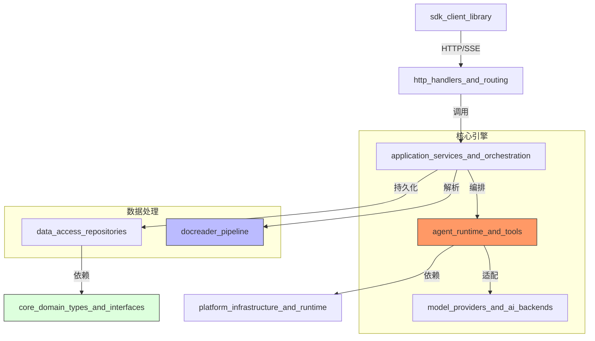

# 欢迎来到 WeKnora 项目维基

你好，开发者！欢迎加入 **WeKnora**。作为一个旨在构建企业级智能知识库与 AI Agent 平台的项目，WeKnora 不仅仅是一个 RAG（检索增强生成）工具，它是一套完整的生态系统，让 AI 能够像人类专家一样阅读文档、思考计划并利用工具解决复杂问题。

---

## 1. WeKnora 是做什么的？

简单来说，**WeKnora 是将非结构化数据转化为 AI 生产力的“加工厂”**。

想象一下，你有一堆杂乱无章的 PDF 报告、Word 文档和网页链接。WeKnora 会：
1. **深度解析**：把这些文件拆解成 AI 能理解的“知识碎片”，甚至能看懂其中的图片和表格。
2. **构建大脑**：将碎片存入向量数据库和图数据库，建立知识索引。
3. **智能代理**：当你提问时，一个基于 **ReAct (Reasoning + Acting)** 模式的 AI Agent 会被激活。它不会胡言乱语，而是先搜索知识、制定计划、调用工具，最后给出**基于证据**的准确回答。

---

## 2. 架构一览

WeKnora 采用了清晰的分层架构，确保了系统的高扩展性和企业级稳定性。

### 架构 walkthrough
- **入口层**：外部应用通过 `sdk_client_library` 与 `http_handlers_and_routing` 交互。
- **业务编排层**：`application_services_and_orchestration` 负责协调解析、检索和问答的完整生命周期。
- **执行核心**：`agent_runtime_and_tools` 是系统的大脑，负责 ReAct 循环；而 `model_providers_and_ai_backends` 屏蔽了不同 AI 厂商（OpenAI, DeepSeek, Ollama 等）的差异。
- **数据基石**：`docreader_pipeline` 负责将原始文件转化为结构化 Chunk，最后由 `data_access_repositories` 存入各类数据库。

---

## 3. 关键设计决策

在构建 WeKnora 时，我们做出了几个至关重要的技术选择：

*   **接口驱动与依赖倒置 (Interface-Driven)**：
    核心逻辑只依赖于 [core_domain_types_and_interfaces](core_domain_types_and_interfaces.md) 中定义的抽象契约。这意味着你可以轻松更换向量数据库或 LLM 供应商，而无需修改业务代码。
*   **ReAct 智能体范式**：
    我们没有采用简单的单次 Prompt 模式，而是实现了 [agent_runtime_and_tools](agent_runtime_and_tools.md) 中的“思考-行动-观察”循环。这让 AI 能够处理需要多步检索和逻辑推理的复杂任务。
*   **证据优先 (Evidence-First) 哲学**：
    系统强制要求 AI 必须基于检索到的 Chunk 进行回答，并提供内联引用。这从根本上减少了 AI 幻觉。
*   **纵深防御安全架构**：
    为了安全执行 AI 生成的脚本或工具调用，我们在 [platform_infrastructure_and_runtime](platform_infrastructure_and_runtime.md) 中构建了基于 Docker 的 `Sandbox` 和严格的 `SQLValidator`。

---

## 4. 模块指南

WeKnora 的功能被解耦到以下核心模块中：

*   **[core_domain_types_and_interfaces](core_domain_types_and_interfaces.md)**：系统的“宪法”，定义了 `Knowledge`、`Chunk`、`Session` 等所有核心领域模型和接口契约。
*   **[agent_runtime_and_tools](agent_runtime_and_tools.md)**：Agent 的运行环境，实现了 ReAct 循环、工具注册表以及渐进式加载的 `Skills` 系统。
*   **[docreader_pipeline](docreader_pipeline.md)**：强大的文档解析流水线，支持多模态处理（OCR + VLM），能将 PDF、Docx 等转化为带元数据的标准分块。
*   **[model_providers_and_ai_backends](model_providers_and_ai_backends.md)**：统一的 AI 适配层，让系统能够无缝切换 OpenAI、阿里云 DashScope、本地 Ollama 等 20 多种模型后端。
*   **[data_access_repositories](data_access_repositories.md)**：数据持久化层，实现了多租户隔离的数据库访问，支持 Elasticsearch、Milvus、Postgres 等多种检索后端。
*   **[platform_infrastructure_and_runtime](platform_infrastructure_and_runtime.md)**：底层基础设施，提供全局配置管理、异步 `EventBus`、安全 `Sandbox` 以及流状态管理。
*   **[http_handlers_and_routing](http_handlers_and_routing.md)**：API 网关层，处理身份验证、请求路由以及基于 SSE（Server-Sent Events）的流式响应。
*   **[sdk_client_library](sdk_client_library.md)**：为开发者提供的 Go 语言 SDK，封装了复杂的 API 调用，让集成 WeKnora 变得轻而易举。
*   **[frontend_contracts_and_state](frontend_contracts_and_state.md)**：定义了前后端交互的 TypeScript 契约和前端状态管理结构，确保 UI 交互的一致性。

---

## 5. 核心工作流

### 场景 A：知识入库 (Knowledge Ingestion)
当用户上传一个文件时，数据会经历以下变换：
1.  **接收**：`http_handlers_and_routing` 接收文件流并存入临时存储。
2.  **解析**：`docreader_pipeline` 识别文件类型，提取文本、表格和图片。
3.  **分块**：`BaseParser` 根据语义将文档切分为 `Chunk`，并为图片生成 `Caption`。
4.  **向量化**：`model_providers_and_ai_backends` 调用 Embedding 模型将文本转为向量。
5.  **存储**：`data_access_repositories` 将原始文本、向量和元数据存入数据库。

### 场景 B：智能 Agent 问答 (Agentic QA)
当用户提出一个复杂问题（如“对比 A 和 B 产品的技术架构”）时：
1.  **初始化**：`AgentEngine` 启动，根据 [platform_infrastructure_and_runtime](platform_infrastructure_and_runtime.md) 中的模板构建系统提示词。
2.  **思考 (Think)**：LLM 决定需要搜索知识库，发出 `agent_tool_call` 事件。
3.  **行动 (Act)**：`knowledge_access_and_corpus_navigation_tools` 执行检索，获取相关 `Chunk`。
4.  **观察 (Observe)**：检索结果作为证据反馈给 LLM。
5.  **迭代**：LLM 发现信息不足，可能会继续调用 `web_search` 或 `sequential_thinking` 工具。
6.  **总结**：最终答案通过 `EventBus` 以流式（SSE）方式推送到前端。

---

准备好开始了吗？建议先阅读 **[快速入门指南]** 或深入了解 **[核心接口定义]**。祝你在 WeKnora 的开发旅程中充满乐趣！