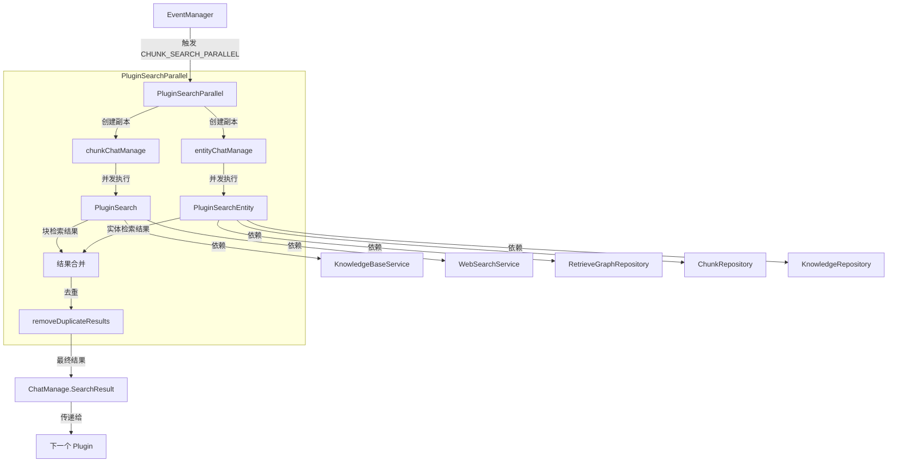

# parallel_retrieval_execution_plugin 模块深度解析

## 概述：为什么需要并行检索？

想象你在图书馆找资料：管理员可以先去书架区找书，同时另一个人去卡片目录查相关文献 —— 这比让同一个人跑两趟要快得多。`PluginSearchParallel` 做的就是这件事。

在知识问答系统中，用户的一个问题可能需要从两个维度检索：
1. **块检索（Chunk Search）**：基于向量相似度在文档片段中查找相关内容
2. **实体检索（Entity Search）**：在知识图谱中查找已提取的实体节点和关系

如果串行执行，总延迟 = 块检索时间 + 实体检索时间。对于需要低延迟响应的对话系统，这是不可接受的。`PluginSearchParallel` 的核心设计洞察是：**这两种检索彼此独立，可以安全地并发执行**。它通过 Go 的 goroutine 机制将两个检索路径并行化，然后在终点合并结果，将总延迟降低到 `max(块检索时间，实体检索时间)`。

但并发不是简单的 "开个 goroutine 就行"。这个模块要解决的关键问题是：
- 如何避免两个 goroutine 同时修改共享状态导致的数据竞争？
- 如果一个检索失败，另一个成功了，该如何处理？
- 合并结果时如何去除重复项？

这些问题的答案构成了本模块的设计核心。

---

## 架构与数据流



### 架构角色解析

`PluginSearchParallel` 在系统中的角色是一个**并发编排器（Concurrent Orchestrator）**：

1. **它不直接执行检索** —— 实际工作委托给内部的 `PluginSearch` 和 `PluginSearchEntity`
2. **它管理并发边界** —— 创建独立的 `ChatManage` 副本来隔离两个检索路径的状态
3. **它处理故障容忍** —— 允许一个检索失败而另一个成功，只在两者都失败时才报错
4. **它合并和清理结果** —— 等待两个 goroutine 完成后，合并结果并去重

### 数据流追踪

让我们追踪一个典型请求的完整路径：

```
用户提问
   ↓
[前置 Plugin] 重写查询 → chatManage.RewriteQuery
   ↓
[前置 Plugin] 提取实体 → chatManage.Entity, chatManage.EntityKBIDs
   ↓
EventManager 触发 CHUNK_SEARCH_PARALLEL 事件
   ↓
PluginSearchParallel.OnEvent() 被调用
   ↓
┌─────────────────────────────────────────────────────┐
│  Goroutine 1 (块检索)        │  Goroutine 2 (实体检索)  │
│  复制 chatManage             │  复制 chatManage        │
│  调用 PluginSearch           │  检查是否有实体        │
│  → 执行混合检索              │  调用 PluginSearchEntity│
│  → 执行 Web 搜索 (如果启用)    │  → 查询知识图谱        │
│  → 结果写入 chunkChatManage  │  → 获取关联 chunk      │
│                              │  → 结果写入 entityChat │
└─────────────────────────────────────────────────────┘
   ↓                    ↓
   └─────── wg.Wait() ──┘
   ↓
合并：chunkChatManage.SearchResult + entityChatManage.SearchResult
   ↓
去重：removeDuplicateResults()
   ↓
写入：chatManage.SearchResult
   ↓
调用 next() → 传递给 PluginRerank
```

关键点：**`ChatManage` 是贯穿整个 pipeline 的共享状态对象**。如果两个 goroutine 直接修改同一个 `chatManage.SearchResult`，会发生数据竞争。解决方案是为每个检索路径创建独立副本，只在 `wg.Wait()` 之后才合并到主对象。

---

## 核心组件深度解析

### PluginSearchParallel

**设计意图**：作为并发检索的入口点，协调两个独立检索路径的执行和结果合并。

#### 依赖注入结构

```go
type PluginSearchParallel struct {
    // 块检索依赖
    knowledgeBaseService interfaces.KnowledgeBaseService
    knowledgeService     interfaces.KnowledgeService
    config               *config.Config
    webSearchService     interfaces.WebSearchService
    tenantService        interfaces.TenantService
    sessionService       interfaces.SessionService

    // 实体检索依赖
    graphRepo     interfaces.RetrieveGraphRepository
    chunkRepo     interfaces.ChunkRepository
    knowledgeRepo interfaces.KnowledgeRepository

    // 内部插件（组合而非继承）
    searchPlugin       *PluginSearch
    searchEntityPlugin *PluginSearchEntity
}
```

**设计选择分析**：这里使用了**组合模式**而非继承。`PluginSearchParallel` 不继承自 `PluginSearch`，而是持有其实例。这样做的好处是：
- 两个内部插件可以独立测试和演进
- 避免了继承带来的紧耦合
- 可以灵活替换内部实现（例如未来换成不同的检索策略）

#### 构造函数：NewPluginSearchParallel

```go
func NewPluginSearchParallel(
    eventManager *EventManager,
    knowledgeBaseService interfaces.KnowledgeBaseService,
    // ... 其他依赖
) *PluginSearchParallel
```

关键行为：
1. **创建内部插件实例** —— 注意这里没有调用 `eventManager.Register()` 注册内部插件
2. **注册自身到 EventManager** —— 只有 `PluginSearchParallel` 本身响应 `CHUNK_SEARCH_PARALLEL` 事件

**为什么内部插件不注册？** 因为它们只作为 `PluginSearchParallel` 的实现细节存在，不应该被外部事件直接触发。这是一种**封装边界**的设计：外部系统只知道并行检索，不知道内部如何拆分。

#### 事件处理：OnEvent 方法

这是模块的核心逻辑，让我们逐段分析：

##### 1. 状态隔离：创建独立副本

```go
chunkChatManage := *chatManage
chunkChatManage.SearchResult = nil

entityChatManage := *chatManage
entityChatManage.SearchResult = nil
```

**为什么需要副本？** `ChatManage` 包含大量字段，其中 `SearchResult` 是两个检索路径都要写入的。如果共享同一个对象：
- Goroutine 1 写入 `SearchResult` 时，Goroutine 2 可能也在写入 → **数据竞争**
- 即使使用互斥锁保护每次写入，也无法保证读取时数据的一致性

**浅拷贝的陷阱**：`*chatManage` 是浅拷贝。对于切片类型（如 `SearchResult`），两个副本的切片底层数组是共享的。所以代码显式设置为 `nil`，确保每个副本有独立的切片。

**需要注意的字段**：`Entity`、`EntityKBIDs`、`RewriteQuery` 等只读字段可以安全共享，因为两个 goroutine 都不会修改它们。

##### 2. 并发执行与错误收集

```go
var wg sync.WaitGroup
var mu sync.Mutex
var chunkSearchErr *PluginError
var entitySearchErr *PluginError

wg.Add(2)

// Goroutine 1: Chunk Search
go func() {
    defer wg.Done()
    err := p.searchPlugin.OnEvent(ctx, types.CHUNK_SEARCH, &chunkChatManage, func() *PluginError {
        return nil
    })
    if err != nil && err != ErrSearchNothing {
        mu.Lock()
        chunkSearchErr = err
        mu.Unlock()
    }
}()

// Goroutine 2: Entity Search
go func() {
    defer wg.Done()
    if len(chatManage.Entity) == 0 {
        return // 跳过实体检索
    }
    err := p.searchEntityPlugin.OnEvent(ctx, types.ENTITY_SEARCH, &entityChatManage, func() *PluginError {
        return nil
    })
    if err != nil && err != ErrSearchNothing {
        mu.Lock()
        entitySearchErr = err
        mu.Unlock()
    }
}()

wg.Wait()
```

**设计决策分析**：

| 选择 | 为什么这样设计 |
|------|---------------|
| 使用 `sync.WaitGroup` | 确保两个检索都完成后才合并结果，避免部分结果丢失 |
| 使用 `sync.Mutex` 保护错误变量 | 虽然每个 goroutine 只写自己的错误变量，但这是防御性编程，防止未来修改引入竞争 |
| 忽略 `ErrSearchNothing` | "没找到结果" 不是错误，是正常业务状态。只有真正异常才记录 |
| `next` 参数传 `func() *PluginError { return nil }` | 内部插件执行完后不应该继续 pipeline，只收集结果 |

**实体检索的短路优化**：如果 `chatManage.Entity` 为空，直接跳过实体检索。这避免了无意义的图谱查询开销。

##### 3. 结果合并与去重

```go
chatManage.SearchResult = append(chunkChatManage.SearchResult, entityChatManage.SearchResult...)
chatManage.SearchResult = removeDuplicateResults(chatManage.SearchResult)
```

此时已经过了 `wg.Wait()`，没有并发访问，可以安全修改主 `chatManage`。

##### 4. 错误处理策略：部分成功也是成功

```go
// 记录错误但不中断 pipeline
if chunkSearchErr != nil {
    logger.Warnf(ctx, "[SearchParallel] Chunk search error: %v", chunkSearchErr.Err)
}
if entitySearchErr != nil {
    logger.Warnf(ctx, "[SearchParallel] Entity search error: %v", entitySearchErr.Err)
}

// 只有当两个检索都失败且无结果时才返回错误
if len(chatManage.SearchResult) == 0 {
    if chunkSearchErr != nil {
        return chunkSearchErr
    }
    return ErrSearchNothing
}

return next()
```

**设计哲学**：这是一个**优雅降级（Graceful Degradation）**的设计。如果块检索成功但实体检索失败，系统仍然可以基于块检索结果继续回答用户问题。只有当两个检索都失败时，才向上游返回错误。

这种设计权衡了**正确性**和**可用性**：
- 严格模式：任何一个检索失败就报错 → 可能错过可用结果
- 宽松模式（当前实现）：只要有结果就继续 → 可能丢失部分信息，但用户体验更好

---

### removeDuplicateResults

**问题空间**：块检索和实体检索可能返回相同的 chunk。例如：
- 块检索基于向量相似度找到 chunk A
- 实体检索通过图谱关系也找到 chunk A

如果不合并，用户会看到重复内容，且后续 rerank 会浪费计算资源。

#### 去重策略

```go
func removeDuplicateResults(results []*types.SearchResult) []*types.SearchResult {
    seen := make(map[string]bool)
    contentSig := make(map[string]string) // sig -> first chunk ID
    var uniqueResults []*types.SearchResult
    
    for _, r := range results {
        // 策略 1: 基于 ID 去重
        keys := []string{r.ID}
        if r.ParentChunkID != "" {
            keys = append(keys, "parent:"+r.ParentChunkID)
        }
        
        // 策略 2: 基于内容签名去重
        sig := buildContentSignature(r.Content)
        if sig != "" {
            if firstChunk, exists := contentSig[sig]; exists {
                continue // 内容重复，跳过
            }
            contentSig[sig] = r.ID
        }
        
        // 标记为已见
        for _, k := range keys {
            seen[k] = true
        }
        uniqueResults = append(uniqueResults, r)
    }
    return uniqueResults
}
```

**两层去重机制**：

1. **ID 去重**：最直接的方式。如果同一个 chunk ID 出现两次，只保留第一次。
2. **父 chunk 去重**：如果 chunk 有 `ParentChunkID`，也将其作为去重键。这处理了子 chunk 重复的情况。
3. **内容签名去重**：即使 ID 不同，如果内容相同（例如不同 KB 中的相似文档），也视为重复。

**设计权衡**：
- **性能 vs 准确性**：内容签名计算需要额外开销，但能捕获 ID 去重无法处理的重复
- **保留哪个**：当前实现保留第一个出现的重复项。如果块检索结果在前，则优先保留块检索结果

---

## 依赖关系分析

### 上游调用者

```
EventManager
    ↓ (触发 CHUNK_SEARCH_PARALLEL 事件)
PluginSearchParallel.OnEvent()
```

`PluginSearchParallel` 通过 `EventManager` 集成到 pipeline 中。典型的触发顺序：

```
PluginLoadHistory → PluginRewrite → PluginSearchEntity (提取实体) → PluginSearchParallel → PluginRerank → PluginFilterTopK → PluginMerge → PluginChatCompletion
```

### 下游被调用者

#### PluginSearch

负责实际执行块检索和 Web 搜索。内部也使用并发：
- Goroutine 1: 调用 `KnowledgeBaseService.HybridSearch()` 执行混合检索（向量 + 关键词）
- Goroutine 2: 调用 `WebSearchService` 执行 Web 搜索（如果启用）

**数据契约**：
- 输入：`ChatManage`（包含 `RewriteQuery`、`SearchTargets`、`KnowledgeBaseIDs` 等）
- 输出：`ChatManage.SearchResult` 填充检索结果

#### PluginSearchEntity

负责在知识图谱中检索实体节点和关系，然后将关联的 chunk 转换为 `SearchResult`。

**执行流程**：
1. 调用 `RetrieveGraphRepository.SearchNode()` 查询实体
2. 从图谱结果中提取关联的 chunk ID
3. 调用 `ChunkRepository.ListChunksByID()` 获取 chunk 详情
4. 调用 `KnowledgeRepository.GetKnowledgeBatch()` 获取知识元数据
5. 转换为 `SearchResult` 并追加到 `ChatManage.SearchResult`

**数据契约**：
- 输入：`ChatManage.Entity`（实体列表）、`ChatManage.EntityKBIDs`（启用了图谱提取的 KB）
- 输出：`ChatManage.GraphResult`（图谱数据）、`ChatManage.SearchResult`（关联 chunk）

### 关键数据契约：ChatManage

`ChatManage` 是 pipeline 中所有 plugin 共享的状态对象。对于 `PluginSearchParallel`，关键字段包括：

| 字段 | 用途 | 读写模式 |
|------|------|---------|
| `RewriteQuery` | 检索使用的查询文本 | 只读 |
| `Entity` | 提取的实体列表 | 只读 |
| `EntityKBIDs` | 启用了图谱提取的 KB ID | 只读 |
| `SearchResult` | 检索结果 | 写入（通过副本隔离） |
| `GraphResult` | 图谱检索结果 | 写入（由 PluginSearchEntity） |
| `SearchTargets` | 预计算的检索目标 | 只读 |
| `EmbeddingTopK` | 检索结果数量 | 只读 |
| `VectorThreshold` | 向量分数阈值 | 只读 |

**隐式契约**：
- Plugin 不应该修改只读字段（如 `Entity`、`RewriteQuery`）
- 写入 `SearchResult` 前应该创建副本或使用互斥锁
- 调用 `next()` 前应该确保 `SearchResult` 已填充

---

## 设计决策与权衡

### 1. 并发模型：Goroutine + WaitGroup

**为什么不用 channel？** Go 有两种并发通信方式：共享内存（互斥锁）和 channel。这里选择共享内存 + `WaitGroup` 的原因：
- 结果需要合并，使用 channel 需要额外的收集逻辑
- 两个 goroutine 的生命周期明确（开始 → 执行 → 结束），`WaitGroup` 更简洁
- 错误收集需要共享变量，channel 反而增加复杂度

**为什么不用 errgroup？** `errgroup` 会在第一个错误时取消上下文。但这里需要**部分成功**语义，所以手动管理 `WaitGroup` 更合适。

### 2. 状态隔离：浅拷贝 + 显式重置

```go
chunkChatManage := *chatManage
chunkChatManage.SearchResult = nil
```

**为什么不用深拷贝？** 深拷贝成本高且容易遗漏新字段。浅拷贝 + 显式重置关键字段是性能和安全的平衡。

**潜在风险**：如果未来 `ChatManage` 添加了新的可变字段（如切片、map），需要确保在副本中也重置它们，否则会引入隐蔽的数据竞争。

### 3. 错误处理：宽松模式

**设计张力**：严格 vs 宽松

| 维度 | 严格模式 | 宽松模式（当前） |
|------|---------|----------------|
| 行为 | 任一检索失败即报错 | 仅当两者都失败才报错 |
| 优点 | 快速暴露问题 | 提高可用性 |
| 缺点 | 可能错过可用结果 | 可能掩盖问题 |
| 适用场景 | 数据一致性要求高 | 用户体验优先 |

当前选择宽松模式，符合对话系统的场景：给用户一个部分正确的答案，比直接报错更好。

### 4. 组合 vs 继承

`PluginSearchParallel` 组合了 `PluginSearch` 和 `PluginSearchEntity`，而不是继承它们。

**为什么？**
- **单一职责**：`PluginSearch` 专注块检索，`PluginSearchEntity` 专注实体检索，`PluginSearchParallel` 专注并发编排
- **可测试性**：可以独立测试每个组件
- **灵活性**：未来可以替换内部实现（例如换成不同的检索算法）而不影响外部接口

---

## 使用与扩展

### 典型使用场景

`PluginSearchParallel` 在以下场景被触发：

```go
// 在 pipeline 初始化时注册
eventManager := NewEventManager()
NewPluginSearchParallel(
    eventManager,
    knowledgeBaseService,
    knowledgeService,
    chunkService,
    config,
    webSearchService,
    tenantService,
    sessionService,
    webSearchStateService,
    graphRepository,
    chunkRepository,
    knowledgeRepository,
)

// 在 pipeline 执行时触发
eventManager.Dispatch(ctx, types.CHUNK_SEARCH_PARALLEL, chatManage)
```

### 配置参数

检索行为通过 `ChatManage` 中的字段控制：

```go
chatManage := &types.ChatManage{
    RewriteQuery:      "重写后的查询",
    Entity:            []string{"实体 1", "实体 2"},
    EntityKBIDs:       []string{"kb-1", "kb-2"},
    SearchTargets:     []SearchTarget{...},
    EmbeddingTopK:     10,
    VectorThreshold:   0.7,
    KeywordThreshold:  0.5,
    RerankTopK:        5,
    // ...
}
```

### 扩展点

#### 添加新的检索路径

如果需要添加第三种检索（例如数据库检索），可以：

```go
type PluginSearchParallel struct {
    // ... 现有字段
    databaseSearchPlugin *PluginDatabaseSearch
}

func (p *PluginSearchParallel) OnEvent(...) *PluginError {
    // ... 现有代码
    wg.Add(3) // 改为 3
    
    // Goroutine 3: 数据库检索
    go func() {
        defer wg.Done()
        // ... 执行数据库检索
    }()
    
    wg.Wait()
    // 合并三个结果
}
```

**注意事项**：
- 需要创建第三个 `ChatManage` 副本
- 需要更新结果合并逻辑
- 需要更新错误处理逻辑

#### 自定义去重策略

如果需要修改去重逻辑，可以替换 `removeDuplicateResults`：

```go
func (p *PluginSearchParallel) OnEvent(...) *PluginError {
    // ... 现有代码
    chatManage.SearchResult = p.customDedup(chunkChatManage.SearchResult, entityChatManage.SearchResult)
}
```

---

## 边界情况与陷阱

### 1. 数据竞争：忘记创建副本

**错误示例**：
```go
// ❌ 危险：两个 goroutine 共享同一个 SearchResult
go p.searchPlugin.OnEvent(ctx, types.CHUNK_SEARCH, chatManage, ...)
go p.searchEntityPlugin.OnEvent(ctx, types.ENTITY_SEARCH, chatManage, ...)
```

**后果**：两个 goroutine 同时 append 到同一个切片，可能导致：
- 结果丢失
- panic（切片扩容时竞争）
- 难以复现的随机错误

**正确做法**：始终创建副本并重置 `SearchResult`。

### 2. 浅拷贝陷阱：共享的 map 和切片

```go
chunkChatManage := *chatManage
// ⚠️ 注意：Entity、SearchTargets 等切片字段是共享的
```

如果未来有代码修改这些字段（例如 `chunkChatManage.Entity = append(...)`），会影响另一个 goroutine。

**防御措施**：
- 约定这些字段为只读
- 或者在需要修改时显式深拷贝

### 3. 上下文取消：一个 goroutine 失败不影响另一个

当前实现中，两个 goroutine 共享同一个 `ctx`。如果外部取消上下文，两个 goroutine 都会停止。

**潜在问题**：如果块检索很快完成，但实体检索很慢，外部超时会导致块检索结果也丢失。

**改进方向**：可以为每个 goroutine 创建独立的子上下文，允许一个超时不影响另一个：

```go
chunkCtx, chunkCancel := context.WithTimeout(ctx, 5*time.Second)
entityCtx, entityCancel := context.WithTimeout(ctx, 10*time.Second)
```

### 4. 错误日志：可能掩盖问题

当前实现只记录 `Warnf`，不返回错误（除非两者都失败）。这可能导致：
- 实体检索持续失败但系统仍然"正常"运行
- 问题难以被发现

**建议**：添加指标监控，记录每个检索路径的成功率：

```go
if entitySearchErr != nil {
    metrics.Inc("search_parallel.entity_search.errors")
    logger.Warnf(...)
}
```

### 5. 去重顺序：块检索结果优先

当前实现先 append 块检索结果，再 append 实体检索结果。去重时会保留先出现的。

**影响**：如果同一个 chunk 同时被两种检索找到，块检索的版本会被保留。

**是否合理**：通常合理，因为块检索的结果包含更完整的相似度分数。但如果实体检索的上下文更相关，可能需要调整优先级。

---

## 性能考量

### 并发收益

假设：
- 块检索耗时：100ms
- 实体检索耗时：80ms

| 模式 | 总延迟 |
|------|--------|
| 串行 | 180ms |
| 并行 | 100ms（取最大值）|

**收益**：约 44% 的延迟降低。

### 并发开销

- Goroutine 创建：约 1μs（可忽略）
- `WaitGroup` 同步：约 100ns（可忽略）
- 结果合并：O(n)，n 为结果数量（通常 < 100）

**净收益**：对于 IO 密集型检索操作，并发收益远大于开销。

### 资源限制

如果系统同时处理大量并发请求，每个请求又创建两个 goroutine，可能导致：
- Goroutine 数量爆炸
- 数据库连接池耗尽

**缓解措施**：
- 在 `PluginSearch` 和 `PluginSearchEntity` 内部使用信号量限制并发
- 配置合理的数据库连接池大小

---

## 相关模块

- [chat_pipline 核心架构](chat_pipline.md) — Pipeline 和 Plugin 的基础设计
- [single_retrieval_execution_plugin](single_query_retrieval_execution_plugin.md) — `PluginSearch` 的详细实现
- [entity_search_plugin](chunk_grep_and_result_aggregation.md) — `PluginSearchEntity` 的详细实现
- [rerank_plugin](retrieval_reranking_plugin.md) — 检索后的重排序处理
- [pipeline_contracts_and_event_orchestration](pipeline_contracts_and_event_orchestration.md) — 事件系统的工作机制

---

## 总结

`PluginSearchParallel` 是一个典型的**并发编排器**模式实现。它的核心价值不是执行检索，而是：

1. **安全地并发** — 通过状态隔离避免数据竞争
2. **优雅地降级** — 允许部分失败，提高系统可用性
3. **清晰地合并** — 通过去重确保结果质量

理解这个模块的关键是把握三个设计原则：
- **隔离**：并发路径之间不共享可变状态
- **容忍**：单个路径失败不导致整体失败
- **合并**：在明确的同步点安全地整合结果

这些原则可以应用到其他需要并发执行的场景，是构建高可用、低延迟系统的重要模式。
