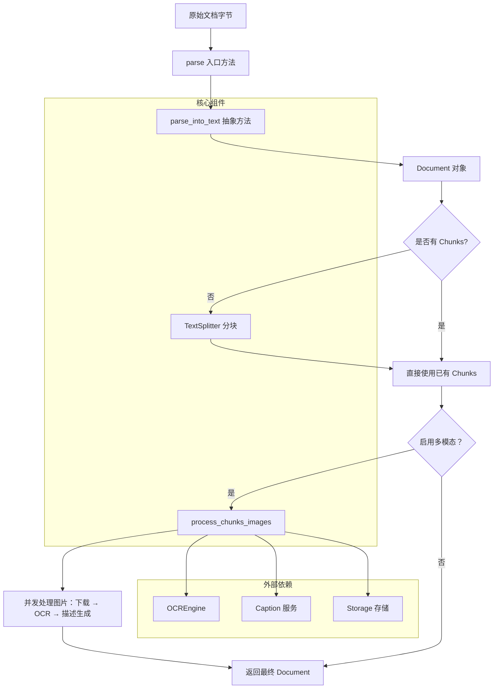

# parser_base_abstractions 模块深度解析

## 概述：为什么需要这个模块

想象你有一个文档处理工厂，每天要处理成千上万份不同格式的文档——PDF、Word、Markdown、图片……每份文档最终都要被切成合适大小的"知识块"（Chunk），供下游的检索系统使用。如果为每种格式都写一套独立的解析逻辑，代码会迅速膨胀成难以维护的"意大利面条"。

`parser_base_abstractions` 模块的核心价值在于**统一抽象**。它定义了所有解析器必须遵循的契约（`BaseParser` 抽象基类），同时封装了跨格式的通用能力：文本分块（Chunking）、多模态处理（OCR + 图片描述）、并发控制、安全校验。具体格式的解析逻辑（如 PDF 解析、Word 解析）由子类实现，但都复用基类提供的"基础设施"。

这个设计的关键洞察是：**不同文档格式的解析流程本质上是相同的**——读取原始字节 → 提取文本和图片 → 切分成块 → 为图片添加元数据（OCR 文本、描述）。变化的只是"提取文本"这一步的具体实现，其他环节完全可以标准化。

---

## 架构全景：数据如何流动



### 数据流详解

1. **入口**：调用 `parse(content: bytes)` 方法，传入文档的原始字节
2. **文本提取**：`parse_into_text()` 由子类实现（如 `PDFParser` 调用 PDF 库，`DocxParser` 调用 python-docx），返回包含纯文本和图片映射的 `Document` 对象
3. **分块决策**：如果子类已经生成了 Chunks，直接使用；否则调用 `TextSplitter` 按配置的分隔符和大小进行切分
4. **多模态增强**（可选）：遍历每个 Chunk，提取其中的图片 URL，并发执行下载、上传到对象存储、OCR 识别、VLM 描述生成
5. **输出**：返回带有完整元数据的 `Document`，包含文本 Chunks 和每张图片的 `ocr_text`、`caption`、`cos_url`

---

## 核心组件深度解析

### BaseParser 抽象基类

**设计意图**：定义解析器的"最小公共接口"，同时提供可复用的默认实现。

#### 关键属性与配置

```python
def __init__(
    self,
    file_name: str = "",
    file_type: Optional[str] = None,
    enable_multimodal: bool = True,      # 是否处理图片
    chunk_size: int = 1000,              # 每块最大字符数
    chunk_overlap: int = 200,            # 块间重叠字符数
    separators: list[str] = ["\n\n", "\n", "。"],  # 分隔符优先级
    ocr_backend: str = "no_ocr",         # OCR 引擎类型
    max_concurrent_tasks: int = 5,       # 图片处理并发数
    max_chunks: int = 1000,              # 返回块数上限
    chunking_config: Optional[ChunkingConfig] = None,
    **kwargs,
):
```

这些参数不是随意堆砌的，它们对应着文档解析的三个核心维度：

| 维度 | 参数 | 设计考量 |
|------|------|----------|
| **分块策略** | `chunk_size`, `chunk_overlap`, `separators` | 平衡检索精度与上下文完整性。重叠避免语义断裂，分隔符优先级保证自然分段 |
| **多模态** | `enable_multimodal`, `ocr_backend`, `max_concurrent_tasks` | OCR 是耗时操作，并发控制防止资源耗尽；可按需关闭以提速 |
| **资源保护** | `max_chunks`, `max_image_size` | 防止恶意大文档拖垮服务，图片缩放避免超大图消耗 OCR 资源 |

#### 抽象方法：`parse_into_text(content: bytes) -> Document`

这是子类**必须实现**的唯一方法。它的设计体现了"关注点分离"原则：

- **基类负责**：分块逻辑、图片处理、并发控制、存储上传
- **子类负责**：从特定格式中提取纯文本和图片

例如 `PDFParser` 会用 PyMuPDF 读取页面文本，`MarkdownParser` 直接读取字符串。这种设计让新增格式解析器变得简单——只需关注格式特有的提取逻辑，其他能力自动继承。

#### 文本分块：`chunk_text(text: str) -> List[Chunk]`

这是模块中最复杂的算法之一。它的核心挑战是：**如何在固定大小的块中保持语义结构的完整性**？

 naive 的做法是按字符数硬切，但这会切断 Markdown 表格、代码块、LaTeX 公式。`BaseParser` 的解决方案是"保护模式分割"：

```python
# 1. 定义需要保护的结构模式
protected_patterns = [
    r"(?m)(^\|.*\|[ \t]*\r?\n...)",  # Markdown 表格
    r"```[\s\S]*?```",                # 代码块
    r"\$\$[\s\S]*?\$\$",              # LaTeX 公式
    r"!\[.*?\]\(.*?\)",               # 图片链接
]

# 2. 找到所有受保护区域的起止位置
protected_ranges = [(match.start(), match.end()) for match in ...]

# 3. 合并重叠区域，得到不相交的保护块
merged_ranges = self._merge_overlaps(protected_ranges)

# 4. 在保护块之间用分隔符分割，保护块本身保持完整
units = []
for start, end in protected_ranges:
    # 保护块前的文本：用分隔符分割
    pre_text = text[last_end:start]
    units.extend(re.split(separator_pattern, pre_text))
    # 保护块本身：作为整体添加
    units.append(text[start:end])
```

这种设计类似"先圈出禁区，再在安全区域施工"。代价是算法复杂度从 O(n) 升到 O(n²)，但保证了表格、公式等结构不会被切成两半——这对下游检索的准确性至关重要。

#### 图片处理：异步并发模型

图片处理是 I/O 密集型操作（下载、上传、API 调用），`BaseParser` 使用 `asyncio` + 信号量实现并发控制：

```python
async def process_multiple_images(self, images_data: List[Tuple[Image.Image, str]]):
    semaphore = asyncio.Semaphore(self.max_concurrent_tasks)  # 限制并发数
    
    tasks = [
        self.process_with_limit(i, img, url, semaphore)
        for i, (img, url) in enumerate(images_data)
    ]
    
    results = await asyncio.gather(*tasks, return_exceptions=True)  # 容忍部分失败
```

**设计权衡**：
- **为什么用信号量而不是 `asyncio.Semaphore` 直接装饰？** 显式传递信号量让并发控制更透明，便于调试和测试
- **为什么 `return_exceptions=True`？** 单张图片失败不应导致整个文档解析失败，体现"尽力而为"的容错哲学
- **为什么有 30 秒超时？** OCR 服务可能挂起，超时防止任务无限阻塞

#### 安全校验：`_is_safe_url(url: str) -> bool`

这是一个容易被忽视但至关重要的方法。它防止 SSRF（服务器端请求伪造）攻击：

```python
def _is_safe_url(url: str) -> bool:
    parsed_url = urlparse(url)
    
    # 1. 只允许 http/https 协议
    if parsed_url.scheme not in ["http", "https"]:
        return False
    
    # 2. 拒绝私有 IP、回环地址、云元数据端点
    try:
        ip = ipaddress.ip_address(hostname)
        if ip.is_private or ip.is_loopback or ip.is_link_local:
            return False
    except ValueError:
        # 3. 拒绝常见内部主机名
        restricted_hostnames = [
            "localhost", "metadata.google.internal",
            "169.254.169.254",  # AWS 元数据
        ]
        if hostname_lower in restricted_hostnames:
            return False
    
    return True
```

**为什么重要？** 如果攻击者能传入 `http://169.254.169.254/latest/meta-data/` 这样的 URL，可能窃取云实例的 IAM 凭证。这个方法是安全底线，任何外部 URL 下载前都必须经过它。

---

### 依赖组件分析

#### TextSplitter（来自 `docreader.splitter.splitter`）

`BaseParser` 内部使用 `TextSplitter` 进行分块，但它自己也实现了 `chunk_text` 方法。两者的关系是：

- **`TextSplitter`**：更通用的分块器，支持标题跟踪（HeaderTracker）、受保护正则表达式配置
- **`BaseParser.chunk_text`**：针对 Markdown 结构优化的专用版本，硬编码了表格、代码块、公式的保护逻辑

**设计张力**：为什么有两套分块逻辑？历史原因。`BaseParser.chunk_text` 是早期实现，`TextSplitter` 是后来抽象出的通用组件。当前代码中两者并存，`parse` 方法优先使用子类返回的 Chunks，没有时才调用 `TextSplitter`。这是一个技术债点，未来应统一。

#### OCREngine（来自 `docreader.ocr`）

OCR 引擎采用**工厂模式 + 单例缓存**：

```python
@classmethod
def get_instance(cls, backend_type: str) -> OCRBackend:
    with cls._lock:
        if backend_type not in cls._instances:
            cls._instances[backend_type] = PaddleOCRBackend()  # 或其他
        return cls._instances[backend_type]
```

**关键设计**：
- **懒加载**：首次调用时才初始化 OCR 引擎，避免不必要的资源占用
- **失败熔断**：`_ocr_engine_failed` 标志位防止重复尝试初始化失败的引擎
- **线程安全**：使用锁保护实例创建过程

#### Caption 服务（来自 `docreader.parser.caption`）

图片描述生成调用 VLM（Vision Language Model）API，支持 OpenAI 和 Ollama 两种接口：

```python
def get_caption(self, image_data: str) -> str:
    caption_resp = self._call_caption_api(image_data)
    return caption_resp.choice_data() if caption_resp else ""
```

**设计注意**：
- **超时保护**：API 调用有 30 秒超时，防止 VLM 服务响应慢拖慢整体流程
- **优雅降级**：描述生成失败返回空字符串，不中断解析流程
- **配置灵活**：支持从 `ChunkingConfig.vlm_config` 或环境变量读取 API 配置

#### Storage 存储（来自 `docreader.parser.storage`）

图片上传到对象存储（MinIO、COS、本地文件系统等）通过 `Storage` 抽象接口：

```python
self.storage = create_storage(
    self.chunking_config.storage_config if self.chunking_config else None
)
```

**策略模式**：`create_storage` 根据配置返回不同的存储实现（`MinioStorage`、`CosStorage`、`LocalStorage`），上层代码无需关心具体存储类型。这使系统能灵活切换存储后端。

---

## 设计决策与权衡

### 1. 同步 vs 异步：混合模型

`parse` 方法是同步的，但内部图片处理用 `asyncio`：

```python
def parse(self, content: bytes) -> Document:
    # ... 同步代码 ...
    if self.enable_multimodal:
        chunks = self.process_chunks_images(chunks, document.images)  # 内部创建事件循环
    
    return document
```

**为什么这样设计？**
- **兼容性**：上游调用者（如 HTTP 处理器）可能是同步代码，同步接口降低集成成本
- **性能**：图片处理是 I/O 密集型，异步并发能充分利用等待时间
- **代价**：在同步方法内创建事件循环（`loop.run_until_complete`）略显笨重，但避免了重构整个调用链

**潜在问题**：如果在已有事件循环的异步环境中调用 `parse`，会触发 `RuntimeError`。当前代码用 `try-except` 捕获并创建新循环，但这不是长久之计。理想方案是提供 `parse_async` 版本。

### 2. 继承 vs 组合：选择继承

`BaseParser` 使用继承让子类复用分块、图片处理逻辑，而非组合（如传入 `Chunker`、`ImageProcessor` 对象）。

**权衡分析**：
| 方案 | 优点 | 缺点 |
|------|------|------|
| **继承** | 代码复用直接，子类实现简单 | 耦合度高，难以替换分块策略 |
| **组合** | 灵活，可运行时切换策略 | 增加构造函数参数，调用链变长 |

当前选择继承是因为：
1. 分块和图片处理逻辑相对稳定，不太需要替换
2. 简化子类实现（如 `PDFParser` 只需几十行代码）
3. 历史原因，早期设计未预见复杂场景

**扩展点**：如果未来需要动态切换分块策略，应引入组合模式，将 `chunk_text` 和 `process_chunks_images` 抽取为独立服务类。

### 3. 并发控制：信号量 vs 连接池

图片处理使用 `asyncio.Semaphore` 限制并发数，而非 HTTP 连接池。

**为什么？**
- **粒度匹配**：并发限制针对"图片处理任务"（包含下载、OCR、上传），不仅是 HTTP 请求
- **简单透明**：信号量语义清晰，易于调整 `max_concurrent_tasks` 参数
- **资源隔离**：避免 OCR 服务被大量并发请求压垮

**代价**：每个 Parser 实例独立管理信号量，无法跨实例共享限流。如果系统同时解析多个文档，总并发数 = 文档数 × `max_concurrent_tasks`。在高并发场景下，应在全局层面增加限流层。

### 4. 错误处理：容忍部分失败

图片下载、OCR、描述生成任何一步失败，都返回空值而非抛出异常：

```python
except Exception as e:
    logger.error(f"OCR processing error, skipping this image: {str(e)}")
    ocr_text = ""  # 降级为空字符串
```

**设计哲学**：文档解析是"尽力而为"的服务。单张图片失败不应导致整个文档解析失败，尤其是 OCR 服务可能因网络波动临时不可用。

**风险**：调用者可能误以为图片处理成功（因为没抛异常），实际 `ocr_text` 为空。应在 `Chunk` 元数据中添加 `ocr_status` 字段标识处理状态。

---

## 使用指南与示例

### 基础用法

```python
from docreader.parser.pdf_parser import PDFParser
from docreader.models.read_config import ChunkingConfig

# 配置分块参数
config = ChunkingConfig(
    chunk_size=512,
    chunk_overlap=50,
    enable_multimodal=True,
    storage_config={"provider": "minio", "endpoint": "..."},
    vlm_config={"base_url": "...", "model_name": "..."},
)

# 创建解析器
parser = PDFParser(
    file_name="document.pdf",
    chunking_config=config,
    ocr_backend="paddle",
    max_concurrent_tasks=5,
)

# 解析文档
with open("document.pdf", "rb") as f:
    content = f.read()

document = parser.parse(content)

# 访问结果
for chunk in document.chunks:
    print(f"Chunk {chunk.seq}: {chunk.content[:100]}...")
    for img in chunk.images:
        print(f"  Image: {img['cos_url']}, OCR: {img['ocr_text'][:50]}...")
```

### 自定义解析器

实现新格式解析器只需继承 `BaseParser` 并实现 `parse_into_text`：

```python
from docreader.parser.base_parser import BaseParser
from docreader.models.document import Document

class CustomParser(BaseParser):
    def parse_into_text(self, content: bytes) -> Document:
        # 1. 提取纯文本
        text = self._extract_text(content)
        
        # 2. 提取图片（可选）
        images = self._extract_images(content)  # Dict[url, image_bytes]
        
        return Document(content=text, images=images)
```

### 关闭多模态处理

如果不需要图片 OCR 和描述，关闭多模态可显著提升速度：

```python
parser = PDFParser(
    file_name="document.pdf",
    enable_multimodal=False,  # 跳过图片处理
    ocr_backend="no_ocr",
)
```

---

## 边界情况与陷阱

### 1. 事件循环冲突

在异步环境中调用 `parse` 可能触发错误：

```python
# ❌ 错误示例：在 async 函数中直接调用
async def handler():
    parser = PDFParser(...)
    document = parser.parse(content)  # 可能报错：RuntimeError
```

**解决方案**：使用 `asyncio.to_thread` 将同步调用放到线程池：

```python
# ✅ 正确示例
async def handler():
    parser = PDFParser(...)
    document = await asyncio.to_thread(parser.parse, content)
```

### 2. OCR 引擎初始化失败

OCR 引擎首次初始化可能失败（如缺少依赖库），之后会返回 `None`：

```python
ocr_engine = OCREngine.get_instance("paddle")
if ocr_engine is None:
    # 降级处理：跳过 OCR 或切换到备用引擎
    pass
```

**建议**：在应用启动时预检 OCR 引擎可用性，而非等到解析时才发现问题。

### 3. 图片 URL 安全校验误杀

`_is_safe_url` 可能误杀合法的内网图片 URL（如公司内网图床）：

```python
# 如果图片在 http://internal-cdn.example.com/image.png
# 而该域名解析到内网 IP，会被拒绝
```

**解决方案**：在 `CONFIG` 中添加白名单机制，允许受信任的内网域名。

### 4. 分块大小与重叠的相互作用

`chunk_overlap` 不应超过 `chunk_size` 的一半，否则会导致大量重复：

```python
# ❌ 不合理配置
ChunkingConfig(chunk_size=512, chunk_overlap=400)  # 重叠 78%

# ✅ 合理配置
ChunkingConfig(chunk_size=512, chunk_overlap=100)  # 重叠 20%
```

**经验法则**：重叠大小应略大于平均句子长度，保证语义完整性即可。

### 5. 内存泄漏风险

`process_multiple_images` 虽有关闭图片对象的逻辑，但在异常路径下可能泄漏：

```python
try:
    # 处理图片
    pass
finally:
    images_data.clear()  # 清理引用
    # 但 PIL Image 对象可能未被垃圾回收
```

**建议**：在长时间运行的服务中，定期调用 `gc.collect()` 强制回收大对象。

---

## 与其他模块的关系

| 依赖模块 | 关系说明 |
|----------|----------|
| [docreader.ocr](ocr_engine_interface.md) | 调用 `OCREngine.get_instance()` 获取 OCR 后端 |
| [docreader.parser.caption](caption_prompt_contracts.md) | 使用 `Caption` 服务生成图片描述 |
| [docreader.parser.storage](storage 模块) | 通过 `create_storage()` 获取存储客户端上传图片 |
| [docreader.splitter.splitter](splitter 模块) | 使用 `TextSplitter` 进行文本分块（备选方案） |
| [docreader.models.document](document_models_and_chunking_support.md) | 依赖 `Document` 和 `Chunk` 数据模型 |
| [docreader.models.read_config](chunking_configuration.md) | 从 `ChunkingConfig` 读取分块和多模态配置 |

---

## 总结：模块的核心价值

`parser_base_abstractions` 是文档解析流水线的"骨架"。它通过抽象基类统一了不同格式解析器的接口，通过复用逻辑减少了代码重复，通过并发控制和错误处理保证了服务的鲁棒性。

**关键设计原则**：
1. **关注点分离**：基类处理通用流程，子类专注格式特有逻辑
2. **容错优先**：单点失败不影响整体，降级而非崩溃
3. **安全底线**：SSRF 校验、并发限制、资源保护
4. **灵活配置**：分块策略、多模态开关、存储后端均可配置

**待改进点**：
- 同步/异步混合模型应统一为纯异步接口
- 分块逻辑应迁移到 `TextSplitter`，消除重复代码
- 增加全局并发限流，防止多文档解析时资源耗尽

理解这个模块的设计思想，有助于在扩展新解析器或优化现有流程时做出符合系统哲学的决策。
