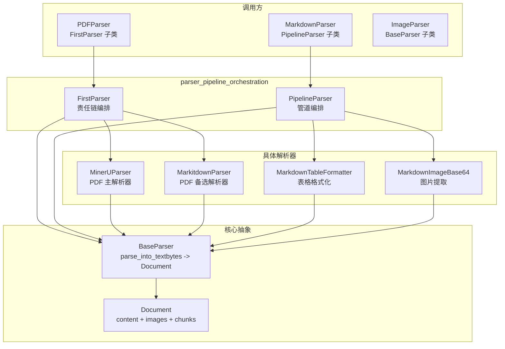

# parser_pipeline_orchestration 模块深度解析

## 概述：为什么需要解析器编排？

想象你正在运营一个多语言客服中心 —— 客户可能通过电话、邮件、在线聊天等多种渠道联系你。你不能指望单一的处理流程能完美应对所有情况。有时电话线路故障了，你需要自动切换到邮件处理；有时一封邮件里既有文字又有附件，你需要先提取附件再处理正文。

`parser_pipeline_orchestration` 模块解决的正是这个问题，但场景是**文档解析**。系统需要处理的文档格式千差万别：PDF 可能来自不同生成器、Markdown 可能包含内嵌图片、Word 文档可能是 `.doc` 或 `.docx` 格式。单一解析器无法可靠地处理所有情况。

这个模块提供了两种编排模式：

1. **FirstParser（责任链模式）**：尝试多个解析器，直到有一个成功。就像你有一串钥匙，挨个试直到打开门。
2. **PipelineParser（管道模式）**：多个解析器串联，前一个的输出是后一个的输入。就像工厂流水线，原材料经过多道工序变成成品。

这两种模式都建立在 `BaseParser` 的统一接口之上，使得解析逻辑可以灵活组合而不破坏现有代码。

---

## 架构设计



### 组件角色说明

| 组件 | 职责 | 设计模式 |
|------|------|----------|
| `BaseParser` | 定义解析器接口 `parse_into_text(content: bytes) -> Document`，提供 OCR、分块、图片处理等通用能力 | 模板方法模式 |
| `FirstParser` | 按顺序尝试多个解析器，返回第一个成功的结果；全部失败则返回空 `Document` | 责任链模式 |
| `PipelineParser` | 将内容依次通过多个解析器，累积图片资源，最终输出整合后的 `Document` | 管道/过滤器模式 |
| `Document` | 统一的数据载体，包含文本内容、图片映射、分块结果和元数据 | 数据传输对象 |

### 数据流追踪

以 `PDFParser` 解析 PDF 文件为例：

```
原始 PDF 字节
    ↓
PDFParser.parse_into_text() 被调用
    ↓
FirstParser 遍历 [MinerUParser, MarkitdownParser]
    ↓
尝试 MinerUParser.parse_into_text(content)
    ├─ 成功 → 返回 Document(content="提取的文本", images={...})
    └─ 失败 → 捕获异常，记录日志，尝试下一个
    ↓
尝试 MarkitdownParser.parse_into_text(content)
    ↓
返回第一个有效的 Document
    ↓
调用方获得解析结果
```

以 `MarkdownParser` 解析 Markdown 文件为例：

```
原始 Markdown 字节
    ↓
MarkdownParser.parse_into_text() 被调用
    ↓
PipelineParser 遍历 [MarkdownTableFormatter, MarkdownImageBase64]
    ↓
阶段 1: MarkdownTableFormatter.parse_into_text(content)
    → 输出：标准化表格格式的 Markdown 文本
    → content 被更新为阶段 1 的输出
    ↓
阶段 2: MarkdownImageBase64.parse_into_text(content)
    → 输出：提取 base64 图片并上传到存储
    → 累积图片到 images 字典
    ↓
合并所有阶段的 images
    ↓
返回最终 Document
```

---

## 组件深度解析

### FirstParser：第一个成功的解析器

**设计意图**

`FirstParser` 的核心思想是**优雅降级**。在真实生产环境中，解析器可能因为各种原因失败：依赖服务不可用、文件格式不规范、资源超限等。如果只有一个解析器，失败就意味着整个流程中断。`FirstParser` 通过维护一个解析器列表，确保即使主解析器失败，系统仍有备选方案。

**内部机制**

```python
class FirstParser(BaseParser):
    _parser_cls: Tuple[Type["BaseParser"], ...] = ()  # 类级别配置
    
    def __init__(self, *args, **kwargs):
        super().__init__(*args, **kwargs)
        # 实例化所有配置的解析器类
        self._parsers: List[BaseParser] = []
        for parser_cls in self._parser_cls:
            parser = parser_cls(*args, **kwargs)
            self._parsers.append(parser)
    
    def parse_into_text(self, content: bytes) -> Document:
        for p in self._parsers:
            try:
                document = p.parse_into_text(content)
            except Exception:
                logger.exception("解析失败，尝试下一个")
                continue
            
            if document.is_valid():  # 关键：检查内容是否非空
                return document
        return Document()  # 全部失败返回空文档
```

**关键设计点**

1. **类级别配置 `_parser_cls`**：解析器类型在类定义时确定，而不是实例化时。这使得可以通过继承快速创建特定组合的解析器，而无需重复编写样板代码。

2. **工厂方法 `create()`**：
   ```python
   @classmethod
   def create(cls, *parser_classes: Type["BaseParser"]) -> Type["FirstParser"]:
       names = "_".join([p.__name__ for p in parser_classes])
       return type(f"FirstParser_{names}", (cls,), {"_parser_cls": parser_classes})
   ```
   这个设计允许动态生成子类，例如：
   ```python
   PDFParser = FirstParser.create(MinerUParser, MarkitdownParser)
   ```
   生成的类名为 `FirstParser_MinerUParser_MarkitdownParser`，便于日志追踪和调试。

3. **有效性检查 `document.is_valid()`**：不是所有"成功返回"都意味着解析成功。`Document.is_valid()` 检查 `content != ""`，确保返回的文档确实包含内容。这防止了解析器"成功"返回空结果的情况。

**参数与返回值**

| 参数 | 类型 | 说明 |
|------|------|------|
| `content` | `bytes` | 原始文档字节流 |
| 返回 | `Document` | 第一个成功解析器的结果，或空 `Document` |

**副作用**

- 记录每个解析器的尝试日志
- 捕获并记录异常，但不中断流程
- 不修改输入 `content`

---

### PipelineParser：多阶段处理流水线

**设计意图**

有些解析任务需要多阶段处理。例如，解析 Markdown 时：
1. 先标准化表格格式（确保后续处理一致性）
2. 再提取并上传 base64 图片（依赖标准化后的内容）

`PipelineParser` 将这种需求抽象为管道：每个阶段接收上一阶段的输出，处理后再传递给下一阶段。

**内部机制**

```python
class PipelineParser(BaseParser):
    def parse_into_text(self, content: bytes) -> Document:
        images: Dict[str, str] = {}  # 累积所有阶段的图片
        document = Document()
        
        for p in self._parsers:
            document = p.parse_into_text(content)  # 当前阶段解析
            content = endecode.encode_bytes(document.content)  # 转为字节传给下一阶段
            images.update(document.images)  # 累积图片
        
        document.images.update(images)  # 合并所有图片
        return document
```

**关键设计点**

1. **内容转换 `encode_bytes()`**：管道中传递的是 `bytes`，但解析器返回的是 `Document`（包含 `str` 内容）。`PipelineParser` 负责在阶段间进行转换，确保接口一致性。

2. **图片累积**：每个阶段可能提取不同的图片。`PipelineParser` 维护一个 `images` 字典，合并所有阶段的图片资源。这是管道模式与责任链模式的关键区别 —— 责任链只返回第一个成功的结果，管道则整合所有阶段的产出。

3. **顺序敏感性**：管道的输出高度依赖解析器的顺序。`[A, B]` 和 `[B, A]` 可能产生完全不同的结果。设计管道时需要仔细考虑阶段依赖关系。

**使用示例**

```python
# MarkdownParser 的定义
class MarkdownParser(PipelineParser):
    _parser_cls = (MarkdownTableFormatter, MarkdownImageBase64)

# 等价于
MarkdownParser = PipelineParser.create(MarkdownTableFormatter, MarkdownImageBase64)
```

**参数与返回值**

| 参数 | 类型 | 说明 |
|------|------|------|
| `content` | `bytes` | 原始文档字节流 |
| 返回 | `Document` | 经过所有阶段处理后的最终文档，包含累积的图片 |

**副作用**

- 按顺序调用每个解析器
- 修改 `content` 变量在阶段间传递
- 累积并合并所有阶段的 `images`

---

### Document：统一的数据载体

**设计意图**

`Document` 是解析流程中的核心数据模型。它需要承载：
- 文本内容（解析的主要产出）
- 图片资源（多模态解析的产出）
- 分块结果（下游检索的输入）
- 元数据（调试和追踪用）

**结构定义**

```python
class Document(BaseModel):
    content: str = ""                    # 文本内容
    images: Dict[str, str] = {}          # 图片 URL → base64 映射
    chunks: List[Chunk] = []             # 分块结果
    metadata: Dict[str, Any] = {}        # 元数据
    
    def is_valid(self) -> bool:
        return self.content != ""
```

**关键设计点**

1. **`images` 字典的设计**：键是图片 URL，值是 base64 编码。这种设计允许：
   - 快速查找图片内容
   - 避免重复上传相同图片
   - 在管道阶段间传递图片资源

2. **`is_valid()` 的简单逻辑**：只检查 `content != ""`。这意味着即使 `images` 为空，只要有文本内容就算有效。这符合大多数场景的需求 —— 文本是核心，图片是增强。

3. **Pydantic BaseModel**：使用 Pydantic 提供类型验证和序列化能力，便于与 API 层集成。

---

## 依赖关系分析

### 上游依赖（谁调用这个模块）

| 调用方 | 调用方式 | 期望 |
|--------|----------|------|
| `PDFParser` | 继承 `FirstParser` | 按顺序尝试多个 PDF 解析后端 |
| `MarkdownParser` | 继承 `PipelineParser` | 多阶段处理 Markdown 内容 |
| 其他格式解析器 | 可能继承 `FirstParser` 或 `PipelineParser` | 灵活的解析策略组合 |

### 下游依赖（这个模块调用谁）

| 被调用方 | 调用原因 | 耦合程度 |
|----------|----------|----------|
| `BaseParser` | 父类，定义接口 | 强耦合（继承关系） |
| `Document` | 返回类型 | 强耦合（类型依赖） |
| `endecode.encode_bytes` | 管道中内容转换 | 中等耦合（工具函数） |

### 数据契约

**输入契约**
- `content: bytes`：原始文档字节流
- 解析器类必须继承 `BaseParser` 并实现 `parse_into_text()`

**输出契约**
- `Document`：包含 `content`、`images`、`chunks`、`metadata`
- `FirstParser` 可能返回空 `Document`（全部解析失败）
- `PipelineParser` 保证返回经过所有阶段处理的 `Document`

---

## 设计决策与权衡

### 1. 类级别配置 vs 实例级别配置

**选择**：`_parser_cls` 是类变量，不是实例变量。

**权衡**：
- ✅ 优点：通过继承快速创建特定组合，代码复用性高
- ❌ 缺点：同一类的所有实例共享相同的解析器组合，无法动态调整

**为什么这样设计**：解析器组合通常是固定的（如 PDF 总是先试 MinerU 再试 Markitdown），类级别配置简化了常见用例。如果需要动态组合，可以直接实例化 `FirstParser` 并手动设置 `_parsers`。

### 2. 异常处理策略

**选择**：捕获所有异常，记录日志，继续尝试下一个解析器。

**权衡**：
- ✅ 优点：系统鲁棒性强，单个解析器失败不影响整体流程
- ❌ 缺点：可能掩盖严重的配置错误或依赖问题

**为什么这样设计**：文档解析是"尽力而为"的任务。即使所有解析器都失败，返回空 `Document` 也比抛出异常中断流程更好。调用方可以根据空结果决定后续处理（如标记为"解析失败"并通知用户）。

### 3. 管道中的内容转换

**选择**：使用 `endecode.encode_bytes()` 将 `Document.content` 转回 `bytes` 传递给下一阶段。

**权衡**：
- ✅ 优点：保持接口一致性，所有解析器都接收 `bytes` 返回 `Document`
- ❌ 缺点：额外的编码/解码开销，可能丢失编码信息

**为什么这样设计**：统一接口简化了解析器的实现。每个解析器不需要关心输入来源（原始文件还是上一阶段输出），只需要处理 `bytes`。编码开销相对于解析操作本身通常可以忽略。

### 4. 图片累积策略

**选择**：`PipelineParser` 累积所有阶段的图片，使用 `dict.update()` 合并。

**权衡**：
- ✅ 优点：保留所有阶段提取的图片，适合多阶段图片处理
- ❌ 缺点：如果不同阶段提取了相同图片的不同版本，后出现的会覆盖先出现的

**为什么这样设计**：在 Markdown 解析场景中，不同阶段处理不同类型的图片（如 base64 内嵌图片 vs 外部链接图片），冲突概率低。如果需要更复杂的合并逻辑，可以子类化 `PipelineParser` 重写 `parse_into_text()`。

---

## 使用指南

### 创建 FirstParser

```python
# 方式 1：使用工厂方法（推荐）
PDFParser = FirstParser.create(MinerUParser, MarkitdownParser)
parser = PDFParser(file_name="document.pdf")
document = parser.parse_into_text(pdf_bytes)

# 方式 2：继承定义
class MyPDFParser(FirstParser):
    _parser_cls = (MinerUParser, MarkitdownParser)

parser = MyPDFParser(file_name="document.pdf")
document = parser.parse_into_text(pdf_bytes)
```

### 创建 PipelineParser

```python
# 方式 1：使用工厂方法
CustomMarkdownParser = PipelineParser.create(
    MarkdownTableFormatter,
    MarkdownImageBase64,
    PostProcessingParser
)
parser = CustomMarkdownParser(file_name="doc.md")
document = parser.parse_into_text(markdown_bytes)

# 方式 2：继承定义（如 MarkdownParser）
class MarkdownParser(PipelineParser):
    _parser_cls = (MarkdownTableFormatter, MarkdownImageBase64)
```

### 处理解析结果

```python
document = parser.parse_into_text(content_bytes)

if document.is_valid():
    print(f"解析成功：{len(document.content)} 字符")
    print(f"图片数量：{len(document.images)}")
    print(f"分块数量：{len(document.chunks)}")
else:
    print("所有解析器都失败了")
    # 处理失败情况：记录日志、通知用户、尝试其他策略等
```

### 配置解析器参数

```python
# 所有解析器共享的配置
parser = PDFParser(
    file_name="document.pdf",
    enable_multimodal=True,      # 启用多模态（图片 OCR 和描述）
    chunk_size=1000,             # 分块大小
    chunk_overlap=200,           # 分块重叠
    ocr_backend="paddle",        # OCR 引擎
    max_concurrent_tasks=5,      # 并发任务数
    max_chunks=1000,             # 最大分块数
)
```

---

## 边界情况与注意事项

### 1. 全部解析器失败

`FirstParser` 在所有解析器失败时返回空 `Document`（`content == ""`）。调用方必须检查 `document.is_valid()`：

```python
# ❌ 错误：未检查有效性
document = parser.parse_into_text(content)
process(document.content)  # 可能处理空字符串

# ✅ 正确：检查有效性
document = parser.parse_into_text(content)
if document.is_valid():
    process(document.content)
else:
    handle_parse_failure()
```

### 2. 管道顺序敏感性

`PipelineParser` 的输出依赖解析器顺序。错误的顺序可能导致：

```python
# ❌ 错误顺序：先提取图片再格式化表格
# 如果表格格式化改变了图片引用，提取的图片可能失效
WrongParser = PipelineParser.create(MarkdownImageBase64, MarkdownTableFormatter)

# ✅ 正确顺序：先格式化再提取
RightParser = PipelineParser.create(MarkdownTableFormatter, MarkdownImageBase64)
```

### 3. 图片键冲突

`PipelineParser` 使用 `dict.update()` 合并图片。如果不同阶段产生相同 URL 的图片，后出现的会覆盖先出现的：

```python
# 阶段 1 提取图片
images = {"img1.jpg": "base64_data_1"}

# 阶段 2 提取同名图片（不同内容）
images.update({"img1.jpg": "base64_data_2"})  # 覆盖！

# 最终 images["img1.jpg"] == "base64_data_2"
```

如果这不符合预期，需要子类化 `PipelineParser` 实现自定义合并逻辑。

### 4. 异常日志淹没

`FirstParser` 捕获所有异常并记录日志。如果解析器频繁失败（如依赖服务不可用），日志可能被淹没。建议：

- 监控 `FirstParser` 的失败率
- 在解析器内部处理可预见的错误，避免抛出异常
- 考虑添加失败次数阈值，超过后跳过该解析器

### 5. 编码问题

`PipelineParser` 使用 `endecode.encode_bytes()` 转换内容。如果内容包含特殊编码，可能出现问题：

```python
# 某些解析器可能返回非 UTF-8 编码的内容
# encode_bytes() 需要正确处理编码转换
content = endecode.encode_bytes(document.content)
```

确保 `endecode` 模块正确处理各种编码场景。

---

## 扩展指南

### 添加新的解析器组合

```python
# 创建新的 FirstParser 组合
HTMLParser = FirstParser.create(
    BeautifulSoupParser,
    RegexHTMLParser,
    PlainTextFallbackParser
)

# 创建新的 PipelineParser 组合
EnhancedMarkdownParser = PipelineParser.create(
    MarkdownTableFormatter,
    MarkdownImageBase64,
    MarkdownLinkValidator,  # 新增阶段
    MarkdownTOCGenerator    # 新增阶段
)
```

### 自定义 FirstParser 行为

```python
class LoggingFirstParser(FirstParser):
    def parse_into_text(self, content: bytes) -> Document:
        start_time = time.time()
        result = super().parse_into_text(content)
        elapsed = time.time() - start_time
        
        # 添加性能日志
        logger.info(f"FirstParser completed in {elapsed:.2f}s")
        
        # 添加指标上报
        metrics.record("parser_latency", elapsed)
        
        return result
```

### 自定义 PipelineParser 图片合并

```python
class ConflictAwarePipelineParser(PipelineParser):
    def parse_into_text(self, content: bytes) -> Document:
        images: Dict[str, str] = {}
        document = Document()
        
        for p in self._parsers:
            document = p.parse_into_text(content)
            content = endecode.encode_bytes(document.content)
            
            # 自定义合并逻辑：检测冲突
            for url, data in document.images.items():
                if url in images and images[url] != data:
                    logger.warning(f"Image conflict for {url}")
                    # 可以选择保留第一个、最后一个、或两者都保留
                images[url] = data  # 这里选择保留最后一个
        
        document.images.update(images)
        return document
```

---

## 相关模块参考

- [parser_base_abstractions](parser_base_abstractions.md)：`BaseParser` 的详细设计，包括 OCR、分块、图片处理等通用能力
- [format_specific_parsers](format_specific_parsers.md)：各种具体格式解析器的实现（PDF、Markdown、Word 等）
- [document_models_and_chunking_support](document_models_and_chunking_support.md)：`Document` 和 `Chunk` 数据模型的详细定义
- [knowledge_ingestion_extraction_and_graph_services](knowledge_ingestion_extraction_and_graph_services.md)：解析结果如何被下游知识入库服务使用

---

## 总结

`parser_pipeline_orchestration` 模块通过两种编排模式（责任链和管道）解决了文档解析中的核心挑战：**如何在面对多样化、不可预测的输入时保持系统的鲁棒性和灵活性**。

**核心洞察**：
1. 单一解析器无法可靠处理所有情况 → 需要组合多个解析器
2. 组合有两种基本模式：备选（责任链）和串联（管道）
3. 统一接口（`BaseParser`）和数据模型（`Document`）是灵活组合的基础

**设计哲学**：
- **优雅降级优于崩溃**：`FirstParser` 确保即使所有解析器失败，系统仍能继续运行
- **组合优于继承**：通过工厂方法和类配置，快速创建新的解析器组合
- **明确的数据契约**：`Document` 作为统一载体，简化了阶段间的数据传递

理解这个模块的关键是把握两种编排模式的适用场景：当你需要**备选方案**时用 `FirstParser`，当你需要**多阶段处理**时用 `PipelineParser`。大多数实际场景是两者的结合 —— 如 `PDFParser` 使用 `FirstParser` 组合多个 PDF 解析后端，而每个后端内部可能使用 `PipelineParser` 进行多阶段处理。
