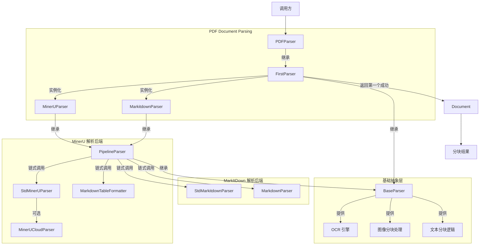

# PDF Document Parsing Module

## 概述

想象你有一个 PDF 文件需要解析成可检索的文本块 —— 这听起来简单，但现实要复杂得多。PDF 是一种"视觉优先"的格式：它关心的是内容在页面上的精确位置，而不是内容的语义结构。同一个 PDF，可能来自扫描的图像、原生数字文档、或混合了复杂表格和公式的技术论文。没有一种解析器能完美处理所有情况。

`pdf_document_parsing` 模块的核心设计洞察是：**与其寻找一个"完美"的解析器，不如构建一个能优雅降级的解析器链**。该模块实现了责任链模式（Chain of Responsibility），按优先级尝试多个解析后端，返回第一个成功解析的结果。这种设计承认了一个现实：PDF 解析本质上是一个启发式过程，不同文档需要不同的解析策略。

模块的核心组件 `PDFParser` 继承自 `FirstParser`，按顺序尝试：
1. **MinerUParser**（首选）— 专为 PDF 优化的解析器，擅长处理复杂布局、表格和公式
2. **MarkitdownParser**（降级）— 通用文档解析器，作为稳健的后备方案

这种"首选 + 降级"的架构确保了在大多数情况下获得高质量解析结果，同时在首选解析器失败时仍能返回可用结果。

## 架构与数据流



### 架构角色分析

**PDFParser** 扮演的是**编排器（Orchestrator）**角色。它不直接解析 PDF，而是协调多个后端解析器的工作。这种设计将"解析策略"与"解析实现"分离：`PDFParser` 决定尝试哪些解析器以及按什么顺序，而具体的解析逻辑委托给下游解析器。

**FirstParser** 是责任链模式的核心实现。它维护一个解析器实例列表，依次调用每个解析器的 `parse_into_text()` 方法。关键设计决策在于：
- **短路求值**：一旦某个解析器成功（通过 `document.is_valid()` 验证），立即返回结果，不再尝试后续解析器
- **异常隔离**：单个解析器的异常不会中断整个链，而是记录日志后尝试下一个解析器
- **空结果兜底**：如果所有解析器都失败，返回空 `Document` 而非抛出异常

**PipelineParser** 与 `FirstParser` 形成对比：它不是"选一个"，而是"全部执行"。每个解析器的输出作为下一个解析器的输入，图像结果会被累积合并。这种模式用于需要多阶段处理的场景（如先解析再格式化表格）。

### 数据流追踪

以解析一个包含表格的 PDF 为例：

```
原始 PDF 字节流
    ↓
PDFParser.parse_into_text(content: bytes)
    ↓
FirstParser 遍历解析器链：
    ├─→ MinerUParser.parse_into_text()
    │     ↓
    │   PipelineParser 执行管道：
    │     ├─→ StdMinerUParser: 解析 PDF → Markdown 文本
    │     └─→ MarkdownTableFormatter: 格式化表格 → 增强 Markdown
    │     ↓
    │   Document(content="...", images={...})
    │     ↓
    │   document.is_valid() → True
    │     ↓
    └─→ [返回，不再尝试 MarkitdownParser]
    ↓
BaseParser.parse() 后处理：
    ├─→ TextSplitter: 按 chunk_size 分割文本
    ├─→ 提取图像信息
    └─→ 并发处理图像（OCR + 描述生成）
    ↓
最终 Chunk 列表
```

## 组件深度解析

### PDFParser

**设计意图**：为 PDF 解析提供统一的入口点，隐藏后端解析器的复杂性。

**内部机制**：
```python
class PDFParser(FirstParser):
    _parser_cls = (MinerUParser, MarkitdownParser)
```

这个类的简洁性是其设计的精髓。它只做一件事：声明解析器优先级。所有复杂逻辑都继承自 `FirstParser`。这种设计遵循"约定优于配置"原则 — 大多数情况下默认配置就足够，但通过 `FirstParser.create()` 工厂方法可以自定义解析器链。

**参数与配置**：
`PDFParser` 本身不定义参数，但通过 `__init__` 将所有参数透传给下游解析器。关键参数包括：
- `ocr_backend`: OCR 引擎类型（`"paddle"`, `"vlm"`, `"no_ocr"`）
- `enable_multimodal`: 是否启用图像处理
- `chunk_size` / `chunk_overlap`: 分块大小和重叠
- `max_concurrent_tasks`: 图像处理的并发数

**返回值**：`Document` 对象，包含 `content`（文本）、`images`（图像映射）、`chunks`（分块结果）

**副作用**：
- 如果启用多模态，会异步下载并上传图像到对象存储
- 可能调用外部 OCR 服务（取决于 `ocr_backend` 配置）
- 记录详细的解析日志（每个解析器的尝试和结果）

### FirstParser

**设计意图**：实现"尝试直到成功"的解析策略，提供容错能力。

**核心方法**：
```python
def parse_into_text(self, content: bytes) -> Document:
    for p in self._parsers:
        try:
            document = p.parse_into_text(content)
        except Exception:
            logger.exception("...")
            continue
        
        if document.is_valid():
            return document
    return Document()
```

**关键设计决策**：

1. **什么是"有效"文档？** — `document.is_valid()` 的判断逻辑在 `Document` 类中定义（通常是检查 `content` 是否非空）。这意味着即使解析器没有抛出异常，如果它返回空内容，也会被视为失败并尝试下一个解析器。

2. **异常处理粒度** — 每个解析器被独立的 `try-except` 包裹。这防止了一个解析器的崩溃影响整个链。但这也意味着解析器内部的错误可能被静默吞掉（只记录日志），调用方可能不知道解析质量下降。

3. **工厂方法模式** — `FirstParser.create()` 允许动态创建解析器组合：
   ```python
   CustomPDFParser = FirstParser.create(MinerUParser, MarkitdownParser, TextParser)
   ```
   这种设计提供了扩展性，但当前 `PDFParser` 没有利用这个能力（硬编码了 `_parser_cls`）。

### MinerUParser

**设计意图**：作为 PDF 解析的首选后端，利用 MinerU 的布局分析能力处理复杂文档。

**内部机制**：
```python
class MinerUParser(PipelineParser):
    _parser_cls = (StdMinerUParser, MarkdownTableFormatter)
```

`MinerUParser` 本身也是一个管道：
1. **StdMinerUParser**：调用 MinerU 库解析 PDF，提取文本、表格、公式和图像
2. **MarkdownTableFormatter**：后处理表格，确保 Markdown 格式正确

**变体**：`MinerUCloudParser` 继承自 `StdMinerUParser`，使用远程 API 而非本地库。它实现了异步任务轮询模式（提交 → 查询状态 → 获取结果），适用于需要解耦解析计算的场景。

**依赖契约**：
- 需要 MinerU 库或远程 API 可用
- 如果 MinerU 不可用，`StdMinerUParser` 应返回空 `Document`，触发 `FirstParser` 尝试下一个解析器

### MarkitdownParser

**设计意图**：作为通用降级方案，处理 MinerU 无法解析的 PDF。

**内部机制**：
```python
class MarkitdownParser(PipelineParser):
    _parser_cls = (StdMarkitdownParser, MarkdownParser)
```

管道流程：
1. **StdMarkitdownParser**：使用 `markitdown` 库转换文档为 Markdown
2. **MarkdownParser**：后处理 Markdown 内容（如图像占位符替换）

**特点**：相比 MinerU，MarkItDown 更轻量、依赖更少，但对复杂布局（多栏、复杂表格）的处理能力较弱。

### BaseParser

**设计意图**：提供所有解析器的公共基础设施，避免重复代码。

**核心能力**：

1. **OCR 引擎管理**：
   ```python
   @classmethod
   def get_ocr_engine(cls, backend_type="paddle", **kwargs):
       if cls._ocr_engine is None and not cls._ocr_engine_failed:
           cls._ocr_engine = OCREngine.get_instance(backend_type, **kwargs)
       return cls._ocr_engine
   ```
   使用**单例模式 + 失败熔断**：OCR 引擎初始化失败后会设置 `_ocr_engine_failed` 标志，避免重复尝试。这是一个重要的性能优化 — OCR 初始化可能很慢，重复失败会拖慢整个系统。

2. **图像并发处理**：
   ```python
   async def process_multiple_images(self, images_data: List[Tuple[Image.Image, str]]):
       semaphore = asyncio.Semaphore(self.max_concurrent_tasks)
       tasks = [self.process_with_limit(i, img, url, semaphore) ...]
       await asyncio.gather(*tasks, return_exceptions=True)
   ```
   使用信号量控制并发数，防止大量图像同时处理导致内存爆炸。`return_exceptions=True` 确保单个图像失败不影响整体流程。

3. **文本分块**：
   `chunk_text()` 方法实现了结构感知的分块算法：
   - 识别受保护的结构（表格、代码块、公式、图像）
   - 确保这些结构不被分割到不同块中
   - 在分块边界保留重叠内容（用于上下文连续性）

4. **SSRF 防护**：
   `_is_safe_url()` 方法验证图像 URL，防止服务器端请求伪造攻击：
   - 拒绝私有 IP 地址
   - 拒绝内部主机名（如 `localhost`, `metadata.google.internal`）
   - 只允许 `http` 和 `https` 协议

   这是一个关键的安全边界 — 解析器可能处理用户提供的文档，文档中可能包含恶意图像链接。

## 依赖分析

### 上游依赖（谁调用 PDFParser）

从模块树来看，`pdf_document_parsing` 属于 `docreader_pipeline`，被更上层的知识入库流程调用。典型的调用链：

```
knowledge_ingestion_service
    ↓
chunk_extraction_service
    ↓
docreader.parser (PDFParser)
    ↓
Document → Chunks
    ↓
chunk_repository (持久化)
```

**调用方期望**：
- 输入：`bytes`（PDF 文件内容）+ 配置参数
- 输出：`Document` 对象（包含 `chunks` 列表）
- 行为：即使解析失败也不应抛出异常（返回空 `Document` 或空 `chunks`）

### 下游依赖（PDFParser 调用谁）

```
PDFParser
    ├─→ MinerUParser
    │     ├─→ StdMinerUParser (MinerU 库或远程 API)
    │     └─→ MarkdownTableFormatter
    ├─→ MarkitdownParser
    │     ├─→ StdMarkitdownParser (markitdown 库)
    │     └─→ MarkdownParser
    └─→ BaseParser 提供的能力
          ├─→ OCREngine (OCR 后端)
          ├─→ Caption (VLM 图像描述)
          └─→ Storage (对象存储上传)
```

**数据契约**：
- 所有解析器必须实现 `parse_into_text(content: bytes) -> Document`
- `Document` 必须有 `is_valid()` 方法用于判断解析是否成功
- 图像数据以 `Dict[str, str]` 形式传递（URL → Base64）

### 关键耦合点

1. **Document 模型** — 所有解析器共享同一个 `Document` 和 `Chunk` 模型。如果这些模型发生变化（如添加新字段），所有解析器都需要适配。

2. **OCR 引擎接口** — `BaseParser` 假设 OCR 引擎有 `predict(image)` 方法。如果更换 OCR 后端，需要确保接口兼容。

3. **存储接口** — `self.storage.upload_bytes()` 被图像处理后调用。存储实现的变更（如从 MinIO 切换到 COS）不应影响解析器逻辑。

## 设计决策与权衡

### 1. 责任链 vs 单一解析器

**选择**：责任链模式（`FirstParser`）

**权衡**：
- **优点**：容错性强，可以组合不同解析器的优势
- **缺点**：解析时间不确定（最坏情况下要尝试所有解析器），调试复杂（需要追踪哪个解析器成功/失败）

**替代方案**：
- 单一解析器：更简单、更快，但无法处理边缘情况
- 并行解析：同时运行所有解析器，选最好的结果 — 更快但资源消耗大

**为什么当前设计合理**：PDF 解析通常是离线或准实时操作（如知识库入库），延迟不是最关键指标。解析质量比速度更重要，因为解析结果会被长期存储和检索。

### 2. 管道模式 vs 独立解析

**选择**：`PipelineParser` 用于需要多阶段处理的场景

**权衡**：
- **优点**：每个阶段专注单一职责，易于测试和替换
- **缺点**：数据需要在阶段间转换（`Document.content` → `bytes` → `Document`），有序列化开销

**关键实现细节**：
```python
content = endecode.encode_bytes(document.content)
```
管道中每个解析器接收的是前一个解析器输出的 `bytes`，而非 `Document`。这意味着中间解析器无法访问前一个解析器提取的图像 — 只有最终结果会合并所有图像。

### 3. 同步解析 vs 异步解析

**选择**：`parse_into_text()` 是同步方法，但内部图像处理使用异步

**权衡**：
- **同步接口**：简化调用方代码，不需要 `async/await`
- **异步内部**：图像处理是 I/O 密集型，异步可以避免阻塞

**潜在问题**：`BaseParser.process_chunks_images()` 在同步方法中创建事件循环：
```python
loop = asyncio.new_event_loop()
asyncio.set_event_loop(loop)
processed_chunks = loop.run_until_complete(process_all_chunks())
```
这在某些场景下可能有问题（如已有事件循环的环境）。更好的设计可能是提供 `process_chunks_images_async()` 作为主要接口。

### 4. 静默失败 vs 显式错误

**选择**：静默失败（记录日志，返回空结果）

**权衡**：
- **优点**：解析流程不会因单个文档失败而中断
- **缺点**：调用方可能不知道解析质量下降，难以诊断问题

**改进建议**：在 `Document` 中添加 `warnings` 或 `errors` 字段，记录解析过程中的非致命问题，让调用方能评估解析质量。

## 使用指南

### 基本用法

```python
from docreader.parser.pdf_parser import PDFParser

# 使用默认配置
parser = PDFParser(file_name="document.pdf")
with open("document.pdf", "rb") as f:
    content = f.read()

document = parser.parse_into_text(content)
print(f"解析成功：{document.is_valid()}")
print(f"文本长度：{len(document.content)}")
print(f"图像数量：{len(document.images)}")

# 获取分块结果
full_document = parser.parse(content)
for chunk in full_document.chunks:
    print(f"Chunk {chunk.seq}: {chunk.content[:100]}...")
```

### 自定义解析器链

```python
from docreader.parser.chain_parser import FirstParser
from docreader.parser.pdf_parser import PDFParser
from docreader.parser.markitdown_parser import MarkitdownParser
from docreader.parser.text_parser import TextParser

# 创建自定义解析器：MinerU → MarkItDown → 纯文本
CustomPDFParser = FirstParser.create(
    MinerUParser,
    MarkitdownParser,
    TextParser
)
parser = CustomPDFParser(file_name="document.pdf")
```

### 配置 OCR 和多模态

```python
parser = PDFParser(
    file_name="scanned.pdf",
    ocr_backend="paddle",  # 或 "vlm", "no_ocr"
    enable_multimodal=True,
    max_concurrent_tasks=10,  # 图像处理并发数
    chunk_size=500,
    chunk_overlap=50,
)
```

### 处理云 API 解析

```python
from docreader.parser.mineru_parser import MinerUCloudParser

parser = MinerUCloudParser(
    file_name="document.pdf",
    minerU="https://mineru-api.example.com",  # 云 API 地址
    enable=True,
)
document = parser.parse_into_text(content)
```

## 边界情况与陷阱

### 1. 解析器静默失败

**问题**：如果 MinerU 库未正确安装，`StdMinerUParser` 可能返回空 `Document`，`FirstParser` 会静默切换到 MarkItDown。调用方可能不知道解析质量下降。

**诊断**：检查日志中的 `FirstParser: using parser ...` 和 `FirstParser: parser ... succeeded` 消息。

**缓解**：在关键路径上添加解析器选择监控，记录每个解析器的成功率。

### 2. 图像处理的资源泄漏

**问题**：`process_multiple_images()` 虽然尝试清理资源（`images_data.clear()`），但 `PIL.Image` 对象可能持有文件句柄。

**症状**：长时间运行后出现 "Too many open files" 错误。

**缓解**：
- 限制 `max_concurrent_tasks`
- 定期重启解析进程
- 监控文件描述符数量

### 3. SSRF 防护的误报

**问题**：`_is_safe_url()` 可能拒绝合法的内部存储 URL（如内网 MinIO）。

**症状**：图像 URL 验证失败，日志显示 "Rejected URL with restricted IP/hostname"。

**缓解**：在配置中添加允许的内部域名/IP 白名单。

### 4. 事件循环冲突

**问题**：在已有事件循环的环境（如 Jupyter、某些 Web 框架）中，`asyncio.new_event_loop()` 可能失败。

**症状**：`RuntimeError: This event loop is already running`

**缓解**：使用 `nest_asyncio` 库或在异步上下文中调用解析器。

### 5. OCR 引擎初始化失败

**问题**：OCR 引擎初始化失败后，`_ocr_engine_failed` 标志会阻止后续重试。如果失败是暂时的（如依赖库延迟加载），后续解析会错过 OCR。

**症状**：第一个 PDF 解析失败后，所有后续 PDF 都跳过 OCR。

**缓解**：添加重试机制或定期重置 `_ocr_engine_failed` 标志。

## 扩展点

### 添加新的解析后端

```python
from docreader.parser.base_parser import BaseParser
from docreader.parser.chain_parser import FirstParser

class MyCustomParser(BaseParser):
    def parse_into_text(self, content: bytes) -> Document:
        # 实现解析逻辑
        return Document(content="...", images={...})

# 集成到 PDFParser 链
class ExtendedPDFParser(FirstParser):
    _parser_cls = (MinerUParser, MyCustomParser, MarkitdownParser)
```

### 自定义分块策略

继承 `BaseParser` 并重写 `chunk_text()` 方法，实现领域特定的分块逻辑（如按章节、按段落）。

### 添加解析质量评估

在 `Document` 中添加质量评分字段，解析器可以自我评估解析质量：

```python
class Document(BaseModel):
    content: str
    quality_score: float = 1.0  # 0-1，1 表示高质量
    warnings: List[str] = []
```

## 相关模块

- [parser_framework_and_orchestration](parser_framework_and_orchestration.md) — 解析器框架的父模块，包含 `BaseParser`、`FirstParser`、`PipelineParser` 的基础抽象
- [format_specific_parsers](format_specific_parsers.md) — 其他格式解析器（DOCX、Markdown、Excel 等）的兄弟模块
- [knowledge_ingestion_extraction_and_graph_services](knowledge_ingestion_extraction_and_graph_services.md) — 调用解析器进行知识入库的上层服务
- [document_models_and_chunking_support](document_models_and_chunking_support.md) — `Document` 和 `Chunk` 数据模型的定义

## 总结

`pdf_document_parsing` 模块体现了一个成熟的设计哲学：**接受不确定性，设计容错机制**。PDF 解析本质上是一个有损过程 — 没有解析器能完美还原所有 PDF 的语义结构。通过责任链模式，该模块将"哪个解析器最好"的问题转化为"按什么顺序尝试解析器"的配置问题。

对于新加入的工程师，理解这个模块的关键是：
1. **不要试图理解所有解析器的内部实现** — 关注 `FirstParser` 的编排逻辑和 `BaseParser` 的公共能力
2. **日志是你的朋友** — 解析链的决策过程都记录在日志中
3. **测试边缘情况** — 扫描版 PDF、加密 PDF、损坏的 PDF、超大 PDF，每种情况都可能触发不同的解析路径
