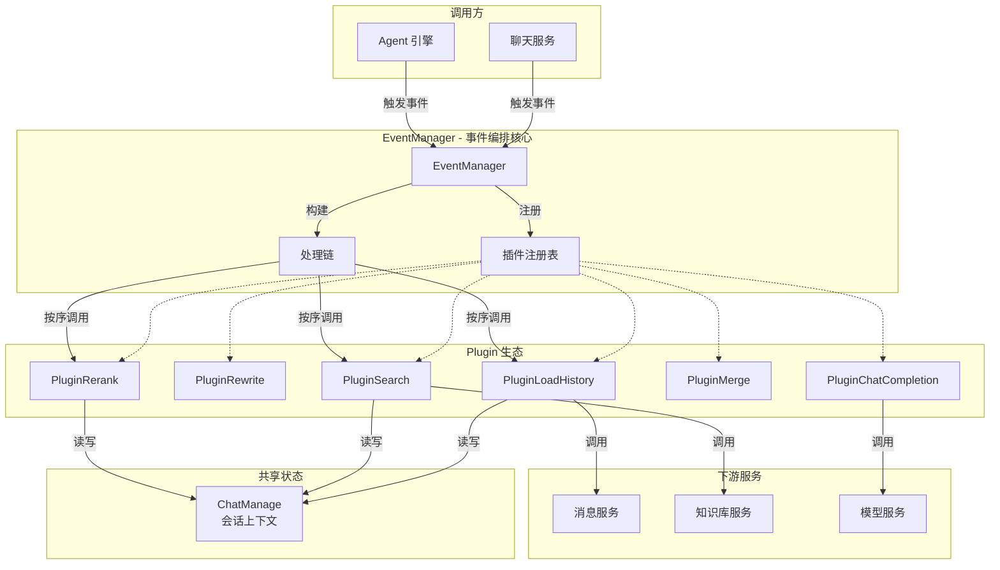

# Pipeline Contracts and Event Orchestration

## 概述

想象你在设计一个机场的安检流程：旅客（用户请求）需要依次通过证件检查、行李扫描、人身安检等多个关卡，每个关卡由不同的工作人员（插件）负责，且每个关卡都可以决定是否放行到下一关。`pipeline_contracts_and_event_orchestration` 模块正是这样一个**事件驱动的插件化流水线编排系统**，它为 RAG（检索增强生成）聊天流程提供了一套灵活、可扩展的处理框架。

这个模块解决的核心问题是：**如何将一个复杂的聊天请求处理流程拆解为多个独立的、可复用的处理阶段，同时保持这些阶段之间的协调和数据传递？**  naive 的方案可能是写一个巨大的 `handleChat()` 函数，按顺序调用各个处理逻辑。但这种方式存在明显缺陷：
- 难以针对不同的聊天模式（普通聊天、流式聊天、RAG、流式 RAG）复用逻辑
- 新增处理阶段需要修改核心代码，违反开闭原则
- 无法动态调整处理顺序或跳过某些阶段

本模块的设计洞察是：**将处理流程定义为事件序列，将每个处理阶段实现为插件，通过责任链模式串联插件**。这样，不同的聊天模式只需配置不同的事件序列，而插件可以独立开发、测试和替换。

## 架构设计



### 核心组件角色

**EventManager** 是整个模块的编排中枢，承担三个关键职责：
1. **插件注册**：维护 `EventType → []Plugin` 的映射关系，记录哪些插件关心哪些事件
2. **处理链构建**：在注册时反向遍历插件列表，构建嵌套的闭包链，实现责任链模式
3. **事件触发**：当某个事件被触发时，执行对应的处理链

**Plugin** 接口定义了所有插件必须遵守的契约：
- `OnEvent()`：处理事件的核心逻辑，接收上下文、事件类型、共享状态和 `next()` 函数
- `ActivationEvents()`：声明该插件关注的事件类型

**ChatManage** 是贯穿整个流水线的共享状态容器，类似于 HTTP 请求中的 `context` 对象，但它是可变的。所有插件都通过读写同一个 `ChatManage` 实例来传递数据。

**EventType** 定义了流水线中的各个处理阶段，包括：
- `LOAD_HISTORY`：加载历史对话
- `REWRITE_QUERY`：重写查询以提升检索效果
- `CHUNK_SEARCH` / `CHUNK_SEARCH_PARALLEL`：检索相关片段
- `CHUNK_RERANK`：对检索结果重排序
- `CHUNK_MERGE`：合并相似片段
- `INTO_CHAT_MESSAGE`：将检索结果转换为聊天消息
- `CHAT_COMPLETION` / `CHAT_COMPLETION_STREAM`：调用 LLM 生成回复
- `MEMORY_RETRIEVAL` / `MEMORY_STORAGE`：长期记忆的存取

### 数据流追踪

以一个典型的流式 RAG 请求（`rag_stream` 模式）为例，数据流动过程如下：

```
用户请求 → EventManager.Trigger(REWRITE_QUERY)
              ↓
    PluginRewrite.OnEvent()
    - 读取：chatManage.Query, chatManage.History
    - 写入：chatManage.RewriteQuery
    - 调用：next() → 继续下一插件
              ↓
    EventManager.Trigger(CHUNK_SEARCH_PARALLEL)
              ↓
    PluginSearch.OnEvent()
    - 读取：chatManage.RewriteQuery, chatManage.SearchTargets
    - 写入：chatManage.SearchResult
    - 调用：并发执行知识库搜索 + 网络搜索
    - 调用：next()
              ↓
    EventManager.Trigger(CHUNK_RERANK)
              ↓
    PluginRerank.OnEvent()
    - 读取：chatManage.SearchResult, chatManage.RerankModelID
    - 写入：chatManage.RerankResult
    - 调用：next()
              ↓
    ... 依次经过 MERGE → FILTER_TOP_K → INTO_CHAT_MESSAGE → CHAT_COMPLETION_STREAM
              ↓
    流式响应返回给用户
```

关键点：**每个插件处理完后必须显式调用 `next()`**，否则处理链会在此中断。这种设计赋予了插件"短路"能力——如果某个插件发现无需继续处理（如搜索结果为空），可以直接返回错误而不调用 `next()`。

## 组件深度解析

### Plugin 接口

```go
type Plugin interface {
    OnEvent(
        ctx context.Context,
        eventType types.EventType,
        chatManage *types.ChatManage,
        next func() *PluginError,
    ) *PluginError
    ActivationEvents() []types.EventType
}
```

**设计意图**：这个接口的设计体现了几个关键考量：

1. **`next func() *PluginError` 参数**：这是责任链模式的核心。`next` 是一个闭包，封装了后续所有插件的执行逻辑。插件可以选择：
   - 调用 `next()` 继续处理链
   - 不调用 `next()` 直接返回，中断处理
   - 先执行一些前置逻辑，调用 `next()`，再执行后置逻辑（类似 HTTP 中间件的 "around" 模式）

2. **`chatManage *types.ChatManage` 指针传递**：使用指针而非值传递，意味着所有插件共享同一份状态。这避免了在插件间显式传递数据的样板代码，但也带来了并发安全风险（见后文"注意事项"）。

3. **`ActivationEvents()` 分离声明与实现**：插件在注册时声明自己关注的事件类型，而不是在 `OnEvent` 内部判断。这样做的好处是 EventManager 可以预先构建好每个事件类型对应的处理链，触发事件时无需遍历所有插件。

**内部机制**：插件本身是无状态的（状态都在 `ChatManage` 中），但插件实例可以持有服务依赖（如 `MessageService`、`KnowledgeBaseService`）。这种设计使得插件可以方便地进行单元测试——只需注入 mock 服务即可。

### EventManager 结构

```go
type EventManager struct {
    listeners map[types.EventType][]Plugin
    handlers  map[types.EventType]func(context.Context, types.EventType, *types.ChatManage) *PluginError
}
```

**核心方法解析**：

#### Register(plugin Plugin)

注册插件时，EventManager 会：
1. 遍历插件的 `ActivationEvents()` 获取关注的事件类型
2. 将插件添加到对应事件类型的 `listeners` 列表中
3. **立即调用 `buildHandler()` 重建该事件的处理链**

这里有一个微妙的设计：**处理链是在注册时构建的，而不是在触发时**。这意味着插件的注册顺序决定了执行顺序。如果插件 A 和插件 B 都关注 `CHUNK_SEARCH` 事件，且 A 先注册，则 A 会在 B 之前执行。

#### buildHandler(plugins []Plugin)

这是整个模块最精妙的部分。让我们用伪代码理解其工作原理：

```go
// 假设 plugins = [A, B, C]
// 反向遍历构建处理链
next = func() { return nil }  // 初始 next 是空操作

// i = 2, current = C
next = func() {
    return C.OnEvent(ctx, eventType, chatManage, func() {
        return next()  // 此时 next 是空操作
    })
}

// i = 1, current = B
next = func() {
    return B.OnEvent(ctx, eventType, chatManage, func() {
        return next()  // 此时 next 是上面 C 的闭包
    })
}

// i = 0, current = A
next = func() {
    return A.OnEvent(ctx, eventType, chatManage, func() {
        return next()  // 此时 next 是上面 B 的闭包
    })
}

// 最终返回的 next 是 A 的闭包
```

**为什么反向遍历？** 因为 `next` 闭包需要捕获"后续插件的执行逻辑"。反向遍历确保在构建当前插件的闭包时，`next` 变量已经指向了后续所有插件的处理链。这种技巧在函数式编程中称为"延续传递风格"（Continuation-Passing Style）。

#### Trigger(ctx, eventType, chatManage)

触发事件时，直接从 `handlers` 映射中取出预构建的处理链并执行。这是一个 O(1) 操作，非常高效。

### PluginError 类型

```go
type PluginError struct {
    Err         error  // 原始错误
    Description string // 人类可读的描述
    ErrorType   string // 错误类型标识符
}
```

**设计考量**：为什么不用标准的 `error` 接口，而是自定义结构体？

1. **结构化错误信息**：`ErrorType` 字段允许调用方通过类型判断错误原因，而无需解析错误消息字符串。例如：
   ```go
   if err.ErrorType == "search_nothing" {
       // 使用 fallback 策略
   }
   ```

2. **预定义错误常量**：模块提供了一组预定义的错误，如 `ErrSearchNothing`、`ErrRerank` 等。插件可以直接返回这些错误（通过 `WithError()` 附加原始错误），确保错误类型的一致性。

3. **不可变性**：`clone()` 方法确保每次 `WithError()` 都返回新实例，避免错误对象被意外修改。

### EventType 与流水线配置

```go
const (
    LOAD_HISTORY           EventType = "load_history"
    REWRITE_QUERY          EventType = "rewrite_query"
    CHUNK_SEARCH           EventType = "chunk_search"
    CHUNK_SEARCH_PARALLEL  EventType = "chunk_search_parallel"
    ENTITY_SEARCH          EventType = "entity_search"
    CHUNK_RERANK           EventType = "chunk_rerank"
    CHUNK_MERGE            EventType = "chunk_merge"
    DATA_ANALYSIS          EventType = "data_analysis"
    INTO_CHAT_MESSAGE      EventType = "into_chat_message"
    CHAT_COMPLETION        EventType = "chat_completion"
    CHAT_COMPLETION_STREAM EventType = "chat_completion_stream"
    STREAM_FILTER          EventType = "stream_filter"
    FILTER_TOP_K           EventType = "filter_top_k"
    MEMORY_RETRIEVAL       EventType = "memory_retrieval"
    MEMORY_STORAGE         EventType = "memory_storage"
)

var Pipline = map[string][]EventType{
    "chat": {CHAT_COMPLETION},
    "chat_stream": {CHAT_COMPLETION_STREAM, STREAM_FILTER},
    "chat_history_stream": {LOAD_HISTORY, MEMORY_RETRIEVAL, CHAT_COMPLETION_STREAM, STREAM_FILTER, MEMORY_STORAGE},
    "rag": {CHUNK_SEARCH, CHUNK_RERANK, CHUNK_MERGE, INTO_CHAT_MESSAGE, CHAT_COMPLETION},
    "rag_stream": {REWRITE_QUERY, CHUNK_SEARCH_PARALLEL, CHUNK_RERANK, CHUNK_MERGE, FILTER_TOP_K, DATA_ANALYSIS, INTO_CHAT_MESSAGE, CHAT_COMPLETION_STREAM, STREAM_FILTER},
}
```

**设计洞察**：`Pipline` 映射将聊天模式与事件序列解耦。新增一种聊天模式只需添加新的配置，无需修改任何插件代码。这种"配置即代码"的方式在保持灵活性的同时，避免了过度工程化（如引入 DSL 或配置文件）。

## 依赖关系分析

### 本模块调用的组件

| 依赖组件 | 调用原因 | 数据契约 |
|---------|---------|---------|
| `types.ChatManage` | 共享状态容器 | 插件通过指针读写查询、历史、检索结果等 |
| `types.EventType` | 事件类型定义 | 字符串枚举，如 `"chunk_search"` |
| `types/interfaces.*Service` | 插件依赖的具体服务 | 各插件通过构造函数注入所需服务 |

### 调用本模块的组件

| 调用方 | 调用场景 | 期望行为 |
|-------|---------|---------|
| `chat_pipline.PluginChatCompletion` | 非流式聊天完成 | 触发 `CHAT_COMPLETION` 事件，期望返回 `ChatResponse` |
| `chat_pipline.PluginChatCompletionStream` | 流式聊天完成 | 触发 `CHAT_COMPLETION_STREAM` 事件，期望通过 EventBus 推送流式事件 |
| `chat_pipline.PluginSearch` | 知识检索 | 触发 `CHUNK_SEARCH` 事件，期望填充 `SearchResult` |
| `chat_pipline.PluginRerank` | 结果重排序 | 触发 `CHUNK_RERANK` 事件，期望填充 `RerankResult` |
| `agent_runtime_and_tools` | Agent 引擎 | 触发完整的事件序列，期望得到最终回复 |

### 数据契约详解

**输入契约**：
- `context.Context`：携带超时、取消信号、请求追踪信息
- `types.EventType`：事件类型，决定触发哪个处理链
- `*types.ChatManage`：必须预先填充基础信息（SessionID、UserID、Query 等）

**输出契约**：
- `*PluginError`：`nil` 表示成功，非 `nil` 表示失败
- 处理结果通过修改 `ChatManage` 中的字段传递（如 `SearchResult`、`ChatResponse`）

**隐式契约**：
- 插件必须按顺序执行，不能并发修改 `ChatManage`（除非使用同步机制）
- 插件应在处理完成后调用 `next()`，除非有意中断处理链
- 插件不应直接 panic，应通过 `PluginError` 返回错误

## 设计决策与权衡

### 1. 责任链模式 vs 顺序调用

**选择**：责任链模式（通过 `next()` 闭包）

**替代方案**：
```go
// 方案 A：顺序调用
for _, plugin := range plugins {
    err := plugin.OnEvent(ctx, eventType, chatManage)
    if err != nil {
        return err
    }
}

// 方案 B：责任链（当前实现）
next := func() *PluginError { return nil }
for i := len(plugins) - 1; i >= 0; i-- {
    current := plugins[i]
    prevNext := next
    next = func() *PluginError {
        return current.OnEvent(ctx, eventType, chatManage, prevNext)
    }
}
```

**权衡分析**：
- 责任链的优势在于插件可以控制 `next()` 的调用时机，实现"环绕"逻辑（如计时、事务）
- 顺序调用更直观，但插件无法在后续插件执行前后插入逻辑
- 责任链的缺点是调试困难（嵌套闭包），且注册顺序敏感

**为什么选择责任链**：RAG 流程中某些插件确实需要"环绕"能力。例如，`PluginTracing` 需要在处理前后记录日志，`PluginRerank` 可能需要在搜索完成后但合并之前执行。责任链模式为这些场景提供了可能性。

### 2. 共享可变状态 vs 不可变数据流

**选择**：共享可变状态（`*types.ChatManage` 指针）

**替代方案**：
```go
// 方案 A：不可变数据流
type Plugin interface {
    OnEvent(ctx context.Context, input ChatManage) (ChatManage, *PluginError)
}

// 方案 B：共享可变状态（当前实现）
type Plugin interface {
    OnEvent(ctx context.Context, chatManage *types.ChatManage, next func() *PluginError) *PluginError
}
```

**权衡分析**：
- 共享状态简化了数据传递，但引入了并发安全风险
- 不可变数据流更安全，但每次修改都需要创建新对象，增加 GC 压力
- 共享状态使得插件可以"就地"修改数据，适合大数据量场景（如大量检索结果）

**为什么选择共享状态**：RAG 流程本质上是顺序的（一个请求对应一个处理链），并发风险较低。且检索结果可能包含大量数据，复制成本较高。通过约定（插件按顺序执行）而非强制（不可变对象）来保证安全性，是务实的选择。

### 3. 事件驱动 vs 阶段枚举

**选择**：事件驱动（`EventType` 字符串）

**替代方案**：
```go
// 方案 A：阶段枚举
type PipelineStage int
const (
    StageLoadHistory PipelineStage = iota
    StageRewriteQuery
    StageSearch
    // ...
)

// 方案 B：事件驱动（当前实现）
type EventType string
const (
    LOAD_HISTORY EventType = "load_history"
    REWRITE_QUERY EventType = "rewrite_query"
    // ...
)
```

**权衡分析**：
- 事件驱动更灵活，支持一个插件关注多个事件
- 阶段枚举更类型安全，编译器可以检查未处理的阶段
- 事件驱动支持动态注册，阶段枚举需要修改核心代码

**为什么选择事件驱动**：插件化架构的核心是解耦。事件驱动允许插件独立声明关注点，而无需修改中央枚举。此外，事件名称（字符串）便于日志记录和监控。

### 4. 注册时构建处理链 vs 触发时动态查找

**选择**：注册时构建

**权衡分析**：
- 注册时构建：触发事件时 O(1) 查找，但插件注册后无法动态调整顺序
- 触发时查找：支持动态调整，但每次触发都需要遍历插件列表

**为什么选择注册时构建**：聊天服务的插件配置在启动时确定，运行时无需动态调整。性能优化（O(1) 触发）优先于灵活性。

## 使用指南

### 基本使用模式

```go
// 1. 创建 EventManager
eventManager := chatpipline.NewEventManager()

// 2. 注册插件（按期望的执行顺序）
pluginHistory := chatpipline.NewPluginLoadHistory(eventManager, messageService, config)
pluginSearch := chatpipline.NewPluginSearch(eventManager, kbService, knowledgeService, chunkService, config, ...)
pluginRerank := chatpipline.NewPluginRerank(eventManager, modelService)
pluginCompletion := chatpipline.NewPluginChatCompletion(eventManager, modelService)

// 3. 准备共享状态
chatManage := &types.ChatManage{
    SessionID: "session-123",
    UserID:    "user-456",
    Query:     "什么是 RAG？",
    KnowledgeBaseIDs: []string{"kb-789"},
    // ... 其他配置
}

// 4. 触发事件序列（对应 rag 模式）
for _, eventType := range types.Pipline["rag"] {
    err := eventManager.Trigger(ctx, eventType, chatManage)
    if err != nil {
        // 处理错误
        log.Errorf("Event %s failed: %v", eventType, err)
        break
    }
}

// 5. 获取最终结果
response := chatManage.ChatResponse
```

### 自定义插件开发

```go
// 1. 定义插件结构
type PluginMyCustom struct {
    someService interfaces.SomeService
}

// 2. 实现 Plugin 接口
func (p *PluginMyCustom) ActivationEvents() []types.EventType {
    return []types.EventType{types.CHUNK_SEARCH} // 在搜索后执行
}

func (p *PluginMyCustom) OnEvent(
    ctx context.Context,
    eventType types.EventType,
    chatManage *types.ChatManage,
    next func() *PluginError,
) *PluginError {
    // 前置处理
    log.Infof("Before search, query: %s", chatManage.RewriteQuery)
    
    // 调用后续插件
    err := next()
    if err != nil {
        return err
    }
    
    // 后置处理
    log.Infof("After search, result count: %d", len(chatManage.SearchResult))
    
    return nil
}

// 3. 注册插件
func NewPluginMyCustom(eventManager *chatpipline.EventManager, someService interfaces.SomeService) *PluginMyCustom {
    plugin := &PluginMyCustom{someService: someService}
    eventManager.Register(plugin)
    return plugin
}
```

### 配置不同的流水线模式

```go
// 简单聊天（无检索）
for _, eventType := range types.Pipline["chat"] {
    eventManager.Trigger(ctx, eventType, chatManage)
}

// 流式 RAG（带查询重写和并行搜索）
for _, eventType := range types.Pipline["rag_stream"] {
    eventManager.Trigger(ctx, eventType, chatManage)
}

// 自定义流水线
customPipeline := []types.EventType{
    types.LOAD_HISTORY,
    types.MEMORY_RETRIEVAL,
    types.REWRITE_QUERY,
    types.CHUNK_SEARCH,
    types.CHAT_COMPLETION_STREAM,
}
for _, eventType := range customPipeline {
    eventManager.Trigger(ctx, eventType, chatManage)
}
```

## 边界情况与注意事项

### 1. 插件注册顺序敏感

**问题**：插件的执行顺序由注册顺序决定。如果插件 A 和 B 都关注同一事件，且 A 先注册，则 A 先执行。

**风险**：
```go
// 错误示例：Rerank 在 Search 之前注册
eventManager.Register(pluginRerank)  // 先注册
eventManager.Register(pluginSearch)  // 后注册

// 触发 CHUNK_SEARCH 时，Rerank 会先于 Search 执行
// 但 Rerank 需要 SearchResult，而此时 SearchResult 还是空的！
```

**解决方案**：
- 在代码审查中严格检查插件注册顺序
- 考虑引入"阶段"概念，插件声明自己属于哪个阶段，框架按阶段排序
- 添加启动时验证，检测依赖关系是否满足

### 2. 共享状态的并发安全

**问题**：`ChatManage` 是可变指针，多个插件并发修改可能导致数据竞争。

**风险场景**：
```go
// PluginSearch 的 OnEvent 中启动了多个 goroutine 并发搜索
go func() {
    results := p.searchByTargets(ctx, chatManage)
    chatManage.SearchResult = append(chatManage.SearchResult, results...) // 数据竞争！
}()
```

**当前缓解措施**：
- `PluginSearch` 内部使用 `sync.Mutex` 保护对 `chatManage.SearchResult` 的并发写入
- 插件之间是顺序执行的，不会并发修改

**建议**：
- 插件内部如需并发，必须使用同步机制保护对 `ChatManage` 的写入
- 考虑在 `ChatManage` 中添加互斥锁字段，强制插件加锁后修改

### 3. 错误处理的不一致性

**问题**：不同插件对错误的处理方式不一致。

**观察**：
- `PluginLoadHistory`：获取历史失败时记录日志，但调用 `next()` 继续（降级处理）
- `PluginSearch`：搜索结果为空时返回 `ErrSearchNothing`，中断处理链
- `PluginRerank`：重排序失败时返回 `ErrRerank`，中断处理链

**影响**：调用方需要理解每个插件的错误语义，无法统一处理。

**建议**：
- 文档化每个插件的错误行为（可降级 vs 必须中断）
- 考虑引入错误级别（Warning、Error、Fatal），调用方根据级别决定是否继续

### 4. 处理链中断的隐式行为

**问题**：插件不调用 `next()` 会静默中断处理链，调用方可能 unaware。

**风险**：
```go
func (p *PluginSearch) OnEvent(...) *PluginError {
    if len(chatManage.SearchResult) == 0 {
        return ErrSearchNothing  // 没有调用 next()
    }
    return next()
}

// 调用方
err := eventManager.Trigger(ctx, types.CHUNK_SEARCH, chatManage)
if err != nil {
    // 知道出错了
} else {
    // 以为成功了，但后续插件（如 Rerank）根本没有执行！
}
```

**建议**：
- 在 `EventManager` 中添加日志，记录处理链执行了哪些插件
- 考虑引入"处理链完成度"指标，监控是否有插件被跳过

### 5. 循环依赖风险

**问题**：`types` 包定义了 `EventBusInterface` 接口，但具体实现在 `event` 包中。`event` 包又依赖 `types` 包的 `EventType`。

**当前解决方案**：
- `types/event_bus.go` 中定义了简化的 `Event` 结构和 `EventBusInterface` 接口
- 注释明确说明："This is a simplified version to avoid import cycle with event package"

**风险**：如果未来需要在 `types.Event` 中添加 `event` 包特有的字段，会打破循环依赖的平衡。

**建议**：
- 保持 `types` 包的"纯净"，只包含数据结构和接口定义
- 复杂逻辑放在 `event` 包，通过接口与 `types` 交互

### 6. 测试难度

**问题**：责任链模式使得单元测试复杂化。

**挑战**：
- 测试单个插件需要模拟 `next()` 函数
- 测试处理链需要注册多个插件，难以隔离
- 闭包捕获的变量难以验证

**建议**：
- 为 `next()` 提供测试辅助函数，如 `chatpipline.NewNoopNext()`
- 使用依赖注入，允许测试时传入自定义的 `EventManager`
- 添加集成测试，验证完整流水线的行为

## 与其他模块的关系

- **[chat_pipeline_plugins_and_flow](chat_pipeline_plugins_and_flow.md)**：父模块，包含所有具体插件实现
- **[agent_runtime_and_tools](agent_runtime_and_tools.md)**：Agent 引擎调用本模块执行聊天流水线
- **[conversation_context_and_memory_services](conversation_context_and_memory_services.md)**：提供历史加载和记忆存取服务，被 `PluginLoadHistory` 和 `PluginMemory` 使用
- **[retrieval_and_web_search_services](retrieval_and_web_search_services.md)**：提供检索服务，被 `PluginSearch` 使用
- **[model_providers_and_ai_backends](model_providers_and_ai_backends.md)**：提供 LLM 和重排序模型，被 `PluginChatCompletion` 和 `PluginRerank` 使用

## 总结

`pipeline_contracts_and_event_orchestration` 模块通过事件驱动的插件化架构，为 RAG 聊天流程提供了一套灵活、可扩展的编排机制。其核心设计洞察是：

1. **将处理流程定义为事件序列**，不同模式对应不同序列
2. **将处理逻辑封装为插件**，插件通过责任链模式串联
3. **使用共享状态容器传递数据**，避免显式参数传递

这种设计在灵活性和复杂性之间取得了平衡：
- ✅ 新增处理阶段无需修改核心代码
- ✅ 不同聊天模式复用相同插件
- ✅ 插件可以独立开发和测试
- ⚠️ 插件注册顺序敏感，需要谨慎管理
- ⚠️ 共享状态引入并发风险，需要插件内部处理
- ⚠️ 责任链调试困难，需要完善的日志和监控

对于新加入的开发者，理解这个模块的关键是掌握**责任链模式的闭包构建机制**和**共享状态的数据流**。一旦理解这两点，就能轻松开发自定义插件或调试流水线问题。
