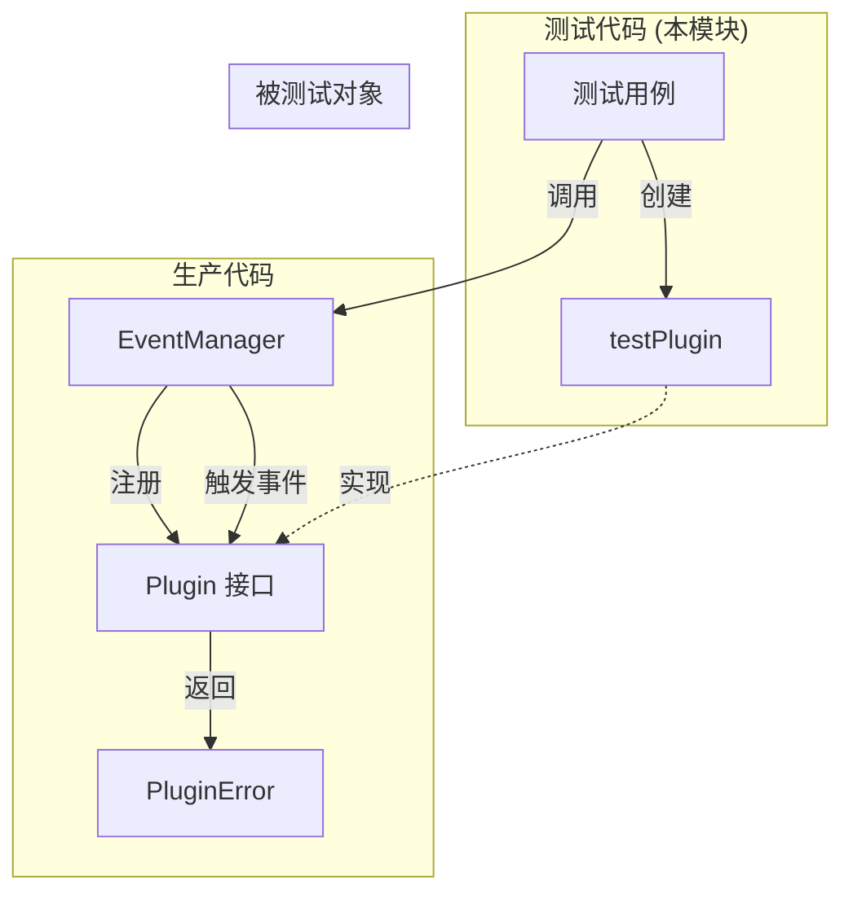

# pipeline_test_doubles_and_validation_helpers 模块深度解析

## 概述：为什么需要这个模块

想象你正在设计一个机场的安检系统。安检流程由多个检查点组成（证件检查、行李扫描、人身检查），每个检查点都可以独立工作，也可以串联成一个完整的流程。现在你需要测试这个安检系统的调度器 —— 它负责在旅客到达时调用正确的检查点，并在某个检查点发现问题时停止后续流程。

但你不能直接用真实的安检员来测试调度器：真实检查点依赖外部设备、数据库、网络服务，而且你无法控制它们的行为（比如模拟"证件检查失败"的场景）。

**这就是 `pipeline_test_doubles_and_validation_helpers` 模块存在的理由。**

这个模块提供了一个可配置的测试桩（test double）—— `testPlugin`，它实现了聊天流水线中的 `Plugin` 接口，允许开发者在单元测试中精确控制插件的行为：让它成功、让它失败、让它在链式调用的任意位置失败。没有这个模块，测试 `EventManager` 就需要启动完整的聊天流水线，依赖 LLM、向量数据库、重排序服务等外部组件，这使得测试变得脆弱、缓慢且难以覆盖边界情况。

---

## 架构定位与数据流

### 模块在系统中的位置



### 核心组件关系

| 组件 | 角色 | 依赖方向 |
|------|------|----------|
| `testPlugin` | 测试桩实现 | 实现 `Plugin` 接口 |
| `EventManager` | 被测试对象 | 持有 `[]Plugin` 列表 |
| `Plugin` 接口 | 契约定义 | 定义 `OnEvent` 和 `ActivationEvents` |
| `PluginError` | 错误类型 | 插件链传递的错误载体 |
| `ChatManage` | 上下文对象 | 携带会话状态在插件间传递 |

### 数据流：一次事件触发的完整路径

```
测试用例创建 testPlugin
       ↓
注册到 EventManager (按 EventType 索引)
       ↓
调用 EventManager.Trigger(eventType, chatManage)
       ↓
EventManager 查找该 eventType 对应的所有插件
       ↓
对每个插件调用 OnEvent(ctx, eventType, chatManage, next)
       ↓
插件执行逻辑 → 调用 next() → 下一个插件执行
       ↓
任意插件返回 *PluginError → 链式调用中断
       ↓
错误沿调用栈返回给测试用例
```

**关键设计洞察**：插件链采用"责任链模式"（Chain of Responsibility），`next` 参数是一个闭包，插件可以选择：
- 调用 `next()` 继续执行后续插件
- 不调用 `next()` 直接返回错误，中断链条
- 调用 `next()` 后检查返回值，做后置处理

`testPlugin` 的设计必须精确模拟这种行为，才能验证 `EventManager` 是否正确处理了各种场景。

---

## 组件深度解析

### testPlugin 结构体

```go
type testPlugin struct {
    name          string
    events        []types.EventType
    shouldError   bool
    errorToReturn *PluginError
}
```

#### 设计意图

这是一个**可配置的行为模拟器**。四个字段分别控制：

| 字段 | 作用 | 测试场景 |
|------|------|----------|
| `name` | 标识符 | 日志输出、调试追踪 |
| `events` | 激活事件列表 | 模拟只对特定事件响应的插件 |
| `shouldError` | 行为开关 | 控制成功/失败路径 |
| `errorToReturn` | 错误内容 | 验证错误传播的精确性 |

#### OnEvent 方法实现分析

```go
func (p *testPlugin) OnEvent(ctx context.Context,
    eventType types.EventType, chatManage *types.ChatManage, next func() *PluginError,
) *PluginError {
    if p.shouldError {
        return p.errorToReturn  // 不调用 next()，直接中断链条
    }
    fmt.Printf("Plugin %s triggered\n", p.name)
    err := next()               // 调用下一个插件
    fmt.Printf("Plugin %s finished\n", p.name)
    return err
}
```

**关键行为**：
1. **短路逻辑**：当 `shouldError=true` 时，直接返回错误，**不调用 `next()`**。这模拟了真实插件在遇到致命错误时中断流程的行为。
2. **透传逻辑**：正常执行时，先打印日志，调用 `next()`，再打印日志，最后返回 `next()` 的结果。这允许测试验证插件链的执行顺序和错误透传。

#### ActivationEvents 方法

```go
func (p *testPlugin) ActivationEvents() []types.EventType {
    return p.events
}
```

这个方法告诉 `EventManager`："我只关心这些事件"。测试中可以验证 `EventManager` 是否正确过滤了事件 —— 一个注册了 `["query_rewrite"]` 事件的插件不应该被 `["search"]` 事件触发。

---

### 测试用例覆盖的场景分析

#### 场景 1：NoPluginsRegistered

```go
manager := &EventManager{}
err := manager.Trigger(ctx, testEvent, chatManage)
```

**验证点**：空插件列表时，`Trigger` 应该无操作且返回 `nil`。这是防御性编程的基本要求 —— 系统不应该因为"没有插件"而报错。

#### 场景 2：SinglePluginSuccess

```go
plugin := &testPlugin{name: "test_plugin", events: []types.EventType{testEvent}}
manager.Register(plugin)
err := manager.Trigger(ctx, testEvent, chatManage)
```

**验证点**：单个插件正常执行时，错误应该为 `nil`。同时通过 `fmt.Printf` 输出可以肉眼验证插件确实被触发了。

#### 场景 3：PluginChain

```go
plugin1 := &testPlugin{name: "plugin1", events: []types.EventType{testEvent}}
plugin2 := &testPlugin{name: "plugin2", events: []types.EventType{testEvent}}
manager.Register(plugin1)
manager.Register(plugin2)
```

**验证点**：多个插件按注册顺序执行。日志输出应该是：
```
Plugin plugin1 triggered
Plugin plugin2 triggered
Plugin plugin2 finished
Plugin plugin1 finished
```
这验证了责任链的"先进后出"特性（类似递归调用栈）。

#### 场景 4：PluginReturnsError

```go
expectedErr := &PluginError{Description: "test error"}
plugin := &testPlugin{
    shouldError:   true,
    errorToReturn: expectedErr,
}
```

**验证点**：插件返回的错误应该原样传递给调用者。这里使用 `==` 比较（`if err != expectedErr`），依赖于 Go 中指针比较的特性 —— 返回的必须是**同一个指针**，而不是拷贝。

#### 场景 5：ErrorInPluginChain

```go
plugin1 := &testPlugin{name: "plugin1", events: []types.EventType{testEvent}}
plugin2 := &testPlugin{
    name:          "plugin2",
    shouldError:   true,
    errorToReturn: expectedErr,
}
manager.Register(plugin1)
manager.Register(plugin2)
```

**验证点**：链中任意位置的错误都应该中断后续执行并正确传递。这里 `plugin2` 是第二个注册的，当它返回错误时：
- `plugin1` 的 `next()` 调用会收到这个错误
- `plugin1` 将这个错误返回给 `EventManager`
- `EventManager` 将错误返回给测试用例

**关键验证**：如果 `plugin2` 之后还有 `plugin3`，它不应该被执行（因为 `plugin2` 没有调用 `next()`）。

---

## 设计决策与权衡

### 为什么不用 mocking 框架？

**选择**：手写 `testPlugin` 结构体，而非使用 `gomock` 或 `testify/mock`。

**权衡分析**：

| 方案 | 优点 | 缺点 | 本模块的选择理由 |
|------|------|------|------------------|
| mocking 框架 | 自动生成、支持复杂期望 | 依赖外部库、学习成本、错误消息晦涩 | ❌ |
| 手写 test double | 零依赖、代码透明、调试友好 | 需要手动维护接口一致性 | ✅ |

**核心原因**：`Plugin` 接口只有两个方法，手写成本极低。而且测试需要验证**行为**（是否调用 `next()`）而非**交互**（是否调用了某个方法），mocking 框架的优势不明显。

### 为什么使用指针比较而非 errors.Is？

```go
if err != expectedErr {  // 指针比较
    t.Errorf("Expected error %v, got %v", expectedErr, err)
}
```

**设计意图**：验证 `EventManager` **原样传递**错误对象，而不是创建新错误。如果使用 `errors.Is`，只要错误链中包含目标错误就会通过，无法验证"透传"这一关键行为。

**潜在风险**：如果未来 `EventManager` 改为包装错误（如 `fmt.Errorf("plugin failed: %w", err)`），这些测试会失败。但这正是测试想要的 —— 错误处理策略的改变应该是有意识的决策，需要更新测试。

### 为什么使用 fmt.Printf 而非 testing.T.Logf？

```go
fmt.Printf("Plugin %s triggered\n", p.name)
```

**权衡**：`fmt.Printf` 的输出在测试失败时才可见（Go 测试默认隐藏 stdout），而 `t.Logf` 总是输出。

**可能原因**：
1. 历史遗留代码
2. 开发者希望在特定调试场景下手动启用输出（通过 `go test -v`）

**改进建议**：改为 `t.Logf` 或通过参数控制日志输出，避免污染测试输出。

---

## 使用指南与扩展示例

### 基本使用模式

```go
func TestMyPluginScenario(t *testing.T) {
    // 1. 创建 EventManager
    manager := &EventManager{}
    
    // 2. 配置 testPlugin
    plugin := &testPlugin{
        name:   "my_plugin",
        events: []types.EventType{"query_rewrite"},
    }
    
    // 3. 注册
    manager.Register(plugin)
    
    // 4. 触发并验证
    err := manager.Trigger(ctx, "query_rewrite", chatManage)
    assert.Nil(t, err)
}
```

### 扩展示例：模拟延迟插件

```go
type slowTestPlugin struct {
    testPlugin
    delay time.Duration
}

func (p *slowTestPlugin) OnEvent(ctx context.Context,
    eventType types.EventType, chatManage *types.ChatManage, next func() *PluginError,
) *PluginError {
    time.Sleep(p.delay)  // 模拟耗时操作
    return p.testPlugin.OnEvent(ctx, eventType, chatManage, next)
}

// 使用
func TestTimeoutHandling(t *testing.T) {
    plugin := &slowTestPlugin{
        testPlugin: testPlugin{name: "slow_plugin", events: []types.EventType{"search"}},
        delay:      5 * time.Second,
    }
    // 验证 EventManager 是否有超时处理机制
}
```

### 扩展示例：验证 next() 调用次数

```go
type countingTestPlugin struct {
    testPlugin
    nextCallCount int
}

func (p *countingTestPlugin) OnEvent(ctx context.Context,
    eventType types.EventType, chatManage *types.ChatManage, next func() *PluginError,
) *PluginError {
    if p.shouldError {
        return p.errorToReturn
    }
    err := next()
    p.nextCallCount++  // 记录调用次数
    return err
}

// 使用
func TestPluginChainExecutionOrder(t *testing.T) {
    plugin := &countingTestPlugin{...}
    // 验证 plugin.nextCallCount == 1（只调用了一次 next）
}
```

---

## 边界情况与注意事项

### 1. 事件过滤的隐式契约

`testPlugin.ActivationEvents()` 返回的事件列表必须与 `EventManager.Trigger()` 使用的事件**精确匹配**（字符串比较）。如果未来 `EventType` 改为枚举或结构化类型，测试需要更新。

### 2. 并发安全未测试

当前测试都是单线程顺序执行。如果 `EventManager` 未来支持并发触发事件（多个 goroutine 同时调用 `Trigger`），需要添加并发测试：

```go
func TestConcurrentTrigger(t *testing.T) {
    manager := &EventManager{}
    // 注册插件...
    
    var wg sync.WaitGroup
    for i := 0; i < 100; i++ {
        wg.Add(1)
        go func() {
            defer wg.Done()
            manager.Trigger(ctx, testEvent, chatManage)
        }()
    }
    wg.Wait()
    // 验证没有 race condition
}
```

### 3. ChatManage 状态未验证

当前测试传入空的 `&types.ChatManage{}`，没有验证插件是否可以修改 `chatManage` 中的状态（如 `SearchResult`、`Entity` 等字段）。如果需要测试插件的副作用，应该：

```go
chatManage := &types.ChatManage{Query: "original query"}
manager.Trigger(ctx, testEvent, chatManage)
assert.Equal(t, "rewritten query", chatManage.RewriteQuery)
```

### 4. 错误类型未覆盖

`PluginError` 有三个字段：`Err`、`Description`、`ErrorType`。当前测试只设置了 `Description`，没有验证其他字段的传递。建议添加：

```go
expectedErr := &PluginError{
    Err:         errors.New("underlying error"),
    Description: "test error",
    ErrorType:   "VALIDATION_ERROR",
}
```

---

## 相关模块参考

- **[chat_pipeline_plugins_and_flow](application_services_and_orchestration.md)**：插件流水线的生产实现，包括 `Plugin` 接口定义和 `EventManager` 的完整逻辑
- **[agent_conversation_and_runtime_contracts](core_domain_types_and_interfaces.md)**：`ChatManage`、`EventType` 等核心类型定义
- **[evaluation_dataset_and_metric_services](application_services_and_orchestration.md)**：类似的测试模式用于评估服务的测试

---

## 总结

`pipeline_test_doubles_and_validation_helpers` 是一个典型的**测试基础设施模块**。它的价值不在于业务逻辑，而在于**使测试成为可能**。通过提供可配置的 `testPlugin`，它让开发者能够：

1. **隔离测试**：单独测试 `EventManager` 而不依赖完整的插件实现
2. **精确控制**：模拟成功、失败、链式中断等各种场景
3. **快速反馈**：无需启动外部服务，测试在毫秒级完成

这种"测试桩"模式在复杂系统中至关重要 —— 它降低了测试的门槛，提高了测试的覆盖率，最终提升了代码的可维护性。
