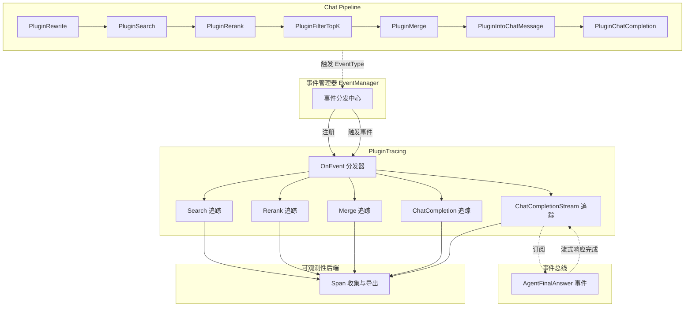

# Pipeline Tracing Instrumentation 模块深度解析

## 概述：为什么需要这个模块

想象你正在调试一个复杂的聊天机器人系统：用户提出问题，系统需要检索知识库、重排序结果、合并上下文、调用大模型生成回答——整个流程涉及十多个处理阶段。当用户报告"回答质量差"或"响应太慢"时，你如何快速定位问题出在哪个环节？是检索没找到相关内容，还是重排序过滤掉了关键信息，或是大模型本身生成有问题？

**`PluginTracing` 模块正是为了解决这个可观测性问题而存在的。** 它不是一个业务逻辑模块，而是一个**横切关注点（cross-cutting concern）**的实现——它像手术台上的监护仪一样，在不干扰主流程的前提下，实时记录每个处理阶段的输入、输出、耗时和关键指标。

这个模块的核心设计洞察是：**追踪不应该侵入业务代码**。通过插件化的事件监听机制，它能够在不修改任何现有 pipeline 逻辑的情况下，为整个聊天处理链路添加完整的可观测性。这种设计使得追踪功能可以独立演进、独立配置，甚至在生产环境中动态开关。

## 架构与数据流



### 架构角色解析

**PluginTracing 在系统中的定位是一个"被动观察者 + 主动记录者"**：

1. **被动注册**：通过 `NewPluginTracing` 构造函数将自身注册到 `EventManager`，成为 pipeline 事件监听网络中的一个节点
2. **主动分发**：`OnEvent` 方法作为中央调度器，根据事件类型将请求路由到对应的追踪处理方法
3. **环绕增强**：每个追踪方法都采用"前置记录 → 调用 next() → 后置记录"的环绕模式，在不改变原有逻辑的前提下捕获完整上下文
4. **异步订阅**：对于流式响应场景，通过订阅 `EventBus` 的 `AgentFinalAnswer` 事件来异步收集完整响应数据

### 数据流动路径

以一次典型的聊天请求为例，数据流经追踪模块的路径如下：

```
用户请求 → PluginRewrite (REWRITE_QUERY 事件) → 记录原始 query 和重写后的 query
         → PluginSearch (CHUNK_SEARCH 事件) → 记录检索参数和结果
         → PluginRerank (CHUNK_RERANK 事件) → 记录重排序模型和过滤阈值
         → PluginFilterTopK (FILTER_TOP_K 事件) → 记录过滤前后数量对比
         → PluginMerge (CHUNK_MERGE 事件) → 记录合并结果
         → PluginIntoChatMessage (INTO_CHAT_MESSAGE 事件) → 记录生成的用户内容长度
         → PluginChatCompletion (CHAT_COMPLETION 事件) → 记录模型调用和 token 使用
         → 返回响应
```

每个箭头处，`PluginTracing` 都会创建一个 OpenTelemetry Span，记录该阶段的输入状态，执行 `next()` 让 pipeline 继续，然后记录输出状态。这种设计确保了即使某个阶段失败，我们也能看到失败前的完整上下文。

## 核心组件深度解析

### PluginTracing 结构体

```go
type PluginTracing struct{}
```

这是一个**无状态的结构体**——注意它没有任何字段。这个设计选择非常关键：

**为什么无状态？** 因为追踪数据完全通过 OpenTelemetry 的 Span 上下文传递，而不是保存在结构体实例中。每个请求的追踪上下文由 `tracing.ContextWithSpan` 注入到 `context.Context` 中，多个并发请求不会相互干扰。这种设计使得 `PluginTracing` 可以安全地作为单例使用，无需担心并发问题。

### NewPluginTracing 构造函数

```go
func NewPluginTracing(eventManager *EventManager) *PluginTracing {
    res := &PluginTracing{}
    eventManager.Register(res)
    return res
}
```

这个构造函数做了两件看似简单但设计精妙的事：

1. **自我注册**：通过 `eventManager.Register(res)` 将自身注册为事件监听器。这是**插件模式**的典型实现——模块不需要知道谁在使用它，只需要声明自己能处理哪些事件。
2. **依赖注入**：`EventManager` 作为外部依赖传入，而不是内部创建。这使得追踪模块可以独立于具体的事件管理器实现进行测试和替换。

**设计权衡**：这里选择了**紧耦合到 EventManager**，但**松耦合到具体事件处理逻辑**。如果未来要更换事件系统，需要修改注册逻辑；但如果要添加新的事件类型追踪，只需修改 `ActivationEvents` 和 `OnEvent`，不影响注册机制。

### ActivationEvents 方法

```go
func (p *PluginTracing) ActivationEvents() []types.EventType {
    return []types.EventType{
        types.CHUNK_SEARCH,
        types.CHUNK_RERANK,
        types.CHUNK_MERGE,
        types.INTO_CHAT_MESSAGE,
        types.CHAT_COMPLETION,
        types.CHAT_COMPLETION_STREAM,
        types.FILTER_TOP_K,
        types.REWRITE_QUERY,
        types.CHUNK_SEARCH_PARALLEL,
    }
}
```

这个方法定义了插件的**关注边界**。它明确声明："我只关心这 9 种事件，其他事件请不要打扰我"。

**设计洞察**：这种显式声明而非隐式监听的设计有几个好处：
- **性能优化**：EventManager 可以只为注册过的事件类型调用插件，避免无谓的方法调用
- **意图清晰**：阅读代码的人一眼就能看出这个插件覆盖哪些处理阶段
- **易于审计**：如果要添加新的事件类型追踪，必须在这里显式添加，不会遗漏

### OnEvent 中央调度器

```go
func (p *PluginTracing) OnEvent(ctx context.Context,
    eventType types.EventType, chatManage *types.ChatManage, next func() *PluginError,
) *PluginError {
    switch eventType {
    case types.CHUNK_SEARCH:
        return p.Search(ctx, eventType, chatManage, next)
    case types.CHUNK_RERANK:
        return p.Rerank(ctx, eventType, chatManage, next)
    // ... 其他 case
    }
    return next()
}
```

这是整个模块的**路由中枢**。它的设计模式类似于 HTTP 框架中的中间件分发器：

**参数设计解析**：
- `ctx context.Context`：携带追踪上下文和请求生命周期信息
- `eventType types.EventType`：事件类型，决定路由到哪个处理方法
- `chatManage *types.ChatManage`：**这是关键**——它包含了整个聊天请求的所有状态，追踪方法通过读取这个对象的不同字段来获取输入/输出数据
- `next func() *PluginError`：管道中的下一个处理函数，调用它才会继续执行后续逻辑

**为什么返回 `*PluginError` 而不是 `error`？** 这是与 pipeline 错误处理机制的统一。`PluginError` 可能包含更丰富的错误上下文（如错误码、可恢复性标志等），便于 pipeline 统一处理。

### 追踪方法通用模式

所有具体的追踪方法（`Search`、`Rerank`、`Merge` 等）都遵循相同的**环绕模式（Around Pattern）**：

```go
func (p *PluginTracing) Xxx(ctx context.Context,
    eventType types.EventType, chatManage *types.ChatManage, next func() *PluginError,
) *PluginError {
    _, span := tracing.ContextWithSpan(ctx, "PluginTracing.Xxx")  // ① 创建 Span
    defer span.End()                                               // ② 确保 Span 结束
    
    span.SetAttributes(...)                                        // ③ 记录输入状态
    
    err := next()                                                  // ④ 执行实际逻辑
    
    span.SetAttributes(...)                                        // ⑤ 记录输出状态
    
    return err                                                     // ⑥ 返回错误
}
```

这个模式的核心思想是：**在逻辑执行前后各记录一次状态，形成完整的"输入→输出"快照**。

**为什么使用 `defer span.End()`？** 这是 Go 中确保资源清理的标准做法。即使在记录输出状态时发生 panic，Span 也能正确关闭，避免追踪数据泄露。

### Search 方法详解

```go
func (p *PluginTracing) Search(ctx context.Context,
    eventType types.EventType, chatManage *types.ChatManage, next func() *PluginError,
) *PluginError {
    _, span := tracing.ContextWithSpan(ctx, "PluginTracing.Search")
    defer span.End()
    span.SetAttributes(
        attribute.String("query", chatManage.Query),
        attribute.Float64("vector_threshold", chatManage.VectorThreshold),
        attribute.Float64("keyword_threshold", chatManage.KeywordThreshold),
        attribute.Int("match_count", chatManage.EmbeddingTopK),
    )
    err := next()
    searchResultJson, _ := json.Marshal(chatManage.SearchResult)
    unique := make(map[string]struct{})
    for _, r := range chatManage.SearchResult {
        unique[r.ID] = struct{}{}
    }
    span.SetAttributes(
        attribute.String("hybrid_search", string(searchResultJson)),
        attribute.Int("search_unique_count", len(unique)),
    )
    return err
}
```

**输入记录**：捕获检索的查询文本、向量相似度阈值、关键词匹配阈值、期望返回数量。这些参数直接影响检索质量。

**输出记录**：
- `hybrid_search`：完整的检索结果 JSON（可能很大，生产环境需注意）
- `search_unique_count`：去重后的结果数量（因为混合检索可能返回重复文档）

**设计细节**：去重计数的计算揭示了一个**隐含的业务假设**——混合检索（向量 + 关键词）可能返回重复结果，需要去重。这个指标对于调试检索质量非常关键：如果去重前后数量差异很大，说明检索策略可能有问题。

### ChatCompletionStream 方法：异步事件订阅

```go
func (p *PluginTracing) ChatCompletionStream(ctx context.Context,
    eventType types.EventType, chatManage *types.ChatManage, next func() *PluginError,
) *PluginError {
    ctx, span := tracing.ContextWithSpan(ctx, "PluginTracing.ChatCompletionStream")
    startTime := time.Now()
    span.SetAttributes(...)
    
    responseBuilder := &strings.Builder{}
    
    if chatManage.EventBus == nil {
        logger.Warn(ctx, "Tracing: EventBus not available, skipping metrics collection")
        return next()
    }
    eventBus := chatManage.EventBus
    
    eventBus.On(types.EventType(event.EventAgentFinalAnswer), func(ctx context.Context, evt types.Event) error {
        data, ok := evt.Data.(event.AgentFinalAnswerData)
        if ok {
            responseBuilder.WriteString(data.Content)
            if data.Done {
                elapsedMS := time.Since(startTime).Milliseconds()
                span.SetAttributes(
                    attribute.Bool("chat_completion_success", true),
                    attribute.Int64("response_time_ms", elapsedMS),
                    attribute.String("chat_response", responseBuilder.String()),
                    attribute.Int("final_response_length", responseBuilder.Len()),
                    attribute.Float64("tokens_per_second", float64(responseBuilder.Len())/float64(elapsedMS)*1000),
                )
                span.End()
            }
        }
        return nil
    })
    
    return next()
}
```

这是整个模块中**最复杂也最精妙**的方法，它处理的是流式响应场景。

**为什么需要特殊处理？** 因为流式响应不是一次性返回的，而是通过多个事件逐步推送。如果在 `next()` 返回时就结束 Span，会丢失完整的响应数据。

**解决方案**：订阅 `EventBus` 的 `AgentFinalAnswer` 事件，累积所有响应片段，直到收到 `Done=true` 的最终事件，才记录完整指标并关闭 Span。

**关键设计决策**：

1. **优雅降级**：如果 `EventBus` 不可用，记录警告日志但继续执行（`return next()`）。这体现了**可观测性不应该影响主流程**的原则。

2. **手动管理 Span 生命周期**：注意这里没有用 `defer span.End()`，而是在事件回调中根据 `data.Done` 手动调用 `span.End()`。这是因为 Span 的生命周期与请求生命周期解耦了——请求可能早已返回，但流式响应还在继续。

3. **性能指标计算**：`tokens_per_second` 的计算公式是 `长度/时间*1000`，这是一个**近似指标**（假设 1 token ≈ 1 字符），但对于快速评估生成速度已经足够。

**潜在问题**：`responseBuilder` 在闭包中捕获，如果流式响应非常大，可能导致内存问题。生产环境可能需要限制累积的最大长度。

### FilterTopK 方法：前后对比模式

```go
func (p *PluginTracing) FilterTopK(ctx context.Context,
    eventType types.EventType, chatManage *types.ChatManage, next func() *PluginError,
) *PluginError {
    _, span := tracing.ContextWithSpan(ctx, "PluginTracing.FilterTopK")
    defer span.End()
    span.SetAttributes(
        attribute.Int("before_filter_search_results_count", len(chatManage.SearchResult)),
        attribute.Int("before_filter_rerank_results_count", len(chatManage.RerankResult)),
        attribute.Int("before_filter_merge_results_count", len(chatManage.MergeResult)),
    )
    err := next()
    span.SetAttributes(
        attribute.Int("after_filter_search_results_count", len(chatManage.SearchResult)),
        attribute.Int("after_filter_rerank_results_count", len(chatManage.RerankResult)),
        attribute.Int("after_filter_merge_results_count", len(chatManage.MergeResult)),
    )
    return err
}
}
```

这个方法展示了**过滤器追踪的标准模式**：记录过滤前后的数量对比。

**设计洞察**：它同时记录了三种结果类型（Search、Rerank、Merge）的过滤前后状态，这是因为 FilterTopK 可能作用于不同阶段的结果。通过对比，可以快速判断过滤器是否过于激进（过滤掉太多）或过于宽松（没过滤掉低质量结果）。

## 依赖关系分析

### 上游依赖（PluginTracing 调用的模块）

| 依赖模块 | 调用方式 | 依赖原因 |
|---------|---------|---------|
| `internal/tracing` | `tracing.ContextWithSpan()` | 创建和管理 OpenTelemetry Span |
| `internal/event` | `eventBus.On()` | 订阅流式响应完成事件 |
| `internal/logger` | `logger.Warn()`, `logger.Info()` | 记录追踪相关的日志 |
| `internal/types` | `types.EventType`, `types.ChatManage` | 事件类型定义和聊天状态数据结构 |
| `go.opentelemetry.io/otel/attribute` | `attribute.String()`, `attribute.Int()` 等 | 构建 Span 属性 |

**关键依赖契约**：
- `tracing.ContextWithSpan` 必须返回一个有效的 Span，且 Span 的 `SetAttributes` 和 `End` 方法必须安全可调用
- `ChatManage` 结构体必须包含追踪方法访问的所有字段（如 `Query`、`SearchResult`、`RerankResult` 等）
- `EventBus.On` 必须是线程安全的，因为事件回调可能在任意 goroutine 中执行

### 下游依赖（调用 PluginTracing 的模块）

| 调用方 | 调用方式 | 期望行为 |
|-------|---------|---------|
| `EventManager` | `Register()` 注册，`OnEvent()` 回调 | 期望 PluginTracing 不修改 `chatManage` 状态，只读访问 |
| Chat Pipeline 各插件 | 通过 EventManager 间接触发 | 期望追踪不增加显著延迟，不影响主流程 |

**隐式契约**：
1. **只读访问**：所有追踪方法只读取 `chatManage` 的字段，不修改它们。如果修改了，会破坏 pipeline 的状态一致性。
2. **错误透传**：追踪方法必须原样返回 `next()` 的错误，不能吞掉错误或创建新错误。
3. **性能约束**：追踪逻辑应该尽可能轻量，避免在热路径上做复杂计算（如大型 JSON 序列化）。

## 设计决策与权衡

### 1. 插件化 vs 硬编码

**选择**：采用插件模式，通过 EventManager 注册和分发事件。

**替代方案**：在每个 pipeline 方法中直接调用追踪代码。

**权衡分析**：
- **插件模式的优势**：
  - 追踪逻辑与业务逻辑完全解耦
  - 可以独立启用/禁用追踪功能
  - 易于添加新的追踪维度（如添加新的指标收集）
- **插件模式的代价**：
  - 增加了一层间接调用，略微增加延迟
  - 需要维护 EventManager 的注册机制
  - 调试时调用栈更深

**为什么选择插件模式？** 因为可观测性是典型的横切关注点，应该与核心业务逻辑分离。而且，生产环境可能需要在不同详细级别之间切换（如调试时开启详细追踪，平时只记录关键指标），插件模式使得这种动态配置成为可能。

### 2. 同步记录 vs 异步上报

**选择**：同步记录 Span 属性，依赖 OpenTelemetry SDK 异步导出。

**替代方案**：将追踪数据放入队列，由后台 goroutine 异步处理。

**权衡分析**：
- **同步记录的优势**：
  - 实现简单，不需要额外的并发控制
  - 追踪数据与请求上下文天然绑定
  - OpenTelemetry SDK 已经处理了异步导出
- **同步记录的代价**：
  - `json.Marshal` 等操作在热路径上执行
  - 大型 JSON 序列化可能阻塞请求

**为什么选择同步记录？** 因为 OpenTelemetry 的 Span 属性设置本身是轻量级的（只是内存中的 map 操作），真正的网络导出由 SDK 异步处理。但需要注意，`json.Marshal` 这样的操作对于大型结果集可能成为瓶颈。

### 3. 完整记录 vs 采样记录

**选择**：默认记录所有请求的完整追踪数据。

**替代方案**：实现采样策略，只记录部分请求（如 1% 或错误请求）。

**权衡分析**：
- **完整记录的优势**：
  - 不会错过任何问题的调试信息
  - 实现简单，不需要采样逻辑
- **完整记录的代价**：
  - 高流量下追踪存储成本可能很高
  - 大型 JSON 结果可能占用大量内存和带宽

**当前状态**：代码中没有实现采样逻辑，这是一个**技术债务点**。生产环境部署时，应该通过 OpenTelemetry 的采样配置或添加自定义采样逻辑来控制数据量。

### 4. 流式响应的特殊处理

**选择**：通过订阅 EventBus 事件来异步收集流式响应数据。

**替代方案**：
- 在 `next()` 返回后立即结束 Span，不记录完整响应
- 使用包装的 ResponseWriter 来拦截流式输出

**权衡分析**：
- **事件订阅的优势**：
  - 与 pipeline 的事件驱动架构一致
  - 可以准确知道响应何时完成（`data.Done`）
  - 不需要修改现有的流式响应处理逻辑
- **事件订阅的代价**：
  - 增加了 EventBus 的依赖
  - 需要手动管理 Span 生命周期
  - 闭包捕获的 `responseBuilder` 可能成为内存泄漏点

**为什么选择事件订阅？** 因为系统已经使用了 EventBus 来传递流式响应事件，复用这个机制比引入新的拦截器更一致。但需要注意内存管理。

## 使用指南与示例

### 基本使用

```go
// 在 pipeline 初始化时创建并注册追踪插件
eventManager := NewEventManager()
tracingPlugin := NewPluginTracing(eventManager)

// 之后，所有通过 eventManager 触发的事件都会自动被追踪
```

### 配置 OpenTelemetry 导出

```go
// 使用 OTLP 导出到 Jaeger 或 Tempo
exporter, err := otlptrace.New(ctx, otlptracegrpc.NewClient())
if err != nil {
    log.Fatal(err)
}
tp := trace.NewTracerProvider(
    trace.WithBatcher(exporter),
    trace.WithSampler(trace.AlwaysSample()), // 或 trace.TraceIDRatioBased(0.1)
)
otel.SetTracerProvider(tp)
```

### 查询追踪数据

在 Jaeger UI 中，可以按以下维度查询：
- **Operation Name**：如 `PluginTracing.Search`、`PluginTracing.ChatCompletion`
- **Tags**：如 `query`、`model_id`、`rerank_model_id`
- **Duration**：筛选耗时较长的请求

### 添加新的事件类型追踪

```go
// 1. 在 ActivationEvents 中添加新事件类型
func (p *PluginTracing) ActivationEvents() []types.EventType {
    return []types.EventType{
        // ... 现有事件
        types.NEW_EVENT_TYPE,  // 新增
    }
}

// 2. 在 OnEvent 中添加路由
func (p *PluginTracing) OnEvent(...) *PluginError {
    switch eventType {
    // ... 现有 case
    case types.NEW_EVENT_TYPE:
        return p.NewEventType(ctx, eventType, chatManage, next)
    }
    return next()
}

// 3. 实现追踪方法
func (p *PluginTracing) NewEventType(ctx context.Context,
    eventType types.EventType, chatManage *types.ChatManage, next func() *PluginError,
) *PluginError {
    _, span := tracing.ContextWithSpan(ctx, "PluginTracing.NewEventType")
    defer span.End()
    
    span.SetAttributes(
        attribute.String("input", chatManage.SomeField),
    )
    
    err := next()
    
    span.SetAttributes(
        attribute.String("output", chatManage.SomeOtherField),
    )
    
    return err
}
```

## 边界情况与注意事项

### 1. 大型 JSON 序列化性能问题

**问题**：`Search`、`Rerank`、`Merge` 方法中都对结果进行了 `json.Marshal`，如果结果集很大（如数百个检索结果），序列化可能成为性能瓶颈。

**缓解措施**：
- 在生产环境中，考虑只记录结果数量，不记录完整 JSON
- 或者实现采样逻辑，只对部分请求记录完整结果
- 或者限制 JSON 的最大长度（如截断到 10KB）

### 2. 流式响应的内存泄漏风险

**问题**：`ChatCompletionStream` 中的 `responseBuilder` 在闭包中捕获，如果 `EventBus` 没有正确清理订阅，可能导致内存泄漏。

**建议**：
- 确保 `EventBus` 在请求结束时清理所有订阅
- 或者在 `ChatCompletionStream` 中返回一个清理函数，由调用方在适当时机调用

### 3. EventBus 不可用时的降级

**当前行为**：记录警告日志，跳过指标收集，但继续执行。

**评估**：这是正确的做法。可观测性功能不应该影响主流程的可用性。

### 4. 并发安全问题

**分析**：`PluginTracing` 本身是无状态的，所有状态都通过 `context` 和 `ChatManage` 传递。只要 `ChatManage` 在单个请求内不被多个 goroutine 并发修改，就是安全的。

**注意**：如果未来在追踪方法中添加了共享状态（如计数器），需要使用互斥锁或原子操作。

### 5. 敏感信息泄露

**问题**：追踪数据中可能包含用户查询、模型响应等敏感信息。

**建议**：
- 在生产环境中，考虑对敏感字段进行脱敏（如哈希处理或部分掩码）
- 确保追踪数据的存储和访问有适当的权限控制

### 6. Span 数量爆炸

**问题**：每个请求会创建 9 个 Span（对应 9 种事件类型），如果 pipeline 中有嵌套调用，Span 数量可能快速增长。

**建议**：
- 使用 OpenTelemetry 的 Span 层级结构，确保父子关系正确
- 考虑将某些细粒度的 Span 合并为更大的 Span

## 与其他模块的关系

- **[chat_pipeline_plugins_and_flow](chat_pipeline_plugins_and_flow.md)**：PluginTracing 是该模块中的一个子组件，与其他 pipeline 插件（如 PluginSearch、PluginRerank 等）协同工作
- **[event_bus_and_agent_runtime_event_contracts](event_bus_and_agent_runtime_event_contracts.md)**：依赖 EventBus 来订阅流式响应事件
- **[core_domain_types_and_interfaces](core_domain_types_and_interfaces.md)**：使用 `types.ChatManage`、`types.EventType` 等核心类型定义

## 总结

`PluginTracing` 模块是一个设计精良的可观测性组件，它通过插件化的事件监听机制，为整个聊天 pipeline 添加了非侵入式的追踪能力。其核心设计原则是：

1. **解耦**：追踪逻辑与业务逻辑完全分离
2. **完整**：记录每个阶段的输入和输出状态
3. **优雅降级**：追踪失败不影响主流程
4. **可扩展**：易于添加新的事件类型和指标

对于新加入的开发者，理解这个模块的关键是掌握**环绕模式**和**事件驱动架构**这两个核心概念。一旦理解了这两点，就能轻松地为新的事件类型添加追踪支持，或根据需求调整追踪的详细程度。
