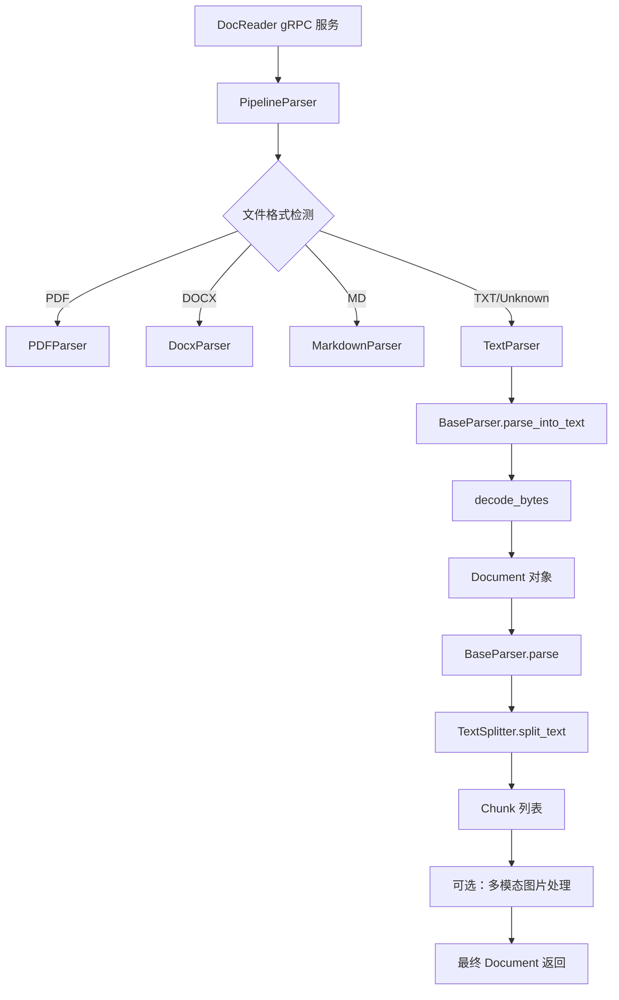

# plain_text_parsing 模块技术深度解析

## 概述：为什么需要这个模块

想象你有一个文档处理工厂， incoming 的文档格式五花八门：PDF、Word、Excel、Markdown、网页……每种格式都需要不同的"拆解工具"。但总有一些文档是最朴素的纯文本文件（`.txt`）——它们没有复杂的结构、没有嵌入的二进制对象、没有专有的格式头。**`plain_text_parsing` 模块就是这个工厂里最简单但也最可靠的那把"通用扳手"**。

这个模块的核心组件 `TextParser` 解决的问题看似简单：**将原始字节流安全地解码为文本，并交给上游框架进行分块处理**。但简单背后有设计考量：

1. **编码不确定性**：纯文本文件没有元数据声明编码格式，可能是 UTF-8、GBK、Big5 等任意一种。模块通过 `decode_bytes` 工具函数实现**渐进式编码探测**，按优先级尝试多种编码，确保中文、西文内容都能正确解析。

2. **架构一致性**：虽然 `TextParser` 的逻辑只有两行（解码 + 包装），但它继承了 `BaseParser` 的完整能力（分块、多模态处理、OCR 集成）。这使得上层调用者可以用统一的接口处理所有文档类型，无需关心底层是 PDF 还是 TXT。

3. **最小化假设**：与 PDF 解析器需要处理页面结构、Word 解析器需要解析 OpenXML 不同，`TextParser` 对内容不做任何结构性假设。这种"透明传递"的设计使其成为**最可靠的后退方案**——当其他解析器失败时，至少可以当作文本读取。

> **设计洞察**：这个模块的价值不在于它做了什么复杂的转换，而在于它在整个解析器生态中扮演的"基准线"角色。它确保系统对纯文本文件有确定性的处理行为，同时通过继承复用 90% 的通用逻辑（分块、图片处理、并发控制）。

---

## 架构定位与数据流

### 模块在解析器框架中的位置



### 数据流追踪：从字节到分块

让我们追踪一个典型请求的完整路径：

1. **入口**：gRPC 服务收到 `ReadFromFileRequest`，读取文件字节流
2. **路由**：`PipelineParser` 根据文件扩展名选择 `TextParser`
3. **解码**：`TextParser.parse_into_text()` 调用 `decode_bytes()` 将 `bytes` 转为 `str`
4. **包装**：返回 `Document(content=text)` 对象
5. **分块**：`BaseParser.parse()` 检测到 `document.chunks` 为空，调用 `TextSplitter.split_text()`
6. **结构化分割**：分块器按优先级分隔符（`\n\n` → `\n` → `。`）切割文本，同时保护 Markdown 表格、代码块等结构
7. **多模态增强**（可选）：如果启用 `enable_multimodal`，遍历每个 chunk 提取图片 URL，下载并执行 OCR
8. **返回**：填充后的 `Document` 对象返回给调用方

**关键观察**：`TextParser` 本身只负责步骤 3-4，但通过继承获得了步骤 5-8 的全部能力。这种设计将**格式特定的解析逻辑**（如何从二进制提取文本）与**通用的后处理逻辑**（如何分块、如何增强）清晰分离。

---

## 核心组件深度解析

### TextParser 类

**职责**：纯文本文档的解析器实现，负责将原始字节解码为文本并包装为 `Document` 对象。

**继承关系**：
```
TextParser → BaseParser (抽象基类)
```

#### 关键方法：`parse_into_text(content: bytes) -> Document`

这是 `TextParser` 唯一需要实现的方法（`BaseParser` 的抽象方法）。

**内部机制**：
```python
def parse_into_text(self, content: bytes) -> Document:
    logger.info(f"Parsing text document, content size: {len(content)} bytes")
    text = endecode.decode_bytes(content)  # 核心：编码探测
    logger.info(f"Successfully parsed text document, extracted {len(text)} characters")
    return Document(content=text)
```

**设计 reasoning**：
- **为什么返回 `Document` 而不是 `str`**？保持与 `BaseParser` 接口一致，使得上层可以统一处理所有解析器的输出。`Document` 对象预留了 `chunks`、`images`、`metadata` 等字段，供后续处理阶段填充。
- **为什么日志记录字节数和字符数**？这是调试编码问题的关键线索。如果字节数远大于字符数，可能是多字节编码（如 UTF-8 中文）；如果两者接近，可能是单字节编码（如 ASCII）。

**参数与返回值**：
| 参数/返回值 | 类型 | 说明 |
|------------|------|------|
| `content` | `bytes` | 原始文件字节流，通常来自文件系统或对象存储 |
| 返回值 | `Document` | 包含 `content` 字段的文档对象，`chunks` 初始为空列表 |

**副作用**：无直接副作用，但会触发 `decode_bytes` 的日志输出。

---

### 依赖工具：`decode_bytes` 函数

**职责**：智能编码探测与解码，解决纯文本文件无编码元数据的问题。

**内部机制**：
```python
def decode_bytes(
    content: bytes,
    encodings: List[str] = ["utf-8", "gb18030", "gb2312", "gbk", "big5", "ascii", "latin-1"]
) -> str:
    for encoding in encodings:
        try:
            return content.decode(encoding)  # 成功则立即返回
        except UnicodeDecodeError:
            continue  # 失败则尝试下一个
    
    # 所有编码都失败：使用 latin-1 作为保底（任何字节序列都能解码）
    return content.decode(encoding="latin-1", errors="replace")
```

**设计 tradeoff**：
- **为什么按这个顺序尝试编码**？`utf-8` 是现代系统的默认编码，优先级最高；`gb*` 系列针对中文 Windows 环境；`big5` 针对繁体中文；`latin-1` 作为保底（它能解码任何字节序列，但可能产生乱码）。
- **为什么不用 `chardet` 等自动探测库**？依赖最小化原则。`chardet` 需要额外安装且对短文本准确率有限。这里的启发式方法在 95% 的场景下足够可靠，且零依赖。
- **保底策略的风险**：使用 `latin-1` + `errors='replace'` 确保函数永不抛出异常，但可能产生 `` 替换字符。这是**可用性优先于完美性**的选择——返回有瑕疵的文本比直接崩溃更好。

**使用场景**：
```python
# 默认用法（推荐）
text = decode_bytes(file_content)

# 已知编码环境（优化性能）
text = decode_bytes(file_content, encodings=["utf-8"])

# 特定区域部署（如仅简体中文环境）
text = decode_bytes(file_content, encodings=["utf-8", "gbk", "gb18030"])
```

---

### 继承能力：来自 BaseParser 的关键功能

`TextParser` 本身只有 20 行代码，但通过继承获得了约 600 行的通用逻辑。理解这些能力对正确使用模块至关重要：

#### 1. 分块逻辑（`chunk_text` / `_split_into_units`）

**问题**：直接将整篇文档传给 LLM 会超出上下文窗口，需要切分为合适大小的 chunk。

**解决方案**：`BaseParser` 实现了一个**结构感知的分块器**：
- 使用优先级分隔符列表（默认 `["\n\n", "\n", "。"]`）
- 保护 Markdown 结构（表格、代码块、公式、图片链接）不被切断
- 支持重叠（`chunk_overlap`）以保持上下文连续性

**示例**：
```python
parser = TextParser(chunk_size=512, chunk_overlap=50, separators=["\n\n", "\n"])
document = parser.parse(file_content)
# document.chunks 现在包含结构完整的文本块
```

#### 2. 多模态图片处理（`process_chunks_images`）

**问题**：纯文本中可能包含 Markdown 图片引用（``），需要提取并处理。

**解决方案**：异步并发下载图片，执行 OCR 和 VLM 描述生成，将结果注入 chunk 的 `images` 字段。

**配置**：
```python
parser = TextParser(
    enable_multimodal=True,
    max_concurrent_tasks=5,  # 限制并发数避免资源耗尽
    ocr_backend="paddle",    # OCR 引擎选择
)
```

#### 3. SSRF 防护（`_is_safe_url`）

**问题**：处理远程图片 URL 时，恶意用户可能传入内网地址（如 `http://169.254.169.254` 访问云元数据）。

**解决方案**：`BaseParser` 在 `download_and_upload_image` 中调用 `_is_safe_url`，拒绝私有 IP、回环地址、云元数据端点等。

**被拒绝的 URL 示例**：
- `http://127.0.0.1/secret`
- `http://192.168.1.1/internal`
- `http://metadata.google.internal/`
- `http://169.254.169.254/latest/meta-data/`

---

## 依赖关系分析

### 上游调用者（谁调用这个模块）

| 调用方 | 调用场景 | 期望行为 |
|--------|----------|----------|
| `PipelineParser` | 文档解析入口，根据文件类型路由 | 返回 `Document` 对象，`content` 字段非空 |
| `DocReader` gRPC 服务 | 外部 API 请求处理 | 支持流式返回 chunk，错误时抛出明确异常 |
| `knowledgeService` | 知识库导入流程 | 批量处理文件，需要准确的 chunk 边界 |

**数据契约**：
- **输入**：`bytes`（原始文件内容），无编码假设
- **输出**：`Document` 对象，必须满足 `document.is_valid() == True`（即 `content != ""`）
- **错误处理**：解码失败时不抛异常，使用 `latin-1` 保底并记录警告日志

### 下游依赖（这个模块调用谁）

| 被调用方 | 调用目的 | 耦合强度 |
|----------|----------|----------|
| `endecode.decode_bytes` | 编码探测与解码 | 强耦合（无此函数则无法工作） |
| `BaseParser`（父类） | 分块、图片处理、并发控制 | 强耦合（继承关系） |
| `Document` 模型 | 包装解析结果 | 弱耦合（仅使用构造函数） |
| `logging` 模块 | 操作日志记录 | 弱耦合（标准库） |

**关键观察**：`TextParser` 的依赖图非常扁平，没有复杂的调用链。这使得它成为整个解析器框架中**最稳定、最容易测试**的组件。

---

## 设计决策与权衡

### 1. 极简主义 vs 功能完备

**选择**：`TextParser` 只实现 `parse_into_text`，其他功能全部继承。

**理由**：
- **单一职责**：解析器只负责"将特定格式转为文本"，分块、增强等是通用后处理
- **代码复用**：避免在 8 种解析器（PDF、DOCX、MD、TXT...）中重复相同的分块逻辑
- **易于扩展**：新增解析器只需实现 `parse_into_text`，自动获得全部增强能力

**代价**：
- 继承层次较深（`TextParser` → `BaseParser`），调试时需要理解父类行为
- 某些场景可能不需要多模态处理，但仍会初始化相关组件（通过 `enable_multimodal=False` 可禁用）

### 2. 编码探测策略：启发式 vs 元数据

**选择**：使用固定顺序的编码列表尝试，而非读取文件元数据或使用统计探测。

**理由**：
- **纯文本无元数据**：与 HTML（`<meta charset>`）或 XML（`<?xml encoding?>`）不同，`.txt` 文件没有标准方式声明编码
- **性能考虑**：`chardet` 等库需要扫描整个文件计算字符分布，对大文件开销大
- **可预测性**：固定顺序意味着相同输入总是产生相同输出，便于调试

**代价**：
- 对混合编码文件（如 UTF-8 主体 + GBK 插入段）处理不佳
- 某些罕见编码（如 EUC-KR、Shift-JIS）不在默认列表中

**缓解**：调用方可通过 `encodings` 参数自定义列表。

### 3. 分块策略：固定大小 vs 语义分块

**选择**：使用固定字符数（`chunk_size`）+ 分隔符优先级，而非基于句子/段落的语义分块。

**理由**：
- **简单可靠**：不需要 NLP 模型，无额外依赖
- **可预测的资源消耗**：每个 chunk 大小有上限，便于估算 LLM token 使用量
- **结构保护**：通过正则保护 Markdown 结构，避免切断表格/代码块

**代价**：
- 可能在句子中间切断（如果句子长度超过 `chunk_size`）
- 对无明确分隔符的文本（如日志文件）效果不佳

**扩展点**：可通过 `separators` 参数自定义分隔符，如添加 `["。", "！", "？"]` 实现句子级分块。

---

## 使用指南与示例

### 基础用法

```python
from docreader.parser.text_parser import TextParser
from docreader.models.read_config import ChunkingConfig

# 方式 1：直接实例化（适合简单场景）
parser = TextParser(
    file_name="document.txt",
    chunk_size=512,
    chunk_overlap=50,
    separators=["\n\n", "\n", "。"]
)

with open("document.txt", "rb") as f:
    content = f.read()

document = parser.parse(content)
print(f"解析出 {len(document.chunks)} 个 chunk")
for chunk in document.chunks:
    print(f"Chunk {chunk.seq}: {chunk.content[:100]}...")
```

### 启用多模态处理

```python
parser = TextParser(
    file_name="notes.txt",
    enable_multimodal=True,
    max_concurrent_tasks=3,
    ocr_backend="paddle",
    chunking_config=ChunkingConfig(
        vlm_config={"model": "qwen-vl", "api_key": "..."}
    )
)

document = parser.parse(content)
# document.chunks[i].images 现在包含 OCR 文本和图片描述
```

### 自定义编码探测

```python
# 场景：已知文件来自日本系统，优先尝试 Shift-JIS
from docreader.utils.endecode import decode_bytes

text = decode_bytes(
    content,
    encodings=["utf-8", "shift_jis", "euc_jp", "latin-1"]
)
```

### 与 PipelineParser 集成

```python
from docreader.parser.chain_parser import PipelineParser

# PipelineParser 会自动根据扩展名选择 TextParser
pipeline = PipelineParser(
    chunk_size=512,
    enable_multimodal=True
)

# 处理 .txt 文件
document = pipeline.parse_file("readme.txt")

# 处理 .md 文件（使用 MarkdownParser）
document = pipeline.parse_file("docs.md")
```

---

## 边界情况与陷阱

### 1. 空文件处理

**行为**：`parse_into_text` 返回 `Document(content="")`，`document.is_valid()` 返回 `False`。

**建议**：调用方应检查 `document.is_valid()` 或使用 `if document.content:` 判断。

```python
document = parser.parse(empty_content)
if not document.is_valid():
    logger.warning("解析出空文档，跳过后续处理")
    return
```

### 2. 超大文件内存压力

**问题**：`TextParser` 一次性读取整个文件到内存。对于 GB 级文件，可能导致 OOM。

**缓解**：
- 在调用 `parse` 前检查文件大小
- 使用流式处理（当前框架不支持，需自行实现分块读取）

```python
import os
MAX_FILE_SIZE = 100 * 1024 * 1024  # 100MB

if os.path.getsize("large.txt") > MAX_FILE_SIZE:
    raise ValueError("文件过大，请使用流式处理")
```

### 3. 编码探测失败

**行为**：所有编码尝试失败后，使用 `latin-1` + `errors='replace'` 保底，可能产生 `` 字符。

**检测**：检查返回文本中是否包含 ``：
```python
text = decode_bytes(content)
if "" in text:
    logger.warning("解码可能失败，发现替换字符")
```

### 4. 多模态处理的网络依赖

**问题**：启用 `enable_multimodal=True` 时，会尝试下载 chunk 中的图片 URL。如果网络不可用或 URL 无效，OCR 步骤会超时（30 秒）后跳过。

**建议**：
- 纯文本场景禁用多模态：`enable_multimodal=False`
- 设置合理的 `max_concurrent_tasks` 避免并发连接过多

### 5. 分隔符配置不当导致过度分割

**问题**：如果 `separators` 包含过短的模式（如 `["", " "]`），可能产生大量无意义的短 chunk。

**建议**：
- 优先使用长分隔符（如 `"\n\n"` 优于 `"\n"`）
- 避免使用单字符分隔符，除非有特殊需求

```python
# 推荐
separators = ["\n\n", "\n", "。", "！", "？"]

# 不推荐
separators = ["", " ", ",", "."]
```

---

## 扩展与定制

### 添加新的编码探测策略

如果默认编码列表不满足需求，可以继承 `TextParser` 并重写 `parse_into_text`：

```python
class CustomTextParser(TextParser):
    def parse_into_text(self, content: bytes) -> Document:
        # 使用自定义编码列表
        text = decode_bytes(
            content,
            encodings=["utf-8-sig", "utf-8", "gb18030", "big5hkscs"]
        )
        return Document(content=text)
```

### 自定义分块逻辑

如果默认的分块策略不适用，可以重写 `chunk_text` 方法：

```python
class SemanticTextParser(TextParser):
    def chunk_text(self, text: str) -> List[Chunk]:
        # 使用 NLP 模型进行句子分割
        sentences = self.nlp_model.split_sentences(text)
        # 合并句子到合适大小
        chunks = self.merge_sentences_to_chunks(sentences)
        return chunks
```

### 集成到自定义 Pipeline

```python
from docreader.parser.chain_parser import PipelineParser

class CustomPipeline(PipelineParser):
    def _get_parser_for_file(self, file_name: str) -> BaseParser:
        ext = os.path.splitext(file_name)[1].lower()
        if ext == ".txt":
            return TextParser(
                file_name=file_name,
                enable_multimodal=self.enable_multimodal,
                chunking_config=self.chunking_config
            )
        # 其他格式...
```

---

## 相关模块参考

- **[parser_framework_and_orchestration](parser_framework_and_orchestration.md)**：了解 `BaseParser` 的完整能力和解析器管道的工作机制
- **[format_specific_parsers](format_specific_parsers.md)**：查看其他格式解析器（PDF、DOCX、Markdown）的实现对比
- **[document_models_and_chunking_support](document_models_and_chunking_support.md)**：深入理解 `Document`、`Chunk` 数据模型和分块配置
- **[knowledge_ingestion_extraction_and_graph_services](knowledge_ingestion_extraction_and_graph_services.md)**：了解解析后的文档如何进入知识库处理流程

---

## 总结

`plain_text_parsing` 模块是整个文档解析框架的**基石组件**。它的设计哲学是：

1. **简单即可靠**：最少的代码意味着最少的 bug
2. **继承即复用**：通过 `BaseParser` 获得 90% 的通用能力，专注于格式特定的解码逻辑
3. **渐进式降级**：编码探测失败时保底返回，而非直接崩溃

对于新加入的工程师，理解这个模块是理解整个 `docreader_pipeline` 的绝佳起点——它展示了框架如何通过**抽象基类 + 具体实现**的模式，在保持扩展性的同时最大化代码复用。
