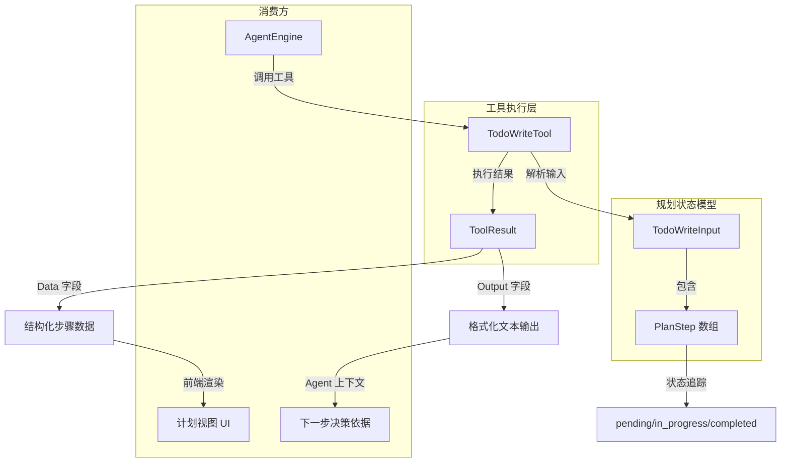

# planning_state_models_and_step_definitions 模块深度解析

## 模块概述：为什么需要这个模块

想象一下，你让一个智能助手去研究"比较 WeKnora 与 LangChain、LlamaIndex 这三个 RAG 框架"。这是一个典型的多步骤任务：需要先搜索知识库获取 WeKnora 信息，再用网络搜索查找另外两个框架的文档，最后还要对比分析。如果没有一个结构化的任务追踪机制，助手很容易在检索过程中迷失方向——忘记已经查了什么、还有什么没查、或者过早地开始总结而遗漏关键信息。

`planning_state_models_and_step_definitions` 模块正是为了解决这个问题而存在的。它实现了一个**规划状态管理工具**（`TodoWriteTool`），让 Agent 能够将复杂的研究任务拆解成可追踪的步骤序列，并在执行过程中实时更新每个步骤的状态。这个模块的核心设计洞察是：**检索（retrieval）与综合（synthesis）应该分离**——`todo_write` 专注于追踪"要检索什么"，而 `thinking` 工具负责"如何综合呈现"。这种分离避免了任务边界的模糊，确保 Agent 在完成所有检索任务之前不会过早进入总结阶段。

从架构角色来看，这个模块是 Agent 推理链路中的**状态协调器**。它不直接执行检索或生成操作，而是维护一个结构化的任务清单，为 Agent 提供执行进度的可视化反馈，同时为前端渲染计划视图提供结构化数据。

---

## 架构与数据流



### 架构角色解析

上图展示了该模块在 Agent 运行时中的位置和数据流向：

1. **输入层**（`TodoWriteInput` + `PlanStep`）：定义规划的数据契约。Agent 在接收到复杂任务时，会构造一个包含任务描述和步骤数组的输入对象。每个步骤都有唯一 ID、描述文本和状态标记。

2. **执行层**（`TodoWriteTool`）：继承自 `BaseTool`，实现工具的执行逻辑。它不产生副作用（不真正执行检索），而是将规划信息格式化后返回，同时更新 Agent 的上下文状态。

3. **输出层**（`ToolResult`）：返回双重格式的结果——`Output` 字段包含人类可读的格式化文本（带 emoji 进度指示），`Data` 字段包含机器可读的结构化数据（JSON 格式的步骤列表），供前端渲染使用。

4. **消费方**：
   - **AgentEngine**：根据返回的计划输出决定下一步执行哪个工具
   - **前端 UI**：解析 `Data` 字段中的 `display_type: "plan"` 标识，渲染专门的计划视图组件
   - **Agent 上下文**：格式化的文本输出被追加到对话历史中，作为后续决策的参考依据

### 数据流追踪：从用户请求到计划生成

当一个复杂查询进入系统时，数据流经该模块的典型路径如下：

```
用户请求 → AgentEngine 判断需要规划 → 构造 TodoWriteInput → 
TodoWriteTool.Execute() → 解析步骤 → 生成格式化输出 → 
返回 ToolResult → AgentEngine 读取输出 → 执行第一个 pending 步骤
```

关键在于 `Execute` 方法中的处理逻辑：它首先反序列化输入的 JSON，验证必填字段（`Task` 不能为空），然后调用 `generatePlanOutput` 生成带进度统计的格式化文本。同时，它将步骤列表再次序列化为 JSON 字符串存入 `Data` 字段，确保前端可以独立解析和渲染。

---

## 核心组件深度解析

### TodoWriteInput：规划请求的数据契约

```go
type TodoWriteInput struct {
    Task  string     `json:"task" jsonschema:"The complex task or question you need to create a plan for"`
    Steps []PlanStep `json:"steps" jsonschema:"Array of research plan steps with status tracking"`
}
```

**设计意图**：这个结构体定义了 Agent 向规划工具传递信息的契约。`Task` 字段是高层任务描述（如"比较三个 RAG 框架"），`Steps` 字段是具体的执行步骤列表。这种双层结构的设计原因是：**任务描述用于人类理解整体目标，步骤列表用于机器追踪执行进度**。

**参数约束**：
- `Task`：允许为空，但为空时会被替换为默认值"未提供任务描述"。这是一个防御性设计，避免因缺少任务描述而导致工具执行失败。
- `Steps`：允许为空数组。当步骤为空时，`generatePlanOutput` 会生成建议的检索流程模板，引导 Agent 创建合理的步骤。

**返回值与副作用**：该结构体本身不产生副作用，仅作为数据载体。但它的字段值直接影响 `generatePlanOutput` 的输出内容——特别是步骤的状态分布会影响进度统计和提醒文本。

**使用示例**：
```go
input := TodoWriteInput{
    Task: "比较 WeKnora 与 LangChain、LlamaIndex",
    Steps: []PlanStep{
        {ID: "step1", Description: "搜索知识库获取 WeKnora 架构信息", Status: "pending"},
        {ID: "step2", Description: "使用 web_search 查找 LangChain 文档", Status: "pending"},
        {ID: "step3", Description: "使用 web_search 查找 LlamaIndex 文档", Status: "pending"},
    },
}
```

### PlanStep：原子步骤的状态机

```go
type PlanStep struct {
    ID          string `json:"id" jsonschema:"Unique identifier for this step"`
    Description string `json:"description" jsonschema:"Clear description of what to investigate"`
    Status      string `json:"status" jsonschema:"Current status: pending, in_progress, completed"`
}
```

**设计意图**：`PlanStep` 实现了一个简化的**三态状态机**（pending → in_progress → completed）。这种设计的核心约束是：**同一时间只能有一个步骤处于 `in_progress` 状态**。这个约束在工具的 `description` 中有明确说明，虽然代码层面没有强制验证，但通过文档约定和 Agent 的行为规范来保证。

**状态语义**：
- `pending`：步骤尚未开始。Agent 在选择下一步操作时，应优先选择 `pending` 状态的步骤。
- `in_progress`：步骤正在执行。**关键约束**：系统中应始终最多只有一个步骤处于此状态。这避免了并行执行导致的上下文混乱。
- `completed`：步骤已成功完成。只有当步骤真正完成（而非遇到错误）时才能标记为此状态。

**非 obvious 的设计选择**：为什么没有 `failed` 状态？代码中的设计哲学是：**遇到错误时保持 `in_progress` 状态，并创建新的步骤来描述需要解决的问题**。这种设计避免了状态爆炸，同时强制 Agent 显式地处理错误情况（通过新增步骤），而不是简单地标记失败后跳过。

**扩展点与边界**：`formatPlanStep` 函数中的 `statusEmoji` 映射表预留了 `skipped` 状态（⏭️），但当前代码逻辑中并未使用。这是一个潜在的扩展点，未来可能支持步骤跳过功能。

### TodoWriteTool：规划执行引擎

```go
type TodoWriteTool struct {
    BaseTool
}
```

**内部机制**：`TodoWriteTool` 继承自 `BaseTool`，采用**组合模式**复用基础工具的功能（如名称、描述、Schema 生成）。`Execute` 方法是核心执行逻辑，它遵循以下流程：

1. **输入解析**：使用 `json.Unmarshal` 将 `json.RawMessage` 反序列化为 `TodoWriteInput`。失败时返回错误信息。
2. **默认值处理**：如果 `Task` 为空，设置为默认值。这是一个容错设计，确保工具不会因输入不完整而崩溃。
3. **输出生成**：调用 `generatePlanOutput` 生成格式化文本。该函数会统计各状态步骤数量，生成进度摘要和提醒文本。
4. **结构化数据准备**：将步骤列表再次序列化为 JSON 字符串，存入 `Data` 字段。这是为了前端可以独立解析，无需解析 `Output` 文本。
5. **返回结果**：构造 `ToolResult`，设置 `Success: true` 和 `display_type: "plan"` 标识。

**关键设计决策**：为什么 `Execute` 方法不产生实际副作用（如调用检索工具）？这是因为 `TodoWriteTool` 的职责是**规划而非执行**。真正的检索操作由其他工具（如 `KnowledgeSearchTool`、`GrepChunksTool`）完成。这种职责分离使得规划逻辑与执行逻辑解耦，便于独立测试和扩展。

**返回值结构**：
```go
&types.ToolResult{
    Success: true,
    Output:  "计划已创建\n\n**任务**: ...\n\n**计划步骤**: ...",
    Data: map[string]interface{}{
        "task":         input.Task,
        "steps":        planSteps,
        "steps_json":   string(stepsJSON),
        "total_steps":  len(planSteps),
        "plan_created": true,
        "display_type": "plan",  // 前端渲染标识
    },
}
```

**依赖的隐式契约**：
- 依赖 `BaseTool` 的 `name` 和 `description` 字段在工具注册时被正确设置
- 依赖 `types.ToolResult` 的 `Data` 字段能被前端正确解析
- 依赖 Agent 遵循"同一时间只有一个 `in_progress` 步骤"的约定

---

## 依赖关系分析

### 该模块调用的组件（下游依赖）

| 依赖组件 | 来源模块 | 调用原因 |
|---------|---------|---------|
| `BaseTool` | `agent_runtime_and_tools` | 继承基础工具功能（名称、描述、Schema 生成） |
| `types.ToolResult` | `core_domain_types_and_interfaces` | 定义工具执行结果的标准返回格式 |
| `utils.GenerateSchema` | 平台工具层 | 根据泛型类型自动生成 JSON Schema |

**耦合分析**：该模块与 `BaseTool` 的耦合是**实现层面的继承耦合**。如果 `BaseTool` 的接口发生变化（如 `Execute` 方法签名修改），该模块需要同步调整。与 `types.ToolResult` 的耦合是**契约耦合**，如果 `ToolResult` 的字段结构变化，会影响返回值的构造方式。

### 调用该模块的组件（上游依赖）

| 调用方 | 来源模块 | 期望行为 |
|-------|---------|---------|
| `AgentEngine` | `agent_runtime_and_tools` | 期望工具返回格式化的计划文本和结构化步骤数据 |
| 前端 UI 渲染器 | `frontend_contracts_and_state` | 期望 `Data` 字段包含 `display_type: "plan"` 标识 |

**数据契约**：上游组件期望 `ToolResult.Data` 中包含以下字段：
- `task`：任务描述字符串
- `steps`：步骤对象数组（包含 `id`、`description`、`status`）
- `steps_json`：步骤数组的 JSON 字符串表示
- `total_steps`：步骤总数
- `plan_created`：布尔值，标识计划是否成功创建
- `display_type`：固定值 `"plan"`，用于前端选择渲染组件

如果这些字段的名称或类型发生变化，会导致前端渲染失败或 Agent 解析错误。

###  hottest 路径分析

在典型的复杂查询场景中，该模块的调用频率相对较低（一次查询通常只调用 1-2 次 `TodoWriteTool`），但它的**影响力很大**——生成的计划会直接影响后续所有工具调用的顺序和内容。因此，虽然它不是性能热点，但却是**逻辑关键路径**上的核心节点。

---

## 设计决策与权衡

### 1. 检索与综合的分离

**选择**：`todo_write` 只追踪检索任务，不包含总结或合成任务。总结由 `thinking` 工具处理。

**权衡**：
- **优点**：职责清晰，避免 Agent 在检索未完成时过早总结；便于前端区分"执行中"和"已完成"阶段
- **缺点**：增加了工具调用的次数（需要先调用 `todo_write`，再调用 `thinking`）；需要 Agent 理解两个工具的边界

**为什么这样设计**：在早期版本中，曾尝试将总结任务也放入 `todo_write`，但发现 Agent 容易在检索中途就开始总结，导致信息不完整。分离后，通过工具描述中的强约束（"DO NOT include summary tasks"）和输出中的提醒文本（"所有任务完成后才能生成最终总结"），显著改善了这一问题。

### 2. 三态状态机 vs 多态状态机

**选择**：只使用 `pending`、`in_progress`、`completed` 三种状态，不引入 `failed`、`skipped` 等状态。

**权衡**：
- **优点**：状态简单，Agent 容易理解和遵循；避免了状态转换的复杂性
- **缺点**：无法显式表示失败的步骤；需要靠新增步骤来处理错误情况

**为什么这样设计**：引入 `failed` 状态会导致 Agent 倾向于跳过困难的任务，而不是尝试解决。通过要求保持 `in_progress` 状态并新增步骤，强制 Agent 正视问题。这是一个**行为引导型设计**，通过状态模型的约束来塑造 Agent 的行为模式。

### 3. 双重输出格式（文本 + 结构化数据）

**选择**：同时返回人类可读的 `Output` 文本和机器可读的 `Data` 对象。

**权衡**：
- **优点**：前端可以灵活选择渲染方式（文本直接显示，结构化数据用于定制 UI）；Agent 可以从文本中提取上下文
- **缺点**：数据冗余；需要维护两种格式的一致性

**为什么这样设计**：早期版本只返回结构化数据，但发现 Agent 在读取历史消息时，难以从纯 JSON 中快速理解计划进度。添加格式化文本后，Agent 的决策质量明显提升。这是一个**以冗余换可理解性**的权衡。

### 4. 无副作用的执行模型

**选择**：`Execute` 方法不实际调用检索工具，只返回规划信息。

**权衡**：
- **优点**：职责单一，易于测试；规划与执行解耦，便于独立演进
- **缺点**：需要额外的工具调用来执行实际检索；增加了调用链长度

**为什么这样设计**：如果 `TodoWriteTool` 直接执行检索，会导致工具职责膨胀，且难以处理部分失败的情况（如某个步骤检索失败）。分离后，每个步骤的执行由对应的专业工具处理，错误处理更加精细。

---

## 使用指南与示例

### 基本使用模式

```go
// 1. 创建工具实例
tool := NewTodoWriteTool()

// 2. 构造输入
input := TodoWriteInput{
    Task: "研究向量数据库在 RAG 中的应用",
    Steps: []PlanStep{
        {ID: "step1", Description: "搜索知识库获取向量数据库基础概念", Status: "pending"},
        {ID: "step2", Description: "使用 web_search 查找最新向量数据库技术", Status: "pending"},
        {ID: "step3", Description: "检索性能对比信息", Status: "pending"},
    },
}

// 3. 序列化输入
inputJSON, _ := json.Marshal(input)

// 4. 执行工具
ctx := context.Background()
result, err := tool.Execute(ctx, inputJSON)

// 5. 处理结果
if result.Success {
    fmt.Println(result.Output)  // 格式化文本
    fmt.Println(result.Data)    // 结构化数据
}
```

### 状态更新模式

```go
// 当开始执行 step1 时，更新其状态为 in_progress
input.Steps[0].Status = "in_progress"

// 当 step1 完成后，标记为 completed，并将 step2 设为 in_progress
input.Steps[0].Status = "completed"
input.Steps[1].Status = "in_progress"
```

### 前端渲染提示

前端在接收到 `ToolResult` 后，应检查 `Data.display_type` 字段：
- 如果值为 `"plan"`，使用计划视图组件渲染
- 从 `Data.steps` 中提取步骤列表
- 根据 `Status` 字段显示对应的状态图标（⏳/🔄/✅）

---

## 边界情况与注意事项

### 1. 空步骤列表的处理

当 `Steps` 为空数组时，`generatePlanOutput` 会生成建议的检索流程模板。这是一个**引导性设计**，帮助 Agent 学习如何创建合理的步骤。但需要注意，这只是一个模板，Agent 仍需要根据实际任务调整。

### 2. 状态一致性约束

代码中没有强制验证"同一时间只有一个 `in_progress` 步骤"。这是一个**约定优于强制**的设计，依赖 Agent 的行为规范来保证。如果 Agent 违反这一约定（如同时标记多个步骤为 `in_progress`），工具不会报错，但会导致进度统计不准确。

**建议**：在 Agent 的训练数据中强化这一约束，或在 `AgentEngine` 层面添加验证逻辑。

### 3. 步骤 ID 的唯一性

`PlanStep.ID` 字段用于唯一标识步骤，但代码中没有验证唯一性。如果 Agent 传入重复的 ID，会导致前端渲染和状态追踪混乱。

**建议**：在 `Execute` 方法中添加唯一性验证，或在 Agent 侧使用确定性 ID 生成策略（如 `step1`、`step2` 递增）。

### 4. 错误处理的隐式契约

当步骤执行遇到错误时，应保持 `in_progress` 状态并新增步骤。这是一个容易被忽视的约束。如果 Agent 直接将步骤标记为 `completed` 而忽略错误，会导致最终总结基于不完整的信息。

### 5. 国际化考虑

`generatePlanOutput` 中的文本是硬编码的中文。如果系统需要支持多语言，需要将文本提取到配置文件中，或根据用户语言偏好动态选择。

---

## 相关模块参考

- [agent_engine_orchestration](agent_runtime_and_tools.md)：了解 `AgentEngine` 如何调用和协调工具
- [tool_definition_and_registry](agent_runtime_and_tools.md)：了解工具注册和发现机制
- [sequential_reasoning_tool_contracts_and_execution](agent_runtime_and_tools.md)：了解 `SequentialThinkingTool` 如何与 `TodoWriteTool` 配合处理综合任务
- [tool_result_contracts_for_agent_reasoning_flow](frontend_contracts_and_state.md)：了解前端如何解析和渲染工具返回的 `PlanData`

---

## 总结

`planning_state_models_and_step_definitions` 模块通过简洁的三态状态机和双重输出格式，实现了 Agent 规划状态的有效管理。它的核心设计哲学是**分离关注点**——检索与综合分离、规划与执行分离、人类可读与机器可读分离。这些分离带来了清晰的职责边界，使 Agent 能够更可靠地完成复杂的多步骤任务。

对于新贡献者，最需要理解的是：**这个模块的价值不在于代码复杂度，而在于它通过数据模型和输出格式的设计，塑造了 Agent 的行为模式**。任何修改都应谨慎评估对 Agent 行为的影响，而不仅仅是代码层面的正确性。
