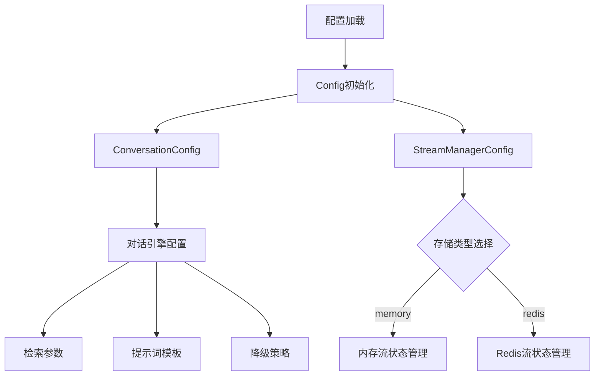

# 对话流与缓存运行时配置模块详解

## 模块概览

在一个支持复杂多轮对话系统中，需要同时管理对话流的流畅性、历史上下文的持久化、以及检索增强生成过程中各种参数的精细控制。`conversation_streaming_and_cache_runtime_configuration` 模块正是为了解决这一问题而设计的核心配置枢纽。它不仅定义了对话服务的参数集，还提供了流式输出的状态管理配置，以及缓存策略的灵活选择。

想象这个模块就像是一个"中央控制台"，它协调着对话引擎、流状态管理和缓存系统之间的关系，确保整个系统在性能和用户体验之间取得平衡。

## 核心组件解析

### 1. ConversationConfig - 对话服务的神经中枢

`ConversationConfig` 是整个对话系统的核心配置结构，它集中管理了检索增强生成（RAG）流程中各个环节的参数。

```go
type ConversationConfig struct {
    MaxRounds                  int            `yaml:"max_rounds"                    json:"max_rounds"`
    KeywordThreshold           float64        `yaml:"keyword_threshold"             json:"keyword_threshold"`
    EmbeddingTopK              int            `yaml:"embedding_top_k"               json:"embedding_top_k"`
    VectorThreshold            float64        `yaml:"vector_threshold"              json:"vector_threshold"`
    RerankTopK                 int            `yaml:"rerank_top_k"                  json:"rerank_top_k"`
    RerankThreshold            float64        `yaml:"rerank_threshold"              json:"rerank_threshold"`
    FallbackStrategy           string         `yaml:"fallback_strategy"             json:"fallback_strategy"`
    FallbackResponse           string         `yaml:"fallback_response"             json:"fallback_response"`
    FallbackPrompt             string         `yaml:"fallback_prompt"               json:"fallback_prompt"`
    EnableRewrite              bool           `yaml:"enable_rewrite"                json:"enable_rewrite"`
    EnableQueryExpansion       bool           `yaml:"enable_query_expansion"        json:"enable_query_expansion"`
    EnableRerank               bool           `yaml:"enable_rerank"                 json:"enable_rerank"`
    Summary                    *SummaryConfig `yaml:"summary"                       json:"summary"`
    GenerateSessionTitlePrompt string         `yaml:"generate_session_title_prompt" json:"generate_session_title_prompt"`
    GenerateSummaryPrompt      string         `yaml:"generate_summary_prompt"       json:"generate_summary_prompt"`
    RewritePromptSystem        string         `yaml:"rewrite_prompt_system"         json:"rewrite_prompt_system"`
    RewritePromptUser          string         `yaml:"rewrite_prompt_user"           json:"rewrite_prompt_user"`
    SimplifyQueryPrompt        string         `yaml:"simplify_query_prompt"         json:"simplify_query_prompt"`
    SimplifyQueryPromptUser    string         `yaml:"simplify_query_prompt_user"    json:"simplify_query_prompt_user"`
    ExtractEntitiesPrompt      string         `yaml:"extract_entities_prompt"       json:"extract_entities_prompt"`
    ExtractRelationshipsPrompt string         `yaml:"extract_relationships_prompt"  json:"extract_relationships_prompt"`
    GenerateQuestionsPrompt string `yaml:"generate_questions_prompt" json:"generate_questions_prompt"`
}
```

**设计意图**：
- **集中管理：将所有对话相关的参数集中在一个结构中，避免配置分散
- **灵活性与可配置性**：几乎所有关键环节都可通过配置调整
- **提示词模板化**：将复杂的提示词逻辑分离到配置中，便于定制
- **检索增强生成流程控制**：完整覆盖了从查询重写到结果重排的全流程参数

**关键参数解析**：
- `MaxRounds`：控制对话历史的最大轮数，直接影响上下文窗口的使用
- `KeywordThreshold`/`VectorThreshold`/`RerankThreshold`：三级阈值系统，分别控制关键词匹配、向量检索和重排结果的过滤
- `EnableRewrite`/`EnableQueryExpansion`/`EnableRerank`：三个布尔开关，精细控制RAG流程的各个环节
- `FallbackStrategy`/`FallbackResponse`/`FallbackPrompt`：降级策略配置，确保系统在检索失败时仍能提供有意义的响应

### 2. StreamManagerConfig - 流式输出的指挥中心

`StreamManagerConfig` 负责配置流式对话输出的状态管理策略。

```go
type StreamManagerConfig struct {
    Type           string        `yaml:"type"            json:"type"`            // 类型: "memory" 或 "redis"
    Redis          RedisConfig   `yaml:"redis"           json:"redis"`           // Redis配置
    CleanupTimeout time.Duration `yaml:"cleanup_timeout" json:"cleanup_timeout"` // 清理超时，单位秒
}
```

**设计意图**：
- **可插拔的状态存储**：支持内存和Redis两种后端，适应不同规模的部署场景
- **资源管理**：通过`CleanupTimeout`控制过期状态的清理，防止资源泄漏
- **统一接口**：无论选择哪种后端，都使用相同的配置接口

**类型选择策略**：
- `memory`：适用于单机部署、开发环境或小规模场景，性能最高但不可持久化
- `redis`：适用于分布式部署、生产环境，支持状态持久化和多实例共享

### 3. RedisConfig - Redis缓存的精密调节器

`RedisConfig` 提供了Redis连接和缓存策略的详细配置。

```go
type RedisConfig struct {
    Address  string        `yaml:"address"  json:"address"`  // Redis地址
    Username string        `yaml:"username" json:"username"` // Redis用户名
    Password string        `yaml:"password" json:"password"` // Redis密码
    DB       int           `yaml:"db"       json:"db"`       // Redis数据库
    Prefix   string        `yaml:"prefix"   json:"prefix"`   // 键前缀
    TTL      time.Duration `yaml:"ttl"      json:"ttl"`      // 过期时间(小时)
}
```

**设计意图**：
- **完整的连接配置**：涵盖了Redis连接所需的所有必要参数
- **键前缀隔离**：通过`Prefix`支持多租户或多应用共享同一Redis实例
- **TTL策略**：统一的缓存过期时间管理，防止过期数据堆积

## 数据流向与依赖关系

让我们通过一个典型的对话请求来追踪配置的使用流程：



**配置数据流**：
1. 系统启动时通过`LoadConfig()`从配置文件加载所有配置
2. `ConversationConfig`被传递给对话引擎，用于控制整个对话流程的各个环节
3. `StreamManagerConfig`根据类型选择相应的流状态管理器
4. 如果选择Redis，则使用`RedisConfig`建立Redis连接并配置缓存策略
5. 整个对话过程中，各个组件从配置中读取参数，动态调整行为

## 设计决策与权衡

这个模块的设计体现了几个关键的架构决策：

### 1. 集中式配置 vs 分布式配置
**选择**：集中式配置
- **优点**：
  - 统一管理，减少配置分散带来的复杂性
  - 便于整体配置的版本控制和审计
  - 简化依赖注入更加清晰
- **缺点**：
  - 配置文件可能变得很大
  - 某些组件可能依赖不需要的配置项

### 2. 硬编码默认值 vs 配置文件
**选择**：配置文件优先，配合环境变量替换
- **优点**：
  - 高度灵活性，无需重新编译即可调整系统行为
  - 支持环境变量替换，便于不同部署环境的配置管理
- **缺点**：
  - 配置验证和验证逻辑分离，可能导致运行时错误

### 3. 内存缓存 vs Redis缓存
**选择**：同时支持，可配置选择
- **优点**：
  - 适应不同部署场景，从开发到生产环境
  - 内存方案性能最优，Redis方案提供持久化和分布式支持
- **缺点**：
  - 增加了代码复杂度，需要维护两套实现
  - 行为可能略有不同，需要仔细测试

### 4. 提示词模板嵌入配置 vs 外部文件
**选择**：两者都支持，优先外部文件
- **优点**：
  - 外部文件便于定制和A/B测试
  - 配置文件提供后备方案，确保系统可运行
- **缺点**：
  - 增加了配置加载逻辑的复杂性

## 使用指南与常见陷阱

### 配置文件示例

```yaml
conversation:
  max_rounds: 10
  keyword_threshold: 0.7
  embedding_top_k: 20
  vector_threshold: 0.5
  rerank_top_k: 5
  rerank_threshold: 0.3
  fallback_strategy: "default"
  fallback_response: "抱歉，我无法找到相关信息。"
  enable_rewrite: true
  enable_query_expansion: false
  enable_rerank: true

stream_manager:
  type: "redis"
  redis:
    address: "localhost:6379"
    password: ""
    db: 0
    prefix: "weknora:"
    ttl: 24h
  cleanup_timeout: 30s
```

### 环境变量替换
配置支持 `${ENV_VAR}` 格式的环境变量引用，例如：
```yaml
stream_manager:
  redis:
    address: "${REDIS_ADDRESS}"
    password: "${REDIS_PASSWORD}"
```

### 常见陷阱

1. **阈值配置不当**：
   - 阈值过高会导致检索结果过少，影响回答质量
   - 阈值过低会导致噪音过多，增加处理负担
   - 建议：先使用默认值，然后根据实际效果逐步调整

2. **Redis连接配置错误**：
   - 地址、密码、数据库配置错误会导致系统无法启动
   - 建议：在开发环境先用memory类型，确保其他配置正确后再切换到redis

3. **提示词模板路径问题**：
   - 模板文件路径或格式错误会导致配置加载失败
   - 建议：确保模板文件存在且格式正确，配置文件中提供后备模板

4. **TTL设置不合理**：
   - TTL过短会导致缓存频繁失效，增加Redis压力
   - TTL过长会导致内存浪费和数据过期
   - 建议：根据对话会话的典型时长设置TTL

5. **MaxRounds设置过大**：
   - 会导致上下文窗口超限，影响模型处理负担增加
   - 建议：根据模型上下文窗口大小和实际需求合理设置

## 扩展与集成

### 自定义流状态管理器

虽然当前模块支持memory和redis两种类型，但设计上预留了扩展点：
- 可以通过实现相同的配置接口，添加新的流状态管理器类型
- 配置模块只需要在StreamManagerConfig中添加新的类型字段即可

### 提示词模板管理

提示词模板支持从外部文件加载，便于：
- A/B测试不同的提示词策略
- 多语言支持
- 动态更新提示词而无需重启服务

## 总结

`conversation_streaming_and_cache_runtime_configuration` 模块是整个对话系统的核心配置枢纽，它通过集中式、可插拔的设计，为对话引擎、流状态管理和缓存系统提供了灵活而强大的配置支持。它的设计体现了现代软件架构中灵活性与可维护性的平衡，为整个系统的稳定运行和灵活扩展提供了坚实的基础。
