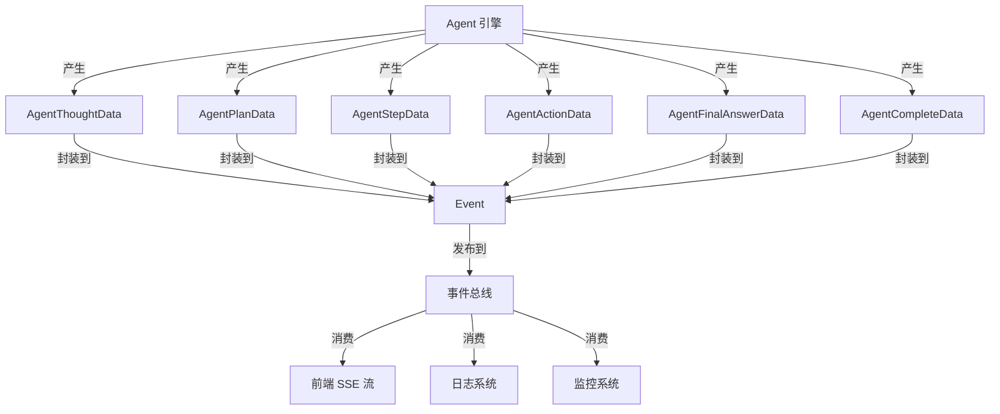

# Agent 规划、推理与完成事件负载模块深度解析

## 1. 模块概述与问题空间

### 1.1 核心问题

在现代 Agent 系统中，用户体验的关键挑战之一是**可观察性和透明性**。当 Agent 执行复杂任务时，用户往往希望了解 Agent 的"思考过程"：它是如何理解问题的？制定了什么计划？调用了哪些工具？为什么得到这个结果？

传统的 LLM 应用通常采用"黑盒"模式，只返回最终答案，隐藏了中间的推理过程。这种方式对于简单问答尚可，但对于需要用户验证、调试或信任 Agent 决策的场景（如代码生成、知识检索、复杂问题解决）就显得不足。

### 1.2 解决方案设计

这个模块的核心洞察是：**将 Agent 的执行过程建模为一系列可序列化的事件，通过统一的事件总线传播给前端和监控系统**。

这种设计解决了两个关键问题：
1. **实时反馈**：通过流式事件，前端可以渐进式展示 Agent 的思考过程，而不是让用户等待整个任务完成
2. **可观察性**：所有中间状态都被记录下来，便于调试、审计和用户理解

## 2. 架构与数据流

### 2.1 系统定位

这个模块位于 `platform_infrastructure_and_runtime` 层，作为 Agent 运行时与事件总线之间的**契约层**。它不包含业务逻辑，而是定义了一套标准化的数据结构，用于在不同组件之间传递 Agent 的执行状态。

### 2.2 核心事件流程

以下是一个典型的 Agent 执行流程中事件的产生和传播路径：



### 2.3 事件生命周期

1. **Agent 启动阶段**：
   - `AgentQueryData` - 接收用户查询
   - `AgentThoughtData` - 开始思考过程
   - `AgentPlanData` - 制定执行计划

2. **执行循环阶段**（可能多次迭代）：
   - `AgentThoughtData` - 当前步骤的思考
   - `AgentStepData` - 完整的步骤信息（思考 + 工具调用）
   - `AgentToolCallData` - 工具调用通知
   - `AgentActionData` - 工具执行结果
   - `AgentReflectionData` - 对结果的反思
   - `AgentReferencesData` - 知识引用

3. **完成阶段**：
   - `AgentFinalAnswerData` - 最终答案（流式）
   - `AgentCompleteData` - 完整执行总结

## 3. 核心组件深度解析

### 3.1 AgentThoughtData - 思考过程数据

```go
type AgentThoughtData struct {
    Content   string `json:"content"`
    Iteration int    `json:"iteration"`
    Done      bool   `json:"done"`
}
```

**设计意图**：
这个结构用于实时流式传输 Agent 的"思考内容"。它不是一次性发送完整的思考过程，而是通过 `Done` 标志支持增量传输，类似于 LLM 的 token 流式输出。

**关键特性**：
- `Iteration` 字段将思考与特定的执行迭代关联，便于前端组织和展示
- `Done` 标志允许前端知道何时该思考片段已完整，避免显示不完整的内容

### 3.2 AgentPlanData - 执行计划数据

```go
type AgentPlanData struct {
    Query    string   `json:"query"`
    Plan     []string `json:"plan"`
    Duration int64    `json:"duration_ms,omitempty"`
}
```

**设计意图**：
在复杂任务开始时，Agent 通常会先制定一个多步骤的计划。这个结构捕获这个计划，让用户了解 Agent 打算如何解决问题。

**设计权衡**：
- 使用 `[]string` 而不是更复杂的结构，保持了简单性和灵活性
- 包含原始 `Query` 作为上下文，便于事件消费者理解计划的背景

### 3.3 AgentStepData - 执行步骤数据

```go
type AgentStepData struct {
    Iteration int         `json:"iteration"`
    Thought   string      `json:"thought"`
    ToolCalls interface{} `json:"tool_calls"`
    Duration  int64       `json:"duration_ms"`
}
```

**设计意图**：
这是 Agent 执行过程中的核心事件结构，它将一个完整的"思考-行动"循环封装在一起。

**关键特性**：
- `ToolCalls` 使用 `interface{}` 类型，提供了极大的灵活性，可以适应不同类型的工具调用
- 包含 `Duration` 字段，便于性能分析和用户体验优化

### 3.4 AgentActionData - 工具执行数据

```go
type AgentActionData struct {
    Iteration  int                    `json:"iteration"`
    ToolName   string                 `json:"tool_name"`
    ToolInput  map[string]interface{} `json:"tool_input"`
    ToolOutput string                 `json:"tool_output"`
    Success    bool                   `json:"success"`
    Error      string                 `json:"error,omitempty"`
    Duration   int64                  `json:"duration_ms"`
}
```

**设计意图**：
这个结构详细记录了单个工具调用的完整信息，包括输入、输出、成功状态和执行时间。

**设计权衡**：
- `ToolOutput` 使用 `string` 类型而不是结构化数据，这是一个有意的选择。工具输出可能是任意格式（JSON、HTML、纯文本等），使用字符串保持了最大的兼容性
- `Error` 字段是可选的（`omitempty`），只有在失败时才会包含，减少了正常情况下的数据传输量

### 3.5 AgentFinalAnswerData - 最终答案数据

```go
type AgentFinalAnswerData struct {
    Content string `json:"content"`
    Done    bool   `json:"done"`
}
```

**设计意图**：
类似于 `AgentThoughtData`，这个结构支持流式传输最终答案。这对于长答案的用户体验特别重要，用户可以开始阅读而不必等待完整生成。

### 3.6 AgentCompleteData - 执行完成数据

```go
type AgentCompleteData struct {
    SessionID       string                 `json:"session_id"`
    TotalSteps      int                    `json:"total_steps"`
    FinalAnswer     string                 `json:"final_answer"`
    KnowledgeRefs   []interface{}          `json:"knowledge_refs,omitempty"`
    AgentSteps      interface{}            `json:"agent_steps,omitempty"`
    TotalDurationMs int64                  `json:"total_duration_ms"`
    MessageID       string                 `json:"message_id,omitempty"`
    RequestID       string                 `json:"request_id,omitempty"`
    Extra           map[string]interface{} `json:"extra,omitempty"`
}
```

**设计意图**：
这是一个"总结性"事件，在 Agent 完成整个任务后发出。它包含了完整的执行信息，便于：
1. 前端显示完整的执行历史
2. 系统记录审计日志
3. 后续的分析和调试

**关键特性**：
- 包含完整的 `AgentSteps`，这是对整个执行过程的回顾
- `Extra` 字段提供了扩展点，可以容纳未来可能需要的额外信息

### 3.7 AgentReflectionData - 反思数据

```go
type AgentReflectionData struct {
    ToolCallID string `json:"tool_call_id"`
    Content    string `json:"content"`
    Iteration  int    `json:"iteration"`
    Done       bool   `json:"done"`
}
```

**设计意图**：
高级 Agent 系统通常具有"反思"能力——在获得工具执行结果后，Agent 会思考这个结果意味着什么，是否需要调整策略，或者是否已经获得足够的信息来回答问题。

这个结构捕获了这种反思过程，并且：
- 通过 `ToolCallID` 与特定的工具调用关联
- 支持流式传输（`Done` 标志）
- 包含迭代信息，便于组织展示

## 4. 依赖关系与数据契约

### 4.1 模块依赖

这个模块是一个相对独立的契约层，它的依赖非常少：
- 仅依赖标准库的 JSON 序列化
- 引用了一些外部类型（如 `types.ToolCall`、`types.SearchResult`），但通过 `interface{}` 避免了强耦合

### 4.2 数据契约

这个模块定义了一套明确的契约，生产者（Agent 引擎）和消费者（前端、日志系统等）都必须遵守：

1. **类型安全与灵活性的平衡**：
   - 对于结构明确的字段（如 `Iteration`、`Success`），使用具体类型保证类型安全
   - 对于可能变化的部分（如 `ToolCalls`、`Extra`），使用 `interface{}` 保持灵活性

2. **可选字段的使用**：
   - 大量使用 `omitempty` 标签，减少不必要的数据传输
   - 这要求消费者能够优雅地处理缺失字段

3. **迭代 ID 的一致性**：
   - 所有与执行循环相关的结构都包含 `Iteration` 字段
   - 这是关联不同事件的关键，消费者依赖它来组织展示

## 5. 设计决策与权衡

### 5.1 为什么使用结构体而不是接口？

**决策**：所有事件负载都定义为具体的结构体，而不是接口。

**原因**：
1. **序列化友好**：结构体与 JSON 序列化天生契合，而接口会带来更多复杂性
2. **简单性**：对于纯粹的数据容器，结构体比接口更直观
3. **兼容性**：添加新字段是向后兼容的，而修改接口则不然

**权衡**：
- 失去了一些多态性
- 但在这个场景下，数据结构的稳定性比多态性更重要

### 5.2 为什么大量使用 interface{}？

**决策**：在 `ToolCalls`、`AgentSteps`、`KnowledgeRefs` 等字段中使用了 `interface{}`。

**原因**：
1. **避免循环依赖**：这些字段引用的类型定义在其他模块中，使用 `interface{}` 可以避免依赖
2. **灵活性**：允许这些字段的具体类型随着时间演变，而不需要修改事件结构
3. **关注点分离**：这个模块只关心数据的传输，不关心数据的具体结构

**权衡**：
- 失去了编译时类型检查
- 消费者需要进行类型断言，增加了运行时错误的风险
- 但通过良好的文档和测试，可以缓解这些问题

### 5.3 为什么分离流式和非流式事件？

**决策**：模块中有两套相关但不同的结构：
- 流式：`AgentThoughtData`、`AgentFinalAnswerData`、`AgentReflectionData`
- 非流式：`AgentStepData`、`AgentActionData`、`AgentCompleteData`

**原因**：
1. **用户体验需求**：流式事件用于实时反馈，非流式事件用于完整记录
2. **数据特性不同**：流式事件是增量的、部分的，非流式事件是完整的、总结性的
3. **消费者不同**：前端主要消费流式事件，日志和监控系统主要消费非流式事件

**权衡**：
- 增加了结构的数量
- 但使每个结构的职责更单一，更符合其使用场景

### 5.4 为什么包含 Duration 字段？

**决策**：几乎所有事件结构都包含了执行时间字段。

**原因**：
1. **性能监控**：便于识别瓶颈，优化系统性能
2. **用户体验**：前端可以显示每个步骤的耗时，让用户了解进度
3. **诊断问题**：当某个步骤异常缓慢时，这个字段有助于诊断

**权衡**：
- 增加了少量的数据传输量
- 但带来的价值远大于成本

## 6. 使用指南与最佳实践

### 6.1 生产者最佳实践（Agent 引擎）

1. **保持事件顺序**：
   ```go
   // 正确的顺序
   publish(AgentThoughtData{Iteration: 1, Content: "思考中...", Done: false})
   publish(AgentThoughtData{Iteration: 1, Content: "思考完成", Done: true})
   publish(AgentStepData{Iteration: 1, ...})
   ```

2. **正确设置 Iteration**：
   - 确保同一迭代的所有事件具有相同的 Iteration 值
   - Iteration 应该从 1 开始递增

3. **谨慎使用 Extra 字段**：
   - 只在确实需要时使用
   - 考虑是否应该将常用数据提升为正式字段

### 6.2 消费者最佳实践（前端、日志系统）

1. **优雅处理缺失字段**：
   ```go
   // 不要假设字段一定存在
   if data.ToolCalls != nil {
       // 处理工具调用
   }
   ```

2. **通过 Iteration 组织事件**：
   ```javascript
   // 前端示例
   const iterations = new Map();
   eventStream.on('data', (event) => {
       const iteration = event.data.iteration;
       if (!iterations.has(iteration)) {
           iterations.set(iteration, []);
       }
       iterations.get(iteration).push(event);
   });
   ```

3. **处理流式事件的 Done 标志**：
   ```javascript
   // 不要在 Done 之前就认为内容完整
   let thoughtContent = '';
   eventStream.on('agent_thought', (data) => {
       thoughtContent += data.content;
       if (data.done) {
           // 现在可以安全地使用完整内容
           displayThought(thoughtContent);
           thoughtContent = '';
       }
   });
   ```

## 7. 边缘情况与常见陷阱

### 7.1 迭代 ID 不连续

**问题**：有时 Agent 可能跳过迭代 ID，或者 ID 不按顺序到达。

**影响**：前端展示可能会混乱，或者某些步骤被遗漏。

**解决方案**：
- 生产者应该确保 ID 连续且有序
- 消费者应该能够优雅地处理不连续的 ID，不要假设 ID 一定连续

### 7.2 大体积事件

**问题**：`AgentCompleteData` 中的 `AgentSteps` 可能包含大量数据，导致事件体积过大。

**影响**：
- 网络传输变慢
- 内存使用增加
- 可能超出某些消息系统的大小限制

**解决方案**：
- 考虑对大事件进行分页或分块
- 提供一个精简版本，只包含摘要信息
- 消费者应该能够处理部分数据，或者有选择地消费

### 7.3 工具输出的编码问题

**问题**：`ToolOutput` 是字符串类型，但工具输出可能包含任意二进制数据或特殊字符。

**影响**：JSON 序列化可能失败，或者数据在传输过程中损坏。

**解决方案**：
- 生产者应该确保工具输出是有效的 UTF-8 字符串
- 必要时进行 Base64 编码
- 消费者应该能够处理可能的编码问题

### 7.4 事件顺序保证

**问题**：在分布式系统中，事件可能不按产生顺序到达消费者。

**影响**：前端展示可能出现逻辑混乱，例如先看到结果再看到思考过程。

**解决方案**：
- 如果顺序很重要，考虑在事件中包含序列号
- 消费者可以缓冲事件，在处理前重新排序
- 或者，消费者可以设计为能够处理无序到达的事件

## 8. 扩展与演进

### 8.1 可能的扩展方向

1. **更多元数据**：
   - 添加 Token 使用量信息
   - 添加置信度分数
   - 添加成本信息

2. **更多事件类型**：
   - Agent 自我修正事件
   - 策略调整事件
   - 子任务事件

3. **结构化程度提升**：
   - 为某些 `interface{}` 字段定义更具体的结构
   - 但要保持向后兼容性

### 8.2 向后兼容性考虑

当需要修改这些结构时，请遵循以下原则：

1. **只添加字段，不删除或重命名字段**
2. **新字段应该是可选的（使用指针或 omitempty）**
3. **如果必须进行不兼容的更改，考虑创建新的结构类型，而不是修改现有结构**

## 9. 总结

`agent_planning_reasoning_and_completion_event_payloads` 模块是 Agent 系统可观察性的基础。它通过定义一套清晰、灵活的事件数据结构，解决了 Agent 执行过程"黑盒"问题，让用户和开发者能够理解、监控和调试 Agent 的行为。

这个模块的设计体现了几个重要原则：
- **契约大于实现**：明确定义了生产者和消费者之间的契约
- **灵活性与类型安全的平衡**：在需要的地方使用具体类型，在可能变化的地方使用 `interface{}`
- **流式与批处理兼顾**：同时支持实时反馈和完整记录

对于新加入团队的开发者，理解这个模块的设计意图和使用方式，将有助于他们更好地理解整个 Agent 系统的架构，并在需要时正确地扩展或修改相关功能。
