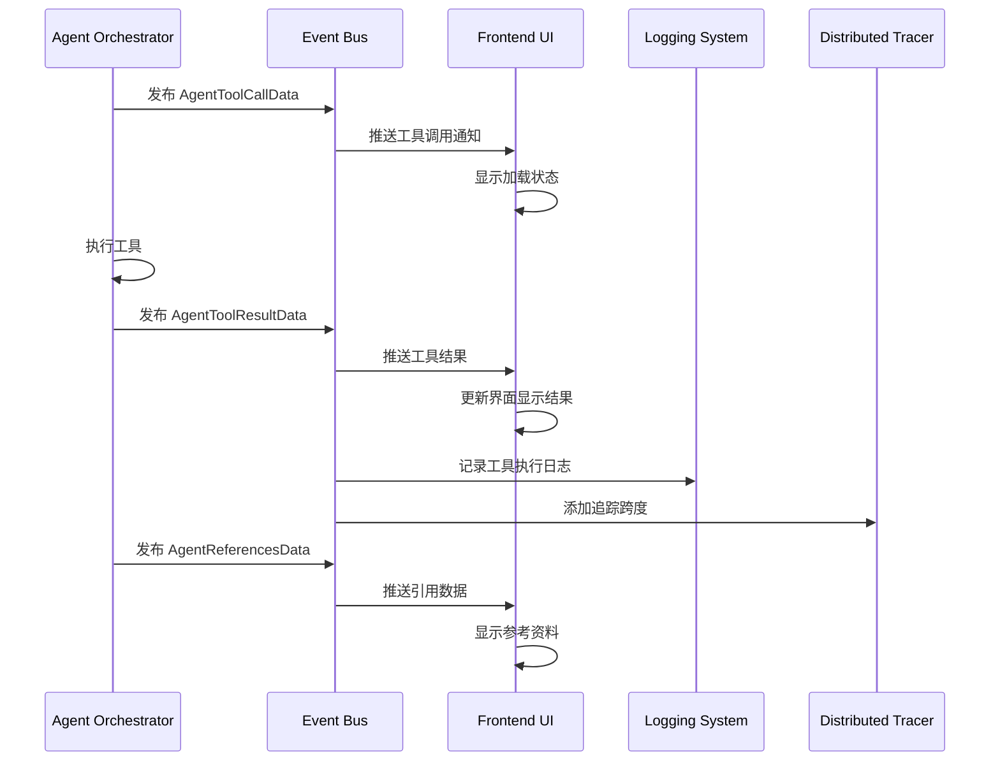

# agent_tool_calls_results_and_references_event_payloads 模块深度解析

## 1. 模块概览

这个模块定义了 Agent 运行时中工具调用、工具结果和知识引用相关的事件数据结构，是整个平台可观测性和实时反馈系统的核心组成部分。在一个典型的 Agent 执行流程中，当 Agent 决定调用工具、获得工具执行结果、或需要展示知识引用时，这些数据结构就会被用来封装事件信息，通过事件总线传递给订阅者（如前端 UI、日志系统、追踪系统等）。

### 核心价值

想象一下，你正在调试一个复杂的 Agent 执行流程，Agent 在多轮思考和工具调用后给出了错误的答案。如果没有这个模块提供的结构化事件数据，你只能看到最终结果，而无法了解 Agent 在每一步做了什么决策、调用了什么工具、得到了什么结果。这个模块就像是给 Agent 安装了一个"黑匣子"记录器，让整个推理过程变得透明可追溯。

## 2. 核心组件详解

### 2.1 AgentToolCallData - 工具调用事件数据

```go
type AgentToolCallData struct {
    ToolCallID string         `json:"tool_call_id"` // 用于追踪的工具调用ID
    ToolName   string         `json:"tool_name"`
    Arguments  map[string]any `json:"arguments,omitempty"`
    Iteration  int            `json:"iteration"`
}
```

**设计意图**：
这个结构在 Agent 决定调用工具但尚未执行时被创建。它的核心作用是通知订阅者"Agent 即将调用某个工具"，这对于实时 UI 反馈（如显示"正在搜索知识库..."）至关重要。

- `ToolCallID`：这是整个工具调用生命周期的关键标识，将 `AgentToolCallData` 和后续的 `AgentToolResultData` 关联起来，支持异步和并行工具调用场景下的结果匹配。
- `Iteration`：表示这是 Agent 推理过程中的第几轮迭代，帮助理解工具调用在整个推理链中的位置。

**使用场景**：
当 Agent 的规划器决定调用 `search_knowledge_base` 工具时，会创建一个 `AgentToolCallData` 事件，前端收到后可以在界面上显示一个加载指示器，让用户知道系统正在处理。

### 2.2 AgentToolResultData - 工具执行结果数据

```go
type AgentToolResultData struct {
    ToolCallID string                 `json:"tool_call_id"` // 用于追踪的工具调用ID
    ToolName   string                 `json:"tool_name"`
    Output     string                 `json:"output"`
    Error      string                 `json:"error,omitempty"`
    Success    bool                   `json:"success"`
    Duration   int64                  `json:"duration_ms,omitempty"`
    Iteration  int                    `json:"iteration"`
    Data       map[string]interface{} `json:"data,omitempty"` // 工具结果的结构化数据（如 display_type、格式化结果）
}
```

**设计意图**：
这是工具执行完成后的结果载体，包含了执行状态、输出内容、耗时等关键信息。与 `AgentToolCallData` 不同，这个结构更注重"结果"而非"意图"。

- `ToolCallID`：通过这个 ID 与之前的工具调用事件关联，形成完整的调用链路。
- `Data` 字段：这是一个设计巧妙的扩展点。考虑到不同工具可能有不同的结果展示需求（有的需要表格展示，有的需要图表展示），这个字段允许工具返回结构化的展示元数据，而不仅是纯文本输出。
- `Duration`：性能监控的关键指标，帮助识别耗时过长的工具调用。

**使用场景**：
当数据库查询工具执行完成后，会创建 `AgentToolResultData`，其中 `Output` 包含原始查询结果，而 `Data` 字段可能包含 `{"display_type": "table", "columns": [...], "rows": [...]}` 这样的结构化信息，前端可以据此渲染出美观的表格。

### 2.3 AgentReferencesData - 知识引用数据

```go
type AgentReferencesData struct {
    References interface{} `json:"references"` // []*types.SearchResult
    Iteration  int         `json:"iteration"`
}
```

**设计意图**：
当 Agent 在回答中引用了知识库内容时，这个结构用于传递引用的源信息。这对于建立用户信任和支持溯源非常重要。

- `References` 字段使用 `interface{}` 类型：这是一个权衡设计。虽然牺牲了一些类型安全，但换取了灵活性，可以适应不同类型的搜索结果结构。实际使用中，它应该是 `[]*types.SearchResult` 类型。
- `Iteration`：同样标注了这些引用是在第几轮迭代中产生的，帮助理解 Agent 的推理过程。

**使用场景**：
Agent 在回答用户关于某个产品的问题时，引用了知识库中的 3 篇文档。`AgentReferencesData` 会携带这些文档的标题、摘要、URL 等信息，前端可以在回答下方显示"参考资料"部分，用户可以点击查看原文。

## 3. 架构与数据流

### 事件流转过程



### 模块在整体架构中的位置

这个模块是 [event_bus_core_contracts](platform_infrastructure_and_runtime-event_bus_and_agent_runtime_event_contracts-event_bus_core_contracts.md) 的扩展，专门负责 Agent 工具调用相关的事件定义。它被以下模块依赖：

- **生产者**：[agent_engine_orchestration](agent_engine_orchestration.md) - 负责创建和发布这些事件
- **消费者**：[agent_streaming_endpoint_handler](http_handlers_and_routing-session_message_and_streaming_http_handlers-streaming_endpoints_and_sse_context.md) - 通过 SSE 将事件推送给前端

## 4. 设计决策与权衡

### 4.1 为什么使用独立的 ToolCallID 而不是依赖 Iteration？

**决策**：为每个工具调用分配唯一的 `ToolCallID`，而不是仅依赖 `Iteration` 来关联事件。

**原因**：在复杂的 Agent 场景中，一轮迭代可能会并行调用多个工具。如果仅使用 `Iteration`，就无法区分同一轮迭代中不同工具的调用和结果。`ToolCallID` 提供了更细粒度的追踪能力，支持并行工具执行的场景。

**权衡**：增加了一些复杂性（需要生成和传递 ID），但换取了更强的表达能力和可追踪性。

### 4.2 为什么 AgentReferencesData 的 References 字段是 interface{} 类型？

**决策**：使用 `interface{}` 而不是具体的类型。

**原因**：
1. **避免循环依赖**：`types.SearchResult` 可能定义在其他包中，直接引用会造成依赖循环。
2. **灵活性**：允许不同类型的引用数据结构，适应未来的扩展。
3. **事件总线的通用性**：事件总线需要处理各种类型的数据，使用 `interface{}` 是常见做法。

**权衡**：失去了编译时类型检查，需要在消费端进行类型断言，增加了运行时错误的风险。

### 4.3 为什么将工具调用和工具结果分成两个独立的事件？

**决策**：`AgentToolCallData` 和 `AgentToolResultData` 是两个独立的结构，分别在不同时间点发布。

**原因**：
1. **实时反馈**：工具调用可能需要很长时间（几秒到几分钟），用户需要立即知道系统正在处理，而不是等到执行完成。
2. **失败处理**：如果工具执行过程中崩溃，我们至少有工具调用事件记录，有助于调试。
3. **异步架构**：在某些架构中，工具执行可能是异步的，调用和结果可能由不同的组件处理。

**权衡**：增加了事件数量和处理逻辑，但提供了更好的用户体验和可观测性。

## 5. 使用指南与最佳实践

### 5.1 发布工具调用事件

```go
// 在 Agent 决定调用工具时
toolCallData := event.AgentToolCallData{
    ToolCallID: generateUniqueID(), // 生成唯一ID
    ToolName:   "search_knowledge_base",
    Arguments: map[string]any{
        "query": "如何配置数据库连接池",
        "top_k": 5,
    },
    Iteration: currentIteration,
}

toolCallEvent := event.NewEvent(event.AgentToolCall, toolCallData).
    WithSessionID(sessionID).
    WithRequestID(requestID)

eventBus.Publish(toolCallEvent)
```

### 5.2 发布工具结果事件

```go
// 在工具执行完成后
toolResultData := event.AgentToolResultData{
    ToolCallID: toolCallID, // 使用之前生成的ID
    ToolName:   "search_knowledge_base",
    Output:     string(resultJSON),
    Success:    err == nil,
    Duration:   time.Since(startTime).Milliseconds(),
    Iteration:  currentIteration,
    Data: map[string]interface{}{
        "display_type": "list",
        "items":        formattedItems,
    },
}

if err != nil {
    toolResultData.Error = err.Error()
}

toolResultEvent := event.NewEvent(event.AgentToolResult, toolResultData).
    WithSessionID(sessionID).
    WithRequestID(requestID)

eventBus.Publish(toolResultEvent)
```

### 5.3 消费事件的注意事项

1. **类型安全**：消费 `interface{}` 类型的字段时，务必进行类型断言和错误检查：
   ```go
   refsData, ok := event.Data.(event.AgentReferencesData)
   if !ok {
       // 处理类型错误
       return
   }
   
   searchResults, ok := refsData.References.([]*types.SearchResult)
   if !ok {
       // 处理类型错误
       return
   }
   ```

2. **异步处理**：事件消费应该是快速的非阻塞操作，避免阻塞事件总线。

3. **幂等性**：考虑到事件可能重复投递，消费逻辑应该具有幂等性。

## 6. 常见陷阱与注意事项

### 6.1 ToolCallID 关联问题

**陷阱**：在创建 `AgentToolResultData` 时忘记设置 `ToolCallID`，或者设置了错误的 ID，导致前端无法将结果与之前的调用关联。

**规避**：始终确保工具调用和结果使用相同的 `ToolCallID`，最好将 ID 存储在局部变量中，避免传递错误。

### 6.2 References 字段类型问题

**陷阱**：在设置 `AgentReferencesData.References` 时，使用了错误的类型，导致消费端类型断言失败。

**规避**：明确约定这个字段应该是 `[]*types.SearchResult` 类型，并在代码中添加注释说明。考虑在创建事件前进行类型检查。

### 6.3 忘记设置元数据

**陷阱**：创建事件后忘记设置 `SessionID`、`RequestID` 等元数据，导致事件难以追踪和关联。

**规避**：养成使用链式调用的习惯，始终设置必要的元数据：
```go
event := event.NewEvent(eventType, data).
    WithSessionID(sessionID).
    WithRequestID(requestID)
```

## 7. 总结

`agent_tool_calls_results_and_references_event_payloads` 模块是 Agent 可观测性和实时反馈的基石。它通过精心设计的数据结构，捕获了 Agent 工具调用生命周期中的关键信息，支持从实时 UI 反馈到事后调试分析的多种场景。

该模块的设计展现了几个重要的架构思想：
- **关注点分离**：将工具调用、结果、引用分成独立的事件
- **可扩展性**：通过 `Data` 字段和 `interface{}` 类型预留扩展点
- **可追踪性**：通过 `ToolCallID` 和 `Iteration` 建立事件关联

正确使用这个模块，能够极大提升 Agent 系统的可观测性和用户体验，让复杂的 AI 推理过程变得透明可控。

