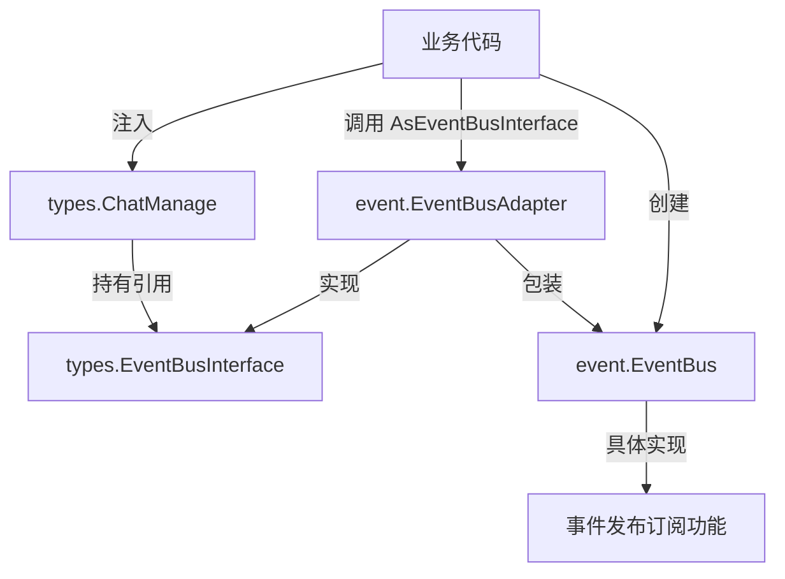

# EventBusAdapter 模块技术深度分析

## 1. 问题背景与模块目的

### 1.1 问题空间

在现代复杂系统中，事件驱动架构是一种常见的设计模式，它允许系统组件之间通过事件进行松耦合通信。然而，在 Go 语言这样的静态类型语言中，一个常见的问题是**循环依赖**（circular dependencies）。

在 WeKnora 项目中，核心问题在于：
- `internal/event` 包提供了具体的事件总线实现 `EventBus`
- `internal/types` 包定义了核心数据结构和接口，包括 `ChatManage`，它需要引用一个事件总线接口
- 如果 `types` 包直接导入 `event` 包，就会形成循环依赖，因为 `event` 包也需要使用 `types` 包中的定义

### 1.2 为什么直接方案不行

一个直观的想法是把所有类型定义都放在同一个包里，但这违反了关注点分离原则：
- `types` 包应该是纯净的领域类型定义，不应该依赖具体的实现
- `event` 包是基础设施层面的实现细节，不应该成为领域层的依赖

另一个想法是让 `EventBus` 直接实现一个接口，但如果这个接口定义在 `types` 包中，仍然需要 `event` 包导入 `types` 包。

### 1.3 设计洞察

解决方案是使用**适配器模式**（Adapter Pattern）结合**依赖倒置原则**（Dependency Inversion Principle）：
1. 在 `types` 包中定义 `EventBusInterface` 接口
2. 在 `event` 包中实现具体的 `EventBus`
3. 用 `EventBusAdapter` 作为桥梁，将 `*EventBus` 适配为 `types.EventBusInterface`

这种设计打破了循环依赖，同时保持了各层的清晰分离。

## 2. 核心概念与心智模型

### 2.1 心智模型

可以把 `EventBusAdapter` 想象成一个**电源插座转换器**：
- `EventBus` 是一个特定类型的插头（比如美式插头）
- `EventBusInterface` 是一个通用的插座接口（比如国际标准接口）
- `EventBusAdapter` 就是转换器，让美式插头可以插入国际标准插座

这个转换器不改变插头的功能，只是改变了它的"形状"，使其能被接口接受。

### 2.2 核心抽象

- **`EventBusInterface`**：定义在 `types` 包中的契约，规定了事件总线应该有什么能力
- **`EventBus`**：定义在 `event` 包中的具体实现，是实际干活的组件
- **`EventBusAdapter`**：两者之间的翻译官，负责类型转换和方法调用转发

## 3. 架构与数据流



### 3.1 组件角色

1. **`types.EventBusInterface`**：契约层，定义了事件总线的核心能力（`On` 和 `Emit` 方法）
2. **`event.EventBus`**：实现层，提供了完整的事件总线功能，包括同步/异步模式、中间件支持等
3. **`event.EventBusAdapter`**：适配层，负责将 `event` 包的类型转换为 `types` 包的类型，并转发方法调用

### 3.2 数据流向

**注册事件处理器的流程：**
1. 调用者通过 `EventBusAdapter.On(eventType, handler)` 注册处理器
2. 适配器将 `types.EventType` 转换为 `event.EventType`
3. 适配器创建一个包装函数，将 `event.Event` 转换回 `types.Event`
4. 适配器将包装后的处理器注册到底层的 `EventBus`

**发布事件的流程：**
1. 调用者通过 `EventBusAdapter.Emit(ctx, evt)` 发布事件
2. 适配器将 `types.Event` 转换为 `event.Event`
3. 适配器调用底层 `EventBus.Emit()` 发布转换后的事件
4. 底层事件总线将事件分发给所有注册的处理器

## 4. 组件深度解析

### 4.1 EventBusAdapter 结构体

```go
type EventBusAdapter struct {
    bus *EventBus
}
```

这是一个简单的包装结构体，持有一个指向具体 `EventBus` 的指针。它的唯一职责是委托调用和类型转换。

### 4.2 NewEventBusAdapter 工厂函数

```go
func NewEventBusAdapter(bus *EventBus) types.EventBusInterface {
    return &EventBusAdapter{bus: bus}
}
```

这个工厂函数是适配器模式的入口点。它接收一个具体的 `EventBus`，返回一个满足 `types.EventBusInterface` 的适配器实例。

**设计意图**：通过返回接口类型，强制调用者依赖抽象而不是具体实现。

### 4.3 On 方法 - 事件处理器注册

```go
func (a *EventBusAdapter) On(eventType types.EventType, handler types.EventHandler) {
    // 转换事件类型
    evtType := EventType(eventType)
    
    // 创建包装处理器
    evtHandler := func(ctx context.Context, evt Event) error {
        // 转换事件对象
        typesEvt := types.Event{
            ID:        evt.ID,
            Type:      types.EventType(evt.Type),
            SessionID: evt.SessionID,
            Data:      evt.Data,
            Metadata:  evt.Metadata,
            RequestID: evt.RequestID,
        }
        return handler(ctx, typesEvt)
    }
    
    a.bus.On(evtType, evtHandler)
}
```

**关键设计点**：
1. **双重转换**：先将输入的类型从 `types` 包转换为 `event` 包，然后在包装函数中再转换回来
2. **闭包捕获**：使用闭包捕获原始的 `handler`，确保类型安全
3. **字段映射**：逐个字段复制 `Event` 结构体，因为 Go 不允许直接转换不同包中的同名结构体

### 4.4 Emit 方法 - 事件发布

```go
func (a *EventBusAdapter) Emit(ctx context.Context, evt types.Event) error {
    // 转换事件对象
    eventEvt := Event{
        ID:        evt.ID,
        Type:      EventType(evt.Type),
        SessionID: evt.SessionID,
        Data:      evt.Data,
        Metadata:  evt.Metadata,
        RequestID: evt.RequestID,
    }
    return a.bus.Emit(ctx, eventEvt)
}
```

**设计意图**：
- 简单直接的类型转换，将 `types.Event` 转换为 `event.Event`
- 完全委托给底层的 `EventBus.Emit()` 方法，不添加额外逻辑

### 4.5 AsEventBusInterface 便利方法

```go
func (eb *EventBus) AsEventBusInterface() types.EventBusInterface {
    return NewEventBusAdapter(eb)
}
```

这是一个在 `EventBus` 结构体上定义的方法，提供了更流畅的 API。与其写：
```go
adapter := NewEventBusAdapter(eventBus)
```
不如写：
```go
adapter := eventBus.AsEventBusInterface()
```

**设计权衡**：
- 优点：API 更流畅，可读性更好
- 缺点：`EventBus` 需要知道 `types` 包的存在，轻微增加了耦合

## 5. 依赖关系分析

### 5.1 输入依赖

`EventBusAdapter` 依赖：
- `internal/event.EventBus`：具体的事件总线实现
- `internal/types` 包中的多个类型：`EventBusInterface`、`EventType`、`EventHandler`、`Event`

### 5.2 输出依赖

谁依赖 `EventBusAdapter`：
- 需要将 `EventBus` 注入到 `types.ChatManage` 的代码
- 任何需要通过 `types.EventBusInterface` 使用事件总线的地方

### 5.3 关键契约

`EventBusAdapter` 必须严格遵守 `types.EventBusInterface` 契约：
- `On(eventType EventType, handler EventHandler)`：注册处理器，不能改变其语义
- `Emit(ctx context.Context, evt Event) error`：发布事件，必须传播错误

### 5.4 数据流契约

事件对象在转换过程中必须保持完整性：
- 所有字段（ID、Type、SessionID、Data、Metadata、RequestID）都必须被正确复制
- 类型转换必须是双向可逆的（虽然在这个实现中不需要反向转换）

## 6. 设计权衡与决策

### 6.1 显式字段复制 vs 不安全转换

**选择**：显式字段复制
```go
typesEvt := types.Event{
    ID:        evt.ID,
    Type:      types.EventType(evt.Type),
    SessionID: evt.SessionID,
    Data:      evt.Data,
    Metadata:  evt.Metadata,
    RequestID: evt.RequestID,
}
```

**替代方案**：使用 `unsafe` 包进行指针转换
```go
typesEvt := *(*types.Event)(unsafe.Pointer(&evt))
```

**权衡分析**：
- **显式复制**：安全、清晰、类型安全，但代码冗长，字段添加时需要更新
- **unsafe 转换**：简洁、高效，但绕过了类型系统，不安全，可维护性差

**决策理由**：在这个场景中，安全性和可维护性优先于微优化。显式复制虽然代码多一点，但清晰易懂，不容易出错。

### 6.2 适配器 vs 合并包

**选择**：使用适配器模式
**替代方案**：将 `event` 和 `types` 包合并

**权衡分析**：
- **适配器模式**：保持包的清晰分离，遵循依赖倒置原则，但增加了一层间接性
- **合并包**：消除适配器需求，简化代码，但破坏了关注点分离，可能导致包过大

**决策理由**：`types` 包是领域层，`event` 包是基础设施层，它们应该保持分离。适配器是这种分离的必要代价。

### 6.3 最小接口 vs 完整接口

**选择**：最小接口（只有 `On` 和 `Emit`）
**替代方案**：完整接口（包括 `Off`、`EmitAndWait` 等）

**权衡分析**：
- **最小接口**：接口更稳定，更容易实现，但功能受限
- **完整接口**：功能更全面，但接口变更风险更大

**决策理由**：`types.EventBusInterface` 只定义了 `ChatManage` 实际需要的方法，遵循接口隔离原则（Interface Segregation Principle）。

## 7. 使用指南与最佳实践

### 7.1 基本使用模式

```go
// 创建具体的事件总线
eventBus := event.NewEventBus()

// 转换为接口类型
busInterface := eventBus.AsEventBusInterface()

// 注入到 ChatManage
chatManage := &types.ChatManage{
    EventBus: busInterface,
    SessionID: "session-123",
    // 其他字段...
}

// 使用事件总线
chatManage.EventBus.On(types.CHAT_COMPLETION, func(ctx context.Context, evt types.Event) error {
    // 处理事件
    return nil
})

// 发布事件
evt := types.Event{
    Type:      types.CHAT_COMPLETION,
    SessionID: "session-123",
    Data:      map[string]interface{}{"result": "hello"},
}
chatManage.EventBus.Emit(context.Background(), evt)
```

### 7.2 异步事件总线使用

```go
// 创建异步事件总线
eventBus := event.NewAsyncEventBus()

// 转换为接口
busInterface := eventBus.AsEventBusInterface()

// 注入到需要的地方
chatManage := &types.ChatManage{
    EventBus: busInterface,
    // ...
}
```

### 7.3 最佳实践

1. **始终通过接口使用**：在业务代码中，应该依赖 `types.EventBusInterface`，而不是具体的 `event.EventBus`
2. **在组合根创建适配器**：适配器的创建应该在应用的入口点（main 函数、DI 容器等）进行
3. **不要在适配器中添加业务逻辑**：适配器只应该做类型转换和方法转发，不应该添加额外逻辑
4. **保持类型定义同步**：当 `types.Event` 或 `event.Event` 结构体发生变化时，必须同步更新适配器中的字段映射

## 8. 边缘情况与注意事项

### 8.1 事件类型兼容性

虽然 `types.EventType` 和 `event.EventType` 都是基于 `string` 的类型定义，但它们是不同的类型。适配器负责转换，但要注意：
- 有些事件类型可能只在一个包中定义，转换时可能会有问题
- 建议保持两个包中的事件类型定义同步

### 8.2 错误处理

适配器的 `Emit` 方法会直接传播底层 `EventBus.Emit()` 返回的错误。在异步模式下，这些错误会被忽略。

### 8.3 数据字段类型

`Event.Data` 字段是 `interface{}` 类型，适配器直接传递这个引用，不会进行深拷贝。这意味着：
- 处理器对数据的修改会影响其他处理器
- 如果需要隔离，应该在处理器中自己进行深拷贝

### 8.4 性能考虑

每次事件发布和处理器注册都会进行结构体字段复制。虽然这在大多数情况下是可接受的，但在高频事件场景中可能需要考虑性能优化。

## 9. 总结

`EventBusAdapter` 模块是一个优雅解决循环依赖问题的示例。它通过适配器模式和依赖倒置原则，成功地将领域层（`types` 包）与基础设施层（`event` 包）解耦，同时保持了功能的完整性。

这个模块的设计体现了几个重要的软件工程原则：
- **依赖倒置原则**：高层模块不依赖低层模块，两者都依赖抽象
- **适配器模式**：将一个类的接口转换为客户希望的另一个接口
- **接口隔离原则**：使用最小的接口，只包含必要的方法
- **关注点分离**：保持领域模型和基础设施实现的清晰分离

虽然这个模块增加了一层间接性，但它为系统带来了更好的可维护性和可扩展性，是一个值得学习的设计典范。
