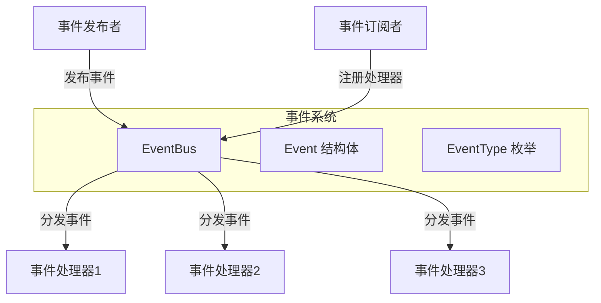

# event_message_contracts 模块技术深度解析

## 1. 模块概述

**event_message_contracts** 模块是整个系统的事件总线核心基础设施，提供了一套统一的事件定义、发布和订阅机制。它解决了系统中不同组件之间松耦合通信的问题，使得各个模块可以独立演化而不影响彼此的交互。

想象一下，这个模块就像是一个城市的广播系统：不同部门（组件）可以发布各种类型的通知（事件），而其他感兴趣的部门可以订阅这些通知并做出相应的反应，而不需要直接知道对方的存在。

## 2. 核心组件分析

### 2.1 Event 结构体

`Event` 是整个事件系统的核心数据结构，代表了系统中的一个事件。

```go
type Event struct {
    ID        string                 // 事件ID (自动生成UUID，用于流式更新追踪)
    Type      EventType              // 事件类型
    SessionID string                 // 会话ID
    Data      interface{}            // 事件数据
    Metadata  map[string]interface{} // 事件元数据
    RequestID string                 // 请求ID
}
```

**设计意图**：
- `ID`：使用 UUID 自动生成，确保每个事件都有唯一标识，便于追踪和调试
- `Type`：强类型的事件类型，避免字符串拼写错误，提供编译时检查
- `SessionID` 和 `RequestID`：用于事件的上下文关联，支持跨组件的请求追踪
- `Data` 和 `Metadata`：分离了事件的核心数据和附加信息，提供了灵活性

### 2.2 EventType 枚举

`EventType` 定义了系统中所有可能的事件类型，涵盖了查询处理、检索、排序、合并、聊天生成、Agent 执行等各个环节。

**设计意图**：
- 使用枚举类型而不是纯字符串，提供了类型安全性
- 事件类型采用命名空间风格（如 `query.received`），便于组织和分类
- 涵盖了系统的完整生命周期，从查询接收到最终答案生成

### 2.3 EventBus 结构体

`EventBus` 是事件系统的核心管理器，负责事件的发布和订阅。

```go
type EventBus struct {
    mu        sync.RWMutex
    handlers  map[EventType][]EventHandler
    asyncMode bool // 是否异步处理事件
}
```

**核心方法**：
- `On(eventType EventType, handler EventHandler)`：注册事件处理器
- `Off(eventType EventType)`：移除特定事件类型的所有处理器
- `Emit(ctx context.Context, event Event) error`：发布事件
- `EmitAndWait(ctx context.Context, event Event) error`：发布事件并等待所有处理器完成
- `HasHandlers(eventType EventType) bool`：检查是否有处理器注册
- `GetHandlerCount(eventType EventType) int`：获取特定事件类型的处理器数量
- `Clear()`：清除所有事件处理器

## 3. 架构与数据流程

### 3.1 架构图



### 3.2 数据流程

1. **事件发布流程**：
   - 发布者创建 `Event` 实例，设置必要的字段
   - 调用 `EventBus.Emit()` 或 `EventBus.EmitAndWait()` 方法
   - EventBus 自动为事件生成 UUID（如果未提供）
   - 根据事件类型查找注册的处理器
   - 根据 `asyncMode` 决定是同步还是异步执行处理器

2. **事件订阅流程**：
   - 订阅者定义 `EventHandler` 函数
   - 调用 `EventBus.On()` 方法注册处理器
   - EventBus 将处理器添加到对应事件类型的处理器列表中

## 4. 设计决策与权衡

### 4.1 同步 vs 异步处理

**设计决策**：提供了两种模式的 EventBus（同步和异步），并通过 `EmitAndWait()` 方法支持在异步模式下等待所有处理器完成。

**权衡分析**：
- **同步模式**：优点是可以立即知道处理器执行结果，便于错误处理；缺点是会阻塞发布者，影响性能。
- **异步模式**：优点是不会阻塞发布者，提高了系统响应性；缺点是错误处理变得复杂，需要额外的机制来收集错误。

**适用场景**：
- 同步模式适用于需要确保事件处理完成后才能继续的场景
- 异步模式适用于事件处理耗时较长，或者发布者不需要立即知道处理结果的场景

### 4.2 强类型 vs 弱类型事件

**设计决策**：使用强类型的 `EventType` 枚举来定义事件类型，而不是使用纯字符串。

**权衡分析**：
- 优点：提供了编译时检查，避免了字符串拼写错误；IDE 可以提供自动补全和重构支持；代码更具可读性和可维护性。
- 缺点：添加新的事件类型需要修改枚举定义，不够灵活；在需要动态事件类型的场景下可能不够方便。

### 4.3 泛型 Data 字段

**设计决策**：使用 `interface{}` 作为 `Data` 字段的类型，而不是使用具体的类型。

**权衡分析**：
- 优点：提供了最大的灵活性，不同类型的事件可以携带不同类型的数据；不需要为每种事件类型定义单独的 Event 结构体。
- 缺点：失去了类型安全性，需要在运行时进行类型断言；代码可读性稍差，需要文档来说明每种事件类型应该携带什么类型的数据。

## 5. 使用指南与最佳实践

### 5.1 基本使用

**创建 EventBus 实例**：
```go
// 同步模式
eventBus := event.NewEventBus()

// 异步模式
asyncEventBus := event.NewAsyncEventBus()
```

**注册事件处理器**：
```go
eventBus.On(event.EventQueryReceived, func(ctx context.Context, e event.Event) error {
    // 处理查询接收事件
    fmt.Printf("Received query: %v\n", e.Data)
    return nil
})
```

**发布事件**：
```go
evt := event.Event{
    Type:      event.EventQueryReceived,
    SessionID: "session-123",
    Data:      "用户查询内容",
    RequestID: "request-456",
}

// 同步发布
if err := eventBus.Emit(ctx, evt); err != nil {
    // 处理错误
}

// 发布并等待所有处理器完成
if err := eventBus.EmitAndWait(ctx, evt); err != nil {
    // 处理错误
}
```

### 5.2 最佳实践

1. **事件类型设计**：
   - 使用命名空间风格的事件类型，便于组织和分类
   - 确保事件类型名称能够清晰表达事件的含义
   - 考虑事件的粒度，既不要太粗也不要太细

2. **事件数据设计**：
   - 为每种事件类型定义明确的数据结构
   - 在文档中说明每种事件类型应该携带什么类型的数据
   - 考虑使用结构体指针作为数据，避免不必要的复制

3. **错误处理**：
   - 在同步模式下，及时检查并处理 `Emit()` 返回的错误
   - 在异步模式下，考虑在处理器内部进行错误处理和日志记录
   - 对于关键事件，可以考虑使用 `EmitAndWait()` 确保处理完成

4. **性能考虑**：
   - 对于高频事件，考虑使用异步模式
   - 避免在处理器中执行耗时操作，或者将耗时操作放到单独的 goroutine 中
   - 注意事件数据的大小，避免传递过大的数据结构

## 6. 注意事项与常见陷阱

### 6.1 常见陷阱

1. **忘记处理错误**：
   - 在同步模式下，`Emit()` 方法会返回处理器的错误，如果不检查可能会导致问题被忽略。

2. **处理器阻塞**：
   - 在同步模式下，处理器的执行会阻塞事件发布者，影响系统性能。
   - 在异步模式下，虽然不会阻塞发布者，但如果处理器执行时间过长，可能会导致资源耗尽。

3. **并发安全**：
   - 虽然 EventBus 本身是并发安全的，但事件数据和处理器内部的操作需要开发者自己保证并发安全。

4. **内存泄漏**：
   - 如果不正确地管理事件处理器的注册和注销，可能会导致内存泄漏。
   - 特别是在长期运行的系统中，需要注意及时移除不再需要的处理器。

### 6.2 注意事项

1. **事件顺序**：
   - 在异步模式下，事件的处理顺序是不确定的，不要依赖事件的处理顺序。

2. **事件重复**：
   - 由于网络问题或其他原因，事件可能会被重复发布，处理器应该是幂等的。

3. **上下文传递**：
   - 注意正确地传递上下文，以便在处理器中可以使用上下文的功能，如超时控制、取消等。

## 7. 依赖关系与模块交互

**event_message_contracts** 模块是一个基础设施模块，被系统中的许多其他模块依赖：

- **event_bus_core_runtime**：依赖此模块提供的 Event 和 EventBus 类型
- **event_bus_adapter_bridge**：使用此模块的接口来桥接不同的事件系统
- **session_and_chat_event_payloads**：定义特定于会话和聊天的事件数据结构
- **agent_planning_reasoning_and_completion_event_payloads**：定义 Agent 相关的事件数据结构

同时，此模块也被更上层的模块使用，如：
- **agent_session_and_message_api**：用于发布和订阅会话相关的事件
- **application_services_and_orchestration**：在业务流程中使用事件进行解耦

## 8. 总结

**event_message_contracts** 模块提供了一个灵活、强大的事件系统基础设施，支持同步和异步两种处理模式，提供了类型安全的事件类型定义，以及并发安全的事件发布和订阅机制。

通过使用这个模块，系统的各个组件可以实现松耦合的通信，提高了系统的可维护性、可扩展性和可测试性。同时，模块也提供了丰富的功能和灵活的配置选项，可以适应不同的使用场景。

在使用这个模块时，需要注意正确处理错误、避免处理器阻塞、保证并发安全，以及及时管理事件处理器的注册和注销。
