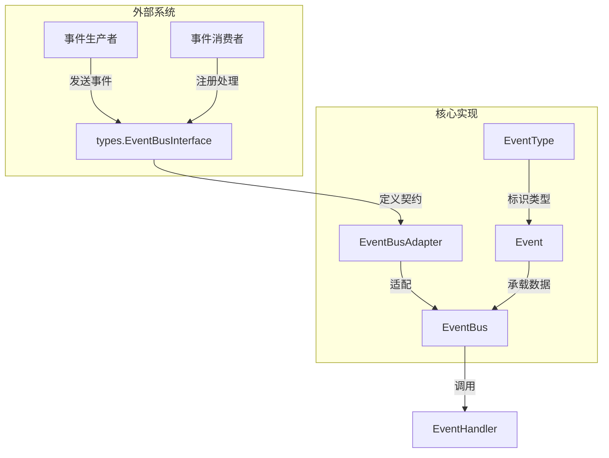

# event_bus_core_contracts 模块技术文档

## 概述

`event_bus_core_contracts` 模块是整个系统的事件基础设施核心，它提供了一套轻量级但功能强大的发布-订阅机制。想象一下，这个模块就像是系统的"神经中枢"——当某个组件发生重要事情时（比如用户查询到达、检索开始、工具调用等），它会向这个中枢发送信号，而其他关心这些信号的组件可以提前注册，在信号到达时自动做出反应。

这个模块的核心价值在于**解耦**：它让事件的生产者不需要知道谁会消费这些事件，也不需要调用具体的消费逻辑；同时，事件的消费者也不需要知道事件是从哪里来的。这种松耦合的设计使得系统可以轻松地添加新功能、修改现有行为，而不需要改动大量代码。

## 架构概览



### 核心组件角色

1. **Event**：事件的数据载体，包含事件ID、类型、会话ID、数据负载和元数据等信息。每个事件都有一个唯一的UUID用于追踪。

2. **EventType**：事件类型的枚举，定义了系统中所有可能的事件种类，从查询处理到Agent执行，覆盖了整个会话生命周期。

3. **EventBus**：事件总线的核心实现，负责管理事件处理器的注册和事件的分发。支持同步和异步两种处理模式。

4. **EventBusAdapter**：适配器，将具体的 `EventBus` 实现转换为 `types.EventBusInterface` 接口，解决了循环依赖问题，使得事件总线可以被系统其他部分通过接口使用。

### 数据流

当一个事件被发送时，数据流如下：

1. 事件生产者创建一个 `types.Event` 对象并通过 `EventBusInterface.Emit()` 发送
2. `EventBusAdapter` 将 `types.Event` 转换为内部的 `event.Event` 格式
3. `EventBus` 查找注册到该事件类型的所有处理器
4. 根据配置的模式（同步/异步），依次或并行调用这些处理器
5. 在同步模式下，任何处理器的错误都会被返回给生产者

## 核心组件详解

### Event 结构体

`Event` 是系统中所有事件的通用容器。它的设计非常灵活，使用 `interface{}` 作为数据字段，可以承载任何类型的载荷。

**设计意图**：
- **统一的追踪机制**：每个事件都有唯一的UUID和RequestID，使得在分布式系统中可以跨服务追踪事件流
- **会话关联**：`SessionID` 字段将事件与特定的用户会话绑定，便于上下文管理
- **可扩展的元数据**：`Metadata` 字段允许在不修改核心结构的情况下添加额外信息

**使用场景**：
- 当你需要在系统中传递一个带有上下文信息的信号时
- 当你需要解耦事件的生产者和消费者时

### EventBus 结构体

`EventBus` 是事件系统的心脏。它的实现简洁而高效，使用读写锁保护处理器映射，支持多种事件分发模式。

**核心特性**：

1. **双重模式支持**：
   - **同步模式**：处理器按顺序执行，任何错误都会中断执行并返回，适用于需要确保处理顺序或需要知道处理结果的场景
   - **异步模式**：处理器在单独的goroutine中执行，"发射后不管"，适用于日志记录、监控等不影响主流程的场景

2. **EmitAndWait 方法**：
   这是一个很有意思的设计——无论EventBus本身是否配置为异步模式，这个方法都会等待所有处理器完成。这在某些需要确保所有副作用都已发生的场景非常有用，比如集成测试或关键数据同步。

3. **细粒度的控制**：
   提供了 `HasHandlers`、`GetHandlerCount` 等方法，允许代码在运行时探查事件总线的状态，这对于动态配置和调试非常有帮助。

**设计权衡**：
- **简单性 vs 功能完整性**：EventBus 没有实现复杂的事件过滤、优先级队列或持久化，这些都留给了上层应用。这种"最小可用"的设计使得核心保持简单，但也意味着使用方需要自己实现更高级的功能。
- **错误处理策略**：在同步模式下，第一个错误就会中断执行，这简化了错误处理，但也意味着后续的处理器不会被调用。如果需要所有处理器都尝试执行，应该使用异步模式或 `EmitAndWait`。

### EventBusAdapter 结构体

这个适配器是一个典型的"防腐蚀层"设计。它的存在解决了一个常见的架构问题：**如何在不引入循环依赖的情况下让核心组件被其他模块使用**。

**工作原理**：
- `EventBus` 定义在 `event` 包中，它可能依赖一些底层包
- `types.EventBusInterface` 定义在 `types` 包中，这个包被很多其他包依赖
- 如果让 `EventBus` 直接实现 `types.EventBusInterface`，可能会造成循环依赖
- 因此，`EventBusAdapter` 作为桥梁，在两个包之间进行类型转换和适配

这种设计虽然多了一层间接，但换取了清晰的依赖关系和更好的模块隔离。

## 设计决策

### 1. 为什么使用发布-订阅模式而不是直接调用？

**选择**：采用发布-订阅模式
**原因**：
- **解耦**：事件生产者不需要知道消费者的存在，这使得系统可以独立演化
- **可扩展性**：可以轻松添加新的事件处理器而无需修改生产者代码
- **可见性**：所有事件都通过一个中心枢纽，便于添加日志、监控和调试工具
- **灵活性**：同一个事件可以有多个处理器，实现横切关注点（如审计、分析）的复用

**权衡**：
- 失去了编译时的类型检查（事件数据是 `interface{}`）
- 调试变得更复杂，因为调用链不是静态可见的
- 有轻微的性能开销（主要是锁竞争和函数调用）

### 2. 为什么同时支持同步和异步模式？

**选择**：提供两种模式，让用户根据场景选择
**原因**：
- 同步模式适用于需要确保处理顺序或需要处理结果的场景（如验证、事务）
- 异步模式适用于不影响主流程的场景（如日志、通知、分析）
- 提供 `EmitAndWait` 作为中间选项，兼顾灵活性和可控性

**权衡**：
- 增加了API的复杂度
- 用户需要理解两种模式的差异，否则可能引入并发问题或性能瓶颈

### 3. 为什么不实现事件持久化？

**选择**：将持久化留给上层实现
**原因**：
- 保持核心简单，只做一件事并做好
- 不同的场景对持久化有不同的要求（内存队列、数据库、消息队列等）
- 避免将不必要的依赖引入核心包

**权衡**：
- 使用方如果需要持久化，必须自己实现
- 没有内置的事件回放或重试机制

## 子模块

本模块包含以下子模块，每个子模块负责事件系统的特定方面：

- [event_message_contracts](platform_infrastructure_and_runtime-event_bus_and_agent_runtime_event_contracts-event_bus_core_contracts-event_message_contracts.md)：定义事件消息的数据契约
- [event_bus_core_runtime](platform_infrastructure_and_runtime-event_bus_and_agent_runtime_event_contracts-event_bus_core_contracts-event_bus_core_runtime.md)：事件总线的运行时实现
- [event_bus_adapter_bridge](platform_infrastructure_and_runtime-event_bus_and_agent_runtime_event_contracts-event_bus_core_contracts-event_bus_adapter_bridge.md)：适配器桥接实现

## 跨模块依赖

这个模块是系统的基础设施，被许多其他模块依赖：

- **依赖本模块的模块**：几乎所有需要发布或订阅事件的模块，包括会话管理、Agent运行时、检索系统等
- **本模块依赖的模块**：主要是 `types` 包，用于接口定义和基础类型

## 使用指南

### 基本使用

```go
// 创建一个同步事件总线
bus := event.NewEventBus()

// 注册事件处理器
bus.On(event.EventQueryReceived, func(ctx context.Context, evt event.Event) error {
    // 处理查询接收事件
    fmt.Printf("收到查询: %v\n", evt.Data)
    return nil
})

// 发送事件
evt := event.Event{
    Type:      event.EventQueryReceived,
    SessionID: "session-123",
    Data:      map[string]interface{}{"query": "你好"},
}
if err := bus.Emit(context.Background(), evt); err != nil {
    log.Printf("发送事件失败: %v", err)
}
```

### 异步模式

```go
// 创建一个异步事件总线
bus := event.NewAsyncEventBus()

// 处理器会在单独的goroutine中执行
bus.On(event.EventChatStream, func(ctx context.Context, evt event.Event) error {
    // 处理流式输出事件
    return nil
})

// 发送事件，不会等待处理器完成
bus.Emit(context.Background(), evt)
```

### 使用接口（推荐）

```go
// 创建事件总线并通过接口使用
bus := event.NewEventBus()
busInterface := bus.AsEventBusInterface()

// 注册处理器使用 types.EventType 和 types.EventHandler
busInterface.On(types.EventTypeQueryReceived, func(ctx context.Context, evt types.Event) error {
    // 处理事件
    return nil
})

// 发送事件使用 types.Event
busInterface.Emit(context.Background(), types.Event{...})
```

## 注意事项和陷阱

### 1. 处理器中的 panic

在异步模式下，处理器中的 panic 会导致整个程序崩溃。始终在处理器中使用 `recover()` 来捕获 panic：

```go
bus.On(event.EventType, func(ctx context.Context, evt event.Event) error {
    defer func() {
        if r := recover(); r != nil {
            log.Printf("处理器 panic: %v", r)
        }
    }()
    // 处理逻辑
    return nil
})
```

### 2. 事件数据的类型安全

由于 `Data` 字段是 `interface{}`，在访问时务必进行类型断言或使用类型开关：

```go
bus.On(event.EventQueryReceived, func(ctx context.Context, evt event.Event) error {
    data, ok := evt.Data.(map[string]interface{})
    if !ok {
        return fmt.Errorf("意外的事件数据类型: %T", evt.Data)
    }
    // 处理数据
    return nil
})
```

### 3. 上下文传递

始终传递 `context.Context`，并在处理器中尊重上下文的取消信号：

```go
bus.On(event.EventType, func(ctx context.Context, evt event.Event) error {
    select {
    case <-ctx.Done():
        return ctx.Err()
    default:
        // 处理逻辑
    }
    return nil
})
```

### 4. 处理器的执行顺序

在同步模式下，处理器按照注册顺序执行，但不要依赖这个顺序。如果需要确保顺序，应该使用单个处理器内部的逻辑控制，而不是依赖多个处理器的注册顺序。

### 5. 避免在处理器中再次发送事件

虽然技术上允许在处理器中发送新事件，但要小心避免造成事件风暴或无限循环。如果必须这样做，确保有明确的终止条件。

## 总结

`event_bus_core_contracts` 模块是一个设计精良的事件基础设施，它通过简单的API提供了强大的解耦能力。它的核心价值不在于功能的丰富性，而在于其简洁性和灵活性——它只做事件分发这一件事，并把它做好，同时为上层应用留出了足够的扩展空间。

作为系统的"神经中枢"，这个模块连接了系统的各个部分，使得组件可以在保持隔离的同时进行有效的通信。理解这个模块的设计思想和使用方法，对于理解整个系统的架构至关重要。
