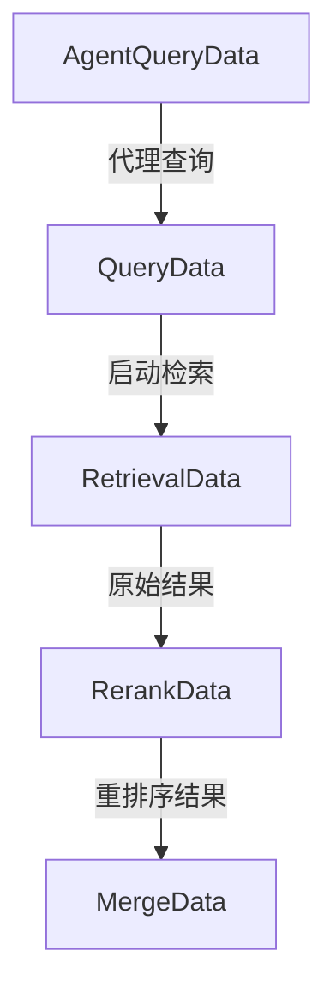

# 检索与结果融合事件负载模块技术深度解析

## 1. 模块概览

`retrieval_and_result_fusion_event_payloads` 模块是平台基础设施中事件总线系统的核心组成部分，专门负责定义和承载检索、重排序和结果融合等关键流程的事件数据结构。

### 解决的核心问题

在多阶段检索和结果处理流程中，需要跨组件传递和记录各阶段的关键信息，包括：
- 查询的原始形式和重写形式
- 检索执行的参数和结果
- 重排序过程的输入输出
- 结果融合的策略和效果

如果没有统一的事件数据结构，各组件间会形成紧密耦合，难以独立演化，也无法进行统一的监控、追踪和调试。

### 设计理念

本模块采用"数据契约"模式，通过定义标准化的事件数据结构，在检索系统的各组件间建立松耦合的通信机制。每个数据结构都设计为可序列化的（通过 JSON 标签），便于跨进程和跨网络传输。

## 2. 架构设计

### 数据流转模型



### 组件职责

- **QueryData**: 承载查询相关的基础信息，作为检索流程的起点
- **AgentQueryData**: 扩展的代理查询信息，增加了请求追踪能力
- **RetrievalData**: 记录检索执行的完整上下文和结果
- **RerankData**: 跟踪重排序阶段的处理过程和效果
- **MergeData**: 描述结果融合阶段的操作和输出

## 3. 核心组件深度解析

### 3.1 QueryData - 查询基础数据结构

```go
type QueryData struct {
	OriginalQuery  string                 `json:"original_query"`
	RewrittenQuery string                 `json:"rewritten_query,omitempty"`
	SessionID      string                 `json:"session_id"`
	UserID         string                 `json:"user_id,omitempty"`
	Extra          map[string]interface{} `json:"extra,omitempty"`
}
```

**设计意图**：
- `OriginalQuery` 和 `RewrittenQuery` 的分离设计允许追踪查询重写过程，这对于理解检索效果和调试查询理解模块至关重要
- `omitempty` 标签的使用使数据结构在不同场景下保持轻量，没有重写查询时不会传输冗余字段
- `Extra` 字段提供了扩展点，允许在不修改核心结构的情况下传递额外信息

**使用场景**：
- 查询重写模块生成新查询时，会同时保留原始和重写版本
- 会话管理系统会填充 `SessionID` 和 `UserID` 用于上下文关联
- 各组件可以通过 `Extra` 字段传递特定领域的信息

### 3.2 AgentQueryData - 代理查询数据结构

```go
type AgentQueryData struct {
	SessionID string                 `json:"session_id"`
	Query     string                 `json:"query"`
	RequestID string                 `json:"request_id,omitempty"`
	Extra     map[string]interface{} `json:"extra,omitempty"`
}
```

**设计意图**：
- 与 `QueryData` 不同，`AgentQueryData` 专注于代理发起的查询场景
- 增加了 `RequestID` 字段，支持更细粒度的请求追踪，这在异步代理执行流程中尤为重要
- 简化的结构反映了代理查询场景下的不同关注点

**关键区别**：
- 不区分原始查询和重写查询，因为代理通常直接处理最终查询
- 强调请求级别的追踪而非会话级别
- 更适合代理执行环境中的事件传递

### 3.3 RetrievalData - 检索执行数据结构

```go
type RetrievalData struct {
	Query           string                 `json:"query"`
	KnowledgeBaseID string                 `json:"knowledge_base_id"`
	TopK            int                    `json:"top_k"`
	Threshold       float64                `json:"threshold"`
	RetrievalType   string                 `json:"retrieval_type"` // vector, keyword, entity
	ResultCount     int                    `json:"result_count"`
	Results         interface{}            `json:"results,omitempty"`
	Duration        int64                  `json:"duration_ms,omitempty"` // 检索耗时（毫秒）
	Extra           map[string]interface{} `json:"extra,omitempty"`
}
```

**设计意图**：
- 完整记录检索执行的"输入-参数-输出"三元组，支持可复现性和调试
- `RetrievalType` 字段使用字符串而非枚举，提供了灵活性，允许新的检索类型无需修改代码
- `Duration` 字段支持性能监控和优化
- `Results` 字段使用 `interface{}` 类型，适应不同检索类型返回的不同结果结构

**关键设计决策**：
- 选择 `interface{}` 而非具体类型，是在类型安全和灵活性之间的权衡，考虑到检索结果类型的多样性
- `KnowledgeBaseID` 的存在表明这是针对特定知识库的检索，而非全局检索
- `ResultCount` 与 `TopK` 的分离允许记录实际返回结果数与请求数的差异

### 3.4 RerankData - 重排序数据结构

```go
type RerankData struct {
	Query       string                 `json:"query"`
	InputCount  int                    `json:"input_count"`  // 输入的候选数量
	OutputCount int                    `json:"output_count"` // 输出的结果数量
	ModelID     string                 `json:"model_id"`
	Threshold   float64                `json:"threshold"`
	Results     interface{}            `json:"results,omitempty"`
	Duration    int64                  `json:"duration_ms,omitempty"` // 排序耗时（毫秒）
	Extra       map[string]interface{} `json:"extra,omitempty"`
}
```

**设计意图**：
- `InputCount` 和 `OutputCount` 的配对设计允许量化重排序阶段的过滤效果
- `ModelID` 记录了使用的具体模型，支持模型效果对比和 A/B 测试
- 与 `RetrievalData` 保持相似的结构风格，便于统一处理

**关键特性**：
- 重点关注"变化"：输入与输出的差异
- 模型标识允许追踪不同重排序策略的效果
- 阈值参数记录了过滤决策的依据

### 3.5 MergeData - 结果融合数据结构

```go
type MergeData struct {
	InputCount  int                    `json:"input_count"`
	OutputCount int                    `json:"output_count"`
	MergeType   string                 `json:"merge_type"` // dedup, fusion, etc.
	Results     interface{}            `json:"results,omitempty"`
	Duration    int64                  `json:"duration_ms,omitempty"`
	Extra       map[string]interface{} `json:"extra,omitempty"`
}
```

**设计意图**：
- `MergeType` 字段描述了融合策略，支持多种融合方法的追踪和比较
- 同样采用输入输出计数的方式量化融合效果
- 简化的结构反映了融合阶段的关注点：处理了多少，产出了多少，用什么方法

**设计权衡**：
- 不包含查询信息，因为融合通常是检索流程的后期阶段，查询上下文已在前面的事件中建立
- `MergeType` 使用字符串而非枚举，保持了扩展性，允许自定义融合策略

## 4. 依赖关系与数据流动

### 依赖分析

本模块是一个相对独立的数据定义模块，它不直接依赖其他业务逻辑模块，但被以下核心模块依赖：

- [event_bus_core_contracts](platform_infrastructure_and_runtime-event_bus_and_agent_runtime_event_contracts-event_bus_core_contracts.md) - 事件总线核心契约，使用这些数据结构作为事件负载
- [retrieval_execution](application_services_and_orchestration-chat_pipeline_plugins_and_flow-query_understanding_and_retrieval_flow-retrieval_execution.md) - 检索执行模块，生成 RetrievalData
- [retrieval_result_refinement_and_merge](application_services_and_orchestration-chat_pipeline_plugins_and_flow-query_understanding_and_retrieval_flow-retrieval_result_refinement_and_merge.md) - 结果优化和融合模块，使用 RerankData 和 MergeData

### 数据流动路径

1. **查询启动阶段**：
   - 用户查询进入系统 → 创建 `QueryData` 或 `AgentQueryData`
   - 包含原始查询、会话信息等基础数据

2. **检索执行阶段**：
   - 接收查询数据 → 执行检索 → 生成 `RetrievalData`
   - 包含检索参数、结果数量、耗时等关键指标

3. **重排序阶段**：
   - 接收检索结果 → 执行重排序 → 生成 `RerankData`
   - 记录输入输出数量差异、模型信息等

4. **结果融合阶段**：
   - 接收重排序结果 → 执行融合 → 生成 `MergeData`
   - 记录融合策略和最终结果统计

## 5. 设计决策与权衡

### 5.1 使用结构体而非接口

**决策**：所有事件数据都定义为具体的结构体，而非接口。

**理由**：
- 事件数据主要用于数据传输和存储，不需要多态行为
- 结构体可以直接序列化，简化了跨进程传输
- 更清晰的数据结构定义，便于文档生成和开发者理解

**权衡**：
- 牺牲了一定的灵活性，但在事件数据场景下，这种权衡是合理的
- 添加新的事件数据类型需要定义新的结构体，但这也增强了类型安全

### 5.2 可选字段与 omitempty 标签

**决策**：大量使用 `omitempty` 标签标记可选字段。

**理由**：
- 减少序列化后的数据大小，提高传输效率
- 允许同一数据结构在不同场景下使用，不必为每种场景定义专门结构
- 更自然地表示"没有值"的概念

**权衡**：
- 零值（如空字符串、0）也会被省略，这在某些情况下可能导致信息丢失
- 接收方需要处理字段缺失的情况，增加了一定的复杂性

### 5.3 interface{} 类型的 Results 字段

**决策**：Results 字段使用 `interface{}` 类型而非具体类型。

**理由**：
- 不同检索类型、重排序策略和融合方法会返回完全不同的结果结构
- 保持了数据结构的通用性，不必为每种可能的结果类型定义变体
- 符合 Go 语言在处理不确定类型数据时的惯用做法

**权衡**：
- 牺牲了类型安全，需要在使用时进行类型断言
- 增加了运行时错误的可能性
- 序列化和反序列化的效率略低于具体类型

### 5.4 Extra 字段的扩展机制

**决策**：每个数据结构都包含一个 `Extra` 字段，类型为 `map[string]interface{}`。

**理由**：
- 提供了标准化的扩展点，允许在不修改核心结构的情况下添加新字段
- 支持实验性功能和特定场景的需求
- 避免了结构体的频繁变更

**权衡**：
- 扩展字段没有类型安全保证
- 可能导致数据结构的使用不够规范
- 文档化变得更加重要，因为扩展字段不会在结构体定义中体现

## 6. 使用指南与最佳实践

### 6.1 基本使用模式

```go
// 创建查询数据
queryData := event.QueryData{
    OriginalQuery: "什么是Go语言?",
    SessionID:     "session_123",
    UserID:        "user_456",
}

// 创建检索数据
retrievalData := event.RetrievalData{
    Query:           "什么是Go语言?",
    KnowledgeBaseID: "kb_789",
    TopK:            10,
    Threshold:       0.7,
    RetrievalType:   "vector",
    ResultCount:     8,
    Duration:        150,
}

// 创建事件
evt := event.NewEvent(event.RetrievalEventType, retrievalData).
    WithSessionID("session_123").
    WithRequestID("req_abc")
```

### 6.2 扩展数据的使用

```go
// 使用 Extra 字段添加特定领域信息
queryData := event.QueryData{
    OriginalQuery: "什么是Go语言?",
    SessionID:     "session_123",
    Extra: map[string]interface{}{
        "query_language": "zh-CN",
        "query_intent":   "information",
        "priority":       5,
    },
}
```

### 6.3 最佳实践

1. **始终填充必填字段**：确保 SessionID、Query 等关键字段始终有值
2. **合理使用 Results 字段**：考虑性能影响，大数据量结果可能不适合直接放入事件
3. **记录耗时信息**：尽可能填充 Duration 字段，便于性能分析
4. **规范使用 Extra 字段**：为扩展字段建立命名约定，避免冲突
5. **注意 JSON 序列化限制**：避免在 Results 或 Extra 中放入不可序列化的对象

## 7. 注意事项与常见陷阱

### 7.1 零值与 omitempty 的交互

由于使用了 `omitempty` 标签，零值字段会被忽略。这在某些情况下可能导致意外行为：

```go
data := event.RerankData{
    Query:     "查询",
    Threshold: 0, // 这个字段会被省略，因为 0 是零值
}
```

如果需要区分"未设置"和"设置为零值"，考虑使用指针类型。

### 7.2 interface{} 的类型断言安全

在访问 `Results` 或 `Extra` 字段时，始终进行安全的类型断言：

```go
// 不安全的做法
results := data.Results.([]SearchResult) // 类型不匹配时会 panic

// 安全的做法
results, ok := data.Results.([]SearchResult)
if !ok {
    // 处理类型不匹配的情况
    return fmt.Errorf("unexpected results type: %T", data.Results)
}
```

### 7.3 数据大小考量

虽然 `Results` 字段可以存储完整结果，但在生产环境中，考虑到事件传输和存储的效率，可能只应存储结果元数据，而完整结果通过其他方式传递。

### 7.4 时间单位一致性

`Duration` 字段使用毫秒作为单位，确保所有生产者和消费者都遵循这一约定，避免时间单位混乱导致的错误分析。

## 8. 总结

`retrieval_and_result_fusion_event_payloads` 模块是检索系统中连接各组件的重要纽带，通过定义标准化的事件数据结构，实现了组件间的松耦合通信。其设计在类型安全和灵活性之间取得了良好的平衡，既保证了核心数据的结构规范，又提供了足够的扩展空间。

新的团队成员应该重点理解：
- 各数据结构的设计意图和使用场景
- 数据流转的完整路径
- 设计权衡背后的考虑因素
- 最佳实践和常见陷阱

掌握这些要点，就能高效地使用和扩展这个模块，为整个检索系统的可观测性和可维护性做出贡献。
